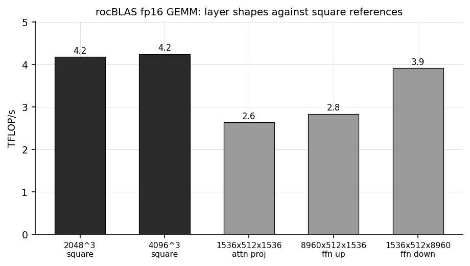

# BC-250 (gfx1013): the investigation

Companion to the [README](README.md), which carries the recipe and the measurements. This file is
the road: how each defect was found, what was measured along the way, and the conclusions this work
published and later had to withdraw. It is long because most of it was wrong at least once, and the
corrections are kept in place rather than tidied away, since how a conclusion failed is usually
more useful than the conclusion.

These are notes from one board and one software stack. The measurements are reproducible and
included as logs; the explanations are working theories and may be wrong or incomplete. Corrections
and "have you tried X" comments are welcome; see [Open questions](#open-questions) at the end.

If you only want the board working, the [README](README.md) is the whole recipe. One result from
below is worth repeating at the top, because it saves the most time: the kernel version is not the
determining factor. The same recipe measures identically on five kernels from 6.18.9 to 7.1.8, so
what matters is a patch set and a set of boot arguments rather than a kernel to upgrade to.

Native gfx1013 rocBLAS sustained 4.5 to 4.6 TFLOP/s of verified-correct SGEMM. PyTorch, once built
for gfx1013, runs everything tried here including training, where a 50-step loop tracks the CPU to
1.799e-05 per step on the losses and returns an identical final loss on all fourteen runs of an
eight-hour soak; the stock ROCm wheel cannot run a library operation at all, aborting at the first
one because it ships no Tensile library for this architecture. llama.cpp, patched and gated as
described below, ran a five-model campaign with every number passing a wikitext perplexity gate
against the Vulkan backend on the same build and boot: 113.5 t/s decode and 805.6 t/s prefill on a
1.5B, rising to a reported 936 on a build compiled with forced cuBLAS, which is not part of the
recipe here since the flag is a compile-time option rather than an environment variable, and which
no capture in this repository supports. Decode comes within a
few percent of Vulkan on an 8B at Q8_0, 34 t/s on a 35B MoE, and a 27B model released after this
work runs on both backends with the two agreeing on perplexity to 0.3 percent. How much of this is
stable over time, rather than a good run on one board, is not something a single board can answer.

Limits that looked like hardware kept dissolving into software as the instruments improved:
current llama.cpp needs three small patches on this board (a device-flag regression, a missing
precision request, and a missing architecture-macro entry that had flash attention garbling for
months and the quantized kernels running 9x slow), plus the native rocBLAS and one environment
variable, each traced and verified; see the caveats.
What remains after them: prefill still trails Vulkan, by 1.4x to 2.3x depending on the model and
narrowing as models grow, which is a gap between llama.cpp's quantized matmul kernels and Vulkan's
rather than anything failing; the allocation-reuse defect needs its kernel-side flush (traced to the
end and fixed here, but a
workaround rather than something upstream has taken); the fp16 GEMM path returned nothing for one
attention projection, which after a long hunt turned out to be a toolchain packaging defect rather
than anything on the GPU (the builtins archive in Fedora 43's ROCm compiler-rt converts half
precision through the wrong register, and the native rocBLAS links it in), repaired here by patching
two helper functions and still unfixed in the package
([`logs/fp16-root-cause-2026-09-15/`](logs/fp16-root-cause-2026-09-15/)); and everything here is one
board. SDMA was on this list for weeks and is not any more:
substituting the navi12 microcode fixes it completely, and the defect was never the board.
This took the combined work of several community projects, credited inline and in the references.

This is the ROCm/HIP companion to [akandr/bc250](https://github.com/akandr/bc250), which covers
the board itself and its (working) Vulkan setup; that background is not repeated here. For a long
time the Vulkan side was the only usable one, and these notes documented how far the ROCm/HIP
stack could be pushed before hitting a wall. The investigation is kept intact below, both because
the observations remain real on older kernels and configurations, and because they explain what
the working configuration actually changes.

Environment throughout: Fedora 43, ROCm 6.4.2 (rocBLAS 6.4.4 as shipped, plus a native gfx1013
rocBLAS built locally), LLVM/clang 19, Mesa 25.3 RADV for the Vulkan comparison, the community
40-CU unlock, the oberon governor around 1500 MHz. The historical observations were taken on
kernel 6.18.9-200.fc43 and most of the new benchmarks on 7.1.5-100.fc43. That difference turned
out not to matter: with the same patch set, both kernels measure identically, so the kernel
version is a detail of when the work was done rather than a condition for it.

## Contents

- [A short primer: the AMD compute stack](#a-short-primer-the-amd-compute-stack)
- [The claim this repo tests](#the-claim-this-repo-tests)
- [A working configuration](#a-working-configuration)
- [What the working configuration measures](#what-the-working-configuration-measures)
- [Observation 1: occasional silent wrong results](#observation-1-occasional-silent-wrong-results)
- [Observation 2: the compute queue wedges under load](#observation-2-the-compute-queue-wedges-under-load)
- [Building a native gfx1013 rocBLAS](#building-a-native-gfx1013-rocblas)
- [Observation 3: the unlock, the fix, and the wedge looked entangled](#observation-3-the-unlock-the-fix-and-the-wedge-looked-entangled)
- [How far ROCm inference gets](#how-far-rocm-inference-gets)
- [ROCm vs Vulkan](#rocm-vs-vulkan)
- [Status snapshot](#status-snapshot)
- [What kept going wrong, and the check that catches it](#what-kept-going-wrong-and-the-check-that-catches-it)
- [Open questions](#open-questions)
- [Reproducing](#reproducing)
- [Files](#files)
- [References](#references)
- [Author and license](#author-and-license)

## A short primer: the AMD compute stack

This section lays out the vocabulary the rest of the document uses, working from an application down
to the silicon. It is a simplified picture.

### The one-picture version

A program like llama.cpp can reach the same GPU by two completely separate software roads. One is
built for graphics, the other for general-purpose compute. When this investigation started only the
graphics road worked, which is why the document keeps contrasting them; most of the compute road
works now, and the [README](README.md) is the recipe for that:

```
                    llama.cpp  (the application)
                   /                            \
        COMPUTE road (ROCm)              GRAPHICS road (Vulkan)
   HIP        a CUDA-like API          Vulkan      graphics + compute API
   rocBLAS    math libraries           (shaders)   the GPU programs
   ROCr/HSA   userspace runtime        Mesa RADV   userspace driver
   KFD        in the amdgpu driver     amdgpu DRM  kernel driver
        |                                    |
   MEC compute queue                  graphics (universal) queue
         \                                  /
                 one shared set of GPU shader cores
```

Everything below just names the boxes in that diagram.

### Architectures, cores, and the word "kernel"

**GPU architectures have ISA names.** AMD GPUs carry an instruction-set name such as `gfx900`,
`gfx1030`, or `gfx1100`, and GPU programs are compiled for a specific one. This board's GPU is
**gfx1013** (RDNA1-class), which is not on ROCm's official supported-GPU list, so "is gfx1013
supported?" recurs throughout.

**Shader cores, CUs, and wavefronts.** A GPU runs work on many small parallel cores grouped into
**compute units (CUs)**; vendors often disable some at the factory ("harvesting"), and threads
execute in lockstep groups called **wavefronts**. How many CUs end up enabled turns out to matter
later.

**"Kernel" means two things.** A **GPU kernel** is a
small program that runs on the GPU (one launch of it is a **dispatch**). The **Linux kernel** is
the operating system, and the `amdgpu` **kernel driver** lives inside it. "A compute kernel wedges"
means a GPU program; "kernel 6.18" means Linux.

### The two software roads

**Graphics (works here).** OpenGL and Vulkan are served on Linux mostly by **Mesa**; AMD's Vulkan
driver in Mesa is **RADV**. llama.cpp's Vulkan backend uses this road, and it runs well on the
BC-250.

**Compute (the hard one).** AMD's general-purpose compute stack is **ROCm**. Its CUDA-like
programming API is **HIP** (close enough to CUDA that code often ports with a rename), and on top
sit math libraries such as **rocBLAS**. Underneath HIP is the **ROCr / HSA runtime**, the userspace
layer that talks to the driver and hands work to the GPU; environment variables like
`HSA_OVERRIDE_GFX_VERSION` and errors like `HSA_STATUS_ERROR_MEMORY_APERTURE_VIOLATION` come from
here. llama.cpp's HIP backend uses this road. It is the harder of the two on this chip, and most of this
document is about why.

**KFD.** The kernel-side half of ROCm is the **KFD** (Kernel Fusion Driver), part of the `amdgpu`
module. It sets up the compute queues, doorbells, and per-process GPU memory maps that HIP programs
use. "The compute queue is broken" points at something in this path.

### How work actually reaches the GPU: queues

The driver hands work to the GPU through hardware **queues** (command rings the GPU pulls from, like
a to-do list). Two matter here:

- the **graphics / universal queue**, driven by the GFX engine, and
- the **compute queue(s)**, driven by the **MEC** (MicroEngine Compute), a small firmware processor
  on the GPU dedicated to compute dispatches.

The distinction that shapes this whole document: **ROCm/HIP sends its compute to the MEC compute
queue**, while Vulkan/RADV normally uses the graphics queue. Same shader cores at the bottom,
different route to reach them, which is why Mesa can route around a problem on the compute queue
and ROCm cannot. (An OpenCL path called **RustiCL**, part of Mesa, also goes by the graphics-queue
route, and was used as a control here. It no longer distinguishes the two, since under the working
configuration compute is correct on both; the section that used it explains what changed.)

**KIQ, PASID, and TLB flushes.** The **KIQ** (Kernel Interface Queue) is a special ring the driver
uses to ask the MEC firmware to do privileged jobs. One such job is invalidating the GPU's
address-translation cache (a **TLB flush**, the GPU equivalent of a CPU's TLB) for a given process,
which is identified by a **PASID**. Newer kernels route that PASID TLB flush through the KIQ/MEC
firmware; older kernels did it directly from the CPU over memory-mapped registers (**MMIO**). That
choice is the crux of Observation 1.

**rocBLAS, Tensile, and code objects.** rocBLAS is AMD's matrix-multiply (BLAS) library; **Tensile**
is the part that generates its GPU programs per architecture. Those compiled GPU programs are
**code objects** (files ending `.hsaco`, an ELF holding GPU machine code). Stock rocBLAS ships no
gfx1013 code objects, so matrix operations have nothing to run and fall over. Building them is one
of the sections below.

### How Mesa handles it

Mesa's source, for this chip, carries the comment `GFX1013 is known to have broken compute queue`
and [disables the compute-only queue for it](https://gitlab.freedesktop.org/mesa/mesa/-/merge_requests/33116),
routing compute through the graphics queue instead. The mechanism, checked against Mesa main in
August 2026: in `src/amd/common/ac_gpu_info.c`, the code that fills in each IP block's queue count
returns early for `AMD_IP_COMPUTE` on this ASIC, so the compute IP is left reporting zero queues,
and `radv_compute_queue_enabled()` then sees `num_queues > 0` fail and reports no compute queue.
It sits in the shared AMD code rather than in RADV itself, so it applies to Mesa's other AMD
drivers as well. ROCm has no equivalent escape hatch: its compute goes to the compute queue, so it
cannot side-step the problem the same way.

## The claim this repo tests

Getting ROCm working would open up the wider GPGPU ecosystem on the board (rocBLAS, PyTorch,
image generation, and so on). The stock answer is that it cannot: the compute queue is broken.
The notes below test that claim.

What the single label "broken compute queue" turned out to cover, on this board, is a set of
distinct problems with distinct causes, most of them in software:

- a TLB-invalidation defect that produced silent wrong results, fixed by correcting the PASID
  flush
- a wedge under sustained compute that belongs to the software-scheduling eviction path, avoided
  by not setting `amdgpu.sched_policy=2`, which was itself adopted here as a workaround for the
  first problem
- an allocation-reuse defect where a stale translation survives into a fresh mapping, fixed by
  rebuilding the runlist on map
- missing gfx1013 code objects in the shipped rocBLAS and PyTorch, fixed by building both
- five defects in llama.cpp's HIP backend: three traced and patched (a device-flag regression, a
  missing precision request, a missing architecture-macro entry), one with a working environment
  variable rather than a patch (HIP graph instantiation), and one still open (an intermittently
  zeroed fp16 GEMM, which an earlier revision of this document counted twice, once under that name
  and once as "forced-MMQ wrongness on qwen3 dense models", before the second label turned out to
  describe the same defect measured through a flag that does nothing)

None of those required new hardware or firmware, and the residue that still looks like silicon is
small: the `hqd_destroy` preemption timeout itself, which is only reachable by asking for the
software scheduler and so does not arise in the working configuration, and a rare extreme-size
dispatch fault, seen twice in a day of boots and not at all in a later five-run repeat at the
largest size. This sentence named a third, an SDMA path that could not move a model into memory,
and called it the one clear-cut case; it was removed on 27 August because it is not one. The
navi12 microcode substitution fixes SDMA outright, as the summary above already said and as this
paragraph had not caught up with, and what looked like the clearest silicon defect on the list
turned out to be the wrong firmware. The
sections that follow give the current answer;
the observations after them are the investigation that led to it, kept as recorded, with notes
where later results corrected them, of which there are several.

## A working configuration

Three ingredients that were once reported as mutually exclusive can coexist, and together they
remove most of the failure modes documented below. Most of the work here was done on 7.1.5, which
is why it appears throughout, but the kernel version is not one of the ingredients: 6.18.9 with
the same patch set measures identically, and the evidence is below.

```
kernel 6.18.9 or later (measured on 6.18.9 and 7.1.5; both identical)
+ the 40-CU unlock                   amdgpu.bc250_cc_write_mode=3
+ the corrected PASID TLB flush      flush_pasid_uses_kiq = false (the patch from Observation 1)
+ hardware scheduling                do NOT set amdgpu.sched_policy=2
+ the runlist-rebuild flush         amdgpu.bc250_flush_by_runlist=3 (bitmask: 1 unmap, 2 map;
                                     value 3 needs two patch scripts, in order:
                                     apply_runlist_flush.py then
                                     apply_svmflush_generic.py; see the
                                     allocation-reuse section below)
+ SDMA fixed or avoided              the navi12 microcode substituted for the
                                     board's own (preferred, it fixes the
                                     transfers rather than avoiding them), or
                                     HSA_ENABLE_SDMA=0 in the environment for
                                     HIP processes; see the SDMA section below
```

Two findings make this possible. Both are corrections to observations below, and both are scoped to
the kernel version, which is why they were missed earlier.

**The unlock and the flush fix no longer conflict.** Earlier work found the corrected flush
forcing the board to 24 CU, where compute wedges (Observation 3). That no longer happens: the
board comes up at 40 CU with the corrected flush, verified on every test boot by the boot log (the
patched module prints its flush state at init, so a stale-initramfs mixup is excluded). A later
rebuild found the same on 6.18.9, 6.18.16 and 6.19.14 alike, so it is not a property of the newer
kernel; why the earlier boots behaved differently is unresolved, and the correction in
Observation 3 sets out both the measurements and the limits of what they explain.

**The flush and the scheduler interact; both changes are required.** `amdgpu.sched_policy=2` was
adopted here early, from the community freeze workaround, and every wedge measurement below was
taken under it. To untangle the two variables properly, a full two-by-two factorial was run on
7.1.5: `flush_pasid_uses_kiq` (false / true) crossed with `sched_policy` (default hardware
scheduling / 2), two boots per cell in a mirror-balanced order (A B C D D C B A), a fixed
measurement battery per boot (three 8.4M-thread correctness probes, SGEMM N=2048 x10 and N=4096
x50, dmesg counters, a health check), and everything else identical:

| cell | flush | scheduling | result (2 boots each) |
|---|---|---|---|
| A | false | hardware (default) | clean both boots (and a third pilot): probes 3/3 correct, both GEMMs complete correct, zero preemption timeouts, board responsive |
| B | false | 2 (software) | probes hang 3/3, both GEMMs wedge, 19 `cp queue preemption time out` per boot, queue degraded |
| C | true | hardware (default) | board lost mid-battery, both boots (the KIQ-flush freeze; recovered by power cycle) |
| D | true | 2 (software) | the historical configuration: probes mostly pass, sustained N=4096 wedges or faults on both boots |

The table reads as an interaction. Cell C is why `sched_policy=2` existed at all: under
hardware scheduling with the stock flush, the KIQ PASID flush freezes the board, so the software
scheduler was the rational mitigation. Cells B and D show the price: under software scheduling,
queue evictions preempt through `kgd_hqd_destroy`, which is where the wedge message is
printed (Observation 2), and sustained compute wedges with either flush setting. Only cell A,
both changes together, is clean: the corrected flush removes the freeze that made hardware
scheduling unsurvivable, and hardware scheduling removes the eviction path that made compute
wedge. Two boots per cell is thin for a board that varies this much between boots (the
flash-attention section is a caution on exactly that), so this is the pattern that held across
these boots, not a settled law.

Cell A was originally reported as unreachable on 6.18, because the corrected flush appeared to
force 24 CU there (Observation 3). That has since been measured directly and it is not the case.
With the same patch set and boot arguments, kernel 6.18.9 is indistinguishable from 7.1.5 on every
check run here: the compute probe correct at all three sizes, the native rocBLAS SGEMM sweep clean
from N=256 to N=4096, a sustained N=4096 for 50 iterations clean, perplexity 8.9442 to the fourth
decimal, and zero faults in dmesg on both. The kernel version was never the ingredient that
mattered; the earlier readings came from a misapplied unlock patch and from `sched_policy=2` being
held fixed. Logs in [`logs/kernel-equivalence-2026-08-17/`](logs/kernel-equivalence-2026-08-17/).

**The scheduler policy is the determinant, and CU count is not.** The claim that a 24-CU board
wedges even on a trivial dispatch appeared in earlier write-ups here. Crossing CU count with
scheduler policy, all four cells on kernel 7.1.5 with the same module, one boot each:

| CUs | scheduling | compute probe | SGEMM N=256 | `preemption time out` in dmesg |
|---|---|---|---|---|
| 40 | hardware (default) | correct, 3 of 3 sizes | clean | 0 |
| 24 | hardware (default) | correct, 3 of 3 sizes | clean | 0 |
| 40 | `sched_policy=2` | hangs, both sizes tried | wedges | 10 |
| 24 | `sched_policy=2` | hangs at the larger size, smaller completes then hangs at exit | wedges | 9 |

Both hardware-scheduling rows are clean and both software-scheduling rows wedge, at either CU
count. At 24 CU with hardware scheduling the board even passes the full battery, perplexity
included, at 8.9442. So the historical "24 CU wedges" observations were `sched_policy=2`
measurements that happened to be taken at 24 CU, and the CU count carried the blame. The same
policy applied to an otherwise clean 6.18.9 reproduces the failure there too, the probe hanging at
all three sizes and SGEMM wedging at N=256, so this is not specific to one kernel either
([`logs/kernel-equivalence-2026-08-17/`](logs/kernel-equivalence-2026-08-17/)).

This also reframes the kernel-7.1.5 test reported in Observation 2, which found both defects
persisting on the newer kernel: that boot carried `sched_policy=2` on its command line, because at
the time that was standard practice here. The failures it recorded were real, but they belong to
the software-scheduling path, not to the kernel version.

### Why this was missed

A short methodological accounting, since the earlier conclusions leaned toward hardware and were
wrong in their scope. Four things compounded:

- **A workaround became an unexamined constant.** `sched_policy=2` was adopted early as the freeze
  mitigation and then carried on every command line, including the newer-kernel test. Under it,
  evictions preempt through the same driver path that emits the wedge message. Every wedge
  measurement was taken inside the failure mode the mitigation itself selected.
- **A misapplied patch produced a fake constraint.** The 40-CU unlock of the time was applied into
  a `gfx10_kiq_*` function rather than `gfx_v10_0_get_cu_info()`, which makes a module that loads
  while the board stays at 24 CU. Combined with the workaround above, that produced the reading
  that the correctness fix "cost 16 CUs" and that 24 CU wedges everything. Both halves are wrong:
  the fix and 40 CU coexist on every kernel retested, and at 24 CU with hardware scheduling the
  board passes the whole battery including perplexity. What looked like two interacting hardware
  blockers, each defeating one-variable experiments, was one bad patch and one fixed boot argument.
- **Intermittency degraded the knob sweep.** The 6.18 sweep sampled each knob a few times in a
  regime where the base failure rate drifts by boot and by session, so a false negative on any
  single knob (including `sched_policy=0`) was likely enough. It also does not record which flush
  its module carried, which limits what any of its rows can settle.
- **Throughput was mistaken for correctness in inference.** Token rates and clean exits do not
  prove the tokens are right (see the flash-attention note below). A seed-fixed text check now
  accompanies every inference claim here.

A fifth belongs on the list, since it is the one that produced the most confident wrong
conclusion: **the kernel version was changed at the same time as the patch set.** Every "this works
on 7.1.5" statement in earlier revisions of this document was really "this works with the corrected
flush, hardware scheduling and a correctly applied unlock", and the kernel came along for the ride.
Measuring 6.18.9 with the same patch set, and getting identical results on every check, is what
separated them.

What remains fairly attributed to the hardware or firmware: the underlying TLB-invalidation
oddities, the load-time host-aperture fault, the rare extreme-size dispatch fault, and the
`hqd_destroy` preemption timeout itself. What does not: the practical unusability, which was a
stack of driver-path and userspace choices that a different configuration avoids on any kernel
tested here.

## What the working configuration measures

All numbers in this section are from kernel 7.1.5 at 40 CU with the corrected flush and hardware
scheduling, native gfx1013 code throughout, no `HSA_OVERRIDE`, one `llama-bench` invocation per
test. The historical rows use llama.cpp build 2da6686
([`logs/bench-2026-08/`](logs/bench-2026-08/)); the fixed-stack campaign uses master 7ba604f
with the patches from the caveats ([`logs/bench-fixed-2026-08/`](logs/bench-fixed-2026-08/)).

### Everything that used to fail, rerun

| workload | historical result | working configuration |
|---|---|---|
| SGEMM N=2048 x10 | protection fault | correct; the shipped sweep at this size runs twenty iterations, not ten, and reports `CORRECT` |
| SGEMM N=4096 x50 sustained | wedge, near-every-run | correct; the 20-iteration sweep measures 4.5 TFLOP/s at this size |
| SGEMM N=4096 x200 sustained | never survived | correct on the day; no capture here runs SGEMM two hundred times, the only x200 in the logs being the OpenCL probe at 1M threads |
| SGEMM N=8192 x20 sustained | wedge / occasional corruption | correct, 4.6 TFLOP/s |
| 10 rapid single-GEMM processes | queue degradation, stalls | clean, though the 10/10 is a count from the day and no log here records it |
| streaming-read probe, 1 and 2 GB | abort at 1 GB, wedge at 2 GB | `fails=0/10` at 2 GB, the size the shipped capture records |
| compute probe, 8.4M threads | failed on 4/4 boots (July, policy 2) | correct on every run since, see below |
| compute probe sweep 1M to 16.7M | wrong results / faults / hangs | correct on every run since, see below |
| HIP process exit | freeze risk | clean exits throughout |

The two probe rows read "17/17 in a counterbalanced A/B" and "30/30 across the two benchmark
boots" until 27 August, and neither denominator can be produced from what is shipped: the probe
runs live in `logs/factorial/`, `logs/kernel-equivalence-2026-08-17/`, `logs/bench-2026-08/` and
`logs/stock/` rather than in the two campaign directories this section cites, and no directory here
holds a counterbalanced probe A/B at all. What is captured is stronger than either fraction and
easier to check. The probe reports a result 107 times across these logs and 105 of them are
correct. Ninety-two of those carry the banner naming their size, thirty-four at the 8.4M-thread
size with thirty-three correct; the remaining fifteen come through harnesses that print the result
without the banner. Both failures are explained and neither is on the working configuration: the 8.4M one is `total_wrong=525308` in
`logs/stock/compute_probe_stock_1500-1000.log`, which is the stock flush and the failure this row's
"before" column describes, and the other is the deliberate `HSA_OVERRIDE` trap in
[`logs/override-trap-2026-08-26/`](logs/override-trap-2026-08-26/), where every element is zero by
design.

The July side of that row is a day count too. "Failed on 4/4 boots" appears in no log here, and
what the shipped captures from the failing configuration actually show is one failure at that size:
`logs/stock/compute_probe_stock_1500-1000.log` runs the probe seven times and reports
`total_wrong=525308` at `nblocks=32768`, which is the 8.4M-thread size and the figure Observation 1
quotes. So the "before" is evidenced by a single captured failure rather than by four boots, and
the four is what was counted at the time.

### SGEMM throughput (native gfx1013 rocBLAS)

Twenty iterations per size, every result checked against a CPU reference, all correct:

| N | median ms per GEMM | GFLOP/s |
|---|---|---|
| 512 | 0.2 | about 1340 |
| 1024 | 0.8 | about 2680 |
| 2048 | 5.7 | about 3010 |
| 4096 | 30.0 | about 4580 |
| 8192 | 236.0 | about 4660 |

About 61 percent of the 7.68 TFLOP/s FP32 peak at the governor's 1500 MHz cap, from an untuned
Tensile build.

That the first column is a median matters more than it looks, and the reason is worth carrying here
rather than only in the log. Re-running twenty iterations per size and taking the plain average
puts N=512 at 542 GFLOP/s against the 1340 above, which reads as a large regression and is not one:
a single iteration at N=512 takes 6.8 ms against about 0.16 ms warm, so one cold call costs more
than the other nineteen together and drags the mean down. Remove one cold call of the measured size
and N=512 comes to about 1645 and N=1024 to about 2488, either side of the published figures. The
three larger sizes are insensitive to this and reproduce within a percent. Anyone re-measuring this
table should take a median, or say which statistic they took
([`logs/defects-recheck-2026-08-22/`](logs/defects-recheck-2026-08-22/)).


### Inference-path caveats: what the perplexity gate caught

Before the inference numbers, a warning: a seed-fixed generation check is essential here, because
token rate and a clean exit do not prove the tokens are right. Later work added a stronger gate,
wikitext perplexity compared against the Vulkan backend on the same model and text (11.21 for the
1.5B used here); reading generated text turned out to miss corruption that perplexity catches
immediately, and most of the findings below were only visible through it. The reverse holds too,
measured rather than assumed: with the RDNA1 macro entry removed from the working build,
perplexity reads 8.9425 and looks entirely healthy while the same build asked to generate text
returns `The???????????????`. That figure was cited here for some time with no surviving log
behind it, which an audit caught, so the arm was measured again from the working tree: reverting
the one line gives 8.9425 and `The???????????????????????`, restoring it gives 8.9442 and `The
capital of France is Paris.`, reproducing the original to four decimals
([`logs/macro-remeasure-2026-08-18/`](logs/macro-remeasure-2026-08-18/)). Perplexity is computed
over batched
prefill and never exercises the decode kernel that garbles, so the two gates catch different
faults and both are needed. Each caveat below is a distinct llama.cpp or library defect that first
looked like board behavior.

**Flash attention garbled for months, and the cause was a two-character architecture list.** The
history of this one is a lesson in how wrong a careful investigation can be. The symptom: `-fa on`
produced garbage at full speed on nearly every boot sampled (ten of eleven in the surviving tally; the
campaign's per-boot record was not retained), with
the garble bytes stable within a boot but different across boots, while `-fa off` stayed correct.
That pattern read convincingly as boot-dependent hardware marginality, plausibly memory training
on the board's bottom-binned GDDR6, and an early one-line software fix (adding gfx1013 to ggml's
RDNA1 architecture macro) was tested and dismissed when an unpatched build appeared equally
correct on one good boot. Both conclusions were wrong. A later split observation reopened it:
`-fa on` computed *correct* results in batched perplexity runs while garbling only in token-by-token
generation, which pointed at the decode-specific flash-attention kernel rather than the hardware.
The macro was retested with better instruments and is the fix: `vendors/hip.h` defines RDNA1 for
`__gfx1010__` and `__gfx1012__` but not `__gfx1013__`, so the host-side code (which classifies by
compute-capability number) selects kernel configurations for an RDNA device while the device code
compiled without the RDNA1 define takes different paths, and the decode kernel reads wrong. The
garble varying by boot, and the single good boot, are consistent with the mismatch consuming
whatever happened to be in memory. With the one-line macro fix: coherent decode on three prompts
across three fresh reboots, nine runs in all, with fa-on batched perplexity 9.9148 and fa-off
9.8574, each bit-identical across boots
([`logs/historical-sources/`](logs/historical-sources/) keeps the six perplexity logs; the nine
decode outputs themselves were read at the time and not retained, so the bit-identical perplexity
across boots is the part of this that can still be produced). The boot-lottery reading and the GDDR6
speculation are retracted for
flash attention. The same macro line also enables the hand-written RDNA1 integer-dot emulation,
which took the quantized matmul kernels from 285 GFLOPS to 2.64 TFLOPS (9.2x, and see the note
below on what backs that) and the default
prefill from 124 t/s to the 800 to 890 range at pp512 with no other change (892 on the boot
where the fix landed, 806 to 808 on three later runs across two boots; pp2048 is stable at 661 to
662 throughout, so the pp512 spread is run to run rather than configuration); `-fa on` decode
measures 113.5 t/s tg64 alongside prefill and 117.6 to 118.8 in a decode-only run, the best
decode numbers recorded on this board.

On the 9.2x, checked 26 August: neither 285 GFLOPS nor 2.64 TFLOPS appears in any capture in this
repository, so that ratio is quoted from a measurement that was not kept. The macro's effect is
captured, on both arms and in one sitting, but as end-to-end rates rather than kernel throughput:
with gfx1013 out of the macro the 1.5B prompts at 86.4 t/s and generates
`The???????????????????????`, and with it restored the same build prompts at 319.8 and generates
`The capital of France is Paris.`
([`logs/macro-remeasure-2026-08-18/`](logs/macro-remeasure-2026-08-18/)). That is a 3.70x prefill
difference. It does not refute the 9.2x, which is a different quantity measured on the kernels
rather than the pipeline, but it is the only speed comparison for this change that has a log behind
it.

**The default-batch GEMM crash is the missing-code-objects problem, not an fp16 defect.** `-fa off`
at the default batch size crashes llama.cpp against the **system** rocBLAS. Verbose logging
(`AMD_LOG_LEVEL=3`) gives the exact cause: `Cannot find CO in the bundle
/usr/lib64/librocblas.so.4.4 for ISA amdgcn-amd-amdhsa--gfx1013:xnack-`, that is
`hipErrorNoBinaryForGpu`. That log line is quoted from a session whose output was not kept; it
appears in no capture in this repository, and neither does the error name. The conclusion it
supports, that the system rocBLAS carries no gfx1013 code objects, is independently captured, since
its gfx1013 Tensile entries are symlinks to gfx1010 and a probe of the file listing records that
([`logs/torch-probe-2026-08-19/`](logs/torch-probe-2026-08-19/)). The system rocBLAS has no gfx1013
code objects embedded at all (its
gfx1013 Tensile files are only symlinks to gfx1010 ones), so it cannot run a rocBLAS GEMM that
needs a compiled kernel. This is the same missing-code-objects situation the native build (PR
#8838) exists to fix; it is not specific to fp16. It looks fp16-specific only because llama.cpp
reaches rocBLAS on its large-batch dequant path, while a small micro-batch (`-ub 8`) uses ggml's
own gfx1013 kernels and never calls rocBLAS.

Two follow-ons at the library layer, both clean and reproducible: the native gfx1013 rocBLAS runs
`rocblas_gemm_ex` correctly (fp16, N=256 through 4096), and `HSA_OVERRIDE_GFX_VERSION=10.1.0`
(reporting the device as gfx1010 so the embedded gfx1010 object loads) did not rescue this
particular path, where the dispatch hung. That is narrower than it was once written as: retested
under the working configuration, a direct SGEMM through the system library does complete under the
override at N=256 through 4096. What the override reliably breaks is code compiled for gfx1013,
which stops running altogether without saying so (the rocBLAS section has the measurement). Tying
the crash to a specific end-to-end llama failure was harder to pin down at the time; the runs that
muddied that A/B later traced to a test-harness mistake (the multi-boot note below), and the
library-layer cause above is unambiguous. The practical answer does not depend on any of this:
`-ub 8` avoids rocBLAS entirely, and is also the faster of the two default paths measured here
(about 189 t/s at pp512, versus about 124 with the native library or the quantized-kernel path at
the default batch). Neither of those two figures is captured, noted 28 August: no shipped benchmark
reports a prefill near either, and what survives of that configuration is its perplexity, 11.21,
which is exact against the log. The ordering they express, `-ub 8` ahead of the default batch on
the unpatched path, is what the section rests on and is visible in the era's own comparison; the
rates are recollections of it. Why large-batch prefill is slow at all turned out to be more interesting than
Tensile tuning: measured at the exact shapes llama.cpp uses, the untuned fallback fp16 GEMM
already sustains 2.6 to 4.2 TFLOP/s, which puts the GEMM itself at roughly a tenth of prefill wall
time, while ggml's quantized matmul kernels (the MMQ path that llama.cpp selects at batch) measure
at about 285 GFLOPS on this chip against 4.2 TFLOPS for the same shape in fp16. The mechanism is
visible in the source: those kernels are built around byte-wise integer dot products (`dp4a`) that
RDNA1 does not have in hardware, gfx1013 is additionally absent from the RDNA1 macro that selects
the hand-written emulation (so it gets the slowest generic fallback), and the path-selection logic
has no RDNA1 case that would prefer the BLAS route at large batch. Two resolutions came out of
that: the macro fix from the flash-attention caveat turns on the hand-written emulation and lifts
the quantized kernels to 2.64 TFLOPS, taking the unmodified default path to about 808 t/s at
pp512; and forcing the BLAS route (`-DGGML_CUDA_FORCE_CUBLAS=ON`, with the native rocBLAS and the
f32 compute type from the next caveat) measures faster still, 936 t/s at pp512 and 760 at pp2048,
perplexity-gated. So the forced-BLAS build is the fastest correct prefill path, the default MMQ
path is close behind and slightly ahead on decode (113.5 versus 109.2 tg64, measured the same
way), and Tensile tuning, the original suspect, is demoted to a minor optimization.

How much of that paragraph is captured, checked 26 August. The 285 GFLOPS and 2.64 TFLOPS are the
pair discussed above, quoted from a measurement that was not kept. The forced-BLAS figures are in
the same position: 936, 760 and 109.2 appear in no capture here, and the one re-run that tried to
reproduce them could not, because `GGML_CUDA_FORCE_CUBLAS` is a compile-time `#ifdef` in this
version and setting it in the harness did nothing, so that arm measured the default path twice
([`logs/campaign-rerun-2026-08-18/`](logs/campaign-rerun-2026-08-18/)). Only the default path's
113.5 tg64 is captured. The comparison is therefore between one measured value and three
remembered ones, and "the forced-BLAS build is the fastest correct prefill path" is the part of
this section least supported by anything shipped here.

A campaign-scale follow-on: on the wider model set the system rocBLAS fails on more shapes than the first
crash showed, aborting with `CUBLAS_STATUS_INTERNAL_ERROR` on the fa-off long-context attention
GEMMs, on the Q8_0 dequant path, and on two more models' perplexity runs. The native gfx1013 build
resolves every one of those; the symlink workaround is not sufficient for real inference, the
native library is required.

**Batched compute corrupted at longer contexts, and the cause turned out to be software.** The
perplexity gate caught this; generated text can look plausible while it happens. The symptom: with
micro-batches of 32 and up, perplexity degraded roughly 17x at context 2048 and roughly 380x at
context 4096 (with large run-to-run variance), while micro-batch 8 stayed exactly correct at every
context, and every individual operator passed correctness tests against the CPU backend at the
exact production shapes and strides. The chase went through and eliminated buffer pools, virtual
memory mapping, batch sizes, and address-placement theories before landing on the actual cause,
which is one attention matmul's precision. llama.cpp requests fp32 precision for the KQ matmul
(its own comment: "this op tends to require high floating point range") but not for the KQV
matmul that aggregates the values. On this architecture, without the matrix instructions newer
GPUs use, the batched KQV runs through rocBLAS half-precision GEMM with fp16 accumulation, and
with this model family's large activations the accumulation error over thousands of keys becomes
catastrophic, growing with context. Data-dependent, which is why synthetic operator tests pass
while real inference corrupts. One added line requesting fp32 precision on KQV (or the existing
`GGML_CUDA_CUBLAS_COMPUTE_TYPE=f32` environment variable) restores exact perplexity at every
context and micro-batch tested, pool and mapping settings irrelevant: 11.0634 against Vulkan's
11.0279 at context 4096, reproduced bit-identically.

Which of the two to use is worth being precise about, because the working configuration below
already sets that environment variable and therefore does not need the patch. Measured on a build
with the patch removed, at context 4096 over two chunks: with the variable it reads 11.0631, and
with flash attention on, which is what the configuration uses, it reads 11.0521, matching the soak
number exactly. Both figures were re-measured from the tree in August 2026 and reproduce to four
decimals, as does the patch itself, since restoring the line takes the failing arm back to
11.0631.

Without the variable and without the patch the same arm is catastrophically wrong, and how wrong
is not a stable number. An earlier revision of this section quoted 276.29 as though it were a
property of the defect. Re-measured, the same arm gives 4199.41, and repeating it with
`GGML_CUDA_NO_VMM` unset gives 624.13, so three observations span more than an order of magnitude
while every correct arm is bit-identical. What is reproducible is that the defect destroys the
output, not by how much ([`logs/kqv-remeasure-2026-08-18/`](logs/kqv-remeasure-2026-08-18/)). So
the patch matters for anyone who does not set the variable, and every number quoted in this
document is reproducible without it.

Two things about that variability do not sit comfortably with the mechanism above, and saying so
is better than leaving them implicit. The first is that the wrongness is bimodal rather than noisy.
At context 1024 two of three unpatched runs return 8.1616 and 8.1616, agreeing to four decimals,
and the third returns 708.4671; at 2048 it is 10.0103 twice and then 1347.6541. Accumulated
rounding error over thousands of keys would be expected to vary continuously between runs, not to
be reproducible to four decimals and then jump by two orders of magnitude. Something discrete is
switching, and a kernel selected differently between invocations was the obvious candidate. It has
now been checked against a dispatch trace and it is not that. Logging every rocBLAS call across
eight unpatched runs shows the same 448 calls and the same eight signatures every time, identical
between correct and wrong runs, while the perplexities come back as 10.0103, 91.3845, 172.3724 and
1057.5494. The library is asked for exactly the same work and does not always return the same
answer, so the variation lives below its interface
([`logs/kqv-dispatch-2026-08-21/`](logs/kqv-dispatch-2026-08-21/)). That also cuts against the
upstream-precision reading, since an accumulation gap is deterministic: it should give a wrong
answer stably, not four different ones from identical calls. What the trace cannot say is whether
the divergence begins inside the GEMM or in data that differed before it, because it records call
shapes and not contents. An attempt to find that first divergent tensor with `llama-eval-callback`
produced six byte-identical dumps, twice, at two prompt lengths, and that was read here for most of
a day as the instrument suppressing the defect. It was not. The rate rises steeply with the amount
of work evaluated, one failure in six runs at a single perplexity chunk against five in six at two
chunks, and the eval-callback runs were a single forward pass, less work than either. Identical
dumps from a workload with a low per-run failure probability are an ordinary outcome rather than
evidence of anything. A control had been run, but it established that the defect was live in the
build rather than in the workload the instrument was actually running, which is the weaker of the
two and does not license the conclusion.

Five interventions were made while chasing that phantom, and they survive it, since each ran on the
perplexity workload where the defect is common and each shows the defect persisting: disabling HIP
graph capture, synchronising after every node, refusing every operator fusion, submitting one node
per graph launch, and reading every result back to the host. None removes it. Each probe carries a
counter proving it executed, a precaution added after one of them was nearly believed without it.
Refusing fusion does shift the correct answer slightly, 10.0204 against 10.0176 on the patched build
where the defect cannot occur, which was measured rather than assumed before scoring that arm
([`logs/kqv-divergence-2026-08-21/`](logs/kqv-divergence-2026-08-21/)). Graph capture is not the
part that matters either: disabling it leaves the defect fully
present, one of six runs correct against three of six with capture on, which at that sample size
is the same thing ([`logs/kqv-divergence-2026-08-21/`](logs/kqv-divergence-2026-08-21/)). Locating
the divergence now looks unreachable by this route, since any instrument fine enough to see it
appears coarse enough to suppress it. Twelve consecutive runs at one
context sharpen this: nine distinct values, but the correct 10.0103 appears three times and a wrong
115.8450 appears twice, both exact repeats, so the defect selects between a small number of
behaviours rather than drifting ([`logs/kqv-periodicity-2026-08-21/`](logs/kqv-periodicity-2026-08-21/)).
That run also refuted a pattern noticed in the ladder, where the catastrophic result fell on the
third invocation of every rung: there is no period, and the probability attached to that pattern
after noticing it was worth nothing. It also shows the defect strikes about two runs in three at
context 2048, pooling both runs, rather than the one in three that three samples suggested.

The second is that "this one is not the board" is an inference rather than a measurement. It rests
on the mechanism being architecture-general, which is a good argument, but the defect has never
been run on hardware other than this one. Everything measured here is consistent with an upstream
precision gap and also consistent with a gfx1013 GEMM behaving badly, and the two have not been
separated. The patch is correct either way.

Reproducing the context ladder on 21 August strengthened
that and corrected one thing. Three unpatched runs at each of 1024, 2048 and 4096 give 8.1616,
8.1616, 708.4671; 10.0103, 10.0103, 1347.6541; and 224.8379, 211.8500, 8234.2048, against patched
values of 8.1702, 10.0204 and 11.0631. So the defect reaches context 1024, which an earlier write-up
had described as correct, and what grows with context is how often it strikes and how
badly rather than whether it can. The patched ctx 4096 value reproduces the 18 August measurement
to four decimals ([`logs/kqv-ladder-2026-08-21/`](logs/kqv-ladder-2026-08-21/)). So the likeliest
reading is an upstream precision gap on architectures that take the cuBLAS path for batched
attention, surfaced by a model with large activations, rather than anything specific to this board,
with the caveat above that this has not been separated from a gfx1013 GEMM behaving badly and
cannot be from one board. The practical rule while it is open: batched work needs
the precision line or the environment variable; micro-batch 8 needs nothing.

The same environment variable turned out to matter for a second, unrelated reason. The qwen3
dense models read perplexity anywhere from 18 to 31 against Vulkan's 9.10 and 7.91 without it,
varying run to run, which looked at first like more of the same accumulation problem but is not:
it is the zeroed cuBLAS result described in the next caveat, and it is a dropped output rather
than a precision loss, which is also why the number moves around. What the two share is the
cure. On this chip the f32 compute type is free, prefill and decode rates
measured identical with and without it (no matrix cores means fp32 and fp16 GEMM run at similar
rates here), so there is no reason not to set it globally, and two separate defects make it
necessary rather than merely advisable.

**One open correctness defect remains, and it is a dropped GEMM result rather than a precision
problem: the layer-0 value projection comes back all zeros.** Whether a given run is affected
varies; within an affected run it does not, as the count below shows. On qwen3-8B and
qwen3-14B, wikitext perplexity reads 18.1 and 24.7 against Vulkan's 9.10 and 7.91 unless
`GGML_CUDA_CUBLAS_COMPUTE_TYPE=f32` is set. Instrumenting llama.cpp to print per-tensor sum of
squares and maximum absolute value (a plain sum hides this behind cancellation), and logging which
matmul path each operation takes, shows the following.

The tensor that fails is `Vcur-0`, the value projection of layer 0. In these models every layer's
value weight is stored **F16** while everything else is quantized, so those 36 matmuls, and only
those, are dispatched to cuBLAS with fp16 compute (`src0=f16 src1=f32 ne11=512`); the rest of the
graph goes to the quantized kernels. Dispatch logging confirms exactly 36 cuBLAS calls per
micro-batch, all of them value projections.

What fails is not the tensor but the position: **the first of those 36 calls in each graph
execution**, and never any of the other 35. On a short prompt nothing happens at all. On a
2100-token prompt, which is what a perplexity run does, that first call returns exactly zero for
every element, while layers 1 through 35 compute correctly in the same pass with the same weights
through the same path. The first graph execution of a run is never affected, and executions after it fail
most of the time: counted across twenty captured runs, 0 of 15 first executions and 49 of 60 later
ones on the 8B, 5 of 8 later ones on the 14B, against 0 of 4 with the f32 compute type and 0 of 8
on the model whose value weights are quantized and so never take this path. That last row was
checked again from the safe side on 25 August: the 1.5B, which is Q4_K throughout, returns 8.9442
under both compute types, so switching to fp16 changes nothing on a model that does not carry F16
value weights ([`logs/gate-verify-2026-08-25/`](logs/gate-verify-2026-08-25/)). That tally is
summarised in working notes rather than derived from artifacts kept here; what
this repository retains is a subset of the underlying runs, the three in
[`logs/fp16-cascade-2026-08-23/`](logs/fp16-cascade-2026-08-23/) with their full per-call zero
positions and the single run analysed call by call in
[`logs/fp16-mechanism-2026-08-23/`](logs/fp16-mechanism-2026-08-23/), both of which show the same
pattern. At the moment of failure everything the call is
given is verifiably good: a kernel launched on the same stream immediately before it sums both
operands and finds them intact, the parameters logged by rocBLAS itself are identical to those of
the calls that succeed (same shape, leading dimensions, `algo 0`, `solution_index 0`), and so are
the pointers and their alignment. With fp16 compute the result goes to a pool temporary rather
than straight to the tensor, so that temporary was stamped with a 1.0 pattern before the call:
after a failing call it sums to exactly zero rather than to the stamp, which means the GEMM
performed its write and wrote zeros. Forcing a full stream synchronisation before every call
changes nothing. Downstream, attention at layer 0 has nothing to work with. Recomputed from the
shipped per-tensor dumps, comparing each faulting forward pass against the same graph position in
a clean one, the flash-attention output after a zeroed tensor diverges by 90 to 101 percent across
the four occurrences, and the final logits by 48 percent in every one
([`logs/mmq-2026-08-14/`](logs/mmq-2026-08-14/)). An earlier revision of this sentence gave 225
and 44 percent; those do not follow from the dumps and are corrected here.

Scope, from the controls: deepseek-r1-14B, whose value weights are q6_K rather than F16, never
reaches the cuBLAS path at all and runs the identical trace with no zeroed tensor, which lines the
fault up with that path rather than with a model family. Re-tested deliberately, it returns 5.9756
on four runs with fp16 compute and two with f32, six values bit-identical, so the compute type
makes no difference to it whatsoever. Selecting fp32 compute avoids it in every case tested. An
earlier revision added "and so does bf16", which was wrong twice over and is withdrawn: no run in
this repository ever set a bf16 compute type, only `f16` and `f32` appear in any script or capture,
and llama.cpp's own device line reports `bf16: 0` alongside `matrix cores: none` on this board
through both backends. GabriWar reports the same, that bf16 does not exist on this silicon at all.
So the narrowing to the fp16 kernels rests on the f32 arm alone, which is enough for it but is one
arm rather than two.

The survey was widened in August 2026 to a model released after most of this work. qwen3.8-27B
IQ3_XXS is unaffected, reading 6.2487 with f32 compute against 6.2509 with f16, a ratio of 1.000.
So the affected set is still the 8B and the 14B, against the 1.5B, deepseek-r1-14B, the 35B MoE
and now the 27B, and being a qwen3-lineage dense model is not sufficient to be affected. Two
further candidates on the board could not be tested at all, both failing to load in llama.cpp for
format reasons rather than anything on the GPU, which is recorded so the blanks are not misread
([`logs/fp16-scope-2026-08-20/`](logs/fp16-scope-2026-08-20/)). Two further probes locate it more
precisely. Issuing one extra fp16 GEMM immediately before each real call reduces the failures from
about 18 in 24 to 1 in 20, and it makes no difference whether that extra GEMM has a different
shape or exactly the same one, so this is not per-shape state. The rule is positional: the call
that fails is the first GEMM after a stretch of unrelated GPU work, which in the model is always
the first of the 36 in a graph execution. Counted from the shipped dumps, the pattern is sharper
than that: across five forward passes of 36 value projections each, the first pass is clean and
every one of the four passes after it has its first projection zeroed, with none of the other 35
in any pass affected. So it is not intermittent within a run so much as deterministic after the
first pass. The zeroed record arrives after roughly a thousand other kernels. Any GEMM placed in
front of it absorbs the failure. Reproducing that outside the model has not worked: filler kernels
between GEMMs, and 8 or 11 GiB held resident, both stay clean over 30 calls. It is not the
quantized kernels: `GGML_CUDA_FORCE_MMQ` is a compile-time option in this version and was **off**
in these builds, so an earlier reading of this as an MMQ defect was wrong and is withdrawn. The
hipBLAS wrapper is not implicated either: rerouting the same call through `rocblas_gemm_ex`
directly, asking for the default solution and getting a success status, fails identically.
Exposure is narrower than it might appear: the fault needs a caller that asks for fp16 *compute*,
not merely fp16 operands. PyTorch requests fp32 compute for half matmuls on this build, confirmed
in the rocBLAS log, so it never takes this path at all. It is also not reproducible in isolation:
a standalone program issuing the same shape through `hipblasGemmEx` on its own stream, with a
fresh converted buffer per call, is clean over 200 calls, so whatever triggers it needs the fuller
context of a running model (concurrent work, memory pressure, or where the buffers land) rather
than the shape alone.

HIP graph capture is not involved either, which had never been tested and was the most promising
remaining hypothesis, since every observation of this defect had come from a run with capture on.
Six perplexity runs per arm on the 8B: with fp16 compute and capture on the values are 19.34,
17.83, 18.30, 20.25, 20.25 and 18.30; with capture off they are 20.25, 25.09, 21.32, 16.87, 15.28
and 18.30, so the defect is exactly as present and if anything more variable. The f32 arm run
alongside returns 9.0975 six times identically, which both confirms the workaround and shows the
harness itself is stable
([`logs/loose-ends-2026-08-18/fp16-graphs/`](logs/loose-ends-2026-08-18/fp16-graphs/)).

How much text is evaluated changes the damage, and changes whether the result is repeatable at
all. Running the same gate at one, two and four perplexity chunks, twice each, with an f32 control
at each length:

| chunks | fp16 run 1 | fp16 run 2 | f32 reference | worst ratio to reference |
|---|---|---|---|---|
| 1 | 11.7443 | 11.7443 | 7.2672 | 1.62 |
| 2 | 16.6232 | 18.7373 | 9.0975 | 2.06 |
| 4 | 20.8293 | 28.9338 | 9.3047 | 3.11 |

Two things move together. The error relative to the reference grows with the amount of text, which
is what a per-pass defect that accumulates would do, and the run-to-run spread grows with it too:
identical to four decimal places at one chunk, 13 percent apart at two, 39 percent at four. The f32
column changes as well, from 7.27 to 9.30, but that is ordinary, since perplexity over more text is
a different quantity; what matters is that its two runs at each length agree while the fp16 ones
increasingly do not.

The design of that test rested on a wrong assumption and is reported anyway, since the numbers
stand on their own. It was set up expecting chunk count to select the number of forward passes, so
that one chunk would give one pass and land clean, matching the dump analysis above. It does not:
one chunk at a 2048-token context is already several passes, so a clean single-pass arm was never
in the experiment. What the table actually shows is weaker than intended but still useful, that the
defect scales with work done and becomes non-repeatable once there is enough of it, and it is
consistent with the dumps rather than a test of them
([`logs/loose-ends-2026-08-18/fp16-chunks/`](logs/loose-ends-2026-08-18/fp16-chunks/)).

Three further hypotheses were tested and closed in August 2026, which narrows what is left rather
than explaining it. The failing call does not select a different rocBLAS kernel: dispatch tracing
shows 289 `rocblas_gemm_ex` calls identical in every field selection depends on, so all 36 value
projections go to the same kernel and choice cannot explain why one fails. Instrumentation does
not suppress the defect either, though one run suggested it did, returning 9.5672 where this
configuration usually gives 16 to 21; alternated four runs per arm the means overlap and that
reading was one low sample. And the arguments are not corrupt, which two separate traces had
suggested.

That last one is worth the detail, because both misleading traces failed the same way. rocBLAS's
bench layer prints alpha and beta as `-0.00014782` on every call, and llama.cpp's own debug hook
printed `alpha=-0.0075111389`, where the source passes half 1.0 and 0.0. Printing raw bits instead
of converted values settles it: alpha is `0x3c00`, which is exactly 1.0 in half precision, and beta
is `0x0000`. Both
misleading values are in the shipped capture and neither bit pattern is, noted 26 August; the
argument-correctness conclusion rests instead on
[`logs/fp16-operands-2026-08-23/`](logs/fp16-operands-2026-08-23/), which shows the arguments
byte-identical between a zeroed call and a clean one and does ship its capture. The
cause of both bad readings was given as `__half2float` being a device function, called on the host
to format a number for printing. Corrected 15 September: the more likely cause is that the host-side
half-to-float conversion in both libraries goes through the broken compiler-rt helper that turned out
to be the root cause of the defect itself
([`logs/fp16-root-cause-2026-09-15/`](logs/fp16-root-cause-2026-09-15/)); the prints were not re-run
to confirm that. Anyone reading
half-precision values out of these traces should print the bit pattern
([`logs/fp16-dispatch-2026-08-19/`](logs/fp16-dispatch-2026-08-19/)).

The pool temporary is not the trigger either, which was the most promising remaining idea because
it would have tied this defect to the allocation-reuse family. With fp16 compute the result goes
to a pool buffer rather than straight to the destination tensor, so bypassing the pool should
matter if reuse is involved. It does not: three alternated rounds give 19.33 with the pool and
20.65 without it, both far from the correct 9.0975. The companion hook that never returns buffers
to the pool is not runnable here, since holding them all exhausts memory on this board
([`logs/fp16-pool-2026-08-19/`](logs/fp16-pool-2026-08-19/)).

Flash attention is not involved either. That was already established on 18 August, where four
fp16 runs with `-fa off` returned 14.09, 17.93, 15.33 and 14.88 and the conclusion drawn was the
one that still stands ([`logs/loose-ends-2026-08-18/controls/`](logs/loose-ends-2026-08-18/controls/)).
What that run lacked was an f32 control in the same cell, so it could show the defect survives with
flash attention off without showing that the same configuration is correct in f32. Completing the
2x2 supplies it: two rounds of all four cells give 9.0975 twice and 9.1404 twice on the f32 arms,
bit-identical within each setting, against 14.8265, 15.5604, 15.1725 and 11.5830 on the f16 arms
([`logs/fp16-flashattn-2026-08-20/`](logs/fp16-flashattn-2026-08-20/)). The conclusion is unchanged
from 18 August; only the control is new.

The largest step so far came from varying the one thing every previous test held fixed: the
library. All seven eliminations above were measured against the locally built gfx1013 rocBLAS.
Driving the board as gfx1010 instead, with a llama.cpp built for both architectures so its own
kernels still load, and letting the system library's real gfx1010 code objects service the GEMMs,
the defect disappears. The fp16 arm returns 9.1117 twice, bit-identical, against 17.3015 and
13.9642 from the same source under gfx1013. The small gap to the f32 value of 9.0975 is ordinary
half-precision arithmetic; when the defect fires it produces something between about 11 and about 24,
not 9.11. Ten distinct wrong readings are on record for this model and context, from 11.5415 to
23.4547. This sentence was corrected twice on 25 August: it read "14 to 23", which excluded the
13.9642 cited beside it, and was then narrowed to "13.9642 to 21.4429", which excluded two further
readings and wrongly denied that any reading of 23 existed. The pooled figures above are what the
captures actually contain.

One objection has to be dealt with first, because this document describes the trap in the rocBLAS
section above: a gfx1013-built binary run under the override has its kernels silently skipped,
leaving the output buffer untouched and raising no error, which would also look like a defect
disappearing. It does not apply here. The binary carries both architectures, so a matching code
object exists either way, and the perplexity under the override is 9.1117 against an f32 reference
of 9.0975. Skipped kernels leave the computation unperformed and produce nonsense; a value within
0.16 percent of the reference is evidence the work was done.

That comparison changes two things together, the device identity and the library, and the cell
that would separate them cannot be run: the native build carries gfx1013 Tensile code only, so
under a gfx1010 identity it has nothing to dispatch, and the system library under a gfx1013
identity aborts, which is why the native build exists. So this does not name the culprit. What it
does is move the suspicion off llama.cpp's fp16 path, which demonstrably works through the same
source when other code objects service it, and onto the gfx1013 configuration, with the fp16 GEMM
kernels in the native Tensile build as the narrowest remaining suspect
([`logs/fp16-arch-2026-08-20/`](logs/fp16-arch-2026-08-20/)).

**Withdrawn 15 September: the kernels were not the culprit.** The variable the gfx1010 comparison
changed that mattered was the library, but not its code objects. The system rocBLAS imports the
half-precision conversion helpers from libgcc_s, which are correct; the native build links its own
copies from Fedora 43's ROCm compiler-rt builtins archive, which read the half value from `%edi`
while ROCm clang passes it in `%xmm0`. Converting alpha therefore returns leftover register contents,
and when those are zero rocBLAS's `prob.k && *prob.alpha ? prob.k : 0` gives Tensile a K=0 problem
whose output is all zeros. That also accounts for what the hypotheses above could not: the positional
rule, the dependence on a running model, the suppression by tracing, and the clean standalone
reproducers all come down to what earlier code left in a register. Replacing the two helpers with
F16C instructions removes the defect on both affected models. The chain, measured link by link, is
in [`logs/fp16-root-cause-2026-09-15/`](logs/fp16-root-cause-2026-09-15/); the route there, through a
HIP runtime trace that hid the defect, is in
[`logs/fp16-scalar-2026-09-15/`](logs/fp16-scalar-2026-09-15/).

A second implementation says the same thing. PyTorch built for gfx1013 is an independent consumer
of the same rocBLAS on the same board, and 200 cycles of half-precision matmul at four
model-shaped sizes, each preceded by allocation churn and elementwise work to imitate the
surrounding context, produced no zeroed and no wrong result. That does not clear the hardware,
since the probe does not reproduce llama.cpp's graph capture or its stream usage, but it does move
suspicion toward the calling pattern rather than the library or the silicon. Probe in
[`patches/torch_fp16_zero_cross.py`](patches/torch_fp16_zero_cross.py). That is where this stops
without more hardware to compare against. The practical rule is simple and cheap: set
`GGML_CUDA_CUBLAS_COMPUTE_TYPE=f32`, which costs nothing measurable here and is required for
correctness on any model carrying F16 weights. "Costs nothing" is measured on a model that
actually takes the path it affects, the Q8_0 8B, since the small Q4_K model never calls rocBLAS at
all and would show no difference either way. Measured 21 August on a stated configuration, eight
rounds with the arms alternated: prefill 233.67 t/s with the variable against 234.51 without, and
decode 34.58 against 34.50, differences of 0.36 and 0.22 percent with Welch t of 0.37 and 0.23
([`logs/f32-cost-2026-08-21/`](logs/f32-cost-2026-08-21/)). Neither is a difference, so the
workaround is free and the reason to prefer it over the patch is convenience.

An earlier revision of this paragraph quoted prefill 238.7 against 238.9 and decode 32.31 plus or
minus 3.01 against 32.28 plus or minus 3.16 over five repetitions. Those four figures survive in no
shipped log and the harness that produced them is not among the shipped scripts, so the
configuration behind them cannot be recovered. They are withdrawn rather than repeated, and the
measurement above replaces them. A first attempt at that replacement was itself void, because two
copies of the harness were launched and competed for the GPU; the harness now takes a lock.

**A separate llama.cpp version warning.** During this work, inference on a current llama.cpp
master was found numerically wrong on this board at every setting, with superficially coherent
text, while an older build (2da6686) is exact. Re-measured from the tree in August 2026 as an
A/B/A within one boot: with the flag at upstream behaviour perplexity reads 168.5483 and 168.1212,
with it forced false it reads 11.1910, and restoring the change returns 11.1910 bit-identically.
An overnight bisect landed on a single commit: `c7d8722`, "ggml-cuda : restore prop.integrated on
HIP builds" ([PR #24233](https://github.com/ggml-org/llama.cpp/pull/24233), landed 2026-07-16). The
bisect's own output was not kept, noted 26 August, so which commits it tested cannot be checked
here. What is captured is the effect at that code line rather than the search that found it: the
A/B/A above is in [`logs/integrated-remeasure-2026-08-18/`](logs/integrated-remeasure-2026-08-18/)
with all four values, and the line the commit restores is quoted from upstream source below. It
makes the backend treat this APU as an integrated GPU and use host-memory buffer paths, which are
exactly the territory this board handles badly. Forcing `integrated = false` restores exact
perplexity at micro-batch 8.

Checked against llama.cpp master in August 2026, the situation is clearer than it first looked, and
it has not changed on the HIP side:

```
#if defined(GGML_USE_HIP)
        info.devices[id].integrated = prop.integrated;
#else
        info.devices[id].integrated = false; // Temporarily disabled due to issues with corrupted output (e.g. #15034)
#endif
```

Upstream has already accepted this reasoning, just not for HIP. The issue their comment cites,
[#15034](https://github.com/ggml-org/llama.cpp/issues/15034), is "Broken/no Gemma 3n output on CUDA
(Nvidia Jetson Orin Nano)", which is the same failure on the same kind of device: an integrated GPU
where trusting the flag selects host-memory paths and the output comes out wrong. So the counter-patch
here is not a special case for one board, it is the decision upstream already made for CUDA applied
to the branch that still trusts the flag. Until upstream changes it, builds after that commit need
the one-line counter-patch, or use a build from around
2da6686, and in either case verify with the perplexity gate rather than by reading output.

### llama.cpp: ROCm vs Vulkan, same build, same boot configuration


Every HIP row below was measured under one configuration: llama.cpp master with the three
patches, flash attention on at the default micro-batch, the native gfx1013 rocBLAS on the library
path, `GGML_CUDA_CUBLAS_COMPUTE_TYPE=f32`, and `HSA_ENABLE_SDMA=0`, with prefill and decode in
the same `llama-bench` invocation. The Vulkan column is the same llama.cpp build on the same
boot. Each rate is one invocation, which for the noisier models carries more uncertainty than the
figure printed beside it suggests: the across-invocation spread on the 8B is about three times
`llama-bench`'s own error bar, so ratios here are reliable to about a few percent rather than to
the second decimal. Every row passed a wikitext perplexity gate against Vulkan on the same command before its
rate was recorded; tokens/s:

| model | HIP pp512 | VK pp512 | HIP tg64 | VK tg64 | decode share |
|---|---|---|---|---|---|
| qwen2.5-1.5B Q4_K_M | 805.6 | 1842.2 | 113.5 | 211.0 | 54 percent |
| qwen3-8B Q8_0 | 241.0 | 401.1 | 39.2 | 39.1 | 100 percent |
| deepseek-r1-14B Q4_K_M | 95.4 | 199.0 | 20.3 | 34.5 | 59 percent |
| qwen3-14B Q4_K_M | 97.4 | 202.8 | 21.5 | 34.2 | 63 percent |
| qwen3.6-35B-A3B MoE IQ2_M | 287.6 | 455.4 | 34.3 | 86.5 | 40 percent |

One qualification on the 8B row, added after the fact. Its decode figure was for a while described
here as parity with Vulkan, on the strength of a single invocation pair reading 39.2 against 39.1.
That model's decode rate turns out to vary more across invocations than within them: eleven
independent measurements give mean 37.34 with sd 1.20. Against a Vulkan figure near 39.1 that puts
ROCm at about 95 percent rather than at parity, which is still far closer than any other model
here. The pairwise rows below are single invocations and carry the same caveat.

Notes on the spread: the 8B at Q8_0 decodes closest to Vulkan, the small model and the
Q4_K 14Bs sit between half and two thirds, and the MoE at 40 percent, so the decode gap is not
one number, it depends on quantization and architecture.

### A newer and larger model: Qwen3.8-27B

Added after the campaign above, both to check that the configuration holds on a model released
later than all of this work and to find where a 16 GiB board runs out. Qwen3.8-27B at UD-IQ3_XXS
is 11.09 GiB of weights for 27.3 billion parameters, the largest dense model tried here:

| backend | pp128 | pp512 | tg128 | perplexity (2 chunks, ctx 2048) |
|---|---|---|---|---|
| ROCm | 62.6 | 69.2 | 7.84 | 6.2487 |
| Vulkan | 93.1 | 97.9 | 17.18 | 6.2651 |

It works, unmodified, under the same recipe: no faults in dmesg, and the two backends agree on
perplexity to within 0.3 percent, which is the useful check since a backend that produced fast
nonsense would look identical in the rate columns. Vulkan keeps prefill by 1.4x and decode by
2.2x, so the decode share here, 46 percent, sits with the other Q4_K-class models rather than
with the Q8_0 8B that comes closest.

Context ceiling on ROCm, prompt processing at increasing depth:

| context | prefill t/s |
|---|---|
| 4096 | 59.2 |
| 8192 | 49.1 |
| 16384 | 41.4 |
| 32768 | fails to run |

16384 tokens is the working ceiling for prompt processing on this model, and the failure at 32768 is
memory rather than any of the defects documented here: it is `failed to create context with
model`, an allocation refusal before any kernel runs, because 11.09 GiB of weights plus a 32k KV
cache does not fit alongside the system in 16 GiB shared. Prefill decays gently to that point,
keeping 70 percent of its 4k rate at 16k.

Generation does not reach as far. Priming the cache to 16128 tokens and then decoding runs out of
memory on this model even though processing a 16384-token prompt is fine, so its decode ceiling is
8192, where it produces 7.0 t/s. The per-model table further down separates the two, and the
distinction matters: a context length a model can ingest is not necessarily one it can generate
from. Logs in [`logs/qwen38-2026-08-17/`](logs/qwen38-2026-08-17/).

One measurement note, since it cost time here. The first attempts at this model failed in two
different ways, once inside `ggml_cuda_mul_mat_cublas` and once at model load, and neither was a
defect: a second process still held the GPU. At 11.09 GiB on a 16 GiB shared board there is no
headroom for an overlapping run, and the failures it produces are loud enough to look like the
ones documented elsewhere in this file. Checked afterwards on an idle board, this model runs
whether or not `GGML_CUDA_CUBLAS_COMPUTE_TYPE=f32` is set, at the same rate, so it carries no F16
weights on the path that variable protects.

That pattern has an explanation, and it is bandwidth. A streaming-read kernel measures 432 GB/s,
which is 402 GiB/s, as the achievable memory bandwidth on this board
([`patches/membw.cpp`](patches/membw.cpp), three shipped runs in
[`logs/membw-2026-08-19/`](logs/membw-2026-08-19/)). Every share below is computed against that
number, so its own reproducibility bounds them: the three runs agree to 0.12 percent, but the same
probe on 25 August, on a later kernel, returned 430.3 GB/s
([`logs/rocm-only-verify-2026-08-25/`](logs/rocm-only-verify-2026-08-25/)). The steadiness is
within a session; between sessions expect about 430 to 432, so treat the shares as good to a
percentage point rather than to their last digit. Decode reads the weights once per token, so each rate
above implies a read bandwidth, and comparing that against the ceiling is more informative than
comparing backends:

| model | weights | ROCm implied read rate | share of ceiling | Vulkan implied | share |
|---|---|---|---|---|---|
| qwen3-8B Q8_0 | 8.24 GiB | 323 GiB/s | 80 percent | 323 GiB/s | 80 percent |
| deepseek-r1-14B Q4_K | 8.37 | 170 | 42 percent | 289 | 72 percent |
| qwen2.5-1.5B Q4_K | 1.04 | 118 | 29 percent | 220 | 55 percent |

Each row is the model's file size times its decode rate from the table above, against the 402
GiB/s ceiling. So the 8B sits near the memory wall on both backends, which is why they come close
there rather than because ROCm suddenly got better. The 80 percent in that row derives from a
single decode invocation; on the pooled eleven it is nearer 76, which does not change the reading.
On the Q4_K models ROCm uses about 42 percent of the available bandwidth where Vulkan reaches
about 72, and that gap, not the arithmetic, is where the remaining decode difference lives.

An earlier version of this table gave the 8B ROCm row as 299 GiB/s and 74 percent, which did not
follow from the decode rate beside it; recomputed from the campaign's own numbers it is 323 and
80, close to Vulkan rather than merely in the same region. The 1.5B row moves the same way for
the same reason, from 123 to 118, because its 113.5 t/s is the mixed-invocation figure rather
than the faster decode-only one.

The 35B MoE is excluded from this table because it activates a subset of
its experts per token, so the file size is not the bytes read. The 1.5B prefill was reported at 936 t/s with
the forced-BLAS build, from a reading that was not kept (the caveat above); the table shows the
unmodified default path, which is measured. The 35B
MoE decodes faster than either dense 14B on both backends.

**The prefill gap is between two quantized-matmul implementations, not between libraries.** The
obvious guess is that ROCm dequantizes to fp16 and calls rocBLAS, so that rocBLAS bounds it. That
is not what happens: a full pp512 run on the small model under `ROCBLAS_LAYER=1` logs **zero**
rocBLAS calls at 797 t/s. llama.cpp's HIP backend selects its own quantized kernels here and never
enters a BLAS, which the quantized-kernel caveat above already establishes from the other
direction, by a reported 2.64 TFLOPS for those kernels after the RDNA1 macro fix, not itself
captured, and a measured 808 t/s out of them.

The two accounts agree numerically, which is the useful part. Taking the arithmetic prefill
implies (roughly twice the non-embedding parameters per token, about 1.55 billion of the model's
1.78) over the measured rate, ROCm's 807.9 t/s is about 2.5 TFLOP/s, against the 2.64 TFLOPS those
kernels are reported to benchmark at directly, a figure that survives in no capture here (see the
macro caveat), so the agreement is between one measured rate and one remembered one. Vulkan's 1844.3
t/s is about 5.7 TFLOP/s, above the board's best
dense fp16 GEMM of 4.6, which a dequantize-then-GEMM path could not reach even in principle and
is consistent with Vulkan also multiplying against quantized weights. So both backends run the
same kind of kernel and Vulkan's is roughly twice as fast on RDNA1. Closing that is kernel work in
llama.cpp's HIP backend; the forced-BLAS build above is the other lever, reported at 936 t/s from a
reading that was not kept. The FLOP
figures count matmul arithmetic only and ignore attention, so treat them as a ratio rather than a
benchmark.

rocBLAS still bounds whatever does go through it, which is a separate matter that decides other
models. Its throughput on layer-shaped problems runs well below its square-matrix rate:

| shape (m x n x k) | what it is | GFLOP/s |
|---|---|---|
| 2048 x 2048 x 2048 | square reference | 4181 |
| 4096 x 4096 x 4096 | square reference | 4248 |
| 1536 x 512 x 1536 | attention projection | 2637 |
| 8960 x 512 x 1536 | feed-forward up | 2838 |
| 1536 x 512 x 8960 | feed-forward down | 3917 |



None of those five numbers is captured, checked 26 August. They are whole numbers, which the
figure audit cannot see by its own documented limitation, and searching the logs for each returns
nothing; the single apparent hit for 2838 is a GDB process id. So this table and the figure under
it, which agree with each other exactly, agree about a measurement that was not kept. The shapes
themselves and the conclusion drawn from them are unaffected in kind, since the same ratio shows up
in the end-to-end prefill rates that are captured, but the numbers here should be read as a record
of what was measured rather than as something a reader can check.

About a third of the square-matrix throughput goes on the tall-thin shapes, from an untuned
Tensile build. Which models pay it is worth checking rather than assuming, and the check is cheap:
under `ROCBLAS_LAYER=1` the Q8_0 8B calls `rocblas_sgemm` where the Q4_K 1.5B calls nothing at
all.

Two measurement notes, both learned by re-measuring rather than assuming. First, decode rate
depends on what else the same invocation ran: the 1.5B reads 113.5 t/s when prefill tests precede
it in one process and 117.6 to 118.8 t/s in a decode-only invocation, reproducibly, which is why
the table and the depth ladder below (a decode-only run) differ at depth zero. Second, the choice
of rocBLAS is not free even where the system library works: deepseek-r1-14B decodes at 21.7 t/s
against the system library and 20.3 against the native one, so the native library costs about
seven percent there while being the only one that runs the other models at all. An earlier
revision of this table mixed the two libraries across rows; these numbers do not.

A qwen3.5-9B file failed to load on both backends and on CPU identically (a GGUF metadata
mismatch, `qwen35.rope.dimension_sections` expected length 4, between an old conversion and this
llama.cpp revision; nothing to do with the board) and is excluded.

The gates behind those rows, rerun at eight chunks rather than two so the error bars are worth
quoting (same model, same command, same boot, wikitext, context 2048, flash attention on):

| model | ROCm/HIP | Vulkan |
|---|---|---|
| qwen3-8B Q8_0 | 7.3503 +/- 0.232 | 7.3792 +/- 0.233 |
| qwen3-14B Q4_K_M | 6.3970 +/- 0.193 | 6.4548 +/- 0.195 |
| deepseek-r1-14B Q4_K_M | 6.0013 +/- 0.173 | 6.0416 +/- 0.175 |
| qwen3.6-35B-A3B MoE IQ2_M | 5.1887 +/- 0.134 | 5.2041 +/- 0.134 |

Every pair agrees far inside one standard error
([`logs/gates-2026-08-14/`](logs/gates-2026-08-14/)). One detail is consistent enough to mention: the
HIP value is slightly lower than the Vulkan one on all four models, by 0.2 to 0.9 percent. With
`GGML_CUDA_CUBLAS_COMPUTE_TYPE=f32` the HIP path accumulates in fp32 where the Vulkan path does
not, so a small systematic accuracy edge is the expected direction, though four models on one
board is thin evidence for the claim.

The historical comparison from before the fixes, kept because the text below references its
era (qwen2.5-1.5B, `-fa off -ub 8` on build 2da6686, the conservative configuration that needed
no patches): pp512 182.2 versus 1844.2 (10 percent of Vulkan), pp2048 170.6 versus 1711.5,
tg128 106.8 versus 210.7 (51 percent). A side finding from that era: the small-microbatch
prefill was five times faster than the broken large-batch path (182 versus 38 t/s), so avoiding
the defective fp16 GEMM closed most of what looked like a 50x prefill deficit, leaving about
10x, and the fixes above closed most of the rest (to about 2x). Larger models in that era were
text-verified only: the MoE decoded at 31.6 and deepseek-r1-14B at 19.5 to 19.7; both now have
gated numbers in the table above, measurably better on the fixed stack.

None of the figures in this paragraph has a capture, noted 26 August. Searching the logs for
182.2, 170.6, 106.8, 31.6, 1844.2, 1711.5 and 210.7 under the figure audit's exclusions returns
nothing for any of them, and the two apparent matches are a GDB backtrace and unrelated SDMA probe
output. The build they were taken on, 2da6686 with `-fa off -ub 8`, is not the stack this
repository now runs, so they cannot be produced again either; re-running that command today would
measure something else. They are kept because the era they describe is referenced below and the
ratios are the point, but they are recollections of it rather than readings a reader can check.

### Decode at context depth

Generation speed with the KV cache primed to the stated depth (tg64), qwen2.5-1.5B. The pre-fix
`-fa off` column (where the non-FA attention pays the full quadratic cost) is kept for contrast:

| depth | ROCm `-fa off` (pre-fix) | ROCm `-fa on` (fixed) | Vulkan (fa on) | fixed HIP as share of Vulkan |
|---|---|---|---|---|
| 0 | 106.8 | 117.6 | 211.0 | 56 percent |
| 4096 | 74.2 | 103.4 | 178.5 | 58 percent |
| 8192 | 54.6 | 96.1 | 163.8 | 59 percent |
| 16384 | 35.4 | 84.4 | 143.1 | 59 percent |
| 24576 | | 74.2 | 126.5 | 59 percent |
| 30720 | | 68.2 | 116.5 | 59 percent |

Provenance of that table, corrected 26 August. It used to say the fixed and Vulkan columns were
"the 2026-08-12 campaign, one boot, same build, full ladder both backends". The Vulkan column is
that campaign, `f_q15_tg.log` of 12 August, and all six values match it. The fixed column is not:
it is `recipe_q15_ladder.log` of 13 August, which is decisive at depth 0, where the table says
117.6 and the 13 August file reads 117.59 while the 12 August one reads 118.80. So the two columns
are a day apart, not one boot. The 12 August run of the same ladder does exist and agrees with the
13 August one to within 0.03 at every depth, which is worth knowing, but it is not what the table
quotes.

The pre-fix `-fa off` column has a weaker footing than either, noted 26 August when an audit
widened to one decimal place reached it. Its four values are 106.8, 74.2, 54.6 and 35.4, and no
capture in this repository holds a `-fa off` ladder at these depths. Under the figure audit's own
exclusions 54.6 appears in no file at all, and the apparent matches for the other three are a GDB
backtrace and unrelated SDMA probe output rather than benchmarks. The column is kept because the
shape it shows is the point, that non-flash attention pays a quadratic cost the fix removes, and
that shape is independently visible in the fixed column beside it. But the four numbers themselves
should be read as recollections of the pre-fix era rather than as figures a reader can check, and
the `-fa off` arm has not been rerun since.

The pre-fix `-fa off` column is worse: 106.8, 74.2, 54.6 and 35.4 appear in no capture in this
repository. The file named for that arm, `logs/bench-fixed-2026-08/a_q15_faoff.log`, aborted with a
ROCm error and recorded no rates at all, and the pre-fix campaign's own 1.5B ladder
(`logs/bench-2026-08/hot_q15_d*.log`) gives 106.21, 103.41 and 97.66, which are different numbers.
Both campaigns were searched. The column is left in place because the contrast it draws is
described elsewhere from data that does survive, but it should be read as unsourced.


How far the context can be pushed, which had not been measured here before, on the fixed stack
with the full recipe (decode of 32 tokens with the cache primed to just under the stated size):

| context | qwen2.5-1.5B | deepseek-r1-14B |
|---|---|---|
| 8192 | 96.3 t/s | 12.6 t/s |
| 16384 | 85.5 | 10.2 (see the note below) |
| 32768 | 67.7 | |
| 65536 | 47.7 | |
| 98304 | 35.6 | |
| 131072 | 28.3 (8 tokens, not 32) | |

So the small model runs the full 131072-token context at 28.3 t/s, and 64k at 47.7. Two earlier
attempts at the longest row were reported here as failures; they were not. Each had simply been
given twenty and then forty minutes, and priming that many tokens takes about fifty-five, after
which it completes normally and decodes at a usable rate. Disabling graph capture changes nothing
there (29.8 against 28.3, within the spread), so the graph limit described further down does not
bite at this context
([`logs/context-2026-08-14/`](logs/context-2026-08-14/)).

The 14B entry needs a correction that an earlier revision of this table got wrong. It reported the
14B as failing between 8k and 16k for want of memory. That is not what happens. The model runs a
16384-token context perfectly well, returning a wikitext perplexity of 4.5489, and it decodes at a
primed depth of 12000 at 10.2 t/s. What fails is narrower and has nothing to do with context size:
**HIP graph instantiation**. With graph capture enabled, a primed-depth decode aborts at depth
12000 (it is fine at 8000 and 10000) with `hipGraphInstantiate` failing inside
`ggml_cuda_graph_evaluate_and_capture`; with `GGML_CUDA_DISABLE_GRAPHS=1` the identical run
completes. The same failure appears at small micro-batches on the 8B, where a micro-batch of 128
aborts in the same call. So this is a graph-size limit rather than a memory limit, and setting
`GGML_CUDA_DISABLE_GRAPHS=1` is the workaround when a configuration trips it.

**How much of that paragraph is backed, checked 26 August.** Less of it than its specificity
suggests, and it is worth stating plainly because this paragraph is itself a correction of an
earlier wrong claim, and it is the reason two other pages disable graph capture.

Captured: a `llama-bench` primed-depth run of deepseek-r1-14B at a 16384-token context returning
`rc=134 FAILED` ([`logs/context-2026-08-14/`](logs/context-2026-08-14/)), and a perplexity run of the
same model at the same context returning 4.5489
([`logs/historical-sources/inv39/`](logs/historical-sources/inv39/)).

Not captured anywhere: the abort at depth 12000, the two passing depths of 8000 and 10000, the name
`hipGraphInstantiate`, the enclosing function, the micro-batch-128 failure on the 8B, and any run
of the failing configuration with the flag set. The two figures above are also not a before and
after: one is a primed-depth decode and the other a perplexity pass, which are different workloads,
so they cannot show a flag fixing a failure.

The model differs between statements as well. Here the entry is deepseek-r1-14B, which is what the
ladder column and both captures are.
[`logs/context-ceilings-2026-08-17/`](logs/context-ceilings-2026-08-17/) says the limit "fails on
that model" of qwen3-14B, and the harness that produced its rows prints the same attribution, but
nothing was measured on qwen3-14B to support it; the flag was set there prophylactically.

None of this shows the graph limit is not real. Disabling graph capture is cheap and the rows that
used it completed. What it shows is that a mechanism stated to the level of a specific API call and
three specific depths rests, in this repository, on one failing run and one unrelated success.

One run in roughly twelve at this depth died in a way nothing else here has: SIGBUS, on the host,
with no GPU fault logged. The backtrace puts the faulting store inside ROCr's own AQL queue,
`rocr::AMD::AqlQueue::StoreRelaxed`, reached from an ordinary `hipblasSetStream` by way of
`hipStreamQuery`, `submitMarker` and `dispatchBarrierPacket`. SIGBUS rather than SIGSEGV points at
a mapping that exists but cannot be backed, which is an uncomfortable thing to see on a board that
needed a driver fix for stale translations, though nothing here connects the two beyond the
resemblance. A deliberate ten-run repeat of the same configuration did not reproduce it, so this is
an observation rather than a reproducer, and it is recorded with the full backtrace in case someone
else sees the same signature
([`logs/loose-ends-2026-08-18/graphflag/sigbus-backtrace.txt`](logs/loose-ends-2026-08-18/graphflag/sigbus-backtrace.txt)).

The workaround is not neutral for throughput, which is worth knowing before reaching for it
globally. On the 8B at a primed depth of 16128 it changes decode by more than ten percent. The
direction depends on how the comparison is run, which is covered below: blocked arms make it look
15 percent slower and counterbalanced arms make it about 13 percent faster, and only the second
design can separate the flag from drift. At depth 0 the difference nearly vanishes either way, so
whatever it is, it belongs to decoding with a large cache resident. Set the flag where a
configuration needs it rather than everywhere.

**Where each model actually runs out.** The ladder above stops where it was stopped, not where
the board refuses, so this is the same measurement pushed to failure on four models: prime the
cache to just under the stated context, then decode 8 tokens. Every cell below is that same
measurement, which matters because decode rate depends on how many tokens are generated (the
1.5B at 8192 reads 96.3 t/s over 32 tokens and 84.8 over 8):

| context | 1.5B Q4_K (1.04 GiB) | 8B Q8_0 (8.24 GiB) | 14B Q4_K (8.63 GiB) | 27B IQ3_XXS (11.09 GiB) |
|---|---|---|---|---|
| 8192 | 84.8 | 22.6 to 23.9 | 12.6 | 7.0 |
| 16384 | 73.6 | 16.2 to 18.7 | 7.3 | fails |
| 32768 | 62.7 | fails | fails | fails |
| 131072 | 27.6 | | | |
| 262144 | fails | | | |

So the ceiling for decode at depth is 131072 tokens on the 1.5B, 16384 on the 8B and the 14B, and
8192 on the 27B. Every failure is memory, and there are two distinct kinds. The 14B and the 27B at
32768 fail cleanly with `failed to create context`, an allocation refused before any kernel runs.
The others get further and then abort in the backend, with dmesg showing `amdgpu: SVM mapping
failed, exceeds resident system memory limit`. Neither is one of the defects documented here, and
dmesg recorded zero GPU faults across the whole campaign, which is a much weaker statement than it
reads and has needed correcting twice. The ROCr runtime reports memory access faults the kernel log
omits entirely, and one such fault appeared in twenty-eight repeats of the deepest 8B measurement
([`logs/deep-decode-faults-2026-08-20/`](logs/deep-decode-faults-2026-08-20/)). That run was then
described as having dmesg clean throughout, which was not an observation at all: the board rebooted,
and a dmesg check after a reboot reads the buffer of the boot that followed. The same instrument has
a second blind spot found later, on 21 August: its ring buffer wraps. A fault hunt flooding the log
with SVM messages pushed the boot-time 40-CU unlock line out of `dmesg` entirely, while the
persistent journal still held it, so a count of zero there can mean the evidence scrolled away
rather than never existed. Asked of the persistent
journal instead, the same period held five fatal GPU resets across the twenty boots retained on
20 August, a snapshot rather than a reproducible rate
([`logs/journal-retro-2026-08-20/`](logs/journal-retro-2026-08-20/)). Logs in
[`logs/context-ceilings-2026-08-17/`](logs/context-ceilings-2026-08-17/).

One condition behind that table needs stating, because it was implicit and it matters. Every row
was taken with the model mmapped, which is `llama-bench`'s default. Loading without mmap lowers the
ceiling: the 8B runs a primed depth of 14336 and aborts at 16128, ten of ten, inside graph capture.
Sampling memory through both arms at that depth shows why, and the difference is not subtle. Without
mmap the run peaks at 14594 MiB used with 601 MiB available; with mmap it peaks at 11532 MiB with
3663 MiB available, because page-cache-backed weights can be reclaimed under pressure and anonymous
ones cannot. On a board sharing 14 GiB between host and GPU that margin is the whole difference
between running and aborting. This was found by accident, when two arms of a variance experiment
used the non-mmap path and failed every time
([`logs/nommap-ceiling-2026-08-21/`](logs/nommap-ceiling-2026-08-21/)).

Prefill reaches further than decode on the largest model, which is worth separating because the
two get conflated easily. The 27B processes a 16384-token prompt at 41.4 t/s, but priming the
cache to that depth and then generating runs out of memory: generation needs the full cache
resident at once alongside 11.09 GiB of weights, where prompt processing does not have to hold as
much live simultaneously. An earlier draft of this table recorded the 27B at 16384 as working on
the strength of the prefill number, which was the wrong measurement for a column about decode.

Three measurement notes. The 131072 row took 55 minutes to prime and reproduces the earlier
measurement closely (27.6 against 28.3 on a different boot), so that figure is stable. The 8B is
given as ranges because it is much
noisier than anything else measured here, and that turned out to be worth chasing rather than
noting. Ten consecutive runs at that row's depth in one boot, `d16128`, give 16.21 to 18.71, mean 17.66, a
coefficient of variation of 4.3 percent, with temperature between 56 and 68 C and free memory flat. Clock is
worth stating quantitatively rather than as "reached 1500 MHz", because it is the most obvious
candidate and the sampled data rules it out rather than merely failing to implicate it. Sampling
the shader clock once a second through all ten runs, 2722 samples in
[`logs/loose-ends-2026-08-18/variance/`](logs/loose-ends-2026-08-18/variance/) as `clk1.txt` to
`clk10.txt`, the time spent at the governor's 1500 MHz cap is 84.1 percent overall and between
83.2 and 85.1 percent in every individual run, the rest being the 1000 MHz idle state around the
ramp. A spread of 1.9 percentage
points in clock residency across runs whose rates differ by 15 percent means the clock is not what
moves the rate. So the spread is intrinsic rather than an environmental artifact.

A note on how precise any of these rates are, which applies to every single-invocation figure in
this document. `llama-bench` prints an error bar computed across its repetitions inside one
invocation. That is not the uncertainty of the number. For the 8B at `tg64`, the median reported
bar across every run on record is 0.43, while the spread across independent invocations is 1.20,
about three times larger. So a printed `39.20 +/- 0.17` is a good deal less precise than it looks,
and differences of a few percent between rates measured in different sessions should not be read
as changes.

That was learned by chasing one such difference for an afternoon. The 8B decode rate measured 36.30
on the current stack, with the same afternoon's other runs between 36.40 and 38.34, against 39.20
in the campaign of 2026-08-12, with prefill flat and
Vulkan flat, which looked like a decode-only regression on the ROCm side and was treated as one.
Two hypotheses were tested and both were wrong. The map-side runlist flush was ruled out by
toggling the parameter live. The debug instrumentation that the working tree had acquired since
the campaign, including `getenv()` calls in the memory pool's hot path, was ruled out by cloning a
clean tree at the campaign commit, applying only the three shipped patches, and measuring both
binaries in one boot: the clean build reads 36.40 and 36.66 against the instrumented build's 38.15
and 38.34, the opposite of what the hypothesis predicted. Pooling all eleven independent
invocations gives mean 37.34 and sd 1.20, which puts the campaign's 39.20 1.6 standard deviations
above the mean. There was no regression, and the small model reproduces the campaign closely in
both builds (807.60 and 807.40 against 806). Data in
[`logs/clean-build-2026-08-18/`](logs/clean-build-2026-08-18/).

It is also specific to decode at depth rather than to this model or this board: prefill spreads are
0.3 percent on the 1.5B over 43 soak rounds and 0.5 to 1.1 percent on the three large models over
26 each.

The cause is not established, and the attempt to test the leading candidate produced a lesson
about controls instead of an answer. Memory bandwidth looked like the explanation, since decode at
depth on the 8B runs at about 80 percent of the board's measured bandwidth, the highest utilisation
of anything tested (the share is the model's file size times its
decode rate against the 402 GiB/s ceiling, derived in the table earlier in this section, and it is a
property of the model rather than of the depth it was measured at), leaving little headroom to
absorb whatever else touches memory. A model at 29
percent utilisation was 6.7 times steadier, which fit. A third model at an intermediate 46 percent
came out the most variable of the three, at 11.7 percent, which fits nothing
([`logs/loose-ends-2026-08-18/bandwidth-variance/`](logs/loose-ends-2026-08-18/bandwidth-variance/),
ten runs, linked here from 26 August after an audit found the directory holding this result was
reachable from nothing).

That third point turned out to be worthless, and for a reason worth recording. The 14B needs
`GGML_CUDA_DISABLE_GRAPHS=1` at a primed depth of 16128, since HIP graph instantiation fails on it
beyond 12000, and the other two models ran without that flag. The flag had been treated as inert.
It is not: measured directly on the 8B, ten runs per arm at the same depth, disabling graph
capture appeared to cost about 15 percent of throughput and to multiply the spread by two and a
half. That measurement was itself blocked rather than counterbalanced, and repeating it properly
reversed the sign, which is set out immediately below.

| 8B at depth 16128, blocked design | mean t/s | sd | coefficient of variation | range |
|---|---|---|---|---|
| graph capture enabled | 17.80 | 1.16 | 6.5 percent | 15.87 to 19.37 |
| graph capture disabled | 15.19 | 2.45 | 16.1 percent | 10.03 to 19.18 |

Those two arms ran as blocks, ten of one and then ten of the other, which is the same design flaw
this section is about. Repeating the comparison in ABBA order, so that anything drifting over the
run cancels, reverses the result:

| ABBA round | capture off | capture on | difference |
|---|---|---|---|
| 1 | 17.70 | 15.78 | +1.92 |
| 2 | 19.78 | 17.89 | +1.89 |
| 3 | 19.69 | 17.12 | +2.57 |

Mean difference +2.13 t/s, sd 0.38, the same sign in three rounds of three: disabling graph capture
is about 13 percent *faster* at this depth, not 15 percent slower. The blocked figures above are
withdrawn, and they are left in place only to show what the flawed design produced
([`logs/counterbalanced-2026-08-18/`](logs/counterbalanced-2026-08-18/)).

The flag is therefore not inert, which is what the three-model comparison needed to know, though
the sign of its effect stood wrong in this document until the counterbalanced repeat. Either way
the 14B's 11.7 percent cannot be separated from what the flag alone produces, so that comparison
is withdrawn as evidence in either direction.

The test that would settle the bandwidth question compares models at a depth where all of them
keep graph capture on, which means at or below 8192. It was run twice, and the two runs disagree,
which is itself the most useful thing to come out of it. Presented in blocks, ten runs of one
model before any of the next, the coefficients of variation come out at 2.8, 5.1 and 6.6 percent
for 29, 46 and 80 percent of the bandwidth ceiling, a monotone ordering that looks like support.
Presented with the model order rotated each round, they come out at 0.7, 6.0 and 4.6 percent, and
the middle model is again the most variable.

So the bandwidth explanation is not supported by the trustworthy design, and it is not refuted
either, since a three-point comparison at these sample sizes cannot resolve differences this
small. What is established is narrower and worth stating on its own: on this board, at these
depths, an effect of a few percent cannot be measured reliably by six to ten runs of an arm, and
two careful designs of the same comparison can return differences of opposite sign. That is a
limit on what any conclusion in this document about small differences can mean, and it applies to
the ones drawn here as much as to the ones withdrawn
([`logs/counterbalanced-2026-08-18/`](logs/counterbalanced-2026-08-18/)).

One earlier reading, 12.94, sits 6.3 standard deviations below this boot's mean and is excluded
from the range above, for two reasons worth stating. It was taken interactively and never captured
to a log, so unlike every other figure here it cannot be re-examined; and it was measured minutes
before a run that exhausted memory and aborted, so the board was plausibly already in the state
that run then hit. Prior heavy work on its own does not reproduce it: measured deliberately, the
same model gives 18.00 and 18.51 on a clean board, 17.88 and 18.78 immediately after a 10.7 GiB MoE
has run, and 19.23 and 18.26 after dropping caches, all overlapping. Data in
[`logs/loose-ends-2026-08-18/variance/`](logs/loose-ends-2026-08-18/variance/) and
[`logs/context-ceilings-2026-08-17/8b-repeats/`](logs/context-ceilings-2026-08-17/8b-repeats/). And
a reading of 2.13 t/s for the 8B at 8192 was discarded: it ran immediately after a
three-and-a-half hour job that had exhausted memory, and re-measured on an idle board the same
configuration gives 22.8 and 22.6.

The share is essentially constant at depth: the fixed flash-attention path loses ground to
Vulkan at the same rate Vulkan loses ground to itself. This ladder was measured twice, on
different boots and (the second time) under the full library recipe, and reproduced to within a
percent at every depth except zero, where the decode-only versus mixed-invocation effect noted
above accounts for the spread.

An earlier revision of this table, measured with `-fa on` before the garble was understood,
showed ROCm nearly flat with depth and was set aside as untrustworthy. It turned out to be
half-right: the *rates* were plausible, only the outputs were garbage, and with the macro fix the
flash-attention path delivers both. Decode at depth 16384 went from 35 to 84 t/s, and ROCm's
share of Vulkan at depth from about a quarter to about three fifths. What was written here before
the fix, that a reliable flash-attention path was the most valuable missing piece for inference
at depth, held up in the most literal way.

### The allocation-reuse defect, a reproducer, and the flush that fixes it

The load-time aperture fault that gated large models above turned out to be one face of a deeper
defect. It now has two reproducers, a mechanism traced to within microseconds, and a fix that
holds across reboots and through an eight-hour soak. The story runs in two stages, because the
first fix worked for the obvious cases and left a residual that took a second pass to explain.

The mechanism: on this board the compute TLB invalidation that should follow `hipFree` does not
take effect, so when `hipMalloc` reuses a virtual address range, the GPU can keep translating
through the previous mapping. The mechanism was identified and a fix demonstrated by the
bc250-rocm-working project (GabriWar). His instrumentation found that
`gmc_v10_0_flush_gpu_tlb_pasid()` looks for the owning VMID in a register that on gfx10 under
hardware scheduling is never written, so the flush matches nothing: 20 of 20 flushes hit zero
VMIDs in his measurements, reproduced on separate hardware. He also confirmed the consequence
directly, finding that for 15 of 15 failing pages across 3 runs the physical address the GPU used
was exactly what that virtual address had pointed to in an earlier generation. His workaround
asks the firmware scheduler to rebuild the runlist on unmap, a cycle that does invalidate. That fix was
ported here as a runtime-switchable module parameter (`amdgpu.bc250_flush_by_runlist`,
[`scripts/apply_runlist_flush.py`](scripts/apply_runlist_flush.py)); at first it showed no effect,
because none of the probes here churned allocations.

The reproducer that changed that ([`patches/seq_probe.c`](patches/seq_probe.c)): a heavy dispatch
(a few seconds of arithmetic), `hipFree`, `hipMalloc` of any size, another dispatch. Generation
two then either takes a GPU page fault or silently drops a large prefix of its stores, roughly
524 thousand elements at the 8.4M size, close to the 525,308 of the original silent
corruption capture in Observation 1. Exact-multiple sizes failed the same way, single dispatches
did not fail here, and a light fill kernel does not trigger it, which is why earlier reuse probes missed
it. With the runlist flush enabled the same sequence runs clean. What this repository can show for
that is a verification boot with the parameter set from the kernel command line: three runs of the
reproducer clean and a flush-off control faulting
([`logs/bench-2026-08/runlist-verify/`](logs/bench-2026-08/runlist-verify/)), plus a fresh-boot
A/B/A on the SVM map side, three runs clean with the flush on and two faulting with it off
([`logs/svm-flush-2026-08/`](logs/svm-flush-2026-08/)).

An earlier and larger same-boot series, an interleaved A/B in which the flush-off arm faulted five
of five and the flush-on arm was clean five of five, was quoted here for weeks. Its raw logs were
never retained: the only surviving record is a line in the working notes this investigation was
assembled from, which is prose rather than an artifact. The claim is left out of the count above
rather than restated, on the same principle applied to figures elsewhere here, that a result whose
evidence cannot be produced is not a result. Nothing else in this section depends on it, since the
two retained A/Bs point the same way.

The practical effects reach further than the reproducer. With the flush on, the 10.7 GiB MoE
loads went from zero of three to three of three (decoding at 31 to 32 t/s), the 14B loads three
of three, and `llama-perplexity`, which had failed on every prior attempt, completed: **HIP
perplexity 11.2071 +/- 0.675 against Vulkan 11.1859 +/- 0.676** on the same wikitext-2 chunks,
agreement well inside the error bars, which suggests the compute path is numerically sound end
to end.

For a while a residual remained: an operator-benchmark sweep with rapid alloc/dispatch/free
churn still faulted within seconds on every attempt even with the flush on, at a slightly
different case each time, which read as a workload-shaped race the unmap hook could not close.
Tracing closed it. Running the churn reproducer under ftrace with the amdgpu VM tracepoints and
freezing the buffer at the fault showed, in every captured instance, the same sequence: the
faulting pages are mapped, later unmapped, sit unmapped for seconds while other work runs, and
are then mapped again, and the GPU faults on them **44 to 122 microseconds after the new valid
PTE is written**. That timing rules out use-after-free through a stale mapping and points the
other way: while a range sits unmapped, in-flight work walking neighboring addresses lets the
translation cache hold the *invalid* entry, and on remap the hardware keeps using that
stale-invalid entry because the invalidation that should follow the map is the same broken PASID
sweep. The reason the unmap hook never helped is that this traffic does not go through the ioctl
path the hook covers at all: function profiling during a faulting run showed the allocations
flowing through the KFD SVM paths (`svm_range_validate_and_map`, `svm_range_unmap_from_gpus`),
which issue their own (ineffective) TLB flush. Extending the same runlist-rebuild to those two
sites, with the parameter widened to a runtime-writable bitmask (bit 1 unmap, bit 2 map),
resolves it: on one boot, with the bits toggled live, the churn sweep runs to completion with
zero faults with the hooks on (previously it aborted within about ten seconds), faults within
seconds with them off, and runs clean again when re-enabled. The cost is not measurable in
these tests: perplexity bit-identical, prefill, decode, and 14B load times unchanged.

The fix also holds under sustained load: an eight-hour soak alternating prefill, a perplexity
gate, and the churn sweep ran 43 rounds with zero faults and one distinct perplexity value (the
soak entry under "What still fails, measured" has the details).

The fix is not specific to this kernel, and neither is the defect. Every kernel in the ladder was
booted and given the same churn sweep:

| kernel | map-side flush | churn sweep |
|---|---|---|
| 7.1.5 | present | 84 runs, all completed, no faults |
| 6.19.14 | present | 2 runs, both completed, no faults |
| 7.1.2 | absent | 2 runs, both faulted |
| 7.0.13 | absent | 2 runs, both faulted |
| 6.18.16 | absent | 2 runs, neither completed nor faulted, both stalled to a 25 minute timeout |
| 6.18.9 | absent | 2 runs, both stalled the same way |
| 6.18.9 | present | 1 run, completed in 590 seconds, no faults |

So the defect spans the whole range from the original work to the current kernel, and nothing
upstream has fixed it in the meantime. Worth noting for anyone reproducing: the symptom differs by
era. On the 7.x kernels the sweep dies with a GPU memory access fault within seconds; on the 6.x
ones it simply never finishes, with no fault logged at all. Someone grepping for a fault signature
on a 6.x kernel would conclude the board was fine.

The last row is why the stall can be attributed to the same defect rather than left as a separate
unknown. A stall is only the absence of completion, so by itself it is equally consistent with a
sweep that needs longer on those kernels. Building the map-side hook into 6.18.9 and rebooting it,
with the same module source and the same boot arguments otherwise, turns a run that did not finish
in 1500 seconds into one that finishes in 590. A healthy sweep takes 590 seconds there, 591 on
7.1.5 and 592 on 6.19.14, so the timeout carried about 2.5 times the necessary headroom on the very
kernel that stalled. Per-kernel configuration and logs for every row, including the 6.18.9 pair,
are in [`logs/ladder-churn-2026-08-16/`](logs/ladder-churn-2026-08-16/).

One trap for anyone checking these configurations: an absent `amdgpu.bc250_cc_write_mode` on the
kernel command line does not mean the unlock is off. It is a module parameter, and
`/etc/modprobe.d/bc250-40cu.conf` sets it to 3 and is baked into every initramfs, so it applies
whenever the command line is silent (a command-line value does override it). The same trap is
described from the other direction further down, where it would invalidate an A/B that toggles only
the boot argument. The SIMD count is the check that cannot be fooled, and it has to be read across
all KFD topology nodes rather than the first one, because node 0 is the CPU and reports 0:

    grep -h simd_count /sys/class/kfd/kfd/topology/nodes/*/properties | sort -u

Which half of it does the work is worth knowing, since it decides how large the change has to be.
Testing the bits separately on one boot: the churn sweep needs the **map** side
(map only, twice, ran to completion with no faults, the same as both bits set; unmap only faults
within seconds; neither bit segfaults in 17 seconds), while the older sequence reproducer is
satisfied by either bit alone (three of three with bits 1, 2, or 3, and three of three corrupt
with neither, reporting two bad generations;
[`logs/svm-flush-bits-2026-08-13/`](logs/svm-flush-bits-2026-08-13/)). PyTorch's varying-size churn
also passes with the
map bit alone, 300 iterations twice over, which is recorded in working notes
rather than in a log kept here: the retained A/B covers both bits set and the unmap bit alone, not
the map bit alone. So the map-side rebuild covers every case reproduced
here and the unmap-side one is redundant, which makes the minimal fix a single hook rather than
two.

The same result holds across a reboot, which is the stronger form of the test. On a fresh boot
that had never faulted, with the parameter arriving from the kernel command line rather than a
runtime write, the churn sweep ran to completion twice (about ten minutes each, the suite
printing its own pass line); disabling the map side then produced a fault in 16 seconds and
again in 104 seconds; re-enabling it produced another full clean run. Judged by log content
rather than exit status, that is three complete runs with the fix and zero without.

Across everything run this way, the tally is **84 churn sweeps with the map side enabled, all 84
completing with no faults, against 12 with it disabled, of which 2 completed and 10 faulted**. So
the disabled arm is not deterministic, as an earlier revision of this section implied by saying it
"faults within seconds"; it fails most of the time, and occasionally survives.

That is an aggregate across the day rather than one run, so here is where it comes from. Enabled:
43 sweeps in the eight-hour soak, 26 in the large-model soak, 3 on the fresh verification boot,
5 in the same-boot series above, 2 from the map-only bit attribution, and the remainder from the
verification and reproduce runs. Disabled: 2 on the fresh boot, 5 in the same-boot series, 3 under
CPU load, 1 unmap-only and 1 with neither bit. The disabled arm sums exactly to the 12 quoted; the
enabled arm is reconstructible to 79 from the logs shipped here, with the balance in runs whose
per-sweep output was not kept separately.

One alternative explanation has now been tested rather than merely acknowledged. If the runlist
rebuild helped only by slowing things down, then slowing the machine some other way should help
too. It does not: with the map side disabled and eight busy CPU threads loading the machine, the
sweep still faulted in two runs of three, the same rate as with the machine idle. So "any delay
hides it" is not supported, which is a point in favour of the rebuild doing something specific to
translations rather than merely perturbing timing. It is not proof of the mechanism, and the
mechanism remains inferred.

What that evidence does and does not establish, stated plainly. The A/B/A is done both within a
boot (parameter toggled live, so boot-to-boot variance cannot explain it) and across a boot, and
the effect size is large. It is one board, and two workloads. It does not prove the
negative-caching mechanism directly; the mechanism is inferred from the timing and from which
kernel paths the traffic uses, and an alternative reading, that the extra rebuilds merely shift
timing enough to hide a race, is weakened by the CPU-load test above, since an unrelated slowdown
does not substitute for the rebuild, but it is not formally excluded. The intermediate attempt is worth
recording for the same reason: hooking the map ioctl alone changed nothing (three of three, one
of two, three of three), which is what sent the investigation to the function profile that found
the SVM paths.

The same extension resolves the other residual this document listed, PyTorch's allocation churn
(see the PyTorch section): the pattern that used to fault reliably now runs clean with the SVM
bits on and crashes with them off, on the same boot. So the residual is not a workload-shaped
race after all, and not something the hook could not see. It was the hook watching the wrong
door.

### PyTorch, and a note on allocation discipline

The official `torch 2.9.1+rocm6.4` wheel with the native gfx1013 rocBLAS grafted in, matmul with
preallocated buffers, thirty iterations per size, all checked and correct:

| N | GFLOP/s |
|---|---|
| 1024 | about 1210 |
| 2048 | about 3050 |
| 4096 | about 4270 |
| 8192 | about 4550 |

One discipline still defines what PyTorch is for on this board, and one that used to has been
lifted. The lifted one is allocation. Loops that allocate and free GPU tensors every iteration
used to fault after 20 to 40 iterations, and the original unmap-only flush did not help, which
was read here as torch's caching allocator reusing addresses without ever unmapping. The SVM-side
flush above changes that: with it enabled, 300 iterations of deliberately varying matrix sizes
(sizes chosen at random from 512 to 5120, which defeats the allocator's block cache and forces
real map and unmap traffic) run clean, four times over in the retained log, while the same loop
with only the unmap bit set faults every time
([`logs/svm-flush-2026-08/torch_aba.log`](logs/svm-flush-2026-08/torch_aba.log)). The notes of the
day record the failures landing near iterations 100 and 200. The retained runs print no progress
line at all before aborting, which does not establish when they faulted: the harness prints every
fiftieth iteration and the process dies on SIGABRT, so an unflushed buffer looks exactly like an
early fault. What the retained log supports is that the unmap-only arm fails and the both-bits arm
does not; the iteration numbers are from the notes and are not reproducible here. The
same-size loop, it turns out, no longer faults either way, so the old 20-to-40 figure belongs to
the earlier configuration. Preallocated outputs (`torch.mm(a, b, out=c)`) remain the faster
pattern, but they are no longer a correctness requirement. Second, kernel coverage:
the official wheel ships no gfx1013 elementwise kernels, so only the rocBLAS-backed matmul path
runs on the GPU; tensor creation and activations must happen on the CPU, and a full autograd
training step fails on the missing kernels (`invalid device function`).

Running each operation in isolation, so that one failure does not mask the others, shows how
narrow the working surface is, and where the boundary actually falls. Two of the three columns are
captured and the middle one is not, noted 26 August: the stock-wheel abort is in
[`logs/torch-pristine-2026-08-20/pristine-probe.txt`](logs/torch-pristine-2026-08-20/pristine-probe.txt)
and the built-for-gfx1013 column in
[`logs/torch-probe-2026-08-19/probe.out`](logs/torch-probe-2026-08-19/probe.out), while the
per-operation errors for the grafted wheel come from a run whose output was not kept. The score it
produced, 1 of 11, is stated on the torch-pristine page; the per-row error strings are not
recoverable from anything shipped.

| operation | path | stock wheel | stock plus native gfx1013 kernels | built for gfx1013 |
|---|---|---|---|---|
| host to device and back | copy | correct | correct | correct |
| `matmul`, fp32 | library | aborts | `HIPBLAS_STATUS_INTERNAL_ERROR` | correct |
| `addmm`, fp32 | library | aborts | `HIPBLAS_STATUS_INTERNAL_ERROR` | correct |
| `matmul`, fp16 | library | aborts | `invalid device function` | correct |
| `randn` on device, `zeros`, `fill_` | torch kernel | aborts | `invalid device function` | correct |
| add, multiply, `relu`, `softmax`, `sum`, `.half()` | torch kernel | aborts | `invalid device function` | correct |

One of eleven, one of eleven, eleven of eleven. A stock wheel aborts at the first library-dispatched
operation rather than failing it, because it ships no Tensile library for gfx1013 or
for any gfx101x; only the host-to-device copy, which reaches no library, survives. Copying the
native gfx1013 Tensile kernels into it stops the abort without buying anything: the library calls
then fail rather than aborting, and the score stays at one. Building for the architecture is what
works.

This table was wrong twice before, in ways worth keeping. It first gave the stock wheel one of
eleven, was revised in August 2026 to three after a re-measurement, and is now back to one for a
different reason than the original. Both earlier readings were taken on a virtualenv that had 56
gfx1013 Tensile kernel files grafted into it by an earlier session, so neither described a stock
wheel. The revision was the more careful mistake: the wheel's `librocblas.so` was checked and is
genuinely stock, and that was taken as settling the question, while the kernels rocBLAS actually
loads sit in a directory beside the library and were never looked at. Verifying the library file
is not verifying the library ([`logs/torch-pristine-2026-08-20/`](logs/torch-pristine-2026-08-20/)).

Worse, this document already carried the right answer. A paragraph further down has described the
pristine failure as an abort inside rocBLAS, printing the list of Tensile files it does have and
dumping core, since long before the revision was made. The re-measurement contradicted a correct
statement sitting in the same file, and neither was checked against the other. Re-measuring is not
automatically an improvement on what is already written down.

One loose end is left visible rather than tidied. That older grafted venv scores three of eleven
where a fresh wheel given the same 56 kernel files scores one, and the two match on torch version,
on `librocblas.so` by md5, on the kernel files by content, and on the entire listing of
`torch/lib`. Both figures are stable across alternated repeats and installing the missing numpy
changes nothing. The older environment carries a large number of extra packages from a source
build, one of which presumably matters. What makes the difference was not identified.

Two things here corrected earlier readings of this table and are worth stating, since both are
easy to get wrong. Half-precision matmul does **not** go through hipBLASLt: with `ROCBLAS_LAYER=1`
it logs `rocblas_gemm_ex` with an `f32_r` compute type, so it is rocBLAS like the fp32 path, and
it works once rocBLAS has the right code objects. And an fp16 matmul written the obvious way,
`a.half() @ b.half()` on tensors already on the device, fails on the *conversion* rather than the
multiply, because `.half()` is a torch elementwise kernel. Building the operands as fp16 on the
host and copying them over, so no device conversion is needed, the multiply itself succeeds.
The same trap applies to checking the result: `.float()` on a device tensor is also a torch
kernel, so verification has to copy to the host first and convert there.

On a pristine wheel the failure is not `invalid device function` but an abort inside rocBLAS,
which prints the list of `TensileLibrary_lazy_*.dat` files it does have, none of them gfx1013,
and dumps core. That listing is the clearest single symptom of the problem.

Two further notes for anyone reproducing this. The wheel's arch list contains no gfx101x target
at all, so no `HSA_OVERRIDE_GFX_VERSION` setting rescues it: overriding to 10.1.0 still gives
`invalid device function` because there is no gfx1010 code object to load, and overriding to a
target the wheel does have, 10.3.0 or 11.0.0, loads code objects for a different architecture
generation and faults the GPU outright. Also, `torch.cuda.is_available()` returns true and the
device is named correctly as `AMD BC-250` with `gfx1013:xnack-`, which makes the wheel look
supported right up until the first kernel launch.

The missing code objects are the whole of the problem, which is worth establishing before
spending hours on a build. A single elementwise kernel compiled for gfx1013 and exposed through a
plain C entry point runs correctly on tensors that the stock wheel allocated, in the wheel's own
process, through its caching allocator: exact agreement with the CPU reference, zero error, at
both 1 million and 16.7 million elements over four launches. The wheel's own equivalent kernel,
called on those same tensors a few lines later in the same process, still fails with `invalid
device function`. Driver, runtime, allocator and hardware are all fine for this work; only the
shipped architecture coverage is not. The probe is in
[`patches/bc250_ext.hip`](patches/bc250_ext.hip) with its harness in
[`patches/torch_ctypes_test.py`](patches/torch_ctypes_test.py).

Two notes on that probe. Torch's own extension builder does not work on this system as shipped:
it detects `ROCM_HOME` as `/usr` and passes `-isystem /usr/include`, which breaks `#include_next`
and fails on `stdlib.h` and `math.h` before any GPU code is reached. Building the kernel directly
with `hipcc --offload-arch=gfx1013` avoids it entirely. And keep the verification on the CPU: an
innocent-looking assertion like `(out == 0).all()` is itself a torch kernel and fails on this
wheel, which reads as the probe having failed when it has not.

### PyTorch built for gfx1013

Building torch 2.9.1 from source with `PYTORCH_ROCM_ARCH=gfx1013` lifts the restriction
completely. The same eleven-case probe, on the same board, against the built wheel with the
native gfx1013 rocBLAS on `LD_LIBRARY_PATH`:

| operation | wheel, native rocBLAS grafted in | built for gfx1013 |
|---|---|---|
| host to device and back | correct | correct |
| `matmul`, `addmm`, fp32 | correct | correct |
| `matmul`, fp16 | correct | correct |
| `randn`, `zeros`, `fill_` | `invalid device function` | correct |
| add, multiply, `relu`, `softmax`, `sum`, `.half()` | `invalid device function` | correct |

Eleven of eleven, against four of eleven for the best the wheel can be made to do and three of
eleven for the wheel as shipped. Training works, which is the case that was previously
impossible: a three-layer network over 50 Adam steps runs entirely on the GPU, the loss falls from
2.30348 to 0.00048, and every step agrees with the same run on the CPU to 1.799e-05. The GPU run takes
0.26 and 0.25 seconds over two runs against 20.38 and 20.33 on the twelve CPU threads
([`logs/torch-train-2026-08-19/`](logs/torch-train-2026-08-19/)). Re-checked on 22 August against
the current configuration, kernel 7.1.8 with the navi12 microcode and `amdgpu.gpu_recovery=0`, the
GPU side is identical to every digit, 0.26 seconds with the same losses and the same 1.799e-05
agreement, while the CPU reference came in at 22.14 seconds, which is host-side variation
([`logs/torch-recheck-2026-08-22/`](logs/torch-recheck-2026-08-22/)). An earlier revision quoted 20.64
for the CPU side, from a run that was never shipped; the figures here are the ones with a log.

The final parameters differ from the CPU run by 9.3e-3, which is drift rather than a defect, and
the distinction is worth checking rather than assuming. One thing to know before trusting any of
this section: the board no longer carries the
build that produced it. Checked on 25 August, the only Python environment on it holds a stock
`torch 2.9.1+rocm6.4` whose architecture list has eleven entries and no `gfx1013`, so every
PyTorch number here would need a source rebuild before it could be re-measured. The build tree is
still on the board, so that is work rather than a dead end, and the probes are in `patches/pytorch/`.
An attempt to re-run the divergence probe during a review pass is what surfaced this: it aborts
with `invalid device function`, which is the stock wheel's signature and is documented elsewhere in
this file as exactly what a wheel without gfx1013 kernels does.

Of the figures in the next two sentences only the
9.3e-3 has a surviving log: the rest were read from the probe output at the time and not retained,
so they are quoted from working notes rather than from an artifact here, and the
probe is kept so the measurement can be repeated. A single forward and backward pass, with no
optimiser state, agrees to 1.1e-8 absolute and 3.4e-7 relative, which is fp32 rounding. Across the
run the difference grows monotonically, 8.7e-6 at step 1 to 9.3e-3 at step 50, which is what Adam
does with an initial difference since it renormalises the step size rather than damping it. The GPU
run repeated is bit-identical. Probes in
[`patches/pytorch/torch_train.py`](patches/pytorch/torch_train.py) and
[`torch_train_diverge.py`](patches/pytorch/torch_train_diverge.py).

One requirement carries over from the rest of this document: the GEMM paths need the native
gfx1013 rocBLAS. Built against the system rocBLAS, whose 56 gfx1013 entries are all symlinks to
the gfx1010 ones, every GEMM fails with `HIPBLAS_STATUS_INTERNAL_ERROR` while the elementwise
kernels are fine. Pointing `LD_LIBRARY_PATH` at the native build fixes all three GEMM cases,
fp16 included.

#### Building it against distribution ROCm

The build assumes AMD's installer layout under `/opt/rocm` throughout, and Fedora's ROCm packaging
differs in enough places to stop it seven times. None of the failures name their cause, and the
first does not fail at all:

| what the build assumes | what Fedora has | how it presents |
|---|---|---|
| `FindHIP.cmake` under `${ROCM_PATH}/lib/cmake/hip` | `lib64/cmake/hip` | no error, a CPU-only wheel |
| `torch_cpu` compiled with `-DUSE_ROCM` | it is not | upstream's own ROCm guard does not fire, CUDA-only symbols reach the compiler |
| edits to the tree persist | `build_amd.py` rewrites it every run | fixes silently reverted, including inside comments |
| hipBLASLt and Composable Kernel present | one packaged, one absent | configure aborts |
| ROCm clang at `${ROCM_PATH}/llvm/bin` | `/usr/lib64/rocm/llvm/bin` | every HIP object fails to compile |
| `rocm-core/rocm_version.h` present | absent | see below |
| that header included unconditionally | absent | one late compile error after most of the build |

The version header is the one to watch. With `rocm-core/rocm_version.h` missing, the build falls
back to `hip/hip_version.h`, whose patch field is a HIP build number rather than a ROCm patch
level. The arithmetic then yields `ROCM_VERSION=103884` from ROCm 6.4, which satisfies guards like
`ROCM_VERSION >= 70000` and enables code the installed ROCm does not have. It fails much later, at
an undeclared FP4 type in a sparse kernel, pointing at PyTorch's source rather than at the version
arithmetic. Systems with the rocm-core package never take this path.

Three source changes cover it, in
[`patches/pytorch/0001-fedora-rocm-build.patch`](patches/pytorch/0001-fedora-rocm-build.patch),
with the environment in
[`scripts/build_pytorch_gfx1013.sh`](scripts/build_pytorch_gfx1013.sh). Two working notes. Patch
the `cuda` sources rather than the generated `hip` copies, since the latter are regenerated on
every build: the compiler names the generated file, which is the wrong file to edit. And write the
fixes so the rewriter leaves them alone; an edit mentioning the vendor token gets rewritten in
place, comments included, which turned one of these fixes into a self-contradictory sentence
before it was reworded. Both fixes were confirmed by re-running the rewriter and rebuilding from
the cleaned tree.

Two habits are worth carrying if reproducing this. Check `USE_ROCM:BOOL` in `build/CMakeCache.txt`
before letting a build run, since the first wheel here built, installed and imported cleanly while
containing no GPU code at all, and only `torch.cuda.get_arch_list()` returning an empty list
revealed it. And do not pipe the build through `tail`; the first attempt here did, which discarded
the `FAILED:` line and left only trailing compiler warnings to read.

### Other things that work, checked once each

Three capabilities that this document had asserted or assumed without ever measuring them on the
finished stack:

- **`llama-server`** serves correctly. Booted on the 1.5B with the working recipe it answers
  `/health` in 8 seconds and returns a coherent completion over HTTP at 114.6 tokens/s by its own
  timings, close to the 113 to 119 the command-line tools give for the same model. An earlier
  revision recorded 12 seconds and 97.9 tokens/s from a single run; both were re-measured and
  captured
  ("The capital of France is Paris. The capital of Italy is Rome..."). Everything else in this
  document was measured through the command-line tools, so the server path had never been tried.
- **ROCm and Vulkan run concurrently without interfering.** Two `llama-bench` processes on the
  same model at the same time, one on each backend, measured 806.1 t/s prefill on ROCm and
  1843.0 on Vulkan, each within a percent of what it does alone. That is worth knowing on a board
  whose display is driven by the same silicon.
- **PyTorch and FP64 still behave after everything.** Re-measured and captured: the matmul path
  agrees with a CPU reference to a relative error of 1.89e-06 at N=1024 rising to 5.88e-06 at
  N=8192, which is ordinary fp32 accumulation over larger sums, and a 50-iteration sustained run
  at one size is bit-identical to its own first result while holding about 3.0 TFLOP/s. The FP64
  DGEMM probe returns 456.3 GFLOP/s with no wrong results
  ([`logs/once-checked-2026-08-17/`](logs/once-checked-2026-08-17/)). An earlier revision quoted
  4.3e-07 here, which no test in this repository reproduces; the figures above replace it.

### ROCm-only capabilities

Things the Vulkan path cannot offer on this board, now usable:

- **Double precision.** rocBLAS DGEMM at N=2048 runs at about 456 GFLOP/s steady state, all
  results correct, which is about 95 percent of the chip's 480 GFLOP/s FP64 peak (RDNA1 executes
  FP64 at one sixteenth of FP32 rate). Vulkan compute has no practical double-precision path on
  this board, so for scientific workloads this capability is exclusive to ROCm.
- **PyTorch, including training.** There is no Vulkan PyTorch backend, so anything torch-shaped is
  ROCm-only here. Built for gfx1013 it is not limited to matmul offload: every operation tried
  runs, and a full training loop matches the CPU to 1.799e-05 per step on the losses (the section above).
- **Custom HIP C++ kernels.** Single-source GPU programming with the CUDA-style toolchain: the
  probes in this repo are just that, and a small Mandelbrot renderer
  ([`patches/mandelbrot.cpp`](patches/mandelbrot.cpp), FP64 iteration on the GPU) is included as a
  small example. An FP64 Jacobi stencil (2048x2048, five-point) runs two thousand back-to-back GPU
  sweeps with no fault, at 6.85 ms per sweep and 2.4 GFLOP/s when built with the unoptimised line
  its source documents, and at 0.19 ms per sweep and 87.7 GFLOP/s from the same source with `-O2`,
  a 36-fold difference that is worth knowing before reading either number as a hardware figure.
  Both builds produce identical results. Two cautions on what the probe prints: its "effective
  GB/s" counts logical accesses, so the optimised build's 877 exceeds the board's measured 432 GB/s
  DRAM ceiling and should not be read as memory throughput, a stencil re-reading its neighbours
  from cache; and its convergence check does not pass at two thousand sweeps, which is the method
  rather than the hardware, since the error falls monotonically with sweep count (0.95, 0.87, 0.65
  at 2 thousand, 20 thousand and 200 thousand) and Jacobi on a grid this wide needs far more
  ([`logs/once-checked-2026-08-17/`](logs/once-checked-2026-08-17/)).
- **Retrieval as a worked example.** Cosine-similarity search over one million 384-dimensional
  document embeddings, resident on the GPU, ran at 928 queries per second through the
  PyTorch matmul path, agreeing with a CPU reference to 2.1e-07, with results matching a CPU
  reference. The top-k step ran on the CPU
  because this was measured on the stock wheel, whose only working GPU path is the
  library-dispatched matmul; on a torch built for gfx1013 that constraint is gone and the whole
  operation can stay on the GPU.

### What still fails, measured

- **Large-model loads faulted until the runlist flush.** The load-time host-to-device staging fault (the
  same aperture violation documented in the inference section) becomes likelier the more bytes are
  staged, and a faulted load degrades the boot, so subsequent loads tend to fault too until a
  reboot. On a clean boot the picture is much better than the size trend first suggested:

| model (file size) | plain | unified memory | mmap on | SDMA on | plain + runlist flush |
|---|---|---|---|---|---|
| qwen2.5-1.5B (1.0 GiB) | 3/3, and about 15/15 across the day | | | | |
| deepseek-r1-14B (8.4 GiB) | 3/3 clean boot; repeated faults on boots where an earlier process had faulted | 3/3 | 3/3 | 0/3 (hang) | 3/3, incl. on a previously faulted boot |
| qwen3.6-35B MoE (10.7 GiB) | 0/3 | 1/3 | | | 3/3 (and 1/1 on the verification boot) |

That table is a tally kept as the loads were run, and the per-attempt output behind it was not,
noted 27 August. Two of its cells, the MoE's 1/3 under unified memory and the 1/1 on the
verification boot, appear in no shipped log at all; the rest are countable only in the sense that
logs elsewhere here show loads of those models succeeding and failing, not that any file records
these denominators. Read it as what was observed across that day rather than as something a reader
can recount.

  A related control: decode itself runs fine with SDMA enabled (105.7 t/s in a one-off tg64, a
  reading that was not kept and survives in no capture here, noted 26 August), but
  every model load with SDMA on hung to its timeout, so `HSA_ENABLE_SDMA=0` was required in
  practice for as long as this section describes. It is not required now, and the rest of this
  entry is the behaviour of the wrong microcode rather than of the board: substituting navi12's
  SDMA firmware fixes it outright, as set out further down. The narrowing below stands, and stops
  one layer short of the cause. A dedicated retest on the fixed stack (after the campaign, with the
  native rocBLAS and
  all patches) confirmed it is untouched by everything that turned out to be software: with
  `HSA_ENABLE_SDMA=1` every load hung to its timeout (three small-model attempts, a perplexity
  run, and two 14B attempts at 900 seconds each), silently, with nothing in dmesg, while the same
  14B loads take 18 to 24 seconds with SDMA off.

  A bare `hipMemcpy` probe ([`patches/sdma_probe.c`](patches/sdma_probe.c), one watchdog per copy)
  then bracketed the boundary, and it is not about bulk at all. The threshold is exact: with SDMA
  enabled a copy of **16384 bytes completes and 16385 bytes never returns**, with nothing logged.

  Runtime tracing (`AMD_LOG_LEVEL=4`) shows what changes at that byte, and it is a path switch
  inside ROCclr rather than anything about buffer sizes. At 16384 the log reads `Unpinned write
  path`, then `memcpy stg buf`, then `Blit staging H2D copy`, followed by an ordinary kernel
  dispatch: the host copy goes into a staging buffer and a **blit compute kernel** moves it, so the
  SDMA engine is never involved. At 16385 the same call instead reports `HSA Async Copy staged
  H2D`, queries the copy engines (`free_engine mask 0x3`) and issues `HSA Async Copy on
  copy_engine=0x1` with a completion signal. That signal never fires.

  Varying everything else around it leaves the boundary alone
  ([`patches/sdma_angles.c`](patches/sdma_angles.c)):

| variant | result |
|---|---|
| pageable host to device, 16384 | completes |
| pageable host to device, 16385 | hangs |
| **pinned** host to device, 16385 and 1 MiB | hangs |
| device to host, 16385 | hangs |
| asynchronous on an explicit stream, 16385 | hangs |
| device to device, 16385 and 1 MiB | completes |
| `hipMemset`, 16385 and 1 MiB | completes |

  Pinning the host memory does not help, which rules out the bounce-buffer reading an earlier
  revision of this section gave: pinned memory needs no staging and still hangs, because above the
  threshold it takes the same async-copy path. The device-to-device and memset rows are not
  counter-examples either, since tracing shows both are serviced by blit compute kernels
  (`grid=[10240, 1, 1]`) and never reach SDMA.

  The workaround works below ROCclr, which is worth knowing. With `HSA_ENABLE_SDMA=0` the runtime
  makes the identical `HSA Async Copy on copy_engine=0x1` call for a 1 MiB copy, with identical
  engine masks, and it completes. So the failing component is not the ROCclr path selection but
  what services that copy underneath it.

  The path switch can also be moved, which confirms the reading from the other side. ROCclr exposes
  `GPU_FORCE_BLIT_COPY_SIZE`, a size in kilobytes below which it keeps using the blit kernel. With
  SDMA left enabled, a 1024 KB copy hangs at every setting up to 1023 and completes at 1024 and
  above, so the boundary tracks the knob exactly. Set large enough it makes the whole stack work
  with SDMA on: a model that otherwise never finishes loading runs at 119.3 t/s and returns
  perplexity 8.9442, matching the reference. Measured decode-only against `HSA_ENABLE_SDMA=0` over
  three repetitions each, the two are equivalent (117.6 and 118.0 against 118.1 and 119.7). None of
  those six figures was kept, noted 26 August: the directory ships the knob boundary table and the
  traces, and no benchmark or perplexity output from that run. The boundary is what this is cited
  for and it is captured; the throughputs are not.

  It is specifically that knob, and not staging generally. ROCclr also exposes
  `GPU_STAGING_BUFFER_SIZE`, which sets the size of the staging buffer the blit path copies
  through, and it might plausibly move the same boundary. It does not: a 1 MiB copy hangs at 4, at
  64 and at 1024, exactly as it does unset, while the blit-copy knob moves the boundary in the same
  session. So what decides the outcome is which path the runtime picks, not how much staging memory
  that path is given, which is the distinction the tracing already implied and this tests directly.

  `HSA_ENABLE_SDMA=0` remains the recommendation anyway, because it has no ceiling to get wrong:
  the knob only helps for copies smaller than whatever value is set, and a single larger one
  falls back to SDMA and hangs. The knob's value here is as evidence, since forcing the blit path
  by a second, independent mechanism produces the same result
  ([`logs/sdma-interrupt-2026-08-17/blit-knob/`](logs/sdma-interrupt-2026-08-17/blit-knob/)). For
  contrast, the same probe with SDMA disabled walks 4 KiB to 2 GiB without
  complaint. At 2 GiB, in the sweep this repository ships
  ([`logs/sdma-sizes-2026-08-19/blit-recheck-2026-08-25/`](logs/sdma-sizes-2026-08-19/blit-recheck-2026-08-25/),
  ten repeats per size, best of), it reaches 149.59 GB/s from pageable host memory and 12.96 ms
  from pinned, which is about 165.7 GB/s. Corrected 26 August: this sentence used to quote 151.7 to
  153.6 pinned and 122.9 to 125.2 pageable over three runs, neither range appearing in any capture
  here, and it said the figure quoted elsewhere in this document was the pinned one. It is the
  pageable one. The roughly 150 GB/s cited for large transfers is the plain H2D column, 150.89,
  151.05 and 149.59 at 512 MiB, 1 GiB and 2 GiB, and pinned is the faster path rather than that
  number's source. The engines are present in the KFD topology, two of them with eight
  queues each and firmware 52,
  and the kernel logs no ring-test failure at init; work handed to them simply never completes.
  This paragraph concluded for weeks that the defect was board-genuine. It was not: substituting
  the navi12 SDMA microcode fixes it outright, and everything above describes the behaviour of the
  wrong firmware rather than of the silicon. The firmware version reported here, 52, is the clue
  that was sitting in plain sight, and it is the same number the blob's own header carries:
  reading both files on 27 August, the board's `cyan_skillfish2_sdma.bin` declares
  `ucode_version` 0x34, which is 52, against navi12's 0x2c. They are the same SDMA 5.0 format and
  the same 33792 bytes, so the version field is the only header difference besides the checksum.
  The payloads are not close, though: 17988 of those 33792 bytes differ, everything from the
  offset the header gives as the start of the microcode. So the substitution does not talk the
  board out of a version check, it hands it a different program of the same generation, and why
  the board's own build fails remains open
  ([`logs/sdma-firmware-2026-08-19/identity-2026-08-26/`](logs/sdma-firmware-2026-08-19/identity-2026-08-26/)).

  Those two halves have now been joined up, using the SDMA trap instrumentation from
  [GabriWar/bc250-rocm-working](https://github.com/GabriWar/bc250-rocm-working)
  (`patches/bc250-sdma-trap-instrumentation.patch` in that repository, not this one), which logs
  inside the trap IRQ handler where
  the interrupt vector has already been dispatched, so a line appearing means the interrupt really
  arrived. Built into a 6.18.16 module and booted, with the threshold reproducing there exactly:

  - **The interrupt path works.** 31 SDMA trap interrupts were dispatched during boot, all on
    instance 0, against a logging budget of 64 that was never exhausted.
  - **Neither side of the threshold produces one.** The count is 31 before running the probe and
    31 after. The 16384-byte copy completes without an interrupt, which is what the staging
    reading predicts since the engine is never involved, and the 16385-byte copy hangs without one.
  - **The user queue is created.** During the hang the process holds a KFD queue of type 1, the
    SDMA type, at 1 MiB. The work is submitted and nothing comes back.
  - **The hypothesis their patch singles out does not hold here.** It proposes that the console
    firmware leaves interrupt-handler rings 1 and 2 alive, so an interrupt routed there vanishes
    silently. On this board both are cleanly zeroed, `base=0x00000000 cntl=0x00000000`, and the two
    "Fence fallback timer expired" lines their patch predicts on every boot do not appear at all.

  So this is not "SDMA is broken". The engine runs, its interrupt reaches the driver for
  kernel-submitted work, the handler rings are configured as Linux expects, and the user queue is
  created. Putting that together with the trace above, the failing step is narrow: ROCclr asks the
  HSA runtime for an async copy on a copy engine, the runtime routes it to SDMA, and the completion
  signal never fires and no trap interrupt is dispatched.

  The queue itself never moves either, which narrows it further, though establishing that took two
  tries. Sampling the KFD queue descriptors during a hanging copy, the SDMA queue is present
  throughout and its descriptor is byte-identical in every sample. The first attempt at a control
  compared this against sampling during a real compute workload, which changes substantially
  between samples, and that comparison is not valid: below the copy threshold ROCclr uses a blit
  compute kernel and creates no SDMA queue at all, so the two arms were never watching the same
  queue, and no matched control exists on this board because no SDMA copy ever works. What does
  establish the point is decoding the descriptor rather than counting changed lines. Against
  `struct v10_sdma_mqd` from the kernel headers, the ring is fully configured, base address,
  doorbell offset and read-pointer writeback address all programmed, and the write pointer is
  zero. Nothing was ever placed in the ring, which points at the submission end rather than at the
  engine doing the work and failing to signal it
  ([`logs/sdma-onebyte-2026-08-18/`](logs/sdma-onebyte-2026-08-18/); the superseded line-counting
  comparison is kept in [`logs/loose-ends-2026-08-18/sdma-mqd/`](logs/loose-ends-2026-08-18/sdma-mqd/)).
  Everything on either side of that step
  works, including the same request when the runtime services it without SDMA. That is one board
  and one instrumented boot, and it does not name a cause; it removes one hypothesis and says where
  the next one has to look
  ([`logs/sdma-interrupt-2026-08-17/`](logs/sdma-interrupt-2026-08-17/), traces in its
  `angles/` subdirectory).

  When a large model does load it runs at full speed, so this reads as a load-time problem, not a
  runtime one. The last column is what helped: the load fault looks like the allocation-reuse
  defect (the section above), and with the runlist flush enabled the large-model loads that had
  been failing went through in these trials, including the MoE that never loaded plain. The
  residual noted at the time has since been traced to the SVM paths and closed by the map-side
  extension of the same flush.
- **A rare extreme-size dispatch fault.** Across the day's boots the 16.7M-thread probe faulted
  once and the 8.4M probe once (a fresh boot's first run); the two dedicated benchmark boots ran
  the full sweep clean, though that 30/30 is a count from the day rather than one the shipped
  directories reproduce. Later retesting adds six more clean runs at 16.7M threads, five of
  them consecutive, and three at 8.4M, with no faults logged. So it is rare enough that it has not
  been reproduced deliberately since, but it was seen twice and is not called fixed.
- **One hard crash.** In roughly sixty heavy runs, one power-cut-level crash (a large dispatch on
  an already heavily used boot). Rarer, still possible.
- **Flash attention failed on most boots, until the macro fix.** A dedicated reboot campaign
  measured garbled `-fa on` output on nearly every boot sampled, warm, cold and verification boots
  alike, while the sustained-compute wedge was absent on every boot. The per-boot record was not
  retained, and the count once given here, sixteen of seventeen, cannot be traced to anything that
  survives: the contemporaneous working note from 11 August tallies ten of eleven boots at that
  point, and no later tally exists in the logs, in the notes, or on the board. Ten of eleven is what
  can be produced, the larger figure is not, and the conclusion does not turn on which is right. That
  rate, and the per-boot garble patterns, fed the boot-lottery reading that the flash-attention caveat now
  retracts: with gfx1013 added to the RDNA1 macro the same test is coherent on every boot tried
  (nine prompts over three fresh reboots), and the perplexity numbers are bit-identical across
  boots. A caution preserved from the same campaign: its first pass also reported model loads
  hanging on every boot, and that turned out to be a test-harness mistake, not the board. A newer
  llama.cpp CLI ignores `-no-cnv`, drops into its interactive console, and spins on a closed
  stdin; every "hung" load had in fact completed and generated (all fifteen original logs contain
  finished generations at full speed). With the flag that build actually needs (`--single-turn`)
  the same loads complete in seconds: twelve of twelve across three fresh reboots in the surviving
  note, which is again less than the twenty-five of twenty-five once claimed here and is again what
  can actually be produced.
- **What is reliable, by contrast.** A 40-minute soak of back-to-back heavy compute and GEMM ran
  439 iterations with zero wrong results and zero faults, model loads with the corrected
  invocation completed in seconds on the same boots that fail flash attention, and ROCm compute
  and Vulkan ran concurrently without interfering. That iteration count comes from the working
  notes of 10 August; the soak's own output was not kept, so it is quoted rather than produced. The
  same conclusion has since been reached from soaks whose logs are here, eight hours on the small
  model and 8.1 hours rotating three large ones, both linked above. So sustained ROCm *compute* on a
  booted-and-working board was dependable even while attention looked boot-dependent; with the
  macro fix, attention joined it.
- **A second soak, on the large models.** The soak above runs one small model; this one rotates
  qwen3-8B, qwen3-14B and the 35B MoE, each round doing a prefill benchmark, an eight-chunk
  perplexity gate and, once per rotation, the allocation-churn sweep. Across 78 rounds in 8.1
  hours, 26 per model, there is **exactly one distinct perplexity value per model** (7.3503,
  6.3970 and 5.1887, all 26 runs of each identical), prefill spread is 1.1 percent on the 8B, 0.5 on
  the 14B and 1.1 on the MoE across the whole run, all 26
  churn sweeps complete with no faults, and the temperature peaks at 94C against a 77C mean. Since
  each round loads a multi-gigabyte model from scratch, this
  also exercises the large-model load path, which used to be the least reliable part of this
  system. ([`logs/soak-large-2026-08-14/`](logs/soak-large-2026-08-14/))
- **A third soak, on the stack as it now stands.** The two soaks above predate the corrected patch
  scripts, the native PyTorch build and the current llama.cpp patch set, so nothing had run for
  hours on the configuration this document now recommends. Forty-two rounds over eight hours four
  minutes, each one a prefill benchmark, a perplexity gate, an allocation-churn sweep, and every
  third round a PyTorch training loop. Nothing moved: **one distinct perplexity value across all 42
  rounds, 8.9442**, prefill 661.27 to 663.61 t/s (a 0.35 percent spread), 42 of 42 churn sweeps
  clean, zero GPU faults, 62 to 71 C. The fourteen PyTorch training runs returned an identical
  final loss of 0.00048 every time, so the training path is deterministic across eight hours that
  also included hundreds of large allocations. The perplexity figure is the same one the earlier
  soak returned across its 43 rounds and the same one a single gate returns today, so it is stable
  across builds, boots and months rather than within one run
  ([`logs/loose-ends-2026-08-18/soak/`](logs/loose-ends-2026-08-18/soak/)).
- **An eight-hour soak on the finished stack.** Forty-three rounds, each one a twenty-repetition
  pp2048 hammer, a wikitext perplexity gate, and an allocation-churn sweep (the workload the
  map-side flush fixes), on the full recipe with the flush parameter set from the kernel command
  line. Every round passed: 43 perplexity runs returning one distinct value, 11.0521, bit
  identical from the first round to the last; prefill flat at 661.5 to 663.6 t/s with no drift;
  43 churn sweeps completed with zero faults, where the same sweep aborts within about ten
  seconds if the map side is disabled. Thermals over the 8.2 hours: 94C peak, 75C mean, the
  shader clock pinned at 1500 MHz under load with one sample at 1444, so the governor is holding
  rather than throttling, under the 100C cut-off but with thin headroom.
  ([`logs/soak-2026-08-13/`](logs/soak-2026-08-13/))
- **Batched compute** corrupted until the KQV precision fix (the precision caveat), including at
  context 1024, where an earlier revision of this list said it was clean; with the fix, exact at
  every context tested. Solved in software, pending upstream.
- **Prefill**: about 808 to 892 t/s at pp512 (boot variance) on the default path once the RDNA1
  macro enables the real integer-dot emulation (was 124 without it), and a reported 936, not kept,
  gated-correct on the
  forced-BLAS build with the f32 compute type, the fastest correct path measured. The remaining
  gap to Vulkan is what is left after those, not Tensile tuning.
- All of it is one board, as ever.

## Observation 1: occasional silent wrong results

### What the probe showed

A bare HIP kernel ([`patches/compute_probe.c`](patches/compute_probe.c), native gfx1013, no
rocBLAS, no override) fills an array by arithmetic and checks every element against a CPU
reference. On the stock driver it sometimes returns wrong answers with no error reported. In one
run at about 8.4 million threads, 525,308 elements were wrong, and each wrong element still held its
pre-kernel value, as if some stores were dropped. Silent wrong results are the most dangerous
failure mode, so this was worth chasing.

| module | 1M | 4M | 8M | 16M | silent-wrong runs | kiq-fence freeze |
|--------|:--:|:--:|:--:|:---:|:-----------------:|:----------------:|
| stock (`flush_pasid_uses_kiq = true`) | ok | ok / abort | 525,308 wrong / hang | hang | yes | yes |
| patched (`= false`) | ok | ok | ok (mostly) | 16.7M correct once; some recoverable hangs | 0 | no |

Full logs: [`logs/stock/`](logs/stock/), [`logs/patched/`](logs/patched/).

### A likely explanation (tentative)

The dropped-store pattern points at address translation. The PASID TLB flush
(`amdgpu_gmc_flush_gpu_tlb_pasid()`) branches on `adev->gmc.flush_pasid_uses_kiq`. When true (the
mainline default), the flush is submitted to the KIQ ring, so the MEC firmware performs it while
compute is in flight, and this path is also the source of a `timeout waiting for kiq fence`
board-freeze. When false, the flush is done from the CPU over MMIO, with no MEC involvement.

A plausible reading, and it is only that, is that routing the invalidation through the MEC while a
compute kernel is running lets a translation get invalidated out from under an in-flight wavefront
on this Navi-1x part, so the store lands nowhere. Setting that field to false appears to make the
wrong answers go away in these tests:

```c
/* BC-250/gfx1013: route PASID TLB flushes via MMIO, not the KIQ ring */
adev->gmc.flush_pasid_uses_kiq = false;
```

The change is [`patches/amdgpu-flush-pasid-mmio.patch`](patches/amdgpu-flush-pasid-mmio.patch),
built with [`scripts/build_patched_amdgpu.sh`](scripts/build_patched_amdgpu.sh). The same change
also stops the `kiq fence` board-freeze and greatly speeds up model loading.

Credit for the `flush_pasid_uses_kiq = false` idea belongs to **anrp** and **ahorek** in
[ROCm/ROCm#6313](https://github.com/ROCm/ROCm/issues/6313), who found that it stops the freeze. What
these tests seem to add is that it also removes the silent wrong results in an A/B comparison. That
is an n=1 hardware result, so independent reproduction or refutation would be valuable.

One qualification was attached here originally and no longer holds. It read that the patched runs
above came from a boot where the module happened to come up at 40 CU, that the same patch more often
left the board at 24 CU where even a trivial dispatch wedges, and that the correct flush and a
working compute queue could therefore not be had together. All three parts are now known to be
artifacts: the 24-CU boots came from a misapplied unlock patch, and 24 CU is not a wedged state at
all once `sched_policy=2` is off.
[Observation 3](#observation-3-the-unlock-the-fix-and-the-wedge-looked-entangled) sets out both
mistakes with their controls.

### A useful contrast: the graphics queue runs the same compute cleanly

The clearest single test runs the identical kernel on the graphics queue instead of the compute
queue, by porting it to OpenCL ([`patches/ocl_compute_probe.c`](patches/ocl_compute_probe.c)) and
running under **RustiCL** (`RUSTICL_ENABLE=radeonsi`), which dispatches through the
graphics/universal queue as RADV does:

| size (threads) | HIP, stock configuration | RustiCL (graphics queue) | HIP, working configuration |
|----------------|--------------------------|--------------------------|----------------------------|
| 1,048,576 | ok | 0 wrong, 2.0 ms | ok |
| 4,194,304 | ok | 0 wrong, 46 ms | ok |
| 8,388,608 | 525,308 wrong / wedge | 0 wrong, 92 ms | 0 wrong |
| 16,777,216 | wrong / hang | 0 wrong, 184 ms | 0 wrong, 5 runs of 5 |

The graphics queue was correct and fast at every size, including a sustained
many-small-dispatch pattern (1M threads times 200 sequential launches), with no wedges
([`logs/rusticl_graphics_queue_ok.log`](logs/rusticl_graphics_queue_ok.log),
[`logs/rusticl_sustained_ok.log`](logs/rusticl_sustained_ok.log)).

The fourth column is what this contrast looks like now, and it changes the conclusion. When the
first two columns were measured, the reading was that the shader hardware, memory and ALUs are
fine and the fault lives specifically in the MEC compute-queue path, which would explain why
Mesa's route-through-graphics fix works and why ROCm, unable to do that, was stuck. Retested under
the working configuration, HIP on the MEC compute queue is correct at both of the sizes that used
to fail, including five consecutive runs at 16.7M threads with no faults logged. So the two queues
are not distinguishable by this test any more.

What the contrast does establish is narrower than it looked: the graphics queue was already clean
when the compute queue was misconfigured, which located the problem above the shader cores rather
than in them. It does not show a MEC-specific hardware defect, because the compute-queue column
was measured with the stock flush and `sched_policy=2`, both of which the working configuration
changes. Mesa's decision to route around the compute queue remains sound for a driver that has to
work on unpatched systems.

**Where this lands now:** under the working configuration (corrected flush at 40 CU, hardware
scheduling) the silent wrong results were not observed at all: every shipped probe
run on this configuration reports `ALL CORRECT`, 105 of the 107 results in these logs and
thirty-three of the thirty-four at the old failing size of 8.4M threads, the two exceptions being a
stock-flush run and a deliberate override trap rather than this configuration, with two isolated
faults elsewhere in the day as the residual.
Two fractions stood here until 27 August, 17/17 in a counterbalanced A/B and 30/30 across two
benchmark boots, and neither denominator can be produced from what is shipped; the counts above
can be. The 40-CU
qualification above does not apply under this configuration on either kernel measured, 6.18.9 or
7.1.5 (see Observation 3).

## Observation 2: the compute queue wedges under load

Separately from the wrong results, a large or sustained stream of compute dispatches intermittently
wedges the queue. This appears even in the 40-CU configuration where smaller dispatches are correct,
and the measurements below are from that configuration. The teardown in dmesg reads:

```
amdgpu: cp queue preemption time out.
amdgpu: Pasid 0x8004 destroy queue 1 failed, ret -62      (-62 = ETIME)
amdgpu: Resetting wave fronts (nocpsch) on dev ...
```

A lost completion interrupt was one theory, plausible on a board that prints
`Fence fallback timer expired` every boot. But memory-polled completion (`HSA_ENABLE_INTERRUPT=0`)
hangs the same way, and the message is specifically a preemption timeout: the driver asks the MEC
to preempt a queue and it never yields. So it is a preemption that does not complete, not a signal
going missing; what that preemption is actually for turns out to be a routine queue eviction, traced
in [What the wedge appears to be](#what-the-wedge-appears-to-be-a-queue-eviction-whose-preemption-times-out)
below. Either way it resembles the "compute-only queue doesn't work properly" that Mesa documented
and chose to route around.

No driver knob removed it in these tests. Tried without effect: `amdgpu.sched_policy` 0, 1, and 2
(1, HWS without over-subscription, was worse, a stuck dispatch there escalates to a full GPU reset
rather than a per-queue eviction), CWSR on and off, `HSA_ENABLE_INTERRUPT` 0 and 1, `amdgpu.mcbp`
(mid-command-buffer preemption) on and off, `amdgpu.queue_preemption_timeout_ms` raised from the
9000 default to 90000, transparent hugepages set to `never`, HIP graphs on and off,
flash-attention on and off, 24 versus 40 CU, and native-versus-override builds. Two firmware
versions were compared by extracting the older Cyan Skillfish set (release 21.40) from the
linux-firmware git history and force-loading it in place of the current 21.50 (different MEC/CP
microcode, same RLC); the wedge behaved the same on both. Pacing dispatches with idle gaps between
them looked promising on single runs but did not hold up: over ten runs on a fresh boot it wedged
about as often as back-to-back. That is a list of things that did not help, not a claim that
nothing can; the per-knob results are in
[`logs/wedge_knob_sweep.txt`](logs/wedge_knob_sweep.txt).

A newer kernel alone did not fix it. That was first apparent from source: the compute-queue reset and
preemption functions in this path (`gfx_v10_0_kiq_reset_hw_queue`, `gfx_v10_0_reset_kcq`) are
byte-for-byte identical between 6.18.9 and current mainline, and mainline carries no gfx1013-specific
preemption code. It also holds when actually booted. Fedora's kernel 7.1.5 (about a year newer than
6.18.9, and newer than the ROCm 7.1 / kernel 7.0 stack others report on in
[ROCm/ROCm#6313](https://github.com/ROCm/ROCm/issues/6313)), with the same amdgpu rebuilt to carry
only the 40-CU unlock and the stock flush, comes up at 40 CU and reproduces both problems: the bare
compute probe is correct at 1M threads but, across four fresh boots, failed every time at 8M, twice
with silent wrong results (about 2.3M and 3.3M dropped-store elements of 8.4M) and twice with a GPU
memory-access fault, and wedges at 16M with `cp queue preemption time out`; native gfx1013 rocBLAS is
correct at N=1024 and N=2048 (about 226 and 1400 GFLOP/s) but faults at N=4096 with a
`GCVM_L2_PROTECTION_FAULT`, the same fault class others flag in that thread. Logs:
[`logs/kernel-7.1.5/`](logs/kernel-7.1.5/). `HSA_XNACK=1` is also a dead end here: the chip reports
`gfx1013:xnack-` and stays that way even with `amdgpu.noretry=0`, so retry-fault memory coherence
(which would replace the eviction path below) is not available in hardware.

### Seeing it with a real library GEMM

To watch this without llama.cpp in the way, a native gfx1013 rocBLAS was built (next section) and a
tiny CPU-checked SGEMM run at various sizes ([`patches/sgemm_sweep.cpp`](patches/sgemm_sweep.cpp)):

| GEMM | stock module, 40 CU | note |
|------|---------------------|------|
| N=256 / 512 / 1024 / 2048 (single) | correct | up to about 1660 GFLOP/s at N=2048 |
| N=512 times 2000 (sustained) | correct, about 2327 GFLOP/s | thousands of small GEMMs are fine |
| N=1024 times 500 (sustained) | correct, about 3746 GFLOP/s | |
| N=2048 times 200 (sustained) | wedge (timeout) | |
| N=4096 (single) | wedge (timeout) | |

Full log: [`logs/rocblas/sgemm_sweep_stock_40cu.log`](logs/rocblas/sgemm_sweep_stock_40cu.log). Two
points stood out. Almost every GEMM that completed was numerically exact, and within a single
long-lived process (one allocation, many dispatches, [`patches/sgemm_iter.cpp`](patches/sgemm_iter.cpp))
the failures were wedges, not wrong answers.
The exception was at larger sizes: a single N=8192 GEMM once returned a wrong result in an earlier
run (checksum mismatch, not captured in the logs here), so "structured kernels never corrupt" would
be too strong; wrong results are rarer with them, not absent. And the wedge
looked intermittent rather than a clean size threshold: N=1024 hung once and then ran fine on
retry. That intermittency is why "just keep dispatches small" seems unlikely to be made reliable.
On a fresh boot the queue tends to tolerate roughly one large sustained dispatch and then wedge on
the next, whether or not the dispatches are paced.

### What the wedge appears to be: a queue eviction whose preemption times out

Tracing the driver gives a more specific picture than "stuck mid-flight", and it lines up with the
intermittency. On this scheduler (`sched_policy=2`, the non-HWS path) the `cp queue preemption time
out` message is printed only by `kgd_hqd_destroy`, which is reached only when a compute queue is
being destroyed or evicted. So the timeout is not a dispatch failing on its own; it is a queue
*eviction* whose MEC preemption does not complete.

A function-tracer stack trace on the eviction entry point
([`logs/ftrace/wedge_eviction_stack.txt`](logs/ftrace/wedge_eviction_stack.txt)) shows what triggers
those evictions, captured on a wedging run while the process was hung mid-dispatch (not exiting):

```
evict_process_queues_nocpsch  <-  kgd2kfd_quiesce_mm  <-  svm_range_evict
  <-  svm_range_cpu_invalidate_pagetables  <-  __mmu_notifier_invalidate_range_start
  <-  __split_huge_pmd  <-  __x64_sys_munmap
```

The trigger is the process's own `munmap`. The ROCm/HIP/Tensile runtime churns its address space
(a couple hundred `munmap` calls over a run, from code-object and module management, not
application `malloc`, and roughly constant rather than scaling per GEMM). Each unmap that overlaps
a KFD SVM range fires an MMU notifier, and KFD responds by quiescing, that is evicting, all of the
process's compute queues. Evicting a compute queue means preempting it on the MEC, and on this
board that preemption intermittently times out when a dispatch is in flight. Process exit is a
second trigger for the same eviction path (via a userptr invalidate rather than `munmap`), which
is consistent with the HIP exit-freeze.

If that reading is right, the eviction itself is ordinary KFD behaviour that happens on any ROCm
system; the board-specific part is only that the MEC preemption for it sometimes never completes.
It would also explain the pattern above: larger dispatches spend longer in flight, so an eviction is
likelier to land while one is running; pacing does not help because the runtime keeps churning
memory regardless; and no scheduler or timeout knob helps because the failing step is the MEC
preemption, below all of them. This is one board's trace and an inference from it, not a proof, but
it is more specific than the earlier guess and it is reproducible with the recipe in the log file.

When a large dispatch fails as a page fault rather than as a wedge or wrong results, amdgpu
decodes it. In one captured instance the faulting client is **TCP** (the shader's vector-L1 /
vector-memory path), the page is mapped and the page-table walk succeeds (`MAPPING_ERROR: 0x0`,
`WALKER_ERROR: 0x0`), and the access is rejected on **permission** (`PERMISSION_FAULTS: 0x3`) on a
**read** (`RW: 0x0`). So this is a permission rejection on a mapped page, not a missing one. That
is a single decode, and the rest is interpretation rather than measurement. A permission fault on
a mapped page, on a read, matches the known pattern of a buffer unmapped while a shader still
references it (a use-after-free on the GPU side), which matches the runtime `munmap` churn and
queue eviction of Observation 2 seen from the memory controller. Read that way, the same eviction
that usually times out the MEC preemption and wedges the queue can instead let an in-flight read
land on a just-revoked page and fault; the fault address being in the process's SVM range fits. A
stale translation left by the PASID flush (Observation 1) could also leave a wrong permission, so
one trace does not cleanly separate the two. Offered as a hypothesis, from one board. The full
decode is in
[`logs/deep-dive-2026-07-28/l2_fault_decode.log`](logs/deep-dive-2026-07-28/l2_fault_decode.log),
and the same `GCVM_L2_PROTECTION_FAULT` is the fault class
others report from an image-bandwidth test in
[ROCm/ROCm#6313](https://github.com/ROCm/ROCm/issues/6313). A bare HIP streaming-read kernel
([`patches/bw_probe.cpp`](patches/bw_probe.cpp), no arithmetic, no rocBLAS) reproduces the
size-dependent failure on its own.

**Where this lands now:** the wedge described in this section belongs to the software-scheduling
path, and that is now measured directly rather than inferred. Every observation above was taken
under `amdgpu.sched_policy=2` (including the kernel-7.1.5 test, whose command line carried it), and
the message itself is printed from the nocpsch eviction path this section traced. With hardware
scheduling the same workloads run clean up to N=8192 sustained, on 7.1.5 and on 6.18.9 alike.
Adding `sched_policy=2` back to an otherwise clean 6.18.9 restores the failure exactly: the compute
probe hangs at every size, SGEMM wedges at N=256, and 16 `cp queue preemption time out` messages
appear. Crossing the setting with CU count puts it beyond doubt, since both hardware-scheduling
cells are clean and both policy-2 cells wedge at 24 and 40 CU
([A working configuration](#a-working-configuration)).

That leaves the 6.18 knob sweep, which recorded `sched_policy=0` as wedging just like policy 2 and
was read here as showing that the scheduler alone was not enough on that kernel. It cannot carry
that weight, for a reason worth stating rather than glossing: the sweep does not record which flush
was in the module it ran against. It was taken at 40 CU on 6.18.9, which at the time meant the
stock flush, since the corrected one was then believed to force 24 CU. So its `sched_policy=0`
sample was most likely a stock-flush measurement and not the configuration that works, but the log
does not say so outright and the inference is mine. Read as a negative result about hardware
scheduling on its own, it should be treated as inconclusive rather than as evidence either way.
The eviction analysis here still describes what happens under policy 2, but the "firmware or
silicon limit" conclusion was too broad. The MEC preempted reliably
whenever the firmware scheduler asked; what failed was the driver-initiated `hqd_destroy`
preemption path.

## Building a native gfx1013 rocBLAS

A long-standing workaround for the missing gfx1013 matrix kernels is to build for **gfx1010** and
run with `HSA_OVERRIDE_GFX_VERSION=10.1.0`, since gfx1010 and gfx1013 share an ISA. It is still the
wrong tool, but the reason is worth restating, because retesting it under the working configuration
gave a different and more dangerous answer than the original one.

Originally the override failed loudly: anything using scratch or private addressing hit
`HSA_STATUS_ERROR_MEMORY_APERTURE_VIOLATION`, and only a small scratch-free SGEMM survived. Retested
now, rocBLAS GEMMs through the system library run clean under the override at N=256, 1024 and 4096
with no wrong results, so the "only a tiny SGEMM" limit has lifted, which is presumably why the
override keeps getting recommended.

The trap is what happens to code you compiled yourself. The bare compute probe, built for gfx1013,
run under the override on the same boot:

| configuration | result | kernel time |
|---|---|---|
| no override | all 4,194,304 elements correct | 1933.0 ms |
| `HSA_OVERRIDE_GFX_VERSION=10.1.0` | all 4,194,304 elements wrong, every one zero | 0.1 ms |

Both rows were rerun on 26 August and are captured in
[`logs/override-trap-2026-08-26/`](logs/override-trap-2026-08-26/); until then this table had no log
behind it. The override arm reproduces exactly, `wrong=4194304/4194304` with the first mismatch
reading `got 0, want -2109779631`, and the probe's banner shows why: it reports `gfx1010:xnack-`
under the override where it otherwise reports `gfx1013:xnack-`. The first row previously read
1994.9 ms, which no capture supports; the rerun measured 1933.0 ms.

A dispatch that returns in 0.1 ms where the real thing takes two seconds did not run. Telling the
runtime the device is gfx1010 means the gfx1013 code object no longer matches, the launch quietly
does nothing, the output buffer keeps whatever it held, and there is no error anywhere. So the
override can make a prebuilt library appear to work while silently zeroing every kernel of your own,
which is worse than the aperture violation it replaced: that one at least stopped the program. The
native build below avoids the whole question.

Following the approach of
[ROCm/rocm-libraries PR #8838](https://github.com/ROCm/rocm-libraries/pull/8838), rocBLAS was
instead built natively for gfx1013 on Fedora's system ROCm. That meant working through a chain of
Fedora-specific issues: system ROCm lives in `/usr` rather than `/opt/rocm`; `amdclang++`,
`msgpack-cxx`, and `roctracer` were missing; and gfx1013 had to be added to Tensile's `SupportedISA`
and `AsmCaps` and to the Tensile and rocBLAS C++ architecture enums. The full worked recipe is in
[`scripts/build_rocblas_gfx1013.sh`](scripts/build_rocblas_gfx1013.sh).

The result is a real `librocblas.so.4.4` (about 37 MB) with 56 gfx1013 Tensile libraries and
genuine gfx1013 code objects (`Kernels.so-000-gfx1013.hsaco` reports ELF machine "AMD GPU" with
gfx1013 flags, native rather than an override). It runs on the board with no `HSA_OVERRIDE` and
computes correct GEMMs, per the table above. The main value is that it removes the override from
the picture: where a native rocBLAS GEMM works it is correct, and where it does not it is the
wedge, not an aperture mismatch. At the time of the original investigation it was not enough for
reliable inference, because the wedge still applied to the large fused matmuls that inference
leans on; under the working configuration that limit is gone and this library is the one behind
the SGEMM and PyTorch numbers above.

Two related notes. Fedora's own system rocBLAS "supports gfx1013" only by symlinking its gfx1013
Tensile files to the gfx1010 ones, so a stock install is silently running the gfx1010 override,
which is a fair part of why "rocBLAS works on gfx1013" reports coexist with real workloads
failing. And the same wedge reached a mainstream framework: the official `torch 2.9.1+rocm6.4`
wheel detects the board but ships no gfx1013 (or gfx1010) kernels, so a matmul fails immediately
out of the box; with a native gfx1013 rocBLAS grafted in, PyTorch matmuls were correct up to
N=4096 single, but a sustained loop (N=4096 repeated) wedged the compute queue the same way the
probes and rocBLAS did ([`logs/deep-dive-2026-07-28/`](logs/deep-dive-2026-07-28/)). Under the
working configuration the sustained loop is clean (the PyTorch table above); what remains on the
torch side is the wheel's missing gfx1013 elementwise kernels and the allocation discipline, both
described there.

## Observation 3: the unlock, the fix, and the wedge looked entangled

Two facts appeared to collide here, and the correction below reports that neither of them holds up
on retest. First, without the 40-CU unlock the board runs at 24 CU, and at 24 CU a trivial compute
dispatch appeared to wedge: `compute_probe` returned correct results at 40 CU and hung at 24. So
the community
**40-CU unlock** ([duggasco/bc250-40cu-unlock](https://github.com/duggasco/bc250-40cu-unlock))
looked like a prerequisite for any ROCm compute here, not just inference, which is
counterintuitive (more CUs, more stable) and seemed to tie the wedge to the harvested-CU / WGP-mask
configuration.

Second, in the kernel tree used here the 40-CU unlock's register write lives inside
`gfx_v10_0_kiq_reset_hw_queue()`, a function that only runs when a KIQ hardware queue is reset. On
the stock driver, the KIQ-fence bug triggers such a reset during boot, which incidentally fires the
unlock, so the board comes up at 40 CU.

Together those appeared to undercut the correctness change on this board, and the reasoning ran:
`flush_pasid_uses_kiq = false` removes the KIQ activity that was triggering the reset, so the unlock
does not fire, the board comes up at 24 CU, and at 24 CU compute wedges. Every step of that except
the first is now known to be wrong, for the reasons in the correction below, but it is recorded as
it was believed. Testing it at the time with the native rocBLAS GEMM, on the patched module at 24 CU
every size wedged, including N=256
([`logs/rocblas/sgemm_sweep_patched_24cu.log`](logs/rocblas/sgemm_sweep_patched_24cu.log)). An
earlier session did once boot the patched module at 40 CU, which is where the correct patched
`compute_probe` results (Observation 1) and the prefill pass below came from, but that
patched-and-40-CU state did not reproduce on later boots.

So with that tree the available states appeared to be the correct TLB flush at 24 CU (where
compute wedges) or the working 40-CU configuration with the buggy flush (wrong results and
freeze), but not both. The correction below shows that conclusion was too broad. A controlled
rebuild reproduced the entanglement: with `flush_pasid_uses_kiq = false` and the unlock present
only in the reset path, the board comes up at 24 CU and the bare probe wedges, the predicted
state.

The obvious escape, moving the unlock write out of the reset path into normal init, did not work in
attempts here, but in an informative way. Placed at the end of `gfx_v10_0_hw_init` (after RLC init,
CU harvesting, and CP resume) the register writes do run, but the board still reports 24 CU: the
40-CU state seemed to need the queue-reset context around `kiq_reset_hw_queue`, not just the
register values. Trying to fire that reset deliberately at the end of init, or from userspace via
`amdgpu_gpu_recover`, was either permission-gated or hung the board.

**Correction, 2026-08-13 and 2026-08-15: none of the three premises above reproduce.** Rebuilding
the current patch set and booting it, with the correctness fix genuinely enabled, all three states
hold at once. And 24 CU is not a wedged state either: booted with the unlock disabled
(`simd_count 48`) and the corrected flush active, the bare compute probe is correct at 4096, 16384
and 32768 blocks, and the native rocBLAS SGEMM runs ten clean iterations at every size from 256 to
4096, the N=256 case being the one this section says wedged. No preemption timeouts appear in
dmesg. Measured on five kernels spanning the whole range from the earlier work to the
current one (6.18.9, 6.18.16, 6.19.14, 7.0.13, 7.1.2), each module-only, `dracut`-installed, with
the boot arguments verified before booting:

| check | result with `flush_pasid_uses_kiq = false` |
|---|---|
| CU count | `simd_count 80`, that is 40 CU, on all five kernels |
| sustained GEMM | N=4096 at about 30 ms per iteration, no wrong results, no preemption timeouts anywhere. Iteration counts corrected 26 August: within this ladder it is 20 iterations on 6.18.9, 6.18.16 and 6.19.14 and 30 on 7.0.13 and 7.1.2, not "50 on 6.18.9, 30 on the later rungs". A 50-iteration sustained run does exist for 6.18.9, in [`logs/kernel-equivalence-2026-08-17/`](logs/kernel-equivalence-2026-08-17/) four days later, and the old wording merged the two campaigns |
| bare compute probe at 8.4M threads | correct three times out of three (the size that returned 525,308 wrong results with the flush left on) |

Three controls make that readable. The module parameter only exists in the patched module, so its
presence proves which module booted. The parameter does real work: the same kernel booted with the
flush left on core-dumps the probe, core-dumps the sustained GEMM, and froze the board, which is
the failure this document describes. And the CU measurement is sensitive rather than cosmetic:
disabling the unlock drops `simd_count` to 48 and slows the same GEMM to 48.7 ms per iteration, a
ratio of 1.62 against the 40-CU number, close to the 40 to 24 ratio expected.

So the earlier reading, that the correct flush and 40-CU compute are mutually exclusive on this
part, does not survive a rebuild, and both of the mistakes behind it have since been identified.
The first is a misapplied patch. The companion project's own notes from May warn that targeting
`gfx_v10_0_get_cu_info` naively can land the register write in a `gfx10_kiq_*` function instead,
because a forward declaration appears earlier in the file, and that the symptom of getting it
wrong is a module that loads while the board stays at 24 CU. That is precisely the state described
here, and it explains why the write appeared to live in KIQ context: in that build it did, by
accident. The second is described below: the scheduler setting that was held fixed across the
comparison.

**Why it looked that way, established 2026-08-15.** The earlier measurements were right and they
reproduce exactly; the attribution had an invisible constant in it. Those 24-CU sweeps ran with
`amdgpu.sched_policy=2`, which this document recommended at the time as protection against the
HIP-exit freeze. Restoring that argument reproduces the published result precisely: at 24 CU with
the corrected flush, N=256 wedges on a timeout with `cp queue preemption time out`, exactly as the
archived log records. The control that was never run then is the one that matters: **the same
policy at 40 CU wedges identically**, same size, same two preemption timeouts.

| CU count | scheduler | N=256 |
|---|---|---|
| 24 | `sched_policy=2` | wedge, 2 preemption timeouts |
| 40 | `sched_policy=2` | wedge, 2 preemption timeouts |
| 24 | hardware scheduling | clean, and clean to N=4096 |
| 40 | hardware scheduling | clean, and clean to N=4096 |

The wedge was never about the CU count. It belongs to the software scheduler, which the two-by-two
factorial later pinned independently with the same signature. The original experiment varied the
CU count while holding the scheduler fixed across both arms, so the thing doing the damage could
not be seen. That also dissolves the "more CUs, more stable" paradox the text above flags as
counterintuitive: it was not a hardware peculiarity, it was a boot argument. The explanation
offered above, that the unlock's register write lived inside `gfx_v10_0_kiq_reset_hw_queue()` and
so depended on KIQ activity the flush fix removes, does not match the community patch's history:
every released version of it, from the first in May 2026, writes those registers from
`gfx_v10_0_get_cu_info()`, and none mentions the reset path at all. So either the tree used then
carried a hand-placed variant that was not kept, or the coupling had a different cause. Stating
that honestly seems better than keeping a tidy mechanism the artifacts do not support.

One practical trap found while testing this, which would silently invalidate any experiment that
varies the unlock from the kernel command line: `/etc/modprobe.d/bc250-40cu.conf` carries
`options amdgpu bc250_cc_write_mode=3` and is baked into every initramfs, so the unlock fires
whether or not the command line mentions it. An A/B that toggles the boot argument alone changes
nothing, and would read as the unlock being insensitive to configuration.

The direct "is the wedge a regression" experiment was attempted two ways, both inconclusive for
frustrating reasons. A stock older kernel (Fedora 6.6.14) does not bring this board up at all:
amdgpu's display code faults during KMS init
([`logs/older-kernel-6.6-display-oops.log`](logs/older-kernel-6.6-display-oops.log)), and on the
kernels tested, BC-250 support appears only from about kernel 6.18 (Fedora's 6.18.9 amdgpu exposes
`bc250_cc_write_mode`; its 6.17.1 does not). Reverting the one named TLB regression on 6.18 lands
back in the 24-CU-wedges-everything state above. So whether the wedge itself is a regression or a
hardware limit is unresolved here. The graphics-queue contrast was once read as leaning toward a
hardware or firmware cause, but it no longer supports that: HIP on the compute queue is correct at
the same sizes under the working configuration, so the two queues no longer differ on that test.

**Where this lands now:** the entanglement was not real, and it was not a property of kernel 6.18.
The unlock's register writes run during ordinary driver init and the board comes up at 40 CU with
`flush_pasid_uses_kiq = false`, on every boot, with the module's own init log line confirming both
states together. That is now measured on 6.18.9 as well as on 7.1.5, with the same patch set, so
the "correct flush at 24 CU, or working 40 CU with the buggy flush, but not both" trade this
section documents was an artifact rather than a kernel-specific behaviour. Two causes account for
it: the unlock patch of the time was applied into a `gfx10_kiq_*` function instead of
`gfx_v10_0_get_cu_info()`, which produces exactly the reported symptom of a module that loads
while the board stays at 24 CU, and `sched_policy=2` was held fixed across both arms of the
comparison, which wedges compute at 24 CU and 40 CU alike. The wedge that made 24 CU look fatal
belongs to the scheduler policy, not to the CU count: at 24 CU with hardware scheduling the board
passes the whole battery including perplexity, and at 40 CU with `sched_policy=2` it wedges on a
trivial dispatch. The factorial is in [A working configuration](#a-working-configuration).

## How far ROCm inference gets

This section records the inference attempts from the 6.18-era investigation; the working numbers
now live in [What the working configuration measures](#what-the-working-configuration-measures).
Its lasting value is the fault analysis: the load-time aperture violation documented here later
turned out to be the allocation-reuse defect, which the runlist flush resolves.

With the patched module, llama.cpp's HIP backend got further than before, though not to a usable
state at the time. The qualifier an earlier revision carried here, that this was "subject to its
40-CU limitation on 6.18", belonged to the coupling claim that Observation 3 retracts and has been
removed rather than reworded.

A completing prompt-processing pass was achievable with a native gfx1013 build and rocBLAS kept
out of the hot path:

```bash
cmake -B build-hip -S . -DGGML_HIP=ON -DAMDGPU_TARGETS=gfx1013 \
  -DCMAKE_HIP_COMPILER=/usr/lib64/rocm/llvm/bin/clang++ -DCMAKE_BUILD_TYPE=Release -G Ninja
ninja -C build-hip llama-bench

HSA_ENABLE_SDMA=0 GGML_CUDA_FORCE_MMQ=1 \
  ./build-hip/bin/llama-bench -m qwen2.5-1.5b-q4km.gguf -ngl 999 -fa 1 -p 128 -n 0 -mmp 0
# qwen2.5-1.5B Q4_K_M, pp128 about 35 tok/s, RC=0
```

`-fa 1` (flash attention) routes around rocBLAS via ggml's own gfx1013 kernels, and
`HSA_ENABLE_SDMA=0` was required when this was run, though it is not any more: the navi12
microcode substitution removed the need, and the recipe now offers it as the alternative to
substituting the firmware rather than as a requirement. The `GGML_CUDA_FORCE_MMQ=1` in that command line
does nothing at all, which an earlier version of this paragraph credited with half the effect: it is
a compile-time option in this version, so setting it in the environment is inert. The command is
kept as it was actually run rather than tidied, since the point of this section is the historical
record. Two further warnings applied in hindsight: this
recipe and every rate in this section ran with flash attention on, which at the time garbled on
most boots (later traced to the RDNA1 macro entry, see the caveats; fixed since). These runs were
judged by completion and return code only, so their output correctness is unknown; the recipe
([`scripts/native_fa.sh`](scripts/native_fa.sh)) is kept for the record, and the working
inference configuration above is the one to use.

Token generation was more workable than earlier runs suggested, and what gated it was mostly not
the compute queue. On a later stack (`llama.cpp` b9265, native gfx1013, 40 CU), decode ran and
generated tokens (around 40 tok/s, correctness unknown per the warning above) in most of the runs
where the model finished loading, so the earlier read of decode as hard-blocked was too strong.
Two things gate it, and a compute-kernel scratch fault is not the main one. Logs:
[`logs/inference/`](logs/inference/).

First, an intermittent aperture violation. It does not fire on most decode-reaching runs: the
single-boot campaign below reached decode six times and faulted on none. It does recur across
sessions, though, and every instance captured has the same shape. Under `AMD_LOG_LEVEL=3` the
fault is not inside a compute kernel: on the runs that fault, the abort happens before any ggml
kernel dispatches at all, on a runtime host-to-device copy (`__amd_rocclr_copyBuffer`) whose host
source is past the GPU's legal aperture
([`logs/inference/decode_copybuffer_aperture_violation.txt`](logs/inference/decode_copybuffer_aperture_violation.txt),
zero compute kernels dispatched
before the abort). That points at this board's UMA host-buffer mapping (only `hipHostMalloc`'d
memory is GPU-legal here), a memory-mapping fault rather than a scratch/private-memory problem in
`mul_mat_vec_q`. An earlier trace on a different llama.cpp build had read as the latter; the two
builds may simply differ, so this is stated for the current one.
[`logs/inference/decode_aperture_violation.txt`](logs/inference/decode_aperture_violation.txt) is
that earlier trace. `GGML_CUDA_ENABLE_UNIFIED_MEMORY=1`, which removes that host copy on a UMA
APU, did not reliably remove the fault. That one is a day observation like the load table below:
the variable is read by ggml, but no capture here records a run with it set, so "not reliably"
is the strength of it.

Second, and far more limiting in practice, the flaky and slow model load. In one single-boot run
the model failed to finish loading 15 of 21 attempts, and it got worse with cumulative GPU use;
the runs that did load then decoded cleanly, with no aperture fault in that run
([`logs/inference/decode_campaign_stats.txt`](logs/inference/decode_campaign_stats.txt), collected
by [`scripts/decode_stats.sh`](scripts/decode_stats.sh)). This is HSA-signal-level (the
`hipEventSynchronize` overhead this board is known for), not the kernel fence timeout: a module
rebuilt with a fence-fallback timer at 2 ms did not speed the load. So in practice the wall for
decode on that stack was getting the model loaded, not a decode-kernel fault.

For scale at the time: on 6.18 even where ROCm prefill completed it was roughly 36 times slower
than Vulkan on the same model and did not survive repetition. That ratio is long gone. Under the
working configuration the same comparison is about 2.3 times, 807.9 against 1844.3 t/s at pp512,
and the remaining difference is between two quantized-kernel implementations rather than
anything failing. Decode, sustained generation, and the compute path under them work as well
(the tables above).

## ROCm vs Vulkan

Vulkan appears here only as the baseline the ROCm path is measured against; the full Vulkan
characterization of the board (many models, context scaling, memory ceilings) lives in
[akandr/bc250](https://github.com/akandr/bc250) and is not repeated here. The current side-by-side
is in [What the working configuration measures](#what-the-working-configuration-measures); the
summary after the fixes is that Vulkan keeps prefill, but by how much depends on the model, and
the pattern is worth knowing: across the six models gated here the ratio runs from 2.29x on the
1.5B down to 1.41x on the 27B, with the two largest models the closest. So the often-quoted "about
2x" is roughly the median and hides a real trend in ROCm's favour as models grow. It was 10x
before the fixes, and the small model was reported at 936 t/s at pp512 with the forced-BLAS build, a
figure not kept, against
808 on the default path.

ROCm's decode share likewise depends on the model: closest on the 8B at Q8_0, roughly three fifths
on the Q4_K models at any depth, 46 percent on the 27B and 40 percent on the MoE. And ROCm alone
offers FP64, PyTorch including training, and custom HIP kernels. One Vulkan-side note: a community
patch set that re-enables the dedicated compute queues RADV normally hides on this chip
([bc250-gfx1013-fix](https://github.com/DryhoppedIPA/bc250-gfx1013-fix), see References) was
built and verified here; it runs llama.cpp correctly and a few percent faster
(tg128 210.6 to 217.4 on the small model), with its larger async-compute gains aimed at
graphics workloads. Neither figure was kept, noted 26 August, and no directory here holds
that build or its output, so "verified here" describes something done rather than something
a reader can check. It is stated as a recollection, which matters more than usual because it
is a claim about someone else's work.

The historical 6.18-era comparison, kept for the record and
corrected against its own log on 26 August: on qwen2.5-1.5B Q4_K_M, Vulkan ran
pp128/pp256/pp512/tg128 at 1275.72, 1597.66, 1845.60 and 211.01 t/s, each a mean of three repeats
with the standard deviation the log prints beside it (0.71, 1.98, 0.41 and 0.02). ROCm produced no
throughput at all in that run: all three of its cells failed, `rc=124` at pp128, `rc=139` at pp256
and `rc=137` at pp512, which is a timeout and two killed processes
([`logs/inference/bench_rocm_vs_vulkan.log`](logs/inference/bench_rocm_vs_vulkan.log)). This
sentence previously read 1275.8 and 210.7 for the first and last figures, said the four held "on
every run", and credited ROCm with "about 35 t/s on pp128". The first is a misrounding of 1275.72,
the second matches nothing in the log, and the third describes three-run means as if they were
repeated readings. The fourth is a real measurement attributed to the wrong run: pp128 at
35.37 t/s is captured in
[`logs/inference/rocm_prefill_works.log`](logs/inference/rocm_prefill_works.log), a separate run of
the same native gfx1013 build, while the ROCm arm of the log cited here timed out. Two runs of one
configuration, one completing and one not, is worth knowing in itself and is lost by reporting them
as a single result.

## Status snapshot

Offered as a current read, not a verdict; several rows could change with better ideas or newer
firmware.

| Thing | Where it landed |
|-------|-----------------|
| Silent wrong results on large compute | Not observed under the working configuration (every shipped probe run on it reports ALL CORRECT, 105 of the 107 results in these logs and thirty-three of the thirty-four at the old failing size, the two exceptions being a stock-flush run and a deliberate override trap; the 17/17 and 30/30 that stood here are day counts the shipped directories do not reproduce, and two isolated faults across the day are the residual). The reported entanglement with the unlock did not reproduce on either kernel measured, and its two causes are identified in Observation 3 |
| KIQ board-freeze on HIP exit | Gone under the corrected flush. `amdgpu.sched_policy=2` is no longer needed for it, and works against compute (it selects the eviction path that wedges) on every configuration measured |
| Compute wedge under large / sustained load | Did not reproduce under hardware scheduling in these runs: SGEMM to N=8192 sustained, streaming reads to 2 GB, and teardown churn all ran clean, on 7.1.5 and on 6.18.9 alike. The wedge belongs to the software-scheduling eviction path (Observation 2): crossing CU count with scheduler policy, both hardware-scheduling cells are clean and both `sched_policy=2` cells wedge, at 24 and 40 CU |
| Multi-minute model load | Fast under the corrected flush; small models load essentially always |
| Cost of the runlist flush | Below run-to-run noise. Toggling `bc250_flush_by_runlist` across 3, 1, 0 and back within one boot, the two working settings differ by less than two measurements of the identical setting do. At 0 the same benchmark aborts with an aperture violation, which is the allocation-reuse defect shown by a single-variable change rather than across boots |
| Large-model loads | Addressed by the runlist-rebuild flush (the load fault appears to be the allocation-reuse defect): 14B and the 10.7 GiB MoE both load 3/3 with `bc250_flush_by_runlist=1`. The residual that remained after the original unmap-only version has since been traced (ftrace: the fault lands 44 to 122 microseconds after a *remap*, on ranges that go through the KFD SVM paths) and closed by extending the flush to SVM map and unmap; A/B/A on one boot with the parameter toggled live, and the PyTorch churn pattern fixed with it |
| rocBLAS has no gfx1013 kernels | Built natively (the PR #8838 approach) and now usable end to end: 4.5 TFLOP/s FP32 at N=4096 and 4.6 at N=8192, FP64 DGEMM at about 95 percent of its rate peak, fallback fp16 GEMM at 2.6 to 4.2 TFLOP/s at inference shapes, from a shape sweep whose numbers were not kept. The native build is required, not optional: the system rocBLAS (gfx1010 symlinks) aborts with `CUBLAS_STATUS_INTERNAL_ERROR` on several real inference shapes. Untuned Tensile turned out not to be the prefill bottleneck (see the caveats) |
| llama.cpp inference | With the three patches (integrated flag, KQV precision, RDNA1 macro), native rocBLAS, and the f32 compute type: five-model campaign fully perplexity-gated against same-build Vulkan, and two soaks (8 hours on the small model, 8.1 hours rotating three large ones) in which every gate returned a bit-identical value and no churn sweep faulted. Small model pp512 806 (a forced-BLAS build measured 936, from a reading that was not kept and could not be reproduced, see the Tensile section) and tg64 113.5; 8B Q8_0 decode closest to Vulkan (39.2 vs 39.1 on one invocation pair; pooling eleven ROCm invocations gives 37.34, nearer 95 percent of Vulkan); Q4_K 14Bs 20 to 22 t/s (about three fifths of Vulkan); 35B MoE 34.3 (40 percent). Gates bit-identical across reboots on the small model. Without the patches, the conservative `-fa off -ub 8` path on build 2da6686 is perplexity-exact (11.21, equal to Vulkan), with the 107 t/s decode and 189 t/s prefill once quoted here surviving in no capture. An earlier loads-hang claim was a harness mistake (see the multi-boot note). One open defect: the fp16 cuBLAS path returns an all-zero layer-0 value projection on models carrying F16 weights, deterministically after the first forward pass once a run is affected, avoided by the f32 compute type (see the caveats). Re-checked on 25 August: five distinct wrong perplexities are now on record for the f16 arm, 14.7398 to 21.4429, against an f32 arm that returns 9.0975 every time, so there is no single fp16 figure to quote for this path ([`logs/fp16-recheck-2026-08-25/`](logs/fp16-recheck-2026-08-25/)) |
| PyTorch | Fully working when built from source for gfx1013: 11 of 11 operations in the probe, including fp16 matmul, and a 50-step training loop whose losses stay within 1.799e-05 of the CPU at every step, though the accumulated parameter difference after fifty steps is 9.312e-03 and the script's own 1e-3 check therefore reports disagreement. A stock wheel installed fresh does not manage any library operation: it aborts at the first one, shipping no Tensile library for gfx1013 or any gfx101x. Figures of 1 of 11 and then 3 of 11 appeared here previously and both came from wheels with gfx1013 kernels grafted in. Replacing its bundled rocBLAS with the native build has been reported to lift that to 4 of 11 and no further, and note that `LD_LIBRARY_PATH` cannot do the replacing, since `torch/lib` carries `RPATH $ORIGIN`. GEMM paths need the native gfx1013 rocBLAS in either configuration. The allocation churn that used to fault is fixed by the runlist-rebuild flush |
| SDMA | **Fixed, and it was never the board.** Substituting the navi12 SDMA microcode for `cyan_skillfish2_sdma.bin` and `_sdma1.bin`, both shipped by `linux-firmware`, makes every transfer complete: the full sweep runs 4 KiB to 2 GiB with zero faults where 16385 bytes previously never returned. Gates stay bit-identical with SDMA enabled (1.5B 8.9442 three times, 8B 9.0975). It buys no measurable speed for inference, 0.1 percent on 8B decode measured ABBA and nothing on Vulkan, but it is not neutral in general: faster by 13 percent just above the 16384-byte threshold and 10 percent at 256 KiB, and four times slower at 16 MiB where the blit path sustains about 110 GB/s against SDMA's 30. `dracut -f` is required or the initramfs reloads the old blob. Credit to GabriWar |
| A host-side SIGBUS in the ROCr queue path | No longer its own entry: it is the last link of the reset chain below. The store that faults is inside ROCr's AQL queue, reached from `hipStreamQuery`, and it faults because a GPU reset has withdrawn the queue's mapping from under a store already in flight. The claim once made here that no GPU fault accompanies it was a measurement error, `dmesg` read after a reboot reporting the boot that followed; the persistent journal shows the fault, the preemption timeout and the reset that precede it. The rate once quoted, once in twelve runs, came from the same blind instrument and is a floor rather than a rate |
| A GPU reset takes the host with it | **The most serious defect here, and open.** Captured over netconsole, which does not need the machine to still be writing to disk, the reset itself succeeds: MODE1 completes, PSP and SMU resume, the unlock is reapplied. The host then stalls, and bisecting the resume reaches the GFX block's resume, then `gfx_v10_0_cp_resume()`, then `gfx_v10_0_kiq_resume()`, and inside it an MMIO read to the GC block that does not return. The stopping point is not fixed: twelve triggered resets on one module stalled on that read eleven times and once got past it, ran four steps and stalled at the next such access, so it is a race. Same queue as the PASID flush defect above, which is suggestive without being proof. `amdgpu.gpu_recovery=0` stops the reset being requested on the path the faults take, confirmed against a real fault on 24 August: no reset, host alive, and a GPU that never recovers. Every GPU process for the following hour died and the wedge stayed invisible to enumeration, so the parameter buys a clean shutdown rather than continued service |
| Context ceiling | Memory, not any defect. For decode at depth: 131072 tokens on the 1.5B, 16384 on the 8B and the 14B, 8192 on the 27B, with zero GPU faults logged by dmesg across the campaign, which is a weaker statement than it sounds since the runtime reports faults dmesg does not. Prompt processing reaches further than decode on the largest model, 16384 against 8192, since generation needs the whole cache resident alongside 11.09 GiB of weights. Failures come in two forms, an allocation refused up front and an `SVM mapping failed, exceeds resident system memory limit` further in |
| Vulkan vs ROCm | Vulkan remains the fast, reliable default for prompt-heavy inference. ROCm is now the path for GPGPU (BLAS, FP64, PyTorch including training, custom HIP kernels) and is competitive for decode-dominated inference. The prefill gap is between llama.cpp's quantized matmul kernels and Vulkan's, measured with zero rocBLAS calls on the ROCm side, so it is kernel tuning rather than a driver or library deficiency |

In short: what looked like one broken compute queue seems, on current kernels and this testing, to
separate into a configuration problem (scheduler policy plus the flush fix plus the unlock, all
three finally compatible), an unmap-flush defect with a workable mitigation, and a set of
symptoms that looked like failing hardware and were not. Wrong numbers on current llama.cpp
everywhere, corrupted batched inference at long context, flash attention garbling on nearly every
boot, quantized kernels running an order of magnitude slow, and a family of hard aborts on the
larger models all turned out to be software above the board (a device-flag regression, a missing
precision request, one absent macro entry, and a system BLAS library without real gfx1013
kernels), each verified with a small patch or the native library and reproducible perplexity.
What remains looking like this board is the unmap-flush family, the SDMA engine that never
completes a copy larger than 16384 bytes, the historical wedge and freeze behaviour the working
configuration already routes around rather than repairs, and the one defect that has grown rather
than shrunk with attention: a GPU reset that succeeds and then hangs the host in the KIQ resume.
What remains looking like upstream software
is the zeroed fp16 GEMM, which two independent implementations on the same rocBLAS could not
reproduce. All of it is one board, and any
of it could still be wrong.

## What kept going wrong, and the check that catches it

Every conclusion this document has had to withdraw failed the same way, and the list is long
enough now that the pattern is more useful than the individual corrections. In each case the
numbers were fine. They came from logs, they re-derive, and an audit script now checks that every
figure quoted here still has an artifact behind it. What failed was something held fixed across
every measurement and never itself varied.

`amdgpu.sched_policy=2` was adopted as a freeze mitigation and then carried on every command line
for months, including into the experiments meant to test the hardware, so every wedge measurement
was taken inside the failure mode the mitigation selected. That one cost three conclusions.
`GGML_CUDA_DISABLE_GRAPHS=1` was set because one model needs it at depth and was treated as inert;
measured directly it changes decode throughput by more than ten percent, which invalidated a
three-model comparison built on top of it. Measuring it took two attempts, since the first
comparison was itself blocked rather than counterbalanced and returned the opposite sign. In both
cases the variable was invisible precisely because it was everywhere.

The largest withdrawal came from outside. This document called the SDMA failure board-genuine and
said so repeatedly, on the strength of having ruled out the engine, the interrupt route, the
handler rings and the queue configuration. All of that was correct and none of it reached the
cause: the board's own SDMA microcode is simply wrong, and substituting navi12's makes every
transfer complete. The reasoning had narrowed correctly and then stopped one layer short, and the
confident phrase "board-genuine" was doing work the evidence could not support. What it should
have said is that the failure survived every software-side hypothesis tried here, which is a
statement about the search rather than about the silicon.

It is also the clearest argument in this document for publishing defects you cannot fix. The tip
came from GabriWar, unprompted, in response to these notes. No amount of further work here would
have produced it, because the answer was not in any layer this setup could see.

Two more of this document's own claims came apart the same way in August 2026, and both are listed
here rather than only where they occur. The SDMA localisation rested on a descriptor that stayed
frozen during a hang, against a control in which descriptors moved; the control turned out to be a
compute queue, because below the copy threshold no SDMA queue is created at all, so the two arms
were never watching the same thing. And the stock PyTorch wheel was recorded as managing one probe
operation of eleven, which does not reproduce: it manages three, and the wheel that was measured
for the higher figure had its bundled rocBLAS replaced, which cannot be done through
`LD_LIBRARY_PATH` because `torch/lib` carries `RPATH $ORIGIN`.

Not every suspicion of this kind pays out, and one from the same afternoon did not. A build
carrying debug instrumentation, including `getenv()` calls in the memory pool's hot path, had been
used for benchmarking, and an 8B decode figure that read low against an earlier campaign looked
like the consequence. A clean tree at the campaign commit carrying only the three shipped patches
settled it in the opposite direction: the clean build is if anything slower, and pooling every
independent invocation of that measurement shows the earlier figure was an ordinary sample rather
than a different regime. The suspicion was reasonable and the answer was no, which is worth
recording next to the ones that were yes.

Sorting the withdrawn conclusions by how each was established turns out to separate them from the
surviving ones cleanly, which makes the pattern testable rather than just narratable. Everything
withdrawn came from comparing conditions that differed in more than one way: two boots differing
in both initramfs and patch; kernels that also differed in scheduler policy; models differing in
both size and graph capture. Everything that has survived came from an intervention on a single
variable: a parameter toggled live in one boot, a two-by-two factorial, one line reverted and
restored, a git bisect, a byte-level bracket.

Applied to the claims still standing, that test flagged exactly one, and rather than leave it for
someone else to find it was tested. The SDMA failure was localised to the submission end because
the queue descriptor never advances during a hang, against a control showing descriptors changing
during real work. That control was a different workload, so the comparison varied the workload as
well as the hang, which is the shape of everything in the withdrawn column.

The single-variable version costs one byte, and it did not vindicate the claim so much as replace
its evidence. Looping 16384-byte copies completes 1652160 of them; 16385 hangs on the first. But
below the threshold ROCclr uses its blit compute kernel and no SDMA queue is created at all, so
the descriptor seen changing in the working arm is a compute queue, not the SDMA one. The two arms
never compare the same queue, and on this board no matched positive control exists, because there
is no size at which an SDMA copy works. A first pass through this data counted changed lines
between samples and reported the two arms as one descriptor moving and then freezing, which is
wrong and is corrected here.

What the hanging arm's descriptor does show is more useful, once decoded against `struct
v10_sdma_mqd` from the kernel headers rather than read as hex. The ring is fully configured: the
control register is programmed, the ring buffer is allocated with its address written, the
read-pointer writeback address is set, and a doorbell offset is assigned. The write pointer is zero.
Nothing was ever placed in the ring. That still points at the submission end rather than at an
engine failing to consume or to signal, but it now rests on a decoded field instead of a
mismatched comparison ([`logs/sdma-onebyte-2026-08-18/`](logs/sdma-onebyte-2026-08-18/)).

Short of proof, and the gap is worth naming: an MQD is a saved copy of queue state, so a queue
never mapped to hardware would show these same values, and the zero context status is consistent
with either. Separating them needs a read of the live doorbell or the hardware registers, which
this setup cannot currently do. That is the next thing anyone with the right instrumentation could
settle quickly.

Getting there took two attempts, and the first is worth recording. It passed the two sizes to a
probe whose argument is a repetition count rather than a size, so both arms ran identical 16 KiB
copies, and it sampled the queue five seconds after launching a copy that finishes in
microseconds, which would have shown an idle queue in both arms even with the sizes right. A test
designed to check whether a comparison varies more than one thing can fail by varying none.

One duplicate had also crept into the defect count, which is worth saying because the count is
quoted. "Forced-MMQ wrongness on qwen3 dense models" and "the zeroed fp16 GEMM" were listed as two
open defects and are one, with identical perplexities on both models; the first name came from an
environment variable that does nothing, so those arms were the default path under another label.
The remaining list was then checked pair by pair for the same problem, and the two pairs that
could plausibly have been one defect each turn out to be separated by an actual experiment rather
than by assertion. The missing gfx1013 code objects in rocBLAS and in PyTorch are distinct because
replacing the stock wheel's bundled rocBLAS with the native build lifts it from aborting to 4 of
11 operations to 4 and no further, so fixing one demonstrably does not fix the other. The PASID
flush defect and the allocation-reuse defect are distinct because the second still reproduces on a
boot where the first is already corrected, with its own parameter toggled live in that boot.

A third pair was added to that check on 21 August, having been missed the first time, and it is the
one that looks most like a single defect wearing two names. The KQV precision defect and the zeroed
fp16 GEMM both live on the cuBLAS path, both are removed by setting the compute type to f32, and
both concern the value side of attention, which is enough shared surface to deserve an experiment
rather than an opinion. They are distinct, and the discriminator is the model. The zeroed GEMM
affects qwen3-8B and qwen3-14B while qwen2.5-1.5B is clean under it
([`logs/fp16-scope-2026-08-20/`](logs/fp16-scope-2026-08-20/)); the KQV defect corrupts that same
1.5B badly, returning 708.4671 where the patched build returns 8.1702
([`logs/kqv-ladder-2026-08-21/`](logs/kqv-ladder-2026-08-21/)). A model clean under one and
destroyed by the other cannot be showing a single mechanism.

Two habits came out of it. The first is to keep an explicit inventory of what is held constant,
and to treat anything on it that has never been varied as an untested assumption rather than as
background. The current list: the scheduler policy, the flush parameters, the CU count, the
compute type, memory mapping and graph capture have all been varied and measured. The corpus
behind every correctness gate, and the single benchmark tool behind almost every throughput
figure, had not been. Both have since been varied, and both held
([`logs/corpus-instrument-2026-08-18/`](logs/corpus-instrument-2026-08-18/)). The ROCm-versus-Vulkan
agreement, which is the backbone of the correctness argument and had only ever been tested on
`wiki.test.raw`, was repeated on a different slice of that text and on concatenated C++ source, a
distribution shift large enough to move perplexity from about 10 to about 2.6. The two backends
agree on every corpus, the widest gap being 0.72 percent, and the open fp16 defect damages all
three by a similar factor, 2.11x to 2.52x. Decode measured through a second tool agrees with
`llama-bench` to 0.3 percent, 115.00 against 115.40, so the instrument is not introducing a bias,
though `llama-cli` is markedly steadier across the same runs, sd 0.44 against 1.94, which fits the
finding elsewhere here that `llama-bench` figures carry more spread than their printed error bars
suggest.

The second is that hedging is not a control. The bandwidth explanation for decode variance was
carefully labelled as an inference rather than a demonstration, which was honest and made it cheap
to set aside, and it was still left standing for weeks without anyone trying to break it. When the
attempt finally came it took three goes: the first comparison was confounded by the graph-capture
flag, the second by presenting the models in blocks, and only the third controlled both. A label
describes a claim's status; it does not improve it, and it is not a substitute for the experiment
being harder than it looks.

One more constant, found on 24 August by comparing the recommended boot line against what the board
actually boots. Two arguments are on the command line and were in no document here:
`ttm.pages_limit=4194304` and `mitigations=off`. The first is load-bearing for the large-model
results, since TTM defaults its page limit to half of system memory, `num_pages / 2` in
`ttm_device.c`, which is about 7.4 GiB of this board's 14.8 GiB, while the 14B and the 10.7 GiB MoE
both allocate more than that and the context ceilings were measured peaking at 14594 MiB. Whether
the default actually blocks those loads has not been tested, only read from the driver. The second
does not touch the GPU but flatters every CPU-side comparison quoted here. Neither is a defect in
the board, and both are exactly the kind of unexamined constant this section exists to catch: they
were carried through every measurement in this repository without ever being written down.

The audits themselves turned out to have the same shape of flaw, found by running each one
somewhere it could see nothing. Three of the seven reported a clean result rather than an error:
the figure audit announced "0 distinctive figures across 2 file(s)", the orphan and single-capture
audits reported zero of each, and the fault-check audit reported no offending scripts while
iterating over none. Only the link and formatting audits failed loudly. All of them now resolve to
the repository root the way `audit_logs.sh` always did, so an audit run from the wrong place gives
the same answer as one run from the right place rather than a reassuring one. This is the same
error as reading `dmesg` after a reboot, committed by the tools built to catch that error.

## Open questions

Places where other eyes would help most:

- ~~Which kernel change between 6.18 and 7.1.5 made the difference?~~ Answered, and the answer is
  none. With the same patch set and boot arguments, 6.18.9 and 7.1.5 are indistinguishable across
  the compute probe, the SGEMM sweep, a sustained N=4096, perplexity, and dmesg. The question
  presupposed a kernel difference that was really a misapplied unlock patch plus `sched_policy=2`
  held fixed. MES remains unavailable on this chip, `mes=0`, no Cyan Skillfish MES firmware.
  What is still worth an answer is the layer below: why `sched_policy=2` wedges compute on this
  MEC at all, given that it is the documented mitigation elsewhere and that the same setting is
  what earlier work here recommended.
- ~~Why does the PASID invalidation cover nothing?~~ Answered and measured. On gfx10
  `gmc_v10_0_flush_gpu_tlb_pasid()` walks VMIDs 1 to 15 asking the ATHUB which PASID each holds; a
  module instrumented around that loop reports `valid_vmids=0 matches=0` on every call without
  exception, so the loop body never runs and the function returns having flushed nothing,
  silently. That mechanism was identified first by the bc250-rocm-working project, with 20 of 20
  flushes hitting zero VMIDs in his measurements; what the run here adds is a second board and a
  second instrument agreeing, not the discovery. What remains open is a lighter replacement for the
  runlist rebuild, and two candidates
  have now been built and rejected: invalidating all VMIDs 1 to 15, and invalidating only the
  range the KFD owns via `adev->vm_manager.first_kfd_vmid`. Both fail a model load that the
  control shows does discriminate, and the all-VMID variant rebooted the board. The likely reason
  is in GabriWar's own patch, whose comment says the scheduler preempts the queues, rebuilds
  the runlist and reassigns VMIDs: if the reassignment is what clears the stale translation rather
  than the invalidation,
  no amount of flushing harder will substitute, and a lighter fix would have to trigger
  reassignment instead ([`logs/pasid-diagnosis-2026-08-19/`](logs/pasid-diagnosis-2026-08-19/),
  [`logs/vmid-flush-2026-08-20/`](logs/vmid-flush-2026-08-20/)).
- The allocation-reuse defect now has a mechanism and a fix that holds in A/B (the section
  above), so what remains is one open sub-question. The fix rebuilds the runlist
  on every map and unmap, which is heavier than necessary in principle though not measurably so in
  practice: toggling the parameter across 3, 1, 0 and back to 3 within one boot, the two settings
  that work differ by less than two repeats of the same setting differ from each other, so the
  map-side bit's throughput cost is below run-to-run noise. The same sweep is the cleanest
  demonstration that the flush is doing real work, since at 0 the benchmark that runs fine either
  side of it aborts with `HSA_STATUS_ERROR_MEMORY_APERTURE_VIOLATION`
  ([`logs/flush-cost-2026-08-18/`](logs/flush-cost-2026-08-18/)). A version scoped to reused ranges
  would be lighter, and the fact that the map side needed it at all (a
  stale *invalid* translation surviving into a fresh mapping, rather than the usual stale-valid
  case) remains unexplained, as does the original question of why the PASID invalidation
  covers nothing on gfx10 under hardware scheduling and why direct invalidation is never
  acknowledged on this part. The open sub-question: whether the negative caching happens because
  neighboring in-flight work touches the unmapped range, which is what the timing suggests but
  was not proven directly.
- The one "good boot" in the reboot campaign under the unfixed flash-attention macro (the campaign's
  per-boot record was not retained, so the denominator quoted here previously, seventeen, is not
  something this repository can produce; see the flash-attention entry above): the
  mismatch-reads-junk
  explanation predicts mostly-garbled with occasional benign content, which fits, but that single
  good boot was never instrumented and cannot be re-examined. Of historical interest only now that
  the macro fix holds across reboots. The fp16 batch-GEMM crash remains the missing-code-objects
  problem (the system rocBLAS has no gfx1013 code objects, only gfx1010 symlinks); the native
  build fixes it.
- The llama.cpp findings: the `prop.integrated` regression (bisected, one-line
  local fix, exact perplexity restored, and upstream's own non-HIP branch already carries the same
  decision for the same reason), the KQV fp16-accumulation precision gap (one-line fix
  verified, and the campaign showed the same mechanism reaching the dequant-GEMM path on qwen3
  dense), and the RDNA1 gaps around the quantized kernels (missing macro entry, no RDNA1
  path-selection case). The zeroed fp16 GEMM is the remaining open one, and it hits the default path
  rather than an opt-in mode: the compute type is derived from the
  operand types before the environment variable is consulted, so an F16 weight selects fp16 compute
  with nothing set, and the variable is the workaround rather than the trigger. An earlier reading
  of this as an MMQ defect, and the guess that it would therefore affect gfx1010 and gfx1012 since
  MMQ is their selected path, both rested on `GGML_CUDA_FORCE_MMQ` being a runtime switch. It is a
  compile-time option and was off, so those arms were the default path and the reasoning built on
  them is withdrawn. Whether the precision gaps affect other pre-RDNA3 HIP GPUs with large-activation
  models is a question upstream can answer with more hardware than one board; whether
  `GGML_CUDA_CUBLAS_COMPUTE_TYPE=f32` should be the default on architectures without matrix
  cores is another; it measured free here on the model that takes the affected path, prefill and
  decode both within noise.
- ~~The per-iteration alloc/free fault in PyTorch.~~ Resolved: it is the same allocation-reuse
  defect. The reasoning that raised it, that torch's caching allocator does not unmap between
  iterations and so cannot be producing stale translations, holds only for same-size loops. Loops
  with varying sizes defeat the block cache and do force real map and unmap traffic, and those are
  the ones that faulted. Measured directly on the torch built for gfx1013, toggling the parameter
  live on one boot: 300 varying-size iterations run clean with the map-side flush enabled, and the
  same loop crashes the process with a GPU memory fault when it is disabled.
- ~~What in the ROCr user-mode SDMA path stops a copy above 16384 bytes from ever completing?~~
  Answered, and the answer was not in ROCr at all. The board's own SDMA microcode is the problem;
  substituting navi12's makes every size complete. The narrowing that preceded this was correct as
  far as it went, ruling out the engine, the trap interrupt route and the interrupt-handler rings,
  and showing a fully configured queue whose write pointer never moved. It simply pointed one
  layer short of the cause. The tip came from GabriWar in response to these notes, which is the
  clearest argument for publishing a defect you cannot fix.
- Why decode at depth varies run to run by as much as 15 percent on some models and under 1
  percent on others, in one boot, with the clock pinned (residency at 1500 MHz is 83 to 85 percent
  in every run) and temperature and memory flat. A memory-bandwidth explanation was the working
  theory and is not supported: with model order rotated the coefficients of variation are 0.7, 6.0
  and 4.6 percent at 29, 46 and 80 percent of the bandwidth ceiling, so variability does not rise
  with utilisation. The one solid clue is that the variance is not in the decode loop: repetitions
  inside a single `llama-bench` invocation spread by a median of 0.43, while separate invocations
  of the same command spread 1.20. Whatever varies therefore belongs to per-process setup rather
  than to execution, which made allocation and placement the natural suspects. Both have now been
  tested and neither is it. Pinning the process to a fixed set of CPUs does nothing, and dropping
  the page cache and compacting memory before each run does nothing either: a first design at six
  runs per arm suggested compaction cut the spread to a third, variance ratio 7.32 at p 0.048, and
  a twelve-run confirmation brought that ratio to 1.16 with the two arms indistinguishable. The
  apparent effect was one arm being unusually tight in a small sample. The mean difference that
  looked consistent across both designs, about 0.5 t/s, also fails at eighteen runs per arm, Welch
  p 0.108 ([`logs/decode-variance-state-2026-08-21/`](logs/decode-variance-state-2026-08-21/)).
  So the clue still stands, the variance lives in per-process setup, and the two obvious
  candidates for what differs per process are eliminated. A third has since joined them: the
  hardware queue the runtime is given. Ten runs with the compute MQD captured mid-run show no field
  that predicts the rate, and the one that appeared to, a bit splitting the first six runs perfectly
  along the rate ordering, reversed direction on four held-out runs whose outcome was predicted in
  writing beforehand ([`logs/decode-queue-2026-08-22/`](logs/decode-queue-2026-08-22/)). A fourth
  followed on 23 August: address space randomisation, which is per-process by definition and had
  never been varied. Three runs per arm made it look like the answer, a sevenfold difference in
  spread with the means unmoved; eight runs per arm reversed it, the randomised arm becoming the
  tighter one and the means landing 0.04 t/s apart
  ([`logs/aslr-2026-08-23/`](logs/aslr-2026-08-23/)). That is now the third effect on this board to
  look convincing at small n and evaporate or reverse when resampled, which makes it a property of
  the measurement rather than a caution to repeat. Depth was checked too, since the primed cache is
  the obvious thing left that differs: five runs at each of 2048, 8192 and 16128 give coefficients
  of variation of 3.2, 4.4 and 9.6 percent, which looks like a trend and mostly is not. The absolute
  spread is flat between the first two, 0.95 against 0.97, while the mean falls from 29.55 to 22.05,
  so the ratio rises on its denominator. Only the deepest point widens, 0.97 to 1.66, a variance
  ratio of 2.93 on 4 and 4 degrees of freedom against a critical value near 9.6, which is not
  significant at that sample size ([`logs/decode-depth-2026-08-23/`](logs/decode-depth-2026-08-23/)). Note also that effects of this size are
  hard to establish here at all: two careful designs of the same comparison have returned
  differences of opposite sign, and this is now a second case where a counterbalanced design at
  small n produced an effect that a larger one erased.
- Why the first fp16 cuBLAS call of each graph execution returns exactly zero, when the other 35
  in the same pass do not. Re-verified directly on 23 August rather than inferred from perplexity:
  144 GEMM outputs across four graph executions contain exactly three zeros, at positions 37, 73 and
  109, which are the first call of the second, third and fourth of the four batches a single
  perplexity chunk is evaluated in. The first call of the first batch is not zero. The obvious
  reading, that capture behaves differently from replay, is wrong: with graph capture disabled the
  count, the three positions and the perplexity are identical to the digit, 14.1344 either way, so
  whatever produces the zeros does not care whether the work went through a captured graph. That
  also removes a tension with the 18 August result that capture is not involved, which stands
  without qualification. The defect is tied to the batch boundary instead: the first fp16 GEMM after
  a batch that has already run returns zero, and the first batch of a process is clean
  ([`logs/fp16-mechanism-2026-08-23/`](logs/fp16-mechanism-2026-08-23/),
  [`logs/fp16-batch-boundary-2026-08-23/`](logs/fp16-batch-boundary-2026-08-23/)). That model was
  then tested by prediction rather than left as a reading. Changing the micro-batch size changes the
  number of batches, so it should change the number of zeros exactly, and the predictions were
  written down first: one batch none, two batches one, four batches three, eight batches seven.
  Measured: none, one, three, and eight. Three of four exact, with one unexplained extra zero
  adjacent to an expected one in the eight-batch case. That agreement was weaker evidence than it
  looked, since it was one run per condition of a quantity that varies: five identical runs at
  ubatch 512 give two, three, three and four zeros at drifting positions. Part of the variation has a
  cause, and it is the memory pool, but only part. With `GGML_CUDA_NO_POOL=1` at a single chunk the
  defect is exact, three zeros at calls 37, 73 and 109 and a perplexity of 14.1344, eight times out
  of eight ([`logs/fp16-pool-2026-08-23/`](logs/fp16-pool-2026-08-23/)). At two chunks the same
  setting is not deterministic at all: six runs give four, thirty-two, nine, forty, five and four
  zeros ([`logs/fp16-boundary-scope-2026-08-23/`](logs/fp16-boundary-scope-2026-08-23/)). So the
  pool is not the whole explanation for the variability, and the one-zero-per-batch rule is
  established for one chunk rather than in general. Four positions recur in every two-chunk run,
  37, 73, 109 and 181, and the divergence beyond them takes the form of a contiguous cascade rather
  than scattered extras. Three chunks say what the cascade is anchored to, and it is neither the
  last batch nor a fixed call: it begins at 253, 325 and 361 across runs, each of them a batch
  start. The shape is two behaviours rather than one. Early batches lose only their first call,
  which is the familiar pattern and is stable across every run. Later batches lose everything, in
  contiguous runs of 36, 108, 108, 46 and 2 calls, where 36 is exactly one batch and 108 exactly
  three, and once that state is reached late in a run it usually persists to the end. So the defect
  escalates: the same failure that costs one call early costs a whole batch later. Perplexity
  follows, 14.13 at one chunk, 13.04 to 42.07 at two, 55.74 to 569.70 at three, which is also why
  perplexity was a poor instrument for this, compressing a structured escalating failure into one
  number ([`logs/fp16-cascade-2026-08-23/`](logs/fp16-cascade-2026-08-23/)). What decides when a
  batch escalates is unknown, and the escalation is not reliably permanent. What it is not is data
  corruption: deep inside a cascade, at calls 330 and 340 of a three-chunk run, both operands are
  intact as the shader cores see them, weight sums matching the same tensor elsewhere to a decimal
  and activations rising through the run as the context fills, while the output is still exactly
  zero ([`logs/fp16-escalation-2026-08-23/`](logs/fp16-escalation-2026-08-23/)). So escalation is
  the same output-side failure applied to every call in a batch rather than the first zero
  poisoning what follows. Recovery is visible in the same run: call 258 is zero and call 259 is
  correct with healthy operands, no batch boundary between them, which limits how persistent the
  underlying condition can be. Counting per layer across twelve batches turns the whole thing into a
  survival curve and makes the noise part of the description rather than an exception to it. The
  first call of a batch is zeroed in nine of twelve; five of those nine recover at the very next
  call, one more before layer six, one more before layer twenty-six, and two run to the end of the
  batch, the count never rising with layer index
  ([`logs/fp16-survival-2026-08-23/`](logs/fp16-survival-2026-08-23/)). So the primary event is at
  the boundary and everything after it is that event persisting for a variable lifetime. Two
  questions fall out of the same data. The zeros follow the boundary rather than an ordinal
  position, which the second model already showed: the 14B fails at 41, 81 and 121, tracking its own
  40-call batches, where a position-bound failure would have picked the 8B's 37, 73 and 109. And no
  size threshold is involved, since all 432 calls in the run share `ne_dst=524288`, zeroed and clean
  alike. What sets the lifetime remains unknown, and nothing measured so far correlates with it. The
  pool remains
  cleared as a cause, since disabling it does not remove the zeros. The pattern is also not one
  model's: qwen3-14B, the other model this defect affects, gives 160 calls over four batches, so 40
  per batch, and three zeros at calls 41, 81 and 121, which are again the first call of every batch
  after the first, identically across three runs. Its single-batch arm is clean at 6.3539 against an
  f32 reference of 6.3454, a residual of 0.13 percent, matching the 8B's 0.13 percent
  (that reference had no captured artifact until 25 August, when it was re-measured with the
  recorded method and came back at exactly 6.3454, with the fp16 arm beside it reproducing 6.3539
  as a check on the conditions)
  ([`logs/fp16-secondmodel-2026-08-23/`](logs/fp16-secondmodel-2026-08-23/)). The spacing follows
  the model's layer count rather than any fixed number. Worth separating from that: qwen2.5-1.5B
  makes zero calls through this path, so its being clean is the Q4_K route never reaching rocBLAS
  rather than any resistance to the defect, and reading it as evidence either way would be treating
  an instrument's silence as a measurement. The damage tracks the count throughout,
  7.2768 to 11.7443 to 14.1344 to 20.0773. A single batch is not merely better, it is correct: fp16
  returns 7.2768 three times identically against an f32 reference of 7.2672, 0.13 percent apart,
  which is ordinary half-precision rounding, and the non-determinism that characterises this defect
  is absent ([`logs/fp16-ubatch-2026-08-23/`](logs/fp16-ubatch-2026-08-23/)). So there is a second
  workaround, evaluating in one batch, useful only where the context fits but sharp as a diagnostic,
  and the search moves to whatever is reused or rebound between batches. Two of the obvious
  candidates there are now excluded. The zeroed calls and the clean one are the same tensor with
  byte-identical arguments, the same three pointers, the same alignments and the same shape; and the
  operands are intact as the shader cores see them, the weight summing to 84296.1 at both a clean
  call and a zeroed one and the activations healthy at 16499.4 and 17028.6 respectively. Good inputs,
  identical dispatch, and nothing in the output
  ([`logs/fp16-operands-2026-08-23/`](logs/fp16-operands-2026-08-23/)). The probes report non-zero
  where non-zero exists and do not suppress the defect, which is what makes those negatives worth
  anything. What is left is a statement about execution rather than data, and two more things have
  since been established on the exact baseline. The GEMM runs: stamping the output temporary with
  `0x3c` before the call, which would sum to about 555000 across its 524288 elements if never
  overwritten, still leaves zero behind at the affected calls, so the kernel executes and writes
  zeros rather than the dispatch being lost. And the scaling factors are innocent: alpha and beta
  are identical at all 144 calls including the zeroed ones, one distinct value across the run,
  which also supports the earlier reading that their apparent variation in a rocBLAS trace was a
  logging artifact ([`logs/fp16-sentinel-2026-08-23/`](logs/fp16-sentinel-2026-08-23/)). The printed
  alpha is itself wrong, 0.00031995773 where the source sets 1.0, almost certainly the host-side
  half-conversion trap recorded elsewhere here; the finding rests on the values being equal across
  calls rather than on what they are. This is the largest open
  correctness defect here, the reset described
  below being the largest stability one, and the eliminations have made it
  sharper rather than solved it. All 36 calls are identical in every argument rocBLAS uses to select
  a kernel, so they go to the same kernel; the arguments themselves are correct, read as raw bits
  rather than through a host-side conversion that garbles them; HIP graph capture is not involved;
  flash attention is not involved, on or off; tracing does not suppress it; every corpus is damaged
  by a similar factor; and bypassing the memory pool the result is written into changes nothing. It
  needs a running model to appear at all, and a second implementation on the same rocBLAS cannot
  reproduce it. The sharpest result is the last one: presenting the device as gfx1010 so that the
  system library's real gfx1010 code objects service the GEMMs makes the defect disappear, and
  three rounds on the dual-architecture build return 9.1117 every time against 11.5415, 18.2958 and
  17.3015 on gfx1013, so the non-determinism itself belongs to the gfx1013 path rather than to the
  model or the calling code ([`logs/fp16-arch-2026-08-22/`](logs/fp16-arch-2026-08-22/)). That
  moves the suspicion from the fp16 path to the gfx1013 kernels built for it, with the caveat that
  the override changes the serving library as well as the ISA and the two cannot be separated
  without a rocBLAS carrying both architectures. What is left is state
  around the call rather than the call, and naming that state is where help would go furthest.
  **Answered 15 September:** the state is a register. Broken half-precision helpers from Fedora 43's
  ROCm compiler-rt, linked into the native rocBLAS, make it read alpha as zero at random; see
  [`logs/fp16-root-cause-2026-09-15/`](logs/fp16-root-cause-2026-09-15/).
- What makes a GPU page fault escalate to a board reset, which is the open form of what was
  previously listed here as a host-side SIGBUS of unknown origin. That entry is now answered and
  the answer folds it into a larger question. On 20 August an eight-hour soak reproduced it with a
  complete kernel trail: a gfxhub page fault on vmid 8, then a queue preemption that timed out four
  seconds later, then this repository's own runlist rebuild returning -62, then a GPU reset, and
  only then the SIGBUS, in `rocr::AMD::AqlQueue::StoreRelaxed`, as the reset withdrew the AQL queue
  mapping from under a store already in flight. The guess recorded here that SIGBUS rather than
  SIGSEGV meant a mapping that exists but cannot be backed was right, and the resemblance to the
  stale-translation work was not a coincidence after all. What remains open is the first link
  rather than the last: why the page fault happens at all, once in 254 rounds of mixed load, and
  whether the preemption timeout that follows it is the same firmware limit the compute-queue
  defect has shown since July ([`logs/soak-crash-2026-08-20/`](logs/soak-crash-2026-08-20/)).
  Since 21 August the question is narrower still, because the escalation turns out not to need a
  fault. Asking the driver to reset the device through debugfs, with the GPU idle and nothing
  running, kills the board just as thoroughly, twice out of two. The claim that no kernel output
  survives was an instrument limit rather than a fact, and correcting it changed the finding.
  Captured over netconsole on 23 August, which ships the log by UDP and does not depend on the
  machine still writing to disk, the reset plainly succeeds: `GPU reset succeeded, trying to
  resume`, then PSP and SMU resume and the 40-CU unlock is reapplied to all four shader arrays.
  Only then does the machine stop, on `clocksource: Watchdog remote CPU 10 read timed out`, which
  is a CPU stall rather than a GPU error. Two suspects have been cleared. The reset method is not
  the cause: MODE2, tried because it is the lighter reset APUs normally use, ends identically. Nor
  is the 40-CU unlock, which was the last thing logged before the silence and is a patch carried
  here: booting at `bc250_cc_write_mode=0`, with no unlock lines and 24 CUs active, the board dies
  in the same way, so its position in the log was incidental
  ([`logs/reset-ccwrite-2026-08-23/`](logs/reset-ccwrite-2026-08-23/)). The stall sits between
  `SMU is resumed successfully!` and whatever the resume path does next, which is upstream code.
  The CPU named by the watchdog has been 10, 4 and 6 across captures, so it is whichever CPU polled
  rather than a fixed culprit. Dynamic debug on the whole amdgpu module adds detail inside the SMU
  resume, individual `smu send message` lines, and reaches no further: the path beyond has no
  `pr_debug` to enable, so that instrument is exhausted
  ([`logs/reset-dyndbg-2026-08-23/`](logs/reset-dyndbg-2026-08-23/)). That directory's capture does
  not hold those lines, noted 26 August; the file under its name is from the unload attempt of the
  same session, so the detail is reported from a run that was not kept, while the exhaustion of the
  instrument follows from the source. The final line comes from
  `gfx_v10_0_get_cu_info()`, which `gfx_v10_0_constants_init()` calls, so it is emitted from within
  the GFX block's resume. Prints added
  around the IP-block loop in `amdgpu_device_ip_resume_phase2()` then located it exactly: the SMU
  block is entered, resumes and returns 0, the GFX block is entered, and no matching return line
  ever appears before the host stalls
  ([`logs/reset-resume-bisect-2026-08-23/`](logs/reset-resume-bisect-2026-08-23/)). So the stall is
  not merely after SMU, it is inside `gfx_v10_0`'s resume callback, which never comes back. One
  level further down names the step: `gfx_v10_0_constants_init()` completes, and the unlock prints
  from `gfx_v10_0_get_cu_info()` inside it, which is why that was always the last line;
  `gfx_v10_0_rlc_resume()` returns 0;
  and `gfx_v10_0_cp_resume()` is entered and never returns
  ([`logs/reset-cp-resume-2026-08-23/`](logs/reset-cp-resume-2026-08-23/)). The stall is in the
  Command Processor resume. One level further still names the call, and the prediction that it
  would be on the compute side rather than the graphics ring path was registered before the run:
  `gfx_v10_0_kiq_resume()` is entered and never returns
  ([`logs/reset-cp-bisect-2026-08-23/`](logs/reset-cp-bisect-2026-08-23/)). The host stall after a
  GPU reset is the Kernel Interface Queue failing to resume. That is the same queue as this board's
  original correctness defect: `bc250_flush_pasid_kiq=0` exists because a PASID flush issued through
  the KIQ froze the board, and the fix is to stop using the KIQ for it. Two defects, one queue,
  which is a tighter connection than the component-level one it replaces. It is still not proof of a
  single root cause, since a queue that misbehaves when flushed through and a queue that cannot be
  re-initialised after a reset could be two faults in one block, but any account of this hardware now
  has to explain the KIQ. Going inside it changes the shape of the question. `kiq_resume` is a
  one-line wrapper around `gfx_v10_0_kiq_init_queue()`, and instrumenting that function's seven
  reset steps produced two different answers on two runs: with prints at the step boundaries it
  stopped inside `gfx_v10_0_kiq_setting()`, and with three more prints splitting the register read
  and write inside that function it ran six steps further and stopped in
  `gfx_v10_0_kiq_init_register()`, the read that had apparently killed it now returning 0x5850c0c8
  ([`logs/reset-kiq-bisect-2026-08-23/`](logs/reset-kiq-bisect-2026-08-23/)). Adding prints adds
  delay, and with the delay the sequence gets further, which is the signature of a device needing
  time to settle after a reset rather than of one broken access. So the stall is somewhere in the
  KIQ initialisation, its exact point depends on timing, and the last unreturned call in any single
  capture is how far that build got rather than where it always stops. That suggested a fix rather than another localisation, and the fix does not work. A tunable `msleep()` at the top of the reset path in
  `gfx_v10_0_kiq_init_queue()` leaves the stall exactly as it was at 50 milliseconds and again at
  500, ten times as much, with the sleep completing and the driver proceeding into the same hang
  ([`logs/reset-settle-delay-2026-08-24/`](logs/reset-settle-delay-2026-08-24/)). The board does not
  need wall-clock time, which pointed at the prints themselves, and a build that varied only what
  sits between the scheduler register read and its matching write was meant to separate activity
  from delay. It could not, and finding out why was worth more than the experiment
  ([`logs/reset-kiq-gap-2026-08-24/`](logs/reset-kiq-gap-2026-08-24/)). The arm carrying a
  `dev_warn` between the two accesses printed nothing at all, not an unhelpful print but no print,
  so the read never returned and the instrument sat downstream of the stall. At that point three
  readings had been built in two days, each on a single run, and the thing that had never been done
  was running the same configuration twice. Doing it dissolved all three. Four configurations,
  three repetitions each, one module with only runtime parameters differing: eleven of twelve trials
  stall with the read never returning, and the twelfth, identical to the two either side of it,
  gets the read back, runs four steps further and stalls in `gfx_v10_0_kiq_init_register()`
  instead ([`logs/reset-kiq-repeat-2026-08-24/`](logs/reset-kiq-repeat-2026-08-24/)). One
  counterexample settles it, and the consequence was registered before the data: the stopping point
  is not determined by the build, so every placement conclusion drawn from these captures is
  unsupported. It also explains the run of 23 August without appealing to prints, since that run
  stalled exactly where the unprinted trial did. So the description that survives is that after a
  reset, MMIO accesses to the GC block intermittently do not complete, and where the sequence stops
  varies between identical runs, the read completing about one time in twelve on this sample.
  Instrumenting the accesses themselves narrows it further and takes the RLC out of the account
  entirely ([`logs/reset-path-2026-08-24/`](logs/reset-path-2026-08-24/)). A probe that reads a
  global register, a scratch register and an RLC register before the scheduler register stalls on
  the first of them, `mmGRBM_STATUS`, in five triggered resets out of five. The register the bisect
  had arrived at was never special; it was simply the first GC access that code path makes, and
  giving the build an earlier access moves the stall to that. Three things are cleared at the same
  time. The device is present and the link is up, since config space returns `0x13fe1002` and a
  command word with memory space and bus mastering enabled. The access is not the indirect
  register path, since both offsets sit inside the 524288-byte mapped window, so amdgpu issues a
  plain `readl` rather than serialising on `adev->pcie_idx_lock`, which removes a spinlock held by
  another stuck CPU as an explanation. And the stall is a stall rather than lost UDP, since the
  probe numbers its lines and the numbering is contiguous up to the one that never returns. What is
  left is that after a MODE1 reset, a plain load to the mapped GC aperture intermittently never
  completes and the CPU issuing it stops answering. The same run retires the assumption the whole
  bisect rested on. Every capture until then came from the debugfs trigger, which enters by
  `amdgpu_device_gpu_recover()` with `AMDGPU_RESET_SRC_USER` and logs `Source: 5`, while the resets
  that take the board down under load enter by `amdgpu_amdkfd_gpu_reset()` with
  `AMDGPU_RESET_SRC_HWS` and log `Source: 4`. Driving the second path directly through the probe
  parameter, on a boot with `gpu_recovery` at the driver default so the guard lets it through, gives
  the same failure three times out of three: the guard reports `should_recover=1`, the reset logs
  `Source: 4`, and the capture ends on the same first GC access. Two entry points, eight trials, one
  failure, so the localisation describes the reset that matters. What none of it makes observable is
  the fault that requests the reset in the first place, since these are still deliberate resets on
  an idle GPU. The unlock remains cleared as the cause throughout, since the board dies identically
  without it ([`logs/reset-netconsole-2026-08-23/`](logs/reset-netconsole-2026-08-23/)); it had come
  under suspicion only for being the last thing logged before the silence, in a capture that armed
  the lockup detectors and got no backtrace out of the stall because the machine dies 4.3 seconds
  after the reset begins and a soft lockup needs six, the same capture showing the named CPU is
  whichever one the timekeeping watchdog happened to poll rather than a fixed culprit
  ([`logs/reset-stall-detectors-2026-08-23/`](logs/reset-stall-detectors-2026-08-23/)). So the
  defect is not that this GPU cannot be reset, it is that resetting it wedges the host, which leaves
  the fault chain mattering only as what causes a reset to be requested
  ([`logs/gpu-reset-fatal-2026-08-21/`](logs/gpu-reset-fatal-2026-08-21/)); the addresses the faults
  land on are collected in
  [`logs/reset-fault-addresses-2026-08-21/`](logs/reset-fault-addresses-2026-08-21/). Whether that is
  a defect of this board or ordinary for an integrated GPU sharing memory with the host is not
  something one board can answer. There is a mitigation, and it is traced through the driver source
  rather than measured against a real fault. Every fatal reset logs `Source: 4`, which is
  `AMDGPU_RESET_SRC_HWS` in `amdgpu_reset.h`, and the function that raises it,
  `amdgpu_amdkfd_gpu_reset()`, does nothing unless `amdgpu_device_should_recover_gpu()` agrees,
  which returns false immediately when `amdgpu.gpu_recovery=0`. Under that parameter the reset
  should never be requested at all, leaving a dead process and a wedged GPU on a live host. The
  board ran with it under a fault hunt for 255 iterations across 16 boots without a single natural
  fault, and the hunt is now stopped since the board is kept powered down except for measurements
  ([`logs/fault-hunt-2026-08-22/`](logs/fault-hunt-2026-08-22/)). The prediction has since been
  confirmed anyway, by dropping the requirement for a fault altogether. A module parameter that
  calls `amdgpu_amdkfd_gpu_reset()` directly enters the guarded path on demand: with
  `gpu_recovery=0` the guard reports `should_recover=0`, the call returns, nothing is reset and the
  board stays up; with the driver default the same call kills it, exactly as the fatal events do
  ([`logs/kfd-reset-probe-2026-08-22/`](logs/kfd-reset-probe-2026-08-22/)). Two things there are
  weaker than they read. Each arm is a single write, and only the surviving one left an artifact,
  since the arm that killed the board was recorded when the journal was still the only instrument.
  And the bisect above was driven entirely through debugfs, which enters by
  `amdgpu_device_gpu_recover()` with `AMDGPU_RESET_SRC_USER`, while the fatal events enter by
  `amdgpu_amdkfd_gpu_reset()` with `AMDGPU_RESET_SRC_HWS`. That the two fail identically was an assumption
  rather than an observation until 24 August, and a load-bearing one; it has since been checked and
  it holds, three trials on the KFD path failing exactly as five on the debugfs path do
  ([`logs/reset-path-2026-08-24/`](logs/reset-path-2026-08-24/)). What remains unobserved
  is a real fault under the parameter, since stopping the reset is not the same as leaving a usable
  machine afterwards. That hunt ran on 24 August and caught one after about 190
  rounds ([`logs/fault-usability-2026-08-24/`](logs/fault-usability-2026-08-24/)). The chain was the
  familiar one, three gfxhub page faults on vmid 8 then a preemption failure on doorbell 80004018
  then the runlist rebuild returning -62, on the same doorbell as the August soak. No `GPU reset
  begin` followed it, in a boot that went on to log 1193 preemption failures, so the parameter did
  what the driver source said it would, observed against a real fault for the first time. The host
  stayed up. The GPU did not recover: every GPU process for the next hour died, seven of them,
  ending with a segfault inside `libamdhip64`, and a battery run against the frozen state survives
  to enumeration and fails at execution. The device is still on the bus, the runtime still finds it
  and still reports 14 GiB free, which is more than the healthy control reported because nothing can
  allocate any more, and neither a trivial kernel nor a real workload completes. So the expectation
  this document carried, a dead process and a wedged GPU on a live host, was right in shape and
  understated twice over: it is every process rather than one, and the wedge is invisible to every
  check short of running something. An ordinary reboot restores the board completely, so the wedge
  is a state and not damage; whether anything short of a reboot recovers it was not tried, and an
  `amdgpu` module reload is the obvious untested candidate. All of that is one fault observed once,
  and the counts in it are counts
  from that event rather than rates; whether every fault leaves the same state is untested. An
  attempt to shortcut the wait by causing a fault on purpose
  reproduces the signature exactly, the same TCP client, permission code 0x5 and write direction, but
  not the escalation: on an idle GPU, alongside a separate heavy process, and from inside a process
  holding thirty-two kernels in flight, the faulting process dies and the driver reclaims it without
  resetting anything, at both settings of the parameter. So the probes leave the mitigation untested,
  and the control at the driver default is what shows why: it survived identically, meaning the
  guarded path was never taken in either arm. They do narrow the chain, since a page fault alone
  turns out not to be enough to make the following preemption time out
  ([`logs/fault-probe-2026-08-22/`](logs/fault-probe-2026-08-22/)). Note that the debugfs trigger
  used to establish that resets
  are fatal ignores the parameter, since it calls `amdgpu_device_gpu_recover()` directly with
  `AMDGPU_RESET_SRC_USER`, which is why testing it there still killed the board and why that arm
  says nothing about the mitigation ([`logs/gpu-recovery-cost-2026-08-21/`](logs/gpu-recovery-cost-2026-08-21/)
  records what the parameter costs, which is nothing measurable).
- The earlier report of this signature said no GPU fault accompanied it. That was a measurement
  error rather than an observation, and it is worth stating plainly because it delayed the answer
  by weeks. The check was `dmesg`, run after the board had rebooted, when `dmesg` necessarily
  reports the boot that followed the crash. It could not have seen the fault. The trail above came
  from `journalctl -b -1`, and every claim in this document about a clean kernel log after a run
  that ended in a reset should be read as saying nothing at all.
- What changes now that SDMA works. Every measurement here was taken with `HSA_ENABLE_SDMA=0`,
  which was forced rather than chosen, and this document spends some length arguing that a
  constant carried through every experiment has to be re-examined before it is trusted. The
  headline ones have been: throughput measured ABBA, the correctness gates on two models, and
  Vulkan, all unchanged with SDMA enabled, and since then the allocation-churn sweep and decode at
  depth as well, also unchanged. The endurance soaks have not been repeated.
- Whether the same configuration works on other gfx1013 boards. Everything here is one board.
- Did the mining stacks really run sustained compute on this exact path, and if so what did their
  kernel and firmware combination do differently? [ROCm/ROCm#6313](https://github.com/ROCm/ROCm/issues/6313)
  hints that gfx1013 worked under older ROCm and kernel combinations; the scheduler-policy finding
  above may be part of that story.

Data, corrections, or a "you are holding it wrong" are all welcome, as an issue here or a note on
[ROCm/ROCm#6313](https://github.com/ROCm/ROCm/issues/6313).

## Reproducing

- rocm-hip 6.4.2, rocblas 6.4.4, ROCm LLVM/clang 19, mesa 25.3, llama.cpp build 2da6686. Historical
  observations: kernel 6.18.9-200.fc43. Working configuration: measured on kernel 7.1.5-100.fc43
  and, with the same patch set, identically on 6.18.9-200.fc43. The kernel version is not a
  requirement; the patch set and the boot arguments are.
- The working configuration: a kernel from 6.18.9 onward, the patched module carrying the flush
  change and the 40-CU unlock ([`scripts/build_patched_amdgpu.sh`](scripts/build_patched_amdgpu.sh),
  which takes
  `SRC` and `KREL` in the environment and rebuilds the initramfs itself, since the running module
  comes from there and not from `/lib/modules`),
  `amdgpu.bc250_cc_write_mode=3`, `amdgpu.bc250_flush_pasid_kiq=0` and
  `amdgpu.bc250_flush_by_runlist=3` on the command line (all three: the flush parameter is what
  selects the corrected PASID flush at boot, and omitting it leaves the patched module running the
  stock behaviour),
  **no `amdgpu.sched_policy` argument** (hardware scheduling is the default), and
  either the navi12 SDMA microcode substituted for the board's own or `HSA_ENABLE_SDMA=0` in the
  environment of every HIP process. That last point was stale until 26 August and read as though
  the environment variable were required: it is one of two ways, and the firmware substitution is
  the one the front page now leads with, since it fixes the transfers rather than avoiding them.
  Of the three command-line parameters, only `bc250_flush_by_runlist` comes from the scripts below.
  `bc250_flush_pasid_kiq` is added by the embedded patcher in
  [`scripts/ladder_prep_rung.sh`](scripts/ladder_prep_rung.sh) and `bc250_cc_write_mode` by the
  community 40-CU unlock, neither of which the pair below produces. The runlist parameter needs the
  module built with two scripts, in this order, each taking the amdkfd directory as an argument:
  [`scripts/apply_runlist_flush.py`](scripts/apply_runlist_flush.py) then
  [`scripts/apply_svmflush_generic.py`](scripts/apply_svmflush_generic.py). That pair is
  kernel-independent and is what to use. It is verified the way a reader meets it: a 6.18.16 tree
  restored to pristine, the two scripts run against it and nothing else, then built, installed,
  booted and put through the full battery. That module comes up at 40 CU and returns the compute
  probe correct at three sizes, SGEMM clean from N=256 to 4096, perplexity 8.9442, a sustained
  N=4096 for 50 iterations clean, and no dmesg faults
  ([`logs/recipe-e2e-2026-08-17/`](logs/recipe-e2e-2026-08-17/)), which also makes 6.18.16 a third
  kernel measuring equivalent. The `_715` variants in the file table are earlier kernel-specific
  versions kept for reference and fail on 6.x; value 1 is the original unmap-only behavior and
  3 enables the map side that closes the residual, and because the parameter is writable at
  runtime the two can be A/B tested on one boot. All three scripts take the amdkfd directory as an
  argument and validate it; two defects in
  [`apply_runlist_flush.py`](scripts/apply_runlist_flush.py) were found and fixed by running it
  against a pristine tree rather than the author's, so if you have an older copy, replace it. It
  ignored the directory argument and silently patched a hardcoded path, and its `kfd_chardev.c`
  anchor only matched trees where `kfd_flush_tlb` takes one argument, which is 7.x; on 6.x, where
  it takes two, that hunk failed and the map side never got applied. Both are corrected, and the
  sequence is verified end to end on a pristine 6.18.16 tree. Verify the CU count and the module's
  flush-state line before
  trusting a boot. The driver prints the derivation at init, but `dmesg` may have rotated it out by
  the time you look, so read the boot log directly:

      sudo journalctl -b -k | grep -E 'active_cu_number|bc250_flush'

  which gives `SE 2, SH per SE 2, CU per SH 10, active_cu_number 40` along with the boot arguments
  actually in force. Match on `bc250_flush` rather than on `bc250`, since the latter is a common
  hostname on these boards and would match every line in the log. The independent cross-check
  that does not depend on log retention is the SIMD count, since this chip has two SIMDs per CU:

      grep -h simd_count /sys/class/kfd/kfd/topology/nodes/*/properties | sort -u

reporting 80 for 40 CUs and 48 for 24. Read it across all nodes, because node 0 is the CPU and
reports 0. - Reproducing the historical observations: kernel 6.18.9 with `amdgpu.sched_policy=2`,
which the earlier revision of this document recommended as a safety measure. That setting is the
difference between the wedge and clean runs, and not only on newer kernels: adding it to an
otherwise working 6.18.9 turns a clean board into one where the compute probe hangs at every size
and SGEMM wedges at N=256, with 16 preemption timeouts logged. Drop it once the flush fix is in,
on any kernel. - [`reproduce.sh`](reproduce.sh) is the quickest end-to-end check, run from the
repository root. It prints the kernel, rocBLAS and Mesa versions; lists the ISAs actually embedded
in the installed rocBLAS, where gfx1013 is absent; runs the rocBLAS probe three ways (system
library, system library under the gfx1010 override, and the native build); runs an OpenCL probe on
the graphics queue; and runs the HIP compute probe at 1M and 16M threads. It also refuses to
proceed if the map-side flush bit is missing, since a reader on an older module would otherwise
hit the churn faults this document describes. On a correctly configured board every arm passes
except the system-library rocBLAS one, which is expected to fail. - Native gfx1013 rocBLAS:
[`scripts/build_rocblas_gfx1013.sh`](scripts/build_rocblas_gfx1013.sh), then
[`patches/sgemm_sweep.cpp`](patches/sgemm_sweep.cpp). - The three llama.cpp changes are in
[`patches/llamacpp/`](patches/llamacpp/) and apply with `git apply` to a checkout at or near
7ba604f. Verified both ways: each reverse-applies against the tree that produced the measurements
in this document, so the shipped patch is the code that was measured, and each forward-applies
cleanly to a fresh checkout at 7ba604f. All three conditions were also checked against llama.cpp
master in August 2026 and all three still hold there: the HIP branch still takes `prop.integrated`
while the non-HIP branch does not, the RDNA1 macro still lists only `__gfx1010__` and
`__gfx1012__`, and `kq` still gets a precision request where the `kqv` multiply below it gets
none. They are not equally necessary. The first, `prop.integrated`, is mandatory: without it every
number on this board is wrong. The third, the RDNA1 macro entry, is what makes flash attention
correct and the quantized kernels fast. The second, KQV precision, is an alternative to setting
`GGML_CUDA_CUBLAS_COMPUTE_TYPE=f32`, which this configuration sets anyway, so it can be skipped;
it is included because it fixes the cause rather than because the recipe needs it.
Each patch's contribution was measured by removing it from the working build: without the macro
entry, prefill falls from 806 to 122 t/s and generated text becomes `The???????????????`, while
perplexity stays at 8.9425 and looks perfectly healthy. - llama.cpp: build with `-DGGML_HIP=ON
-DAMDGPU_TARGETS=gfx1013`. Two restrictions this recipe used to carry have been retested and
dropped, since both were written before the allocation-reuse flush existed: - **Memory mapping is
fine.** The recipe used to require `--no-mmap`. With mapping enabled the small model returns
8.9442 three times out of three, bit-identical to the no-mmap reference, and the 14B loads three
times out of three. Note that `--mmap` and `--no-mmap` are deprecated in current llama.cpp in
favour of `--load-mode`, so the old flags now warn (and `--mmap 1`, which reads naturally, is
rejected outright: it is a boolean). - **One benchmark per invocation is no longer needed.** The
recipe warned that multi-size sweeps reallocate between tests and can trip the load-time fault
mid-run. A single invocation sweeping pp128, pp512, pp1024, pp2048, tg32 and tg64 now completes
all six rows with no faults in dmesg. - For anything beyond the small model, put the native
gfx1013 rocBLAS on the library path (`LD_LIBRARY_PATH=<rocblas-install>/lib`) and set
`GGML_CUDA_CUBLAS_COMPUTE_TYPE=f32`. The first avoids `CUBLAS_STATUS_INTERNAL_ERROR` aborts
wherever inference reaches a GEMM the system library has no gfx1013 code object for; the second
fixes the qwen3-family batch corruption, costs nothing on this chip, and is required for
correctness on models with F16 weights (see the caveats). Whether a given run needs the native
library is directly checkable rather than a matter of judgement: prefix it with `ROCBLAS_LAYER=1`
and count the calls. The 1.5B Q4_K at pp512 makes zero, which is why it is correct against the
system library, while the 8B Q8_0 calls `rocblas_sgemm` and aborts without the native one. Note
that `GGML_CUDA_FORCE_MMQ` is compile-time only in current llama.cpp, so setting it in the
environment does nothing. - llama.cpp version: the numbers here come from build 2da6686, which is
perplexity-verified exact on this board. Anything including commit `c7d8722` (the
`prop.integrated` restore, PR #24233) computes wrong on this board at every setting until that
flag is forced off again; see the version warning in the caveats. Whatever the build, gate it with
`llama-perplexity -f wiki.test.raw --chunks 8` against the same model under Vulkan on the same
command before trusting any other number from it. Reference points from the gated campaign
(qwen2.5-1.5B, `-fa on -c 4096 --chunks 8`): HIP 8.9442, Vulkan 8.9760, and the HIP value
reproduced bit-identically across two boots. The older `-ub 8` gate at default context reads 11.21
on both backends. - Two footguns in newer llama.cpp CLIs that both look like board failures and
are not: scripted `llama-cli` runs need `--single-turn` (`-no-cnv` no longer prevents the
interactive console, and with a closed stdin the process spins forever after generating, which
reads as a "hung load" and writes hundreds of MB of prompt characters); and the CLI defaults to
the model's full context length, so an 8 GiB+ model needs an explicit `-c` (4096 here) or it dies
in host-memory allocation ("SVM mapping failed, exceeds resident system memory limit").

Two things that cost time. A rebuilt kernel module must be compressed with `xz --check=crc32` (the
build script does this): the xz default is CRC64, which loads via userspace `modprobe` but fails the
in-kernel decompressor from the initramfs (`decompression failed with status 6`), while `xz -t`
still passes, so it looks like a bricked board. Keep a verified-good module backup. And after a
compute wedge a soft reboot often does not recover the queue; a hard power-cycle does. Always verify
`active_cu_number 40` in the boot log (via `journalctl -b -k`, since `dmesg` may have rotated),
or `simd_count 80` in the KFD topology, and a good `compute_probe` or GEMM run before trusting a
setup.

## Files

The harnesses here were written to run on one board and carry its paths. The
rocBLAS build directory, which forty-nine of them need, is overridable with
`ROCBLAS_LIB_DIR` and otherwise defaults to where it sat on that machine, so a
script run without the variable behaves exactly as it did when its log was
taken. Model paths under `/opt/models`, kernel source trees and the netconsole
addresses are not parameterised: they are what they were, and anyone re-running
these will be editing them. That is the nature of proof-of-work scripts rather
than a recipe, and the recipe itself, `reproduce.sh` and the two patch scripts,
carries no such paths.

| Path | What it is |
|------|------------|
| [`logs/bench-2026-08/`](logs/bench-2026-08/) | The working-configuration benchmark campaign: per-test llama-bench logs (HIP and Vulkan), SGEMM curve, probe sweeps, depth ladder, load-reliability trials, PyTorch runs |
| [`figures/`](figures/) | The three figures above, with [`scripts/make_figures.py`](scripts/make_figures.py) to regenerate them from the logged numbers |
| [`logs/factorial/`](logs/factorial/) | The two-by-two flush-by-scheduler factorial: per-boot raw logs and verdicts, results table, and the battery/orchestration scripts ([`scripts/factorial_battery.sh`](scripts/factorial_battery.sh), [`scripts/factorial_orchestrate.sh`](scripts/factorial_orchestrate.sh)) |
| [`patches/gen_reuse.cpp`](patches/gen_reuse.cpp) | Targeted reproducer for the stale-translation-on-address-reuse mechanism, written against the description from bc250-rocm-working. Used by [`scripts/aba_mapflush_verify.sh`](scripts/aba_mapflush_verify.sh), which is why it is shipped alongside it |
| [`patches/seq_probe.c`](patches/seq_probe.c) | Deterministic allocation-reuse reproducer (heavy dispatch, free, realloc, dispatch); the flush-by-runlist A/B evidence in [`logs/bench-2026-08/runlist-verify/`](logs/bench-2026-08/runlist-verify/) |
| [`scripts/apply_runlist_flush.py`](scripts/apply_runlist_flush.py) | Applies the runlist-rebuild-on-unmap flush (ported from bc250-rocm-working) as the `bc250_flush_by_runlist` module parameter. Takes the amdkfd directory as an argument and validates it; works on kernels where `kfd_flush_tlb` takes either one or two arguments. Step one of two |
| [`scripts/soak_current_stack.sh`](scripts/soak_current_stack.sh) | The endurance soak for the current recipe: prefill, a perplexity gate, an allocation-churn sweep every round and a PyTorch training loop every third, which is the path the earlier soaks never covered |
| [`scripts/loose_end_controls.sh`](scripts/loose_end_controls.sh) | Three controls run together: the quantized-value model that should never reach the fp16 path, a low-bandwidth model measured the same way as the high-bandwidth one, which was the first half of the decode-variance explanation later withdrawn, and the fp16 case with flash attention off |
| [`scripts/gap_probe_three.sh`](scripts/gap_probe_three.sh) | Three gaps in one run: fp16 error against amount of text evaluated, whether the SDMA boundary moves with the staging-buffer knob as well as the blit-copy one, and decode variance for a third model at intermediate bandwidth utilisation. The first arm's design assumption was wrong and the header says so |
| [`scripts/graph_flag_control.sh`](scripts/graph_flag_control.sh) | Isolates `GGML_CUDA_DISABLE_GRAPHS=1` as a confound in the decode-variance comparison, by running the high-bandwidth model under the flag the low-rate model required |
| [`scripts/audit_figures.py`](scripts/audit_figures.py) | Checks that every distinctive figure still has a log behind it, per occurrence rather than once per value, including scientific notation, and accepting the comma decimal separator some tools on this board print, which had made two correct figures look unsupported |
| [`scripts/audit_env_vars.sh`](scripts/audit_env_vars.sh) | Checks that every environment variable this work relies on is actually read by the library that would have to read it; refuses to run anywhere the libraries are absent, since a workstation run reports every variable unread and that reads like fourteen findings rather than none |

All nine audits were run against planted defects on 25 August, one per audit, in a copy of the
repository: a broken link, an unlinked log directory, a doubled list marker, a figure with no log, a
directory whose page draws a conclusion from its single capture, a counted claim with no match, a log
directory with no README, and a harness counting faults with `dmesg` alone. Each was caught. The
environment audit was run on the board instead, where it resolves every variable to the library that
reads it and reports only the two compile-time ones as unread, and a made-up variable name reports
unread as it should. That is the complement of the earlier check, which ran the audits where they
could see nothing to confirm they said so: an audit that cannot report a defect it is looking at is
worth no more than one that reports defects that are not there.
| [`scripts/campaign_rerun.sh`](scripts/campaign_rerun.sh) | Repeats the five-model campaign on the current stack, since the most-cited figures in this document came from a build several changes ago |
| [`scripts/macro_removal_remeasure.sh`](scripts/macro_removal_remeasure.sh) | Rebuilds with the gfx1013 RDNA1 entry removed and restores it, to re-measure the healthy-perplexity-with-garbled-output arm from the tree rather than cite it |
| [`scripts/sigbus_characterise.sh`](scripts/sigbus_characterise.sh) | Separates flag from depth from chance after a run died with SIGBUS in the ROCr queue path. Its depth-0 arm mis-parses `llama-bench`'s depth-0 row format, so those runs read as crashes in the raw log and are not |
| [`scripts/sdma_queue_probe.sh`](scripts/sdma_queue_probe.sh) | Samples the KFD queue descriptors during a hanging SDMA copy, with a compute-workload control that establishes whether descriptors track live state at all |
| [`scripts/fp16_graph_arms.sh`](scripts/fp16_graph_arms.sh) | Runs the zeroed-fp16-GEMM case with HIP graph capture on and off against an f32 control, to test whether the capture machinery is involved |
| [`scripts/decode_history_control.sh`](scripts/decode_history_control.sh) | Measures the same decode workload on a clean board, immediately after a 10.7 GiB model has run, and after dropping caches, to test whether memory history explains a low outlier. It does not |
| [`scripts/decode_variance.sh`](scripts/decode_variance.sh) | Repeated decode measurements at a fixed depth with the shader clock sampled during each run, written to find out why one model's decode rate moves when nothing else does |
| [`scripts/bench_fixed_stack.sh`](scripts/bench_fixed_stack.sh) | The harness behind [`logs/bench-fixed-2026-08/`](logs/bench-fixed-2026-08/): the whole five-model campaign on the patched stack, HIP and Vulkan, one benchmark per invocation with a perplexity gate before each rate is recorded |
| [`scripts/ftrace_alloc_reuse_window.sh`](scripts/ftrace_alloc_reuse_window.sh) | The ftrace capture behind the allocation-reuse mechanism: freezes the trace buffer the moment the faulting process exits, so the unmap-to-fault window can be measured rather than inferred |
| [`scripts/aba_mapflush_verify.sh`](scripts/aba_mapflush_verify.sh) | The A/B/A battery for the map-side flush, toggling the runtime-writable parameter within one boot |
| [`scripts/soak_fixed_stack.sh`](scripts/soak_fixed_stack.sh) | The endurance soak behind the stability rows: alternates a prefill hammer, a perplexity gate and an allocation-churn sweep, logging temperature and clock throughout, and stops early if a gate drifts |
| [`patches/llamacpp/`](patches/llamacpp/) | The three llama.cpp changes as applicable patches: `0001` counter-patches the `prop.integrated` regression, `0002` requests fp32 precision on the KQV matmul, `0003` adds gfx1013 to the RDNA1 macro. Each was generated from, and checked against, the tree the measurements were taken on |
| [`scripts/ladder_prep_rung.sh`](scripts/ladder_prep_rung.sh), [`scripts/ladder_rung_test.sh`](scripts/ladder_rung_test.sh) | Build the patch set against an arbitrary Fedora kernel from koji and test that rung (unlock, sustained GEMM, perplexity, churn); the per-kernel results behind the Observation 3 correction are in [`logs/ladder-2026-08-13/`](logs/ladder-2026-08-13/) |
| [`scripts/apply_svmflush_generic.py`](scripts/apply_svmflush_generic.py) | Step two of two, applied on top of the above: the parameter becomes a runtime-writable bitmask (1 unmap, 2 map) and the rebuild is added to the KFD SVM map and unmap paths, which is what actually closes the fault (evidence in [`logs/svm-flush-2026-08/`](logs/svm-flush-2026-08/): the ftrace correlation and the A/B/A battery). Locates its call sites by enclosing function rather than by literal context, so it is not tied to a kernel version |
| [`scripts/apply_mapflush_715.py`](scripts/apply_mapflush_715.py), [`scripts/apply_svmflush_715.py`](scripts/apply_svmflush_715.py) | The earlier 7.1.5-specific versions of step two, superseded by the generic script above and kept only for reference. They match literal context from that tree and fail on 6.x, where `kfd_flush_tlb` takes two arguments |
| [`logs/mmq-2026-08-14/`](logs/mmq-2026-08-14/) | Per-tensor statistics from the fp16-compute and f32-compute runs that localized the zeroed value projection (the directory name preserves the original, mistaken, "MMQ" label), one line per tensor (`STATS <name> <op> n= sum= sumsq= maxabs=`); diff two of them positionally to see it |
| [`patches/membw.cpp`](patches/membw.cpp) | Streaming-read bandwidth measurement, 432 GB/s on this board, used above to show which decode rates are memory-bound and which are not |
| [`patches/pytorch/0001-fedora-rocm-build.patch`](patches/pytorch/0001-fedora-rocm-build.patch) | The three source changes needed to build PyTorch for gfx1013 against distribution-packaged ROCm rather than the AMD installer layout: the lib64 CMake module path, the ROCm version computed from a HIP build number, and a version header Fedora does not ship |
| [`patches/pytorch/torch_train.py`](patches/pytorch/torch_train.py), [`torch_train_diverge.py`](patches/pytorch/torch_train_diverge.py) | GPU training loop against a CPU reference, and the follow-up that separates numerical drift from a defect by looking at single-step gradients, divergence growth, and run-to-run determinism |
| [`patches/torch_opprobe.py`](patches/torch_opprobe.py) | Eleven PyTorch operations run in isolation so one failure does not mask the rest, which is what separates the library paths from the wheel's own kernels |
| [`patches/torch_ctypes_test.py`](patches/torch_ctypes_test.py), [`patches/bc250_ext.hip`](patches/bc250_ext.hip) | A gfx1013 kernel run on the stock wheel's own allocator memory, establishing that missing code objects are the only blocker before committing hours to a build |
| [`patches/torch_fp16_zero_cross.py`](patches/torch_fp16_zero_cross.py) | Cross-check of the zeroed fp16 GEMM in a second implementation on the same rocBLAS |
| [`patches/hgemm_zero_probe2.cpp`](patches/hgemm_zero_probe2.cpp) | Standalone attempt at the zeroed fp16 GEMM: same shape, own stream, fresh converted buffer per call. Runs clean over 100 calls, which is the point, the defect needs the full model's context. Build with `hipcc -x hip --offload-arch=gfx1013` or the conversion kernel silently does not run |
| [`patches/sdma_angles.c`](patches/sdma_angles.c) | Runs ten SDMA variants, each in its own watchdogged process so one hang does not end the run: pinned against pageable, both directions, sync against async, and the device-side operations that turn out to use blit kernels rather than SDMA |
| [`patches/sdma_probe.c`](patches/sdma_probe.c) | Walks `hipMemcpy` from 4 KiB to 2 GiB, pageable and pinned, both directions, with a per-copy watchdog, because the SDMA failure is a silent hang rather than an error; locates the 4 KiB to 64 KiB boundary described above (`hipcc -x hip`) |
| [`patches/dgemm_iter.cpp`](patches/dgemm_iter.cpp) | FP64 DGEMM probe via native gfx1013 rocBLAS (spot-checked against CPU) |
| [`patches/mandelbrot.cpp`](patches/mandelbrot.cpp) | Custom HIP kernel example (FP64 Mandelbrot to PGM) |
| [`patches/torch_matmul_bench.py`](patches/torch_matmul_bench.py) | PyTorch preallocated-buffer matmul benchmark (the allocation-discipline demonstration) |
| [`patches/amdgpu-flush-pasid-mmio.patch`](patches/amdgpu-flush-pasid-mmio.patch) | The one-line kernel change for the correctness observation |
| [`logs/umr/`](logs/umr/) | July captures of a natural stall, with kernel stacks showing the waiting thread parked in `kfd_wait_on_events`. Kept as archival: they belong to the event-latency thread from that period, and the load-hang conclusion that thread fed into was later retracted as a harness artifact (see the multi-boot note). The stacks themselves are real captures |
| Older probes kept for the record | [`patches/evtlat.c`](patches/evtlat.c) and [`patches/loadmimic.c`](patches/loadmimic.c) (event-latency and load-pattern reproducers from the July investigation), [`patches/kfd_skip_eviction_gfx1013.py`](patches/kfd_skip_eviction_gfx1013.py) and [`patches/amdgpu-fence-fallback-2ms.patch`](patches/amdgpu-fence-fallback-2ms.patch) (kernel experiments that did not pan out), [`scripts/bench_prefill.sh`](scripts/bench_prefill.sh) and [`scripts/sweep_cfg.sh`](scripts/sweep_cfg.sh) (early benchmark harnesses, superseded by the campaign scripts above) |
| [`patches/compute_probe.c`](patches/compute_probe.c) | Bare HIP compute reproducer (native gfx1013, CPU-checked) |
| [`patches/ocl_compute_probe.c`](patches/ocl_compute_probe.c) | OpenCL port of the probe (graphics-queue comparison via RustiCL) |
| [`patches/ocl_vecadd.c`](patches/ocl_vecadd.c) | Minimal OpenCL vector add, a smoke test that the graphics-queue compute path works at all before running the larger probe against it |
| [`patches/sgemm_sweep.cpp`](patches/sgemm_sweep.cpp) | Native gfx1013 rocBLAS SGEMM sweep with CPU check and timing |
| [`patches/sgemm_iter.cpp`](patches/sgemm_iter.cpp) | Leak-free single-process SGEMM probe (one allocation, per-iteration check) used for the eviction trace |
| [`patches/rocblas_probe.c`](patches/rocblas_probe.c) | Standalone rocBLAS SGEMM availability/correctness test |
| [`scripts/build_patched_amdgpu.sh`](scripts/build_patched_amdgpu.sh) | Build the patched amdgpu module (module-only) |
| [`scripts/build_rocblas_gfx1013.sh`](scripts/build_rocblas_gfx1013.sh) | Build a native gfx1013 rocBLAS on Fedora system ROCm |
| [`scripts/native_fa.sh`](scripts/native_fa.sh) | A July hypothesis about which combination would work, kept as the record of it rather than as a recipe. Two of its three ingredients have since been settled differently: `GGML_CUDA_FORCE_MMQ` is compile-time only so setting it in the environment does nothing, and the flash-attention problem was a missing architecture-macro entry. The working recipe is in [Reproducing](#reproducing) |
| [`logs/ftrace/wedge_eviction_stack.txt`](logs/ftrace/wedge_eviction_stack.txt) | Function-tracer stacks showing the wedge is a queue eviction (triggered by the process's `munmap`) whose MEC preemption times out, plus the recipe to reproduce it |
| [`logs/wedge_knob_sweep.txt`](logs/wedge_knob_sweep.txt) | Per-knob results from the 6.18-era sweep: scheduler, CWSR, interrupt, mcbp, preemption timeout, hugepages, firmware version, XNACK, pacing, newer-kernel source check. Its conclusion, "no knob removed it", does not survive: the scheduler knob does remove it, and this file records `sched_policy=0` as wedging like policy 2. It does not record which flush the module carried, which is why it cannot settle that on its own; see the correction at the end of Observation 2 |
| [`logs/stock/`](logs/stock/), [`logs/patched/`](logs/patched/) | The Observation 1 A/B: the bare compute probe on the stock module against the module carrying the corrected flush, across clock settings and fresh boots. This is where the silent wrong results were first counted |
| [`logs/soak-large-2026-08-14/`](logs/soak-large-2026-08-14/) | The 8.1 hour large-model soak: 78 rounds rotating the 8B, the 14B and the 35B MoE, with `soak.log` holding the per-round gates and `thermals.tsv` the temperature and clock samples behind the 94C peak |
| [`logs/kernel-7.1.5/`](logs/kernel-7.1.5/) | Newer-kernel test: `compute_probe` (fresh-boot samples + first sweep) and native rocBLAS on Fedora kernel 7.1.5 with the 40-CU unlock, showing the correctness defect and the wedge both persist there (measured under `sched_policy=2`; see the working-configuration section for the reinterpretation). Sampler: [`scripts/probe_kernel_sweep.sh`](scripts/probe_kernel_sweep.sh) |
| [`logs/deep-dive-2026-07-28/`](logs/deep-dive-2026-07-28/) | Follow-up round: the amdgpu VM-fault decode (TCP/UTCL2 read permission fault), a PyTorch native-gfx1013 matmul sweep (correct single, wedges sustained), and the gfx1010-symlink note. Summary in that folder's README |
| [`patches/bw_probe.cpp`](patches/bw_probe.cpp) | Bare HIP streaming-read kernel (no arithmetic, no rocBLAS) that reproduces the size-dependent wedge/fault |
| [`patches/sdma_one.c`](patches/sdma_one.c) | Single-size SDMA copy loop, taking the size in bytes and looping so the queue stays busy while its descriptor is sampled. Written because the older probe takes a repetition count rather than a size, which invalidated a first attempt at the one-byte comparison |
| [`patches/fp16_solutions.cpp`](patches/fp16_solutions.cpp) | Enumerates the Tensile solutions rocBLAS offers for the failing fp16 shape and validates each against a CPU reference |
| [`logs/inference/decode_aperture_violation.txt`](logs/inference/decode_aperture_violation.txt) | Earlier `AMD_LOG_LEVEL=3` decode aperture-violation trace (on a different llama.cpp build; later runs place the fault on the runtime host-to-device copy) |
| [`logs/inference/decode_copybuffer_aperture_violation.txt`](logs/inference/decode_copybuffer_aperture_violation.txt) | Later `AMD_LOG_LEVEL=3` trace (llama.cpp b9265): the aperture violation aborts on `__amd_rocclr_copyBuffer` with no compute kernel dispatched first (second sample in `...violation2.txt`) |
| [`logs/inference/decode_campaign_stats.txt`](logs/inference/decode_campaign_stats.txt) | Single-boot decode campaign: per-attempt verdict (clean / aperture fault / load timeout), showing the intermittent load as the dominant blocker |
| [`scripts/decode_stats.sh`](scripts/decode_stats.sh) | Runs the decode campaign above, classifying each attempt by its last GPU dispatch |
| [`scripts/clean_build_control.sh`](scripts/clean_build_control.sh) | Builds a clean tree at the campaign commit carrying only the three shipped patches, and measures it against the instrumented working tree in the same boot, to test whether the instrumentation moved any quoted number |
| [`scripts/counterbalanced_repeat.sh`](scripts/counterbalanced_repeat.sh) | ABBA and rotated-order repeats of two comparisons that had been run as blocks. It reversed the sign of one of them, which is why blocked designs are not used here for small effects |
| [`scripts/corpus_instrument_check.sh`](scripts/corpus_instrument_check.sh) | Varies the two constants no measurement here had ever varied: the single corpus behind every correctness gate, and the single benchmark tool behind almost every throughput figure |
| [`scripts/kqv_removal_remeasure.sh`](scripts/kqv_removal_remeasure.sh) | Removes the KQV precision line, rebuilds, measures the three arms in the configuration the originals came from, and restores. Also checks that `GGML_CUDA_NO_VMM`, a constant the original harness carried, is inert |
| [`scripts/integrated_flag_remeasure.sh`](scripts/integrated_flag_remeasure.sh) | Reverts the `prop.integrated` counter-patch, rebuilds, measures, and restores, in the configuration the original figures came from |
| [`scripts/sdma_onebyte_intervention.sh`](scripts/sdma_onebyte_intervention.sh) | The one-byte SDMA comparison, alternated: 16384 bytes against 16385 through the same binary, sampling the queue descriptor while the queue is kept busy |
| [`scripts/decode_sdma_mqd.py`](scripts/decode_sdma_mqd.py) | Decodes the SDMA queue descriptor from a KFD dump against `struct v10_sdma_mqd` in the kernel headers, so the fields are named rather than guessed. Written after a coarser reading of the same dumps produced a misleading comparison |
| [`scripts/fp16_dispatch_trace.sh`](scripts/fp16_dispatch_trace.sh) | Traces what the fp16 and f32 paths actually dispatch to rocBLAS, which shows all 36 value projections are parameter-identical |
| [`scripts/fp16_instrumentation_ab.sh`](scripts/fp16_instrumentation_ab.sh) | Alternated arms testing whether tracing suppresses the defect, and a raw-bits read of the alpha and beta llama.cpp passes |
| [`scripts/fp16_pool_arms.sh`](scripts/fp16_pool_arms.sh) | Alternated arms testing the fp16 defect against the pool-bypass and no-reuse hooks already in the tree |
| [`scripts/audit_links.py`](scripts/audit_links.py) | Checks the markdown links in both documents, including ones broken by line wrapping, which render as literal text and which a line-by-line checker cannot see. Two such links were shipped before this existed |
| [`scripts/audit_citations.py`](scripts/audit_citations.py) | Pairs each quoted string with the log directory cited beside it and asks whether that directory contains it, which is the only check here that would catch a sentence that is true and cites the wrong experiment |
| [`scripts/override_trap_probe.sh`](scripts/override_trap_probe.sh) | Runs the bare compute probe with and without `HSA_OVERRIDE_GFX_VERSION`, back to back on one boot, which is what turned the silent-zeroing warning from a recollection into a capture |
| [`scripts/sdma_firmware_identity.sh`](scripts/sdma_firmware_identity.sh) | Reads the SDMA firmware headers and compares the board's blob against navi12's byte by byte, needing the backup since the substitution overwrites the original |
| [`scripts/audit_logs.sh`](scripts/audit_logs.sh) | Checks that every log directory has a README and that it says what produced the data. The write-up promised this and a third of the directories did not keep the promise until it was checked |
| [`scripts/sdma_firmware_ab.sh`](scripts/sdma_firmware_ab.sh) | Whether enabling the now-working SDMA is worth it: throughput and load time with it on against off, alternated, plus repeated gates |
| [`scripts/sdma_size_sweep.sh`](scripts/sdma_size_sweep.sh) | Transfer-size sweep with SDMA on against off, alternated per size, which locates the band where each path wins |
| [`scripts/kernel_718_battery.sh`](scripts/kernel_718_battery.sh) | The comparison battery run on kernel 7.1.8 after porting all four patches to a fresh tree |
| [`scripts/vmid_flush_candidates.sh`](scripts/vmid_flush_candidates.sh) | Tests whether a VMID-level flush can replace the runlist rebuild, using a model load rather than the reproducer that cannot tell the cells apart |
| [`scripts/sdma_depth_ab.sh`](scripts/sdma_depth_ab.sh) | Alternated decode-at-depth comparison with SDMA on against off |
| [`scripts/sdma_constant_and_fp16_scope.sh`](scripts/sdma_constant_and_fp16_scope.sh) | Re-tests the SDMA constant against churn and ceilings, and widens the fp16 model survey |
| [`scripts/fp16_flashattn_arms.sh`](scripts/fp16_flashattn_arms.sh) | The fp16 defect across flash attention on and off, two rounds of four cells |
| [`scripts/sigbus_hunt.sh`](scripts/sigbus_hunt.sh) | Thirty repeats of the deep-decode measurement, counting crashes and capturing backtraces |
| [`scripts/fp16_arch_arms.sh`](scripts/fp16_arch_arms.sh) | The fp16 defect under gfx1013 against gfx1010, using a llama.cpp built for both so the override has kernels to run |
| [`scripts/fp16_library_arms.sh`](scripts/fp16_library_arms.sh) | The blocked first attempts at varying the rocBLAS build |
| [`scripts/audit_fault_checks.sh`](scripts/audit_fault_checks.sh) | Checks that no harness counts GPU faults with `dmesg` alone, which cannot see a fault from a run that ended by resetting the board, and that the pattern it counts with can match a page fault. The second test exists because the first passed for a week over a counter matching neither signature this stack produces |
| [`scripts/fault_count.sh`](scripts/fault_count.sh) | A helper that counts GPU faults from both the current and the previous boot, for harnesses written after the dmesg blind spot was found |
| [`scripts/journal_retro_sweep.sh`](scripts/journal_retro_sweep.sh) | Sweeps every retained boot in the persistent journal for GPU faults and resets, identifying boots by kernel and scheduler policy rather than by wall-clock time, which jumps across reboots here |
| [`scripts/soak_sdma_alternating.sh`](scripts/soak_sdma_alternating.sh) | The endurance soak alternating SDMA on and off round by round, which ran 253 rounds bit-identical before the board reset itself |
| [`scripts/nommap_ceiling.sh`](scripts/nommap_ceiling.sh) | The depth ladder in both load modes, and memory sampled through one run of each at the failing depth, which is how the no-mmap context ceiling was traced to reclaimable memory |
| [`scripts/decode_variance_process_state.sh`](scripts/decode_variance_process_state.sh) | Decode at depth under three process-state arms, default, CPU-pinned and cache-dropped, rotated |
| [`scripts/decode_variance_confirm.sh`](scripts/decode_variance_confirm.sh) | The twelve-round confirmation of that comparison, which is where the apparent effect evaporated |
| [`scripts/f32_workaround_cost.sh`](scripts/f32_workaround_cost.sh) | What the f32 compute-type workaround costs, measured on a stated configuration after the original figures were found to have no shipped log |
| [`scripts/kqv_ladder_remeasure.sh`](scripts/kqv_ladder_remeasure.sh) | The KQV context ladder reproduced, which showed the defect reaching context 1024 where the upstream note had called it clean |
| [`scripts/kqv_periodicity.sh`](scripts/kqv_periodicity.sh) | Twelve consecutive identical runs at one context, which refuted the apparent periodicity in the ladder and showed the wrong answers are discrete |
| [`scripts/kqv_dispatch_trace.sh`](scripts/kqv_dispatch_trace.sh) | Every rocBLAS call logged across eight runs, showing identical call sequences returning four different answers |
| [`scripts/kqv_first_divergence.sh`](scripts/kqv_first_divergence.sh) | An attempt to locate the first divergent tensor with the eval callback, which produced byte-identical dumps for a reason that turned out to be workload rather than instrumentation |
| [`scripts/kqv_divergence_control.sh`](scripts/kqv_divergence_control.sh) | The same with a control arm on the perplexity configuration, which is what eventually exposed the workload explanation |
| [`scripts/kqv_graph_capture_arms.sh`](scripts/kqv_graph_capture_arms.sh) | The defect with HIP graph capture disabled |
| [`scripts/kqv_sync_probe.sh`](scripts/kqv_sync_probe.sh) | A patch that synchronises after every node and copies nothing, with a counter proving it ran |
| [`scripts/kqv_fusion_probe.sh`](scripts/kqv_fusion_probe.sh) | A switch that refuses every operator fusion, with a counter proving it ran |
| [`scripts/kqv_fusion_reference.sh`](scripts/kqv_fusion_reference.sh) | What the correct perplexity is when fusion is refused, measured on the patched build so the fusion arm could be scored against the right reference |
| [`scripts/kqv_granularity_probe.sh`](scripts/kqv_granularity_probe.sh) | The scheduler patched to submit one node per graph launch with no callback installed |
| [`scripts/kqv_hostcopy_probe.sh`](scripts/kqv_hostcopy_probe.sh) | Every result read back to the host and discarded, the last of the five eliminations |
| [`scripts/gpu_reset_test.sh`](scripts/gpu_reset_test.sh) | Asks the driver to reset the device from an idle GPU, which is how the reset was found to be fatal on its own |
| [`scripts/fault_hunt.sh`](scripts/fault_hunt.sh) | A reboot-surviving loop that runs the fault-prone workload and a correctness gate every fifth round, keeps a rolling map of the live process, reads both the current and previous boot after every iteration, and separates faults raised on purpose by the probes from natural ones, which otherwise look identical |
| [`scripts/fault_under_load.sh`](scripts/fault_under_load.sh) | Fires the fault probe while a benchmark runs, so the fault lands with queues busy |
| [`scripts/campaign_current_config.sh`](scripts/campaign_current_config.sh) | The five-model throughput table and the four-model correctness gates re-run end to end on the configuration the README now recommends, both backends, same flags as the original |
| [`scripts/defects_still_open.sh`](scripts/defects_still_open.sh) | Re-checks that the documented open defects still reproduce, and the fixed ones stay fixed, after the microcode, kernel and driver-parameter changes |
| [`scripts/bc250_power`](scripts/bc250_power) | Switches the board on or off through the same Home Assistant switch `bc250_reset` uses, waiting for ssh on the way up and shutting down cleanly on the way down, so a measurement can bracket its own power window |
| [`scripts/frontpage_verify.sh`](scripts/frontpage_verify.sh) | The front-page claims that other re-runs had not reached, bandwidth, DGEMM, context ceilings, the 27B prefill and concurrent ROCm with Vulkan, batched into one powered window |
| [`scripts/fp16_arch_and_queue_probes.sh`](scripts/fp16_arch_and_queue_probes.sh) | The fp16 defect across presented architectures, and decode rate against the queue descriptor the process is given |
| [`scripts/install_probe_module.sh`](scripts/install_probe_module.sh) | Installs a rebuilt amdgpu module the documented way, stripping, compressing with crc32 and running dracut, keeping the previous module |
| [`scripts/kfd_reset_probe.sh`](scripts/kfd_reset_probe.sh) | Adds a module parameter that calls the KFD reset path directly, so the mitigation can be tested without waiting for a fault |
| [`scripts/netconsole_capture.sh`](scripts/netconsole_capture.sh) | Arms netconsole so the kernel log survives a machine that stops writing to disk, which is how the reset was found to succeed before the host stalls |
| [`scripts/aslr_confirm.sh`](scripts/aslr_confirm.sh) | The confirmation run for the address-randomisation effect, eight rounds per arm, with the prediction recorded before the data |
| [`scripts/three_gaps.sh`](scripts/three_gaps.sh) | Three gaps found while auditing the investigation: the fp16 mechanism checked directly rather than through perplexity, whether the native rocBLAS can serve a foreign override, and decode variance against address space randomisation |
| [`scripts/gaps2.sh`](scripts/gaps2.sh) | Whether the zeroed GEMMs survive with graph capture disabled, and whether decode variance depends on primed depth |
| [`scripts/ubatch_zero_test.sh`](scripts/ubatch_zero_test.sh) | Tests the batch-boundary model of the zeroed fp16 GEMM by predicting the zero count from the micro-batch size before measuring it |
| [`scripts/resume_bisect_probe.sh`](scripts/resume_bisect_probe.sh) | Names each IP block as it resumes, so a block that is entered and never returns identifies itself; this is what located the reset stall inside GFX |
| [`scripts/gfx_resume_bisect.sh`](scripts/gfx_resume_bisect.sh) | Bisects inside the GFX resume, around constants_init, rlc_resume and cp_resume; this is what placed the reset stall in the Command Processor |
| [`scripts/cp_resume_bisect.sh`](scripts/cp_resume_bisect.sh) | Bisects inside cp_resume, around the KIQ, KCQ and graphics-ring resumes; this is what placed the reset stall in the KIQ |
| [`scripts/kiq_init_bisect.sh`](scripts/kiq_init_bisect.sh) | Bisects the seven reset steps inside kiq_init_queue, and splits the register read from the write; its own prints move the failure point, which is the finding |
| [`scripts/kiq_settle_delay.sh`](scripts/kiq_settle_delay.sh) | A runtime-tunable delay before KIQ init on the reset path, which falsified the settle-time reading at 50 and 500 milliseconds |
| [`scripts/kiq_gap_probe.sh`](scripts/kiq_gap_probe.sh) | Varies what sits between the KIQ scheduler register read and its write; its arms printed nothing, which is how the instrument was found to sit downstream of the stall |
| [`scripts/kiq_read_probe.sh`](scripts/kiq_read_probe.sh) | Puts the same knob on both sides of that read, so every configuration can be repeated against one byte-identical module |
| [`scripts/audit_orphans.py`](scripts/audit_orphans.py) | Fails when a log directory or script is linked from nothing, since work nobody can navigate to is work nobody can check |
| [`scripts/kiq_reg_probe.sh`](scripts/kiq_reg_probe.sh) | Reads a global, a scratch and an RLC register just before the one the reset path hangs on, so the first that hangs names how much of the block is unreachable |
| [`scripts/kiq_repeat_summary.sh`](scripts/kiq_repeat_summary.sh) | Renders the repetition campaign one row per trial, so a configuration that splits across its repetitions stays visible |
| [`scripts/reset_trial_repeat.sh`](scripts/reset_trial_repeat.sh) | Triggers a reset N times and keeps every capture, since a stall on this board needs a rate rather than an anecdote |
| [`scripts/audit_single_capture.py`](scripts/audit_single_capture.py) | Lists pages that draw a conclusion from one capture without conceding it, which is the failure mode that cost this investigation the most time |
| [`scripts/reset_path_compare.sh`](scripts/reset_path_compare.sh) | The sequence for asking whether the debugfs reset and the reset the fatal events take fail at the same instruction, which the bisect assumed |
| [`scripts/fault_usability_hunt.sh`](scripts/fault_usability_hunt.sh) | Waits for a natural fault under `gpu_recovery=0` and interrogates the machine before anything else touches the GPU; baselines the journal per boot rather than per service start, and treats a round whose workload died as evidence, both of which it failed to do the day it caught its fault |
| [`scripts/fault_hunt_status.sh`](scripts/fault_hunt_status.sh) | One screen of hunt state, distinguishing a hunt that is merely running from one that has caught something |
| [`scripts/audit_formatting.py`](scripts/audit_formatting.py) | Catches what automated edits leave behind in prose, doubled list markers and stranded punctuation, which no other audit can see and two review passes found by hand |
| [`scripts/audit_counts.py`](scripts/audit_counts.py) | Lists counted claims of both shapes, "five of five" and "439 iterations", neither of which the figure audit can see; the first is tested against `logs/`, the second only listed, since searching for a bare integer finds a coincidental match every time |
| [`patches/faultprobe.hip`](patches/faultprobe.hip) | A kernel that writes far outside its allocation, which reproduces the fault signature of the events that kill the board |
| [`patches/faultbusy.hip`](patches/faultbusy.hip) | The same fault raised from inside a process holding thirty-two kernels in flight across four streams, so the queues needing preemption belong to the faulting context |
| [`logs/ladder-churn-2026-08-16/`](logs/ladder-churn-2026-08-16/) | Cross-kernel churn evidence, one directory per boot, each with the kernel, the runlist value, whether the map hook was in the loaded module, and the SIMD count. Includes the 6.18.9 pair that attributes the 6.x stall to the same defect rather than to a short timeout |
| [`logs/kernel-equivalence-2026-08-17/`](logs/kernel-equivalence-2026-08-17/) | The same validation battery on 6.18.9 and 7.1.5, showing them indistinguishable, plus the CU-count by scheduler-policy factorial cells |
| [`logs/qwen38-2026-08-17/`](logs/qwen38-2026-08-17/) | Qwen3.8-27B on both backends: benchmarks, perplexity gates, and the context ladder to the 16384 ceiling |
| [`logs/context-ceilings-2026-08-17/`](logs/context-ceilings-2026-08-17/) | Four models pushed to failure at depth, with the two distinct memory failure modes separated and a discarded reading kept and explained |
| [`logs/sdma-interrupt-2026-08-17/`](logs/sdma-interrupt-2026-08-17/) | Whether the SDMA completion interrupt arrives, using the trap instrumentation from bc250-rocm-working: 31 interrupts at boot, none for either side of the 16 KiB threshold, and the interrupt-handler rings 1 and 2 found zeroed rather than left alive |
| [`logs/recipe-retest-2026-08-17/`](logs/recipe-retest-2026-08-17/) | Retest of two recipe restrictions written before the allocation-reuse flush: memory mapping and one-benchmark-per-invocation, both now unnecessary |
| [`logs/`](logs/) | Captured run logs: correctness, rocBLAS sweeps, RustiCL comparison, inference, benchmarks, older-kernel attempt |
| [`logs/campaign-rerun-2026-08-18/`](logs/campaign-rerun-2026-08-18/) | The five-model campaign repeated on the current stack. Correctness unchanged and throughput unchanged within about one percent on four of five models; the 8B decode figure moved and is chased down in the section on it |
| [`logs/historical-sources/`](logs/historical-sources/) | Backing logs recovered from the board for figures quoted in this document whose original run directories were never shipped, one file per figure |
| [`logs/flush-cost-2026-08-18/`](logs/flush-cost-2026-08-18/) | The runlist flush toggled across 3, 1, 0 and back within one boot: what the map-side bit costs (nothing measurable) and what happens without any of it (an aperture violation) |
| [`logs/depth8192-comparison-2026-08-18/`](logs/depth8192-comparison-2026-08-18/) | Three models compared at a depth where all of them keep graph capture on, which the depth-16128 comparison could not do. Presented in blocks rather than interleaved, so it is superseded for the variance question by the counterbalanced run and kept because the flush-cost sweep shares its harness |
| [`logs/clean-build-2026-08-18/`](logs/clean-build-2026-08-18/) | A clean tree at the campaign commit with only the three shipped patches, measured against the instrumented working tree in one boot. Refutes the idea that instrumentation moved the numbers, and shows the reported error bars understate the real spread about threefold |
| [`logs/kqv-remeasure-2026-08-18/`](logs/kqv-remeasure-2026-08-18/) | The KQV precision arm rebuilt and measured again, after an audit found its figures cited with no surviving log. Two reproduce to four decimals; the corrupted value does not reproduce as a value at all |
| [`logs/integrated-remeasure-2026-08-18/`](logs/integrated-remeasure-2026-08-18/) | The `prop.integrated` arm rebuilt and measured again after its figure was found cited in a patch header with no surviving log. The claim holds and the A/B/A returns bit-identically |
| [`logs/fp16-dispatch-2026-08-19/`](logs/fp16-dispatch-2026-08-19/) | Three hypotheses about the zeroed fp16 GEMM closed: kernel selection, instrumentation sensitivity, and argument corruption. Also the reason two traces appeared to show a corrupt alpha and did not |
| [`logs/reproduce-verify-2026-08-19/`](logs/reproduce-verify-2026-08-19/) | `reproduce.sh` run from a clean copy of the repository on the board, passing every stage. The script had only ever been run from the directory it was developed in |
| [`logs/patch-currency-2026-08-19/`](logs/patch-currency-2026-08-19/) | Whether the three llama.cpp patches are still needed and still apply, checked against upstream master 174 commits after the base this work measures at |
| [`logs/fp16-pool-2026-08-19/`](logs/fp16-pool-2026-08-19/) | Whether the fp16 defect is about the pool temporary it writes into. It is not: bypassing the pool changes nothing |
| [`logs/membw-2026-08-19/`](logs/membw-2026-08-19/) | The 432 GB/s memory-bandwidth ceiling, measured from the shipped source. It underpins every share-of-bandwidth figure here and had no backing log until an audit of whole-number claims found it |
| [`logs/torch-probe-2026-08-19/`](logs/torch-probe-2026-08-19/) | The eleven-operation PyTorch probe on both builds, run because the figures it backs had no shipped log. It corrects the stock wheel from 1 of 11 to 3, and shows why `LD_LIBRARY_PATH` cannot substitute the wheel's bundled rocBLAS |
| [`logs/torch-train-2026-08-19/`](logs/torch-train-2026-08-19/) | The 50-step training loop against its CPU reference, run twice. Confirms the per-step loss agreement and records the accumulated parameter difference the write-up had been leaving out |
| [`logs/sdma-firmware-2026-08-19/`](logs/sdma-firmware-2026-08-19/) | The navi12 microcode substitution that fixed SDMA: the full size sweep, the correctness gates with SDMA enabled, and the ABBA throughput comparison showing it buys nothing measurable here |
| [`logs/sdma-sizes-2026-08-19/`](logs/sdma-sizes-2026-08-19/) | Where working SDMA helps and where it hurts, by transfer size: indistinguishable below the threshold, 13 percent faster just above it, four times slower at 16 MiB |
| [`logs/pasid-diagnosis-2026-08-19/`](logs/pasid-diagnosis-2026-08-19/) | Instrumented proof that the gfx10 PASID flush never matches a VMID on this ASIC and is a silent no-op, plus a direct VMID fallback that was built, tested and rejected |
| [`logs/kernel-718-2026-08-19/`](logs/kernel-718-2026-08-19/) | The full patch set ported to kernel 7.1.8 and measured against 7.1.5: both gates bit-identical, throughput within noise. Extends the kernel-independence finding to a fifth release |
| [`logs/vmid-flush-2026-08-20/`](logs/vmid-flush-2026-08-20/) | Two VMID-level replacements for the runlist rebuild, both built and both rejected, against a workload the control shows does discriminate |
| [`logs/sdma-depth-2026-08-20/`](logs/sdma-depth-2026-08-20/) | Decode at depth with SDMA on against off, alternated. Closes the SDMA re-test, and shows a single-sample version of the same comparison producing a 25 percent gap that is not there |
| [`logs/fp16-flashattn-2026-08-20/`](logs/fp16-flashattn-2026-08-20/) | The fp16 defect across flash attention and compute type as a full 2x2, adding the f32 control cell the 18 August flash-attention arm did not have |
| [`logs/deep-decode-faults-2026-08-20/`](logs/deep-decode-faults-2026-08-20/) | Thirty deep-decode runs hunting the SIGBUS, which did not reproduce, and a GPU memory fault that dmesg did not log |
| [`logs/fp16-arch-2026-08-20/`](logs/fp16-arch-2026-08-20/) | The fp16 defect disappearing when the board is driven as gfx1010, which moves the suspicion from the fp16 path to the gfx1013 kernels |
| [`logs/fp16-library-2026-08-20/`](logs/fp16-library-2026-08-20/) | Two earlier attempts to vary the library, both blocked, recorded because the blocks explain why the dual-architecture build was needed |
| [`logs/fp16-kernel-isolation-2026-08-20/`](logs/fp16-kernel-isolation-2026-08-20/) | Three blocked attempts to separate device identity from GEMM code objects, and why the two are coupled by the hardware rather than by the experiment |
| [`logs/rocblas-recovery-2026-08-20/`](logs/rocblas-recovery-2026-08-20/) | The native rocBLAS destroyed by a build following a symlink, and reconstructed from two partial copies; verified against the established gate values |
| [`logs/torch-pristine-2026-08-20/`](logs/torch-pristine-2026-08-20/) | A genuinely stock PyTorch ROCm wheel on this board, which aborts rather than partially working, correcting two earlier figures that both came from modified wheels |
| [`logs/rocblas-rebuild-attempt-2026-08-20/`](logs/rocblas-rebuild-attempt-2026-08-20/) | An incomplete rebuild of the native rocBLAS, four blockers cleared and the fifth recorded, plus the finding that the build is not currently reproducible from what the board holds |
| [`logs/fp16-solutions-2026-08-20/`](logs/fp16-solutions-2026-08-20/) | Every Tensile solution for the failing shape exercised directly: none produces zeros and all six agree, so no single kernel is the culprit and the defect still needs the running model |

## References

- [ROCm/ROCm#6313](https://github.com/ROCm/ROCm/issues/6313): BC-250 system freeze after compute
  workloads. anrp and ahorek found `flush_pasid_uses_kiq = false`. Still open, and AMD was
  engaged in the thread, as of an August 2026 check; both are statements about that check rather
  than about the thread today.
- [Mesa MR !33116](https://gitlab.freedesktop.org/mesa/mesa/-/merge_requests/33116) and
  [Mesa 25.1 release notes](https://docs.mesa3d.org/relnotes/25.1.0.html): RADV disables the
  gfx1013 compute-only queue (commit `7271b8ee`). The MR is by Ivan Avdeev (`provod` on GitLab,
  `w23` on GitHub), a community contributor, not an AMD employee and not "RADV's author".
- [Mesa issue #11982](https://gitlab.freedesktop.org/mesa/mesa/-/issues/11982): "AMD
  CYAN_SKILLFISH support", the support discussion. Closed, as of an August 2026 check.
- [ROCm/rocm-libraries PR #8838](https://github.com/ROCm/rocm-libraries/pull/8838): adding
  gfx1013 support to rocBLAS. Still open, as of an August 2026 check, which is why the native build
  in this repository is still necessary.
- [kernel bug #216645](https://bugzilla.kernel.org/show_bug.cgi?id=216645): a different system (a
  Dell laptop with a Navi/RDNA1 RX 5600M) hanging with "Fence fallback timer expired" and amdgpu
  interrupts ceasing. Not a BC-250 report, but the same fence-fallback / lost-interrupt symptom this
  board prints every boot, so it is useful background.
- [duggasco/bc250-40cu-unlock](https://github.com/duggasco/bc250-40cu-unlock): the 40-CU unlock
  and the module-build pipeline reused here.
- [GabriWar/bc250-rocm-working](https://github.com/GabriWar/bc250-rocm-working): identified the
  stale-translation-on-reuse mechanism by driver instrumentation and demonstrated the
  runlist-rebuild flush that this repo ports and validates; also documented the session-drift
  measurement hazard that this repo's interleaved A/B protocol follows.
- [DryhoppedIPA/bc250-gfx1013-fix](https://github.com/DryhoppedIPA/bc250-gfx1013-fix): identified
  the graphics-side compute-queue corruption as a threadgroup-dimension dispatch-mode issue with
  a one-line RADV workaround, and repairs the queue lifecycle; their patched RADV was built and
  verified here (it exposes the dedicated compute queues and runs llama.cpp correctly, a few
  percent faster).
- [github.com/akandr/bc250](https://github.com/akandr/bc250): the related BC-250 Vulkan setup.
- [Preprint on Zenodo](https://doi.org/10.5281/zenodo.21364833): the write-up of these notes as a
  single paper (doi:10.5281/zenodo.21364833). The currently published version predates the working
  configuration and still carries the entanglement and firmware-limit conclusions that the
  sections above correct; a revised version is in preparation.

## Author and license

Author: Artur Andrzejczak. Prepared with assistance from Claude.

Code: [AGPL-3.0](LICENSE). Docs: [CC BY-SA 4.0](https://creativecommons.org/licenses/by-sa/4.0/)
