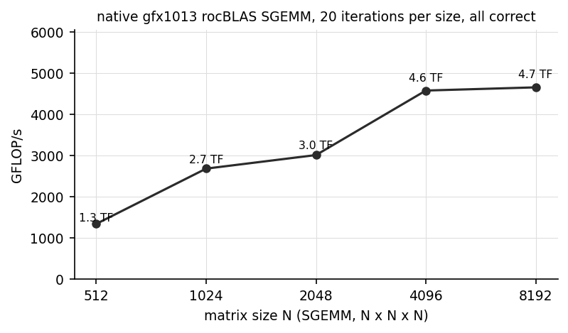
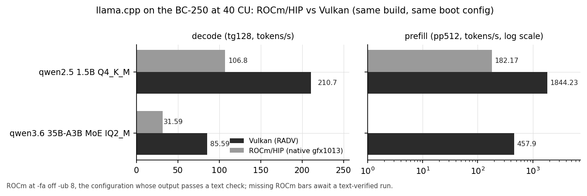
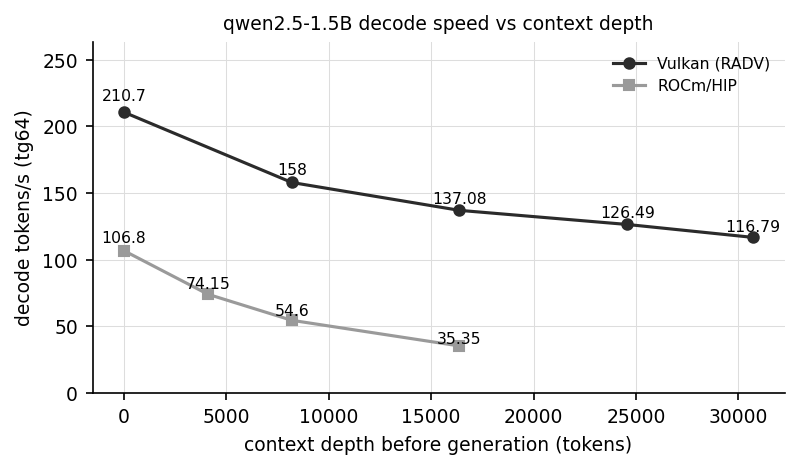

# ROCm / HIP on the AMD BC-250 (gfx1013, Cyan Skillfish): field notes

These are notes from testing GPU compute on an AMD BC-250, from one board and one software stack.
The measurements are reproducible and included as logs; the explanations are working theories and
may be wrong or incomplete. Corrections and "have you tried X" comments are welcome; see
[Open questions](#open-questions) at the end.

This is the ROCm/HIP companion to [akandr/bc250](https://github.com/akandr/bc250), which covers the
board itself and its (working) Vulkan setup; that background is not repeated here. For a long time
the Vulkan side was the only usable one, and these notes documented how far the ROCm/HIP stack
could be pushed before hitting a wall. As of kernel 7.1.5 that has changed: a configuration exists
under which the failures documented here largely stop reproducing, and ROCm becomes genuinely
usable for inference and GPGPU work, with known limits (see
[A working configuration](#a-working-configuration-kernel-715)). The investigation is kept intact
below, both because the observations remain real on older kernels and configurations, and because
they explain what the working configuration actually changes.

Environment throughout: Fedora 43, ROCm 6.4.2 (rocBLAS 6.4.4 as shipped, plus a native gfx1013
rocBLAS built locally), LLVM/clang 19, Mesa 25.3 RADV for the Vulkan comparison, the community
40-CU unlock, the oberon governor around 1500 MHz. The historical observations were taken on
kernel 6.18.9-200.fc43; the working configuration and the new benchmarks are on kernel
7.1.5-100.fc43.

## Contents

- [A short primer: the AMD compute stack](#a-short-primer-the-amd-compute-stack)
- [The claim this repo tests](#the-claim-this-repo-tests)
- [A working configuration (kernel 7.1.5)](#a-working-configuration-kernel-715)
- [What the working configuration measures](#what-the-working-configuration-measures)
- [Observation 1: occasional silent wrong results](#observation-1-occasional-silent-wrong-results)
- [Observation 2: the compute queue wedges under load](#observation-2-the-compute-queue-wedges-under-load)
- [Building a native gfx1013 rocBLAS](#building-a-native-gfx1013-rocblas)
- [Observation 3: the unlock, the fix, and the wedge are entangled](#observation-3-the-unlock-the-fix-and-the-wedge-are-entangled)
- [How far ROCm inference gets](#how-far-rocm-inference-gets)
- [ROCm vs Vulkan](#rocm-vs-vulkan)
- [Status snapshot](#status-snapshot)
- [Open questions](#open-questions)
- [Reproducing](#reproducing)
- [Files](#files)
- [References](#references)

## A short primer: the AMD compute stack

This section lays out the vocabulary the rest of the document uses, working from an application down
to the silicon. It is a simplified picture.

### The one-picture version

A program like llama.cpp can reach the same GPU by two completely separate software roads. One is
built for graphics (and works on this board), the other for general-purpose compute (and is the one
that struggles):

```
                    llama.cpp  (the application)
                   /                            \
        COMPUTE road (ROCm)              GRAPHICS road (Vulkan)
   HIP        a CUDA-like API          Vulkan      graphics + compute API
   rocBLAS    math libraries           (shaders)   the GPU programs
   ROCr/HSA   userspace runtime        Mesa RADV   userspace driver
   KFD        in the amdgpu driver     amdgpu DRM  kernel driver
        |                                    |
   MEC compute queue                  graphics (universal) queue
         \                                  /
                 one shared set of GPU shader cores
```

Everything below just names the boxes in that diagram.

### Architectures, cores, and the word "kernel"

**GPU architectures have ISA names.** AMD GPUs carry an instruction-set name such as `gfx900`,
`gfx1030`, or `gfx1100`, and GPU programs are compiled for a specific one. This board's GPU is
**gfx1013** (RDNA1-class), which is not on ROCm's official supported-GPU list, so "is gfx1013
supported?" recurs throughout.

**Shader cores, CUs, and wavefronts.** A GPU runs work on many small parallel cores grouped into
**compute units (CUs)**; vendors often disable some at the factory ("harvesting"), and threads
execute in lockstep groups called **wavefronts**. How many CUs end up enabled turns out to matter
later.

**"Kernel" means two things.** A **GPU kernel** is a
small program that runs on the GPU (one launch of it is a **dispatch**). The **Linux kernel** is
the operating system, and the `amdgpu` **kernel driver** lives inside it. "A compute kernel wedges"
means a GPU program; "kernel 6.18" means Linux.

### The two software roads

**Graphics (works here).** OpenGL and Vulkan are served on Linux mostly by **Mesa**; AMD's Vulkan
driver in Mesa is **RADV**. llama.cpp's Vulkan backend uses this road, and it runs well on the
BC-250.

**Compute (the hard one).** AMD's general-purpose compute stack is **ROCm**. Its CUDA-like
programming API is **HIP** (close enough to CUDA that code often ports with a rename), and on top
sit math libraries such as **rocBLAS**. Underneath HIP is the **ROCr / HSA runtime**, the userspace
layer that talks to the driver and hands work to the GPU; environment variables like
`HSA_OVERRIDE_GFX_VERSION` and errors like `HSA_STATUS_ERROR_MEMORY_APERTURE_VIOLATION` come from
here. llama.cpp's HIP backend uses this road, and it is the one that struggles on this chip.

**KFD.** The kernel-side half of ROCm is the **KFD** (Kernel Fusion Driver), part of the `amdgpu`
module. It sets up the compute queues, doorbells, and per-process GPU memory maps that HIP programs
use. "The compute queue is broken" points at something in this path.

### How work actually reaches the GPU: queues

The driver hands work to the GPU through hardware **queues** (command rings the GPU pulls from, like
a to-do list). Two matter here:

- the **graphics / universal queue**, driven by the GFX engine, and
- the **compute queue(s)**, driven by the **MEC** (MicroEngine Compute), a small firmware processor
  on the GPU dedicated to compute dispatches.

The single most important fact for this whole document: **ROCm/HIP sends its compute to the MEC
compute queue**, while Vulkan/RADV normally uses the graphics queue. Same shader cores at the
bottom, different route to reach them. (An OpenCL path called **RustiCL**, part of Mesa, also goes
by the graphics-queue route, which makes it a handy control later.)

**KIQ, PASID, and TLB flushes.** The **KIQ** (Kernel Interface Queue) is a special ring the driver
uses to ask the MEC firmware to do privileged jobs. One such job is invalidating the GPU's
address-translation cache (a **TLB flush**, the GPU equivalent of a CPU's TLB) for a given process,
which is identified by a **PASID**. Newer kernels route that PASID TLB flush through the KIQ/MEC
firmware; older kernels did it directly from the CPU over memory-mapped registers (**MMIO**). That
choice is the crux of Observation 1.

**rocBLAS, Tensile, and code objects.** rocBLAS is AMD's matrix-multiply (BLAS) library; **Tensile**
is the part that generates its GPU programs per architecture. Those compiled GPU programs are
**code objects** (files ending `.hsaco`, an ELF holding GPU machine code). Stock rocBLAS ships no
gfx1013 code objects, so matrix operations have nothing to run and fall over. Building them is one
of the sections below.

### How Mesa handles it

Mesa's source, for this chip, carries the comment `GFX1013 is known to have broken compute queue`,
and RADV
[disables the compute-only queue for it](https://gitlab.freedesktop.org/mesa/mesa/-/merge_requests/33116),
routing compute through the graphics queue instead. ROCm has no equivalent escape hatch: its
compute goes to the compute queue, so it cannot side-step the problem the same way.

## The claim this repo tests

Getting ROCm working would open up the wider GPGPU ecosystem on the board (rocBLAS, PyTorch-shaped
workloads, image generation, and so on). The stock answer is that it cannot: the compute queue is
broken. The notes below test that claim. A tentative reading of the results is that the single label
"broken compute queue" appears to cover **two different problems** that behave very differently.
That split is an interpretation of the observed behaviour, not a proven account. The two sections
that follow give the current answer; the observations after them are the investigation that led to
it, kept as recorded, with notes where later results corrected them.

## A working configuration (kernel 7.1.5)

The short version: on kernel 7.1.5, three ingredients that could not previously be combined turn
out to compose, and together they remove the failure modes that made ROCm unusable here.

```
kernel 7.1.5 (Fedora 43 updates)
+ the 40-CU unlock                   amdgpu.bc250_cc_write_mode=3
+ the corrected PASID TLB flush      flush_pasid_uses_kiq = false (the patch from Observation 1)
+ hardware scheduling                do NOT set amdgpu.sched_policy=2
+ HSA_ENABLE_SDMA=0 in the environment for HIP processes
```

Two findings make this possible. Both are corrections to observations below, and both are scoped to
the kernel version, which is why they were missed earlier.

**The unlock and the flush fix no longer conflict.** On 6.18 the corrected flush forced the board
to 24 CU, where compute wedges (Observation 3): the unlock only fired from a KIQ reset context that
the flush fix removed. On 7.1.5 the unlock fires from ordinary driver init, and the board comes up
at 40 CU with the corrected flush, verified on every test boot by the boot log (the patched module
prints its flush state at init, so a stale-initramfs mixup is excluded). The entanglement was a
property of that kernel era, not of the hardware.

**The flush and the scheduler interact; both changes are required.** `amdgpu.sched_policy=2` was
adopted here early, from the community freeze workaround, and every wedge measurement below was
taken under it. To untangle the two variables properly, a full two-by-two factorial was run on
7.1.5: `flush_pasid_uses_kiq` (false / true) crossed with `sched_policy` (default hardware
scheduling / 2), two boots per cell in a mirror-balanced order (A B C D D C B A), a fixed
measurement battery per boot (three 8.4M-thread correctness probes, SGEMM N=2048 x10 and N=4096
x50, dmesg counters, a health check), and everything else identical:

| cell | flush | scheduling | result (2 boots each) |
|---|---|---|---|
| A | false | hardware (default) | clean both boots (and a third pilot): probes 3/3 correct, both GEMMs complete correct, zero preemption timeouts, board responsive |
| B | false | 2 (software) | probes hang 3/3, both GEMMs wedge, 19 `cp queue preemption time out` per boot, queue degraded |
| C | true | hardware (default) | board lost mid-battery, both boots (the KIQ-flush freeze; recovered by power cycle) |
| D | true | 2 (software) | the historical configuration: probes mostly pass, sustained N=4096 wedges or faults on both boots |

The table reads cleanly as an interaction. Cell C is why `sched_policy=2` existed at all: under
hardware scheduling with the stock flush, the KIQ PASID flush freezes the board, so the software
scheduler was the rational mitigation. Cell B and D show the price: under software scheduling,
queue evictions preempt through `kgd_hqd_destroy`, which is exactly where the wedge message is
printed (Observation 2), and sustained compute wedges with either flush setting. Only cell A,
both changes together, is clean: the corrected flush removes the freeze that made hardware
scheduling unsurvivable, and hardware scheduling removes the eviction path that made compute
wedge. On 6.18 cell A was unreachable, because the corrected flush forced 24 CU there
(Observation 3); the knob sweep's `sched_policy=0` negative on that kernel was in effect a cell-C
or 24-CU measurement. Which 7.x kernel change decoupled the unlock, and whether the HWS path also
improved independently, were not isolated here.

This also reframes the kernel-7.1.5 test reported in Observation 2, which found both defects
persisting on the newer kernel: that boot carried `sched_policy=2` on its command line, because at
the time that was standard practice here. The failures it recorded were real, but they belong to
the software-scheduling path, not to the kernel version.

### Why this was missed

A short methodological accounting, since the earlier conclusions leaned toward hardware and were
wrong in their scope. Four things compounded:

- **A workaround became an unexamined constant.** `sched_policy=2` was adopted early as the freeze
  mitigation and then carried on every command line, including the newer-kernel test. Under it,
  evictions preempt through the exact driver path that emits the wedge message. Every wedge
  measurement was taken inside the failure mode the mitigation itself selected.
- **Two interacting blockers defeated one-variable experiments.** On 6.18 the correctness fix cost
  16 CUs (Observation 3), and at 24 CU everything wedges; without the fix, correctness failed. Each
  single fix therefore failed, and repeated single-fix failures look exactly like an intrinsic
  hardware limit. The combination that works was never reachable one change at a time on that
  kernel.
- **Intermittency degraded the knob sweep.** The 6.18 sweep sampled each knob a few times in a
  regime where the base failure rate drifts by boot and by session, so a false negative on any
  single knob (including `sched_policy=0`) was likely enough.
- **Throughput was mistaken for correctness in inference.** Token rates and clean exits do not
  prove the tokens are right (see the flash-attention note below). A seed-fixed text check now
  accompanies every inference claim here.

What remains fairly attributed to the hardware or firmware: the underlying TLB-invalidation
oddities, the load-time host-aperture fault, the rare extreme-size dispatch fault, and the
`hqd_destroy` preemption timeout itself. What does not: the practical unusability, which was a
stack of driver-path and userspace choices that newer kernels and different configuration avoid.

## What the working configuration measures

All numbers in this section are from kernel 7.1.5 at 40 CU with the corrected flush and hardware
scheduling, native gfx1013 code throughout, no `HSA_OVERRIDE`, llama.cpp build 2da6686, one
`llama-bench` invocation per test. Logs: [`logs/bench-2026-08/`](logs/bench-2026-08/).

### Everything that used to fail, rerun

| workload | historical result | working configuration |
|---|---|---|
| SGEMM N=2048 x10 | protection fault | correct |
| SGEMM N=4096 x50 sustained | wedge, near-every-run | correct, about 4.6 TFLOP/s |
| SGEMM N=4096 x200 sustained | never survived | correct |
| SGEMM N=8192 x20 sustained | wedge / occasional corruption | correct, about 4.7 TFLOP/s |
| 10 rapid single-GEMM processes | queue degradation, stalls | 10/10 clean |
| streaming-read probe, 1 and 2 GB | abort at 1 GB, wedge at 2 GB | 0/10 failures at both |
| compute probe, 8.4M threads | failed on 4/4 boots (July, policy 2) | 17/17 correct in a counterbalanced A/B |
| compute probe sweep 1M to 16.7M | wrong results / faults / hangs | 40/40 correct across two benchmark boots |
| HIP process exit | freeze risk | clean exits throughout |

### SGEMM throughput (native gfx1013 rocBLAS)

Twenty iterations per size, every result checked against a CPU reference, all correct:

| N | median ms per GEMM | GFLOP/s |
|---|---|---|
| 512 | 0.2 | about 1340 |
| 1024 | 0.8 | about 2680 |
| 2048 | 5.7 | about 3010 |
| 4096 | 30.0 | about 4580 |
| 8192 | 236.0 | about 4660 |

About 61 percent of the 7.68 TFLOP/s FP32 peak at the governor's 1500 MHz cap, from an untuned
Tensile build.



### Two userspace defects, found the hard way

Before the inference numbers, the caveat that gates all of them. A seed-fixed generation check
(the habit recommended above) caught that llama.cpp's HIP backend, run the obvious way, produces
fluent token rates and garbage text on this board. Bisecting it on fresh boots:

| configuration | result |
|---|---|
| `-fa on`, any batch size, any rocBLAS, MMQ on or off | runs at full speed, output is garbage |
| `-fa off`, default batch | crashes in `hipblasGemmEx` (fp16 GEMM); a q8_0 model errors `CUBLAS_STATUS_INTERNAL_ERROR` on the same call |
| `-fa off -ub 8 -b 8` | **correct, coherent output**, full GPU offload |
| same binary, GPU hidden (CPU only) | correct (the binary is fine) |
| Vulkan, same source and model | correct |

So two distinct userspace defects: llama.cpp's **flash-attention kernel silently computes wrong
results on gfx1013**, and the **fp16 batch-GEMM path** (dequant plus `hipblasGemmEx`) crashes with
the native Tensile library, whose fp16 HPA kernels were never validated here (only FP32 and FP64
were). Neither is a driver or hardware problem; both are reproducible in one minute with a fixed
seed. Every HIP token rate published anywhere for this board without a text check should be
treated as suspect; a day of fa-on numbers was discarded here for exactly that reason.

The working inference configuration is therefore `-fa off -ub 8 -b 8` (plus `HSA_ENABLE_SDMA=0`),
and all numbers below are from it, each model's output text-verified first.

### llama.cpp: ROCm vs Vulkan, same build, same boot configuration



qwen2.5-1.5B Q4_K_M (tokens/s; Vulkan runs with flash attention on, which is correct there):

| test | ROCm/HIP (fa off, ub 8) | Vulkan | HIP as share of Vulkan |
|---|---|---|---|
| pp512 | 182.2 | 1844.2 | 10 percent |
| pp2048 | 170.6 | 1711.5 | 10 percent |
| tg128 | 106.8 | 210.7 | 51 percent |
| tg1024 sustained | 102.2 | | |

A side finding: the small-microbatch prefill is five times faster than the broken large-batch
path was (182 versus 38 t/s), so avoiding the defective fp16 GEMM also closes most of what looked
like a 50x prefill deficit; what remains is about 10x.

Larger models, text-verified in the same configuration: the qwen3.6-35B-A3B MoE (IQ2_M,
10.7 GiB) generates coherent output and decodes at 31.6 t/s against 85.6 on Vulkan (37 percent);
deepseek-r1-14B likewise passes the text check (a coherent reasoning trace), though its rebench
load faulted on the second load of that boot, so its correct-configuration rate is pending a
clean rerun (the fa-on run measured about 20 t/s on the same batch-1 decode path).

### Decode at context depth

Generation speed with the KV cache primed to the stated depth (tg64), qwen2.5-1.5B. Without a
working flash-attention kernel the non-FA attention path pays the full quadratic cost, and it
shows:

| depth | ROCm/HIP (fa off) | Vulkan (fa on) | HIP as share of Vulkan |
|---|---|---|---|
| 0 | 106.8 | 210.7 | 51 percent |
| 4096 | 74.2 | | |
| 8192 | 54.6 | 158.0 | 35 percent |
| 16384 | 35.4 | 137.1 | 26 percent |



An earlier revision of this table, measured with `-fa on` before the garbage-output discovery,
showed ROCm nearly flat with depth; that flatness belonged to the broken kernel, not to the board.
The honest picture is the opposite: a working gfx1013 flash-attention kernel is the single most
valuable missing piece for ROCm inference at depth, and Vulkan is the long-context backend until
one exists.

### PyTorch, and a note on allocation discipline

The official `torch 2.9.1+rocm6.4` wheel with the native gfx1013 rocBLAS grafted in, matmul with
preallocated buffers, thirty iterations per size, all checked and correct:

| N | GFLOP/s |
|---|---|
| 1024 | about 1210 |
| 2048 | about 3050 |
| 4096 | about 4270 |
| 8192 | about 4550 |

Two disciplines make this work, and they define what PyTorch is currently for on this board.
First, allocation: loops that allocate and free GPU tensors every iteration (`c = a @ b`, old `c`
dropped each time) fault after 20 to 40 iterations; with preallocated outputs (`torch.mm(a, b,
out=c)`) and a reused host buffer the same loop is clean indefinitely. Second, kernel coverage:
the official wheel ships no gfx1013 elementwise kernels, so only the rocBLAS-backed matmul path
runs on the GPU; tensor creation and activations must happen on the CPU, and a full autograd
training step fails on the missing kernels (`invalid device function`). A from-source torch build
with `PYTORCH_ROCM_ARCH=gfx1013` should lift that; it was not attempted here.

### ROCm-only capabilities

Things the Vulkan path cannot offer on this board, now usable:

- **Double precision.** rocBLAS DGEMM at N=2048 runs at about 456 GFLOP/s steady state, all
  results correct, which is about 95 percent of the chip's 480 GFLOP/s FP64 peak (RDNA1 executes
  FP64 at one sixteenth of FP32 rate). Vulkan compute has no practical double-precision path on
  this board, so for scientific workloads this capability is exclusive to ROCm.
- **PyTorch.** There is no Vulkan PyTorch backend; the matmul-offload path above makes
  torch-based GPGPU work possible at all, within the disciplines noted.
- **Custom HIP C++ kernels.** Single-source GPU programming with the CUDA-style toolchain: the
  probes in this repo are exactly that, and a small Mandelbrot renderer
  ([`patches/mandelbrot.cpp`](patches/mandelbrot.cpp), FP64 iteration on the GPU) is included as a
  friendly example. An unoptimized FP64 Jacobi stencil (2048x2048, five-point) sustains about
  6.9 ms per sweep (roughly 24 GB/s of effective FP64 memory traffic) for two thousand
  back-to-back GPU sweeps without a hiccup.
- **A practical shape: retrieval.** Cosine-similarity search over one million 384-dimensional
  document embeddings, resident on the GPU, runs at about 960 queries per second through the
  PyTorch matmul path (CPU top-k), with results matching a CPU reference. Small vector-search and
  RAG-style workloads fit entirely in the part of the stack that is now solid.

### What still fails, measured

- **Large-model loads intermittently fault.** The load-time host-to-device staging fault (the
  same aperture violation documented in the inference section) becomes likelier the more bytes are
  staged, and a faulted load degrades the boot, so subsequent loads tend to fault too until a
  reboot. On a clean boot the picture is much better than the size trend first suggested:

| model (file size) | plain | unified memory | mmap on | SDMA on |
|---|---|---|---|---|
| qwen2.5-1.5B (1.0 GiB) | 3/3, and about 15/15 across the day | | | |
| deepseek-r1-14B (8.4 GiB) | 3/3 clean boot; repeated faults on boots where an earlier process had faulted | 3/3 | 3/3 | 0/3 (hang) |
| qwen3.6-35B MoE (10.7 GiB) | 0/3 | 1/3 | | |

  A related control: decode itself runs fine with SDMA enabled (105.7 t/s in a one-off tg64), but
  every model load with SDMA on hung to its timeout, so `HSA_ENABLE_SDMA=0` remains required in
  practice; the SDMA H2D path is still broken for bulk transfers.

  When a large model does load it runs at full speed indefinitely, so this is a load-time
  problem, not a runtime one. The MoE at 10.7 GiB is past the current reliability line.
- **A rare extreme-size dispatch fault.** Across the day's boots the 16.7M-thread probe faulted
  once and the 8.4M probe once (a fresh boot's first run); the two dedicated benchmark boots ran
  the full sweep 40/40 clean. Orders of magnitude better than before, not extinct.
- **One hard crash.** In roughly sixty heavy runs, one power-cut-level crash (a large dispatch on
  an already heavily used boot). Rarer, not extinct.
- **Prefill**, as above: about 40x behind Vulkan pending Tensile tuning.
- All of it is one board, as ever.

## Observation 1: occasional silent wrong results

### What the probe showed

A bare HIP kernel ([`patches/compute_probe.c`](patches/compute_probe.c), native gfx1013, no
rocBLAS, no override) fills an array by arithmetic and checks every element against a CPU
reference. On the stock driver it sometimes returns wrong answers with no error reported. In one
run at about 8.4 million threads, 525,308 elements were wrong, and each wrong element still held its
pre-kernel value, as if some stores were dropped. Silent wrong results are the most dangerous
failure mode, so this was worth chasing.

| module | 1M | 4M | 8M | 16M | silent-wrong runs | kiq-fence freeze |
|--------|:--:|:--:|:--:|:---:|:-----------------:|:----------------:|
| stock (`flush_pasid_uses_kiq = true`) | ok | ok / abort | 525,308 wrong / hang | hang | yes | yes |
| patched (`= false`) | ok | ok | ok (mostly) | 16.7M correct once; some recoverable hangs | 0 | no |

Full logs: [`logs/stock/`](logs/stock/), [`logs/patched/`](logs/patched/).

### A likely explanation (tentative)

The dropped-store pattern points at address translation. The PASID TLB flush
(`amdgpu_gmc_flush_gpu_tlb_pasid()`) branches on `adev->gmc.flush_pasid_uses_kiq`. When true (the
mainline default), the flush is submitted to the KIQ ring, so the MEC firmware performs it while
compute is in flight, and this path is also the source of a `timeout waiting for kiq fence`
board-freeze. When false, the flush is done from the CPU over MMIO, with no MEC involvement.

A plausible reading, and it is only that, is that routing the invalidation through the MEC while a
compute kernel is running lets a translation get invalidated out from under an in-flight wavefront
on this Navi-1x part, so the store lands nowhere. Setting that field to false appears to make the
wrong answers go away in these tests:

```c
/* BC-250/gfx1013: route PASID TLB flushes via MMIO, not the KIQ ring */
adev->gmc.flush_pasid_uses_kiq = false;
```

The change is [`patches/amdgpu-flush-pasid-mmio.patch`](patches/amdgpu-flush-pasid-mmio.patch),
built with [`scripts/build_patched_amdgpu.sh`](scripts/build_patched_amdgpu.sh). The same change
also stops the `kiq fence` board-freeze and greatly speeds up model loading.

Credit for the `flush_pasid_uses_kiq = false` idea belongs to **anrp** and **ahorek** in
[ROCm/ROCm#6313](https://github.com/ROCm/ROCm/issues/6313), who found that it stops the freeze. What
these tests seem to add is that it also removes the silent wrong results in an A/B comparison. That
is an n=1 hardware result, so independent reproduction or refutation would be valuable.

This comes with an important caveat, though. The patched runs above were captured on a boot where
the patched module happened to come up at 40 CU. More often the same patch seems to leave the board
at 24 CU, where even a trivial compute dispatch wedges, so getting the correct flush and a working
compute queue at the same time was not something these tests could do reliably. Why that might
happen is [Observation 3](#observation-3-the-unlock-the-fix-and-the-wedge-are-entangled); it is part
of why "fixed" would overstate this.

### A useful contrast: the graphics queue runs the same compute cleanly

The clearest single test runs the identical kernel on the graphics queue instead of the compute
queue, by porting it to OpenCL ([`patches/ocl_compute_probe.c`](patches/ocl_compute_probe.c)) and
running under **RustiCL** (`RUSTICL_ENABLE=radeonsi`), which dispatches through the
graphics/universal queue as RADV does:

| size (threads) | HIP (MEC compute queue) | RustiCL (graphics queue) |
|----------------|-------------------------|--------------------------|
| 1,048,576 | ok | 0 wrong, 2.0 ms |
| 4,194,304 | ok | 0 wrong, 46 ms |
| 8,388,608 | 525,308 wrong / wedge | 0 wrong, 92 ms |
| 16,777,216 | wrong / hang | 0 wrong, 184 ms |

The graphics queue was correct and fast at every size, including a sustained
many-small-dispatch pattern (1M threads times 200 sequential launches), with no wedges
([`logs/rusticl_graphics_queue_ok.log`](logs/rusticl_graphics_queue_ok.log),
[`logs/rusticl_sustained_ok.log`](logs/rusticl_sustained_ok.log)). One reading is that the shader
hardware, memory, and ALUs are fine, and the fault lives specifically in the MEC compute-queue
path, which would also explain why Mesa's route-through-graphics fix works and why ROCm, unable to
do that, is stuck. That is offered as the most consistent interpretation, not a proof.

**Where this lands now:** under the working configuration (kernel 7.1.5, corrected flush at 40 CU,
hardware scheduling) the silent wrong results were not observed at all: the old failing size ran
17/17 correct in a counterbalanced A/B and the full 1M-to-16.7M sweep ran 40/40 clean across two
benchmark boots, with two isolated faults elsewhere in the day as the residual. The 40-CU caveat
above no longer applies on 7.1.5 (see Observation 3).

## Observation 2: the compute queue wedges under load

Separately from the wrong results, a large or sustained stream of compute dispatches intermittently
wedges the queue. This appears even in the 40-CU configuration where smaller dispatches are correct,
and the measurements below are from that configuration. The teardown in dmesg reads:

```
amdgpu: cp queue preemption time out.
amdgpu: Pasid 0x8004 destroy queue 1 failed, ret -62      (-62 = ETIME)
amdgpu: Resetting wave fronts (nocpsch) on dev ...
```

A lost completion interrupt was one theory, plausible on a board that prints
`Fence fallback timer expired` every boot. But memory-polled completion (`HSA_ENABLE_INTERRUPT=0`)
hangs the same way, and the message is specifically a preemption timeout: the driver asks the MEC
to preempt a queue and it never yields. So it is a preemption that does not complete, not a signal
going missing; what that preemption is actually for turns out to be a routine queue eviction, traced
in [What the wedge appears to be](#what-the-wedge-appears-to-be-a-queue-eviction-whose-preemption-times-out)
below. Either way it resembles the "compute-only queue doesn't work properly" that Mesa documented
and chose to route around.

No driver knob removed it in these tests. Tried without effect: `amdgpu.sched_policy` 0, 1, and 2
(1, HWS without over-subscription, was worse, a stuck dispatch there escalates to a full GPU reset
rather than a per-queue eviction), CWSR on and off, `HSA_ENABLE_INTERRUPT` 0 and 1, `amdgpu.mcbp`
(mid-command-buffer preemption) on and off, `amdgpu.queue_preemption_timeout_ms` raised from the
9000 default to 90000, transparent hugepages set to `never`, HIP graphs on and off,
flash-attention on and off, 24 versus 40 CU, and native-versus-override builds. Two firmware
versions were compared by extracting the older Cyan Skillfish set (release 21.40) from the
linux-firmware git history and force-loading it in place of the current 21.50 (different MEC/CP
microcode, same RLC); the wedge behaved the same on both. Pacing dispatches with idle gaps between
them looked promising on single runs but did not hold up: over ten runs on a fresh boot it wedged
about as often as back-to-back. That is a list of things that did not help, not a claim that
nothing can; the per-knob results are in
[`logs/wedge_knob_sweep.txt`](logs/wedge_knob_sweep.txt).

A newer kernel does not fix it. That was first apparent from source: the compute-queue reset and
preemption functions in this path (`gfx_v10_0_kiq_reset_hw_queue`, `gfx_v10_0_reset_kcq`) are
byte-for-byte identical between 6.18.9 and current mainline, and mainline carries no gfx1013-specific
preemption code. It also holds when actually booted. Fedora's kernel 7.1.5 (about a year newer than
6.18.9, and newer than the ROCm 7.1 / kernel 7.0 stack others report on in
[ROCm/ROCm#6313](https://github.com/ROCm/ROCm/issues/6313)), with the same amdgpu rebuilt to carry
only the 40-CU unlock and the stock flush, comes up at 40 CU and reproduces both problems: the bare
compute probe is correct at 1M threads but, across four fresh boots, failed every time at 8M, twice
with silent wrong results (about 2.3M and 3.3M dropped-store elements of 8.4M) and twice with a GPU
memory-access fault, and wedges at 16M with `cp queue preemption time out`; native gfx1013 rocBLAS is
correct at N=1024 and N=2048 (about 226 and 1400 GFLOP/s) but faults at N=4096 with a
`GCVM_L2_PROTECTION_FAULT`, the same fault class others flag in that thread. Logs:
[`logs/kernel-7.1.5/`](logs/kernel-7.1.5/). `HSA_XNACK=1` is also a dead end here: the chip reports
`gfx1013:xnack-` and stays that way even with `amdgpu.noretry=0`, so retry-fault memory coherence
(which would replace the eviction path below) is not available in hardware.

### Seeing it with a real library GEMM

To watch this without llama.cpp in the way, a native gfx1013 rocBLAS was built (next section) and a
tiny CPU-checked SGEMM run at various sizes ([`patches/sgemm_sweep.cpp`](patches/sgemm_sweep.cpp)):

| GEMM | stock module, 40 CU | note |
|------|---------------------|------|
| N=256 / 512 / 1024 / 2048 (single) | correct | up to about 1660 GFLOP/s at N=2048 |
| N=512 times 2000 (sustained) | correct, about 2327 GFLOP/s | thousands of small GEMMs are fine |
| N=1024 times 500 (sustained) | correct, about 3746 GFLOP/s | |
| N=2048 times 200 (sustained) | wedge (timeout) | |
| N=4096 (single) | wedge (timeout) | |

Full log: [`logs/rocblas/sgemm_sweep_stock_40cu.log`](logs/rocblas/sgemm_sweep_stock_40cu.log). Two
points stood out. Almost every GEMM that completed was numerically exact, and within a single
long-lived process (one allocation, many dispatches, [`patches/sgemm_iter.cpp`](patches/sgemm_iter.cpp))
the failures were wedges, not wrong answers.
The exception was at larger sizes: a single N=8192 GEMM once returned a wrong result in an earlier
run (checksum mismatch, not captured in the logs here), so "structured kernels never corrupt" would
be too strong; wrong results are rarer with them, not absent. And the wedge
looked intermittent rather than a clean size threshold: N=1024 hung once and then ran fine on
retry. That intermittency is why "just keep dispatches small" seems unlikely to be made reliable.
On a fresh boot the queue tends to tolerate roughly one large sustained dispatch and then wedge on
the next, whether or not the dispatches are paced.

### What the wedge appears to be: a queue eviction whose preemption times out

Tracing the driver gives a more specific picture than "stuck mid-flight", and it lines up with the
intermittency. On this scheduler (`sched_policy=2`, the non-HWS path) the `cp queue preemption time
out` message is printed only by `kgd_hqd_destroy`, which is reached only when a compute queue is
being destroyed or evicted. So the timeout is not a dispatch failing on its own; it is a queue
*eviction* whose MEC preemption does not complete.

A function-tracer stack trace on the eviction entry point
([`logs/ftrace/wedge_eviction_stack.txt`](logs/ftrace/wedge_eviction_stack.txt)) shows what triggers
those evictions, captured on a wedging run while the process was hung mid-dispatch (not exiting):

```
evict_process_queues_nocpsch  <-  kgd2kfd_quiesce_mm  <-  svm_range_evict
  <-  svm_range_cpu_invalidate_pagetables  <-  __mmu_notifier_invalidate_range_start
  <-  __split_huge_pmd  <-  __x64_sys_munmap
```

The trigger is the process's own `munmap`. The ROCm/HIP/Tensile runtime churns its address space
(a couple hundred `munmap` calls over a run, from code-object and module management,
not application `malloc`, and roughly constant rather than scaling per GEMM). Each unmap that overlaps
a KFD SVM range fires an MMU notifier, and KFD
responds by quiescing, that is evicting, all of the process's compute queues. Evicting a compute
queue means preempting it on the MEC, and on this board that preemption intermittently times out
when a dispatch is in flight. Process exit is a second trigger for the same eviction path (via a
userptr invalidate rather than `munmap`), which is consistent with the HIP exit-freeze.

If that reading is right, the eviction itself is ordinary KFD behaviour that happens on any ROCm
system; the board-specific part is only that the MEC preemption for it sometimes never completes.
It would also explain the pattern above: larger dispatches spend longer in flight, so an eviction is
likelier to land while one is running; pacing does not help because the runtime keeps churning
memory regardless; and no scheduler or timeout knob helps because the failing step is the MEC
preemption, below all of them. This is one board's trace and an inference from it, not a proof, but
it is more specific than the earlier guess and it is reproducible with the recipe in the log file.

When a large dispatch fails as a page fault rather than as a wedge or wrong results, amdgpu decodes
it. In one captured instance the faulting client is **TCP** (the shader's vector-L1 / vector-memory
path), the page is mapped and the page-table walk succeeds (`MAPPING_ERROR: 0x0`, `WALKER_ERROR:
0x0`), and the access is rejected on **permission** (`PERMISSION_FAULTS: 0x3`) on a **read** (`RW:
0x0`). So this is a permission rejection on a mapped page, not a missing one. That is a single decode,
and the rest is interpretation rather than measurement. A permission fault on a mapped page, on a
read, matches the known pattern of a buffer unmapped while a shader still references it (a
use-after-free on the GPU side), which is exactly the runtime `munmap` churn and queue eviction of
Observation 2 seen from the memory controller. Read that way, the same eviction that usually times out
the MEC preemption and wedges the queue can instead let an in-flight read land on a just-revoked page
and fault; the fault address being in the process's SVM range fits. A stale translation left by the
PASID flush (Observation 1) could also leave a wrong permission, so one trace does not cleanly
separate the two. Offered as a hypothesis, from one board. The full decode is in
[`logs/deep-dive-2026-07-28/l2_fault_decode.log`](logs/deep-dive-2026-07-28/l2_fault_decode.log), and
the same `GCVM_L2_PROTECTION_FAULT` is the fault class others report from an image-bandwidth test in
[ROCm/ROCm#6313](https://github.com/ROCm/ROCm/issues/6313). A bare HIP streaming-read kernel
([`patches/bw_probe.cpp`](patches/bw_probe.cpp), no arithmetic, no rocBLAS) reproduces the
size-dependent failure on its own.

**Where this lands now:** the wedge described in this section belongs to the software-scheduling
path. Every measurement above was taken under `amdgpu.sched_policy=2` (including the
kernel-7.1.5 test, whose command line carried it), and the message itself is printed from the
nocpsch eviction path this section traced. On 7.1.5 with hardware scheduling the same workloads
run clean, up to N=8192 sustained, and the two-by-two factorial isolating flush and scheduler is in
[A working configuration](#a-working-configuration-kernel-715). The eviction analysis here still
describes what happens under policy 2, and the 6.18 knob sweep shows policy alone was not enough
on that kernel; but the "firmware or silicon limit" conclusion was too broad. The MEC preempts
fine on 7.1.5 when the firmware scheduler asks; what fails is the driver-initiated `hqd_destroy`
preemption path.

## Building a native gfx1013 rocBLAS

A long-standing workaround for the missing gfx1013 matrix kernels is to build for **gfx1010** and
run with `HSA_OVERRIDE_GFX_VERSION=10.1.0`, since gfx1010 and gfx1013 share an ISA. In these tests
that override is a dead end for real workloads: the memory-aperture layout differs, so anything
using scratch or private addressing hits `HSA_STATUS_ERROR_MEMORY_APERTURE_VIOLATION`. Only a tiny
scratch-free SGEMM survives, which is probably why the override has looked promising.

Following the approach of
[ROCm/rocm-libraries PR #8838](https://github.com/ROCm/rocm-libraries/pull/8838), rocBLAS was
instead built natively for gfx1013 on Fedora's system ROCm. That meant working through a chain of
Fedora-specific issues: system ROCm lives in `/usr` rather than `/opt/rocm`; `amdclang++`,
`msgpack-cxx`, and `roctracer` were missing; and gfx1013 had to be added to Tensile's `SupportedISA`
and `AsmCaps` and to the Tensile and rocBLAS C++ architecture enums. The full worked recipe is in
[`scripts/build_rocblas_gfx1013.sh`](scripts/build_rocblas_gfx1013.sh).

The result is a real `librocblas.so.4.4` (about 37 MB) with 56 gfx1013 Tensile libraries and
genuine gfx1013 code objects (`Kernels.so-000-gfx1013.hsaco` reports ELF machine "AMD GPU" with
gfx1013 flags, native rather than an override). It runs on the board with no `HSA_OVERRIDE` and
computes correct GEMMs, per the table above. The main value is that it removes the override from
the picture: where a native rocBLAS GEMM works it is correct, and where it does not it is the
wedge, not an aperture mismatch. At the time of the original investigation it was not enough for
reliable inference, because the wedge still applied to the large fused matmuls that inference
leans on; under the working configuration that limit is gone and this library is the one behind
the SGEMM and PyTorch numbers above.

Two related notes. Fedora's own system rocBLAS "supports gfx1013" only by symlinking its gfx1013
Tensile files to the gfx1010 ones, so a stock install is silently running the gfx1010 override, which
is a fair part of why "rocBLAS works on gfx1013" reports coexist with real workloads failing. And the
same wedge reached a mainstream framework: the official `torch 2.9.1+rocm6.4` wheel detects the board
but ships no gfx1013 (or gfx1010) kernels, so a matmul fails immediately out of the box; with a native
gfx1013 rocBLAS grafted in, PyTorch matmuls were correct up to N=4096 single, but a sustained loop
(N=4096 repeated) wedged the compute queue the same way the probes and rocBLAS did
([`logs/deep-dive-2026-07-28/`](logs/deep-dive-2026-07-28/)). Under the working configuration the
sustained loop is clean (the PyTorch table above); what remains on the torch side is the wheel's
missing gfx1013 elementwise kernels and the allocation discipline, both described there.

## Observation 3: the unlock, the fix, and the wedge are entangled

Two facts collided here. First, without the 40-CU unlock the board runs at 24 CU, and at 24 CU even
a trivial compute dispatch wedges: `compute_probe` returns correct results at 40 CU and hangs at 24
CU. So the community
**40-CU unlock** ([duggasco/bc250-40cu-unlock](https://github.com/duggasco/bc250-40cu-unlock))
appears to be a prerequisite for any ROCm compute here, not just inference, which is
counterintuitive (more CUs, more stable) and hints the wedge is tied to the harvested-CU / WGP-mask
configuration.

Second, in the kernel tree used here the 40-CU unlock's register write lives inside
`gfx_v10_0_kiq_reset_hw_queue()`, a function that only runs when a KIQ hardware queue is reset. On
the stock driver, the KIQ-fence bug triggers such a reset during boot, which incidentally fires the
unlock, so the board comes up at 40 CU.

Together those appear to undercut the correctness change on this board:
`flush_pasid_uses_kiq = false` removes the KIQ activity that was triggering the reset, so the unlock
tends not to fire, the board comes up at 24 CU, and at 24 CU compute wedges. Testing this directly with
the native rocBLAS GEMM, on the patched module at 24 CU every size wedged, including N=256
([`logs/rocblas/sgemm_sweep_patched_24cu.log`](logs/rocblas/sgemm_sweep_patched_24cu.log)). An
earlier session did once boot the patched module at 40 CU, which is where the correct patched
`compute_probe` results (Observation 1) and the prefill pass below came from, but that
patched-and-40-CU state did not reproduce on later boots.

So on this board the available states appear to be the correct TLB flush at 24 CU (where compute
wedges) or the working 40-CU configuration with the buggy flush (wrong results and freeze), but not
both. A controlled rebuild confirmed the entanglement directly: with `flush_pasid_uses_kiq = false`
and the unlock present only in the reset path, the board comes up at 24 CU and the bare probe
wedges, exactly the predicted state.

The obvious escape, moving the unlock write out of the reset path into normal init, did not work in
attempts here, but in an informative way. Placed at the end of `gfx_v10_0_hw_init` (after RLC init,
CU harvesting, and CP resume) the register writes do run, but the board still reports 24 CU: the
40-CU state seems to need the queue-reset context around `kiq_reset_hw_queue`, not just the register
values. Trying to fire that reset deliberately at the end of init, or from userspace via
`amdgpu_gpu_recover`, was either permission-gated or hung the board, and an ordinary compute wedge
routes through a different reset path that does not carry the unlock. So the unlock stays coupled to
the KIQ-fence reset that `flush_pasid_uses_kiq = false` removes. A clean way to decouple the two
would still be very welcome.

The direct "is the wedge a regression" experiment was attempted two ways, both inconclusive for
frustrating reasons. A stock older kernel (Fedora 6.6.14) does not bring this board up at all:
amdgpu's display code faults during KMS init
([`logs/older-kernel-6.6-display-oops.log`](logs/older-kernel-6.6-display-oops.log)), and on the
kernels tested, BC-250 support appears only from about kernel 6.18 (Fedora's 6.18.9 amdgpu exposes
`bc250_cc_write_mode`; its 6.17.1 does not). Reverting the one named TLB regression on 6.18 lands
back in the 24-CU-wedges-everything state above. So whether the wedge itself is a regression or a
hardware limit is unresolved here; the graphics-queue contrast leans toward a hardware or firmware
cause, held loosely.

**Where this lands now:** the entanglement is specific to kernel 6.18. On 7.1.5 the unlock's
register writes run during ordinary driver init and the board comes up at 40 CU with
`flush_pasid_uses_kiq = false`, on every boot, with the module's own init log line confirming both
states together. The "correct flush at 24 CU, or working 40 CU with the buggy flush, but not both"
trade that this section documents was real on 6.18 and is gone on 7.1.5. Which kernel change
between the two decoupled them was not isolated here.

## How far ROCm inference gets

This section records the inference attempts from the 6.18-era investigation; the working numbers
now live in [What the working configuration measures](#what-the-working-configuration-measures).
Its lasting value is the fault analysis: the load-time aperture violation documented here is the
one failure that survives into the working configuration, where it gates large-model loads.

With the patched module, and subject to its 40-CU caveat on 6.18, llama.cpp's HIP backend got
further than before, though not to a usable state on that kernel.

A correct prompt-processing pass was achievable with a native gfx1013 build and rocBLAS kept out of
the hot path:

```bash
cmake -B build-hip -S . -DGGML_HIP=ON -DAMDGPU_TARGETS=gfx1013 \
  -DCMAKE_HIP_COMPILER=/usr/lib64/rocm/llvm/bin/clang++ -DCMAKE_BUILD_TYPE=Release -G Ninja
ninja -C build-hip llama-bench

HSA_ENABLE_SDMA=0 GGML_CUDA_FORCE_MMQ=1 \
  ./build-hip/bin/llama-bench -m qwen2.5-1.5b-q4km.gguf -ngl 999 -fa 1 -p 128 -n 0 -mmp 0
# qwen2.5-1.5B Q4_K_M, pp128 about 35 tok/s, correct, RC=0
```

`-fa 1` (flash attention) and `GGML_CUDA_FORCE_MMQ=1` route around rocBLAS via ggml's own gfx1013
kernels; `HSA_ENABLE_SDMA=0` is still needed on this board. Recipe:
[`scripts/native_fa.sh`](scripts/native_fa.sh).

Token generation is more workable than earlier runs suggested, and what gates it is mostly not the
compute queue. On a later stack (`llama.cpp` b9265, native gfx1013, 40 CU), decode ran and generated
tokens (around 40 tok/s) in most of the runs where the model finished loading, so the earlier read of
decode as hard-blocked was too strong. Two things gate
it, and a compute-kernel scratch fault is not the main one. Logs: [`logs/inference/`](logs/inference/).

First, an intermittent aperture violation. It does not fire on most decode-reaching runs: the
single-boot campaign below reached decode six times and faulted on none. It does recur across
sessions, though, and every instance captured has the same shape. Under `AMD_LOG_LEVEL=3` the fault is not
inside a compute kernel: on the runs that fault, the abort happens before any ggml kernel dispatches
at all, on a runtime host-to-device copy (`__amd_rocclr_copyBuffer`) whose host source is past the
GPU's legal aperture
([`logs/inference/decode_copybuffer_aperture_violation.txt`](logs/inference/decode_copybuffer_aperture_violation.txt),
zero compute kernels dispatched before the abort). That points at this board's UMA host-buffer mapping (only `hipHostMalloc`'d
memory is GPU-legal here), a memory-mapping fault rather than a scratch/private-memory problem in
`mul_mat_vec_q`. An earlier trace on a different llama.cpp build had read as the latter; the two
builds may simply differ, so this is stated for the current one.
[`logs/inference/decode_aperture_violation.txt`](logs/inference/decode_aperture_violation.txt) is that
earlier trace. `GGML_CUDA_ENABLE_UNIFIED_MEMORY=1`, which removes that host copy on a UMA APU, did not
reliably remove the fault.

Second, and far more limiting in practice, the flaky and slow model load. In one single-boot run the
model failed to finish loading 15 of 21 attempts, and it got worse with cumulative GPU use; the runs
that did load then decoded cleanly, with no aperture fault in that run
([`logs/inference/decode_campaign_stats.txt`](logs/inference/decode_campaign_stats.txt), collected by
[`scripts/decode_stats.sh`](scripts/decode_stats.sh)). This is HSA-signal-level (the `hipEventSynchronize` overhead this
board is known for), not the kernel fence timeout: a module rebuilt with a fence-fallback timer at
2 ms did not speed the load. So in practice the wall for decode is getting the model loaded, not a
decode-kernel fault.

For scale at the time: on 6.18 even where ROCm prefill completed it was roughly 36 times slower
than Vulkan on the same model and did not survive repetition. That ratio still roughly holds for
prefill under the working configuration; what changed is that decode, sustained generation, and
the compute path under it now work (the tables above).

## ROCm vs Vulkan

Vulkan appears here only as the baseline the ROCm path is measured against; the full Vulkan
characterization of the board (many models, context scaling, memory ceilings) lives in
[akandr/bc250](https://github.com/akandr/bc250) and is not repeated here. The current side-by-side
is in [What the working configuration measures](#what-the-working-configuration-measures); the
summary is that Vulkan keeps prefill by a wide margin (about 40 to 50x), ROCm reaches half to
three quarters of Vulkan's decode depending on model and context depth, and ROCm alone offers
FP64, PyTorch, and custom HIP kernels. The historical 6.18-era comparison, kept for the record: on
qwen2.5-1.5B Q4_K_M, Vulkan ran pp128/pp256/pp512/tg128 at 1275.8/1597.7/1845.6/210.7 t/s on
every run, while patched ROCm managed about 35 t/s on pp128 and faulted on the rest
([`logs/inference/bench_rocm_vs_vulkan.log`](logs/inference/bench_rocm_vs_vulkan.log)).

## Status snapshot

Offered as a current read, not a verdict; several rows could change with better ideas or newer
firmware.

| Thing | Where it landed |
|-------|-----------------|
| Silent wrong results on large compute | Not observed under the working configuration (17/17 counterbalanced at the old failing size, 40/40 sweep on the benchmark boots, two isolated faults across the day as the residual). On 6.18, addressable in isolation but entangled with the unlock; on 7.1.5 the entanglement is gone |
| KIQ board-freeze on HIP exit | Gone under the corrected flush. `amdgpu.sched_policy=2` is no longer needed for it, and on 7.1.5 is actively harmful (it is the wedge variable) |
| Compute wedge under large / sustained load | Does not reproduce under hardware scheduling on 7.1.5: SGEMM to N=8192 sustained, streaming reads to 2 GB, and teardown churn all run clean. The historical wedge belongs to the software-scheduling eviction path (Observation 2), and on 6.18 the kernel version also mattered |
| Multi-minute model load | Fast under the corrected flush; small models load essentially always |
| Large-model loads | The main practical limit now: the load-time aperture fault becomes likelier with model size and with a previously faulted boot; a dense 14B is reliable on a clean boot, the 10.7 GiB MoE is not yet |
| rocBLAS has no gfx1013 kernels | Built natively (the PR #8838 approach) and now usable end to end: about 4.6 TFLOP/s FP32 at N=4096, FP64 DGEMM at about 95 percent of its rate peak. Untuned, so batch/prefill work is slow |
| llama.cpp inference | Working with text-verified output at `-fa off -ub 8`: decode 107 t/s on a 1.5B (half of Vulkan), prefill about 10x behind. Decode falls off steeply with context depth pending a working gfx1013 flash-attention kernel; two userspace defects (FA kernel wrong results, fp16 batch GEMM crash) documented above |
| PyTorch | Working for preallocated-buffer matmul (about 4.5 TFLOP/s at N=8192); blocked for full training by the wheel's missing gfx1013 elementwise kernels, and per-iteration alloc/free churn still faults |
| Vulkan vs ROCm | Vulkan remains the fast, reliable default for prompt-heavy inference. ROCm is now the path for GPGPU (BLAS, FP64, PyTorch matmul, custom HIP kernels) and is competitive for decode-dominated inference |

In short: what looked like one broken compute queue resolves, on current kernels, into a
configuration problem (scheduler policy plus the flush fix plus the unlock, all three finally
compatible) with a residual load-time fault and a prefill tuning gap on top. All of it is one
board, and any of it could still be wrong.

## Open questions

Places where other eyes would help most:

- Which kernel change between 6.18 and 7.1.5 made the difference, twice over: hardware-scheduling
  preemption surviving on this MEC, and the 40-CU unlock decoupling from the KIQ reset context?
  Bisecting either would turn "works on 7.1.5" into an explanation. (The old questions about
  decoupling the unlock by hand and about MEC firmware versions are answered or mooted by the
  working configuration; MES remains unavailable on this chip, `mes=0`, no Cyan Skillfish MES
  firmware.)
- The load-time aperture violation is now the highest-value target: the host source of a runtime
  staging copy is occasionally outside the GPU's legal aperture, with probability growing with the
  bytes staged and with a previously faulted boot. Unified memory and mmap did not remove it here.
  Pinning down how the runtime chooses those host buffers would likely make 10 GiB and larger
  model loads reliable, which is the last practical blocker for inference.
- The two llama.cpp userspace defects are the highest-leverage inference items now: a gfx1013
  flash-attention kernel that computes correctly (the current one produces garbage silently), and
  the fp16 batch-GEMM path (crashes with the native Tensile library, whose fp16 HPA kernels are
  unvalidated). Both are reproducible in a minute with a fixed seed. Fixing FA alone would
  transform decode at depth; fixing the GEMM path plus Tensile tuning would close most of the
  prefill gap.
- The per-iteration alloc/free fault in PyTorch: torch's caching allocator does not unmap between
  iterations, so this does not look like a stale-translation pattern; what exactly faults there is
  unresolved.
- Whether the same configuration works on other gfx1013 boards. Everything here is one board.
- Did the mining stacks really run sustained compute on this exact path, and if so what did their
  kernel and firmware combination do differently? [ROCm/ROCm#6313](https://github.com/ROCm/ROCm/issues/6313)
  hints that gfx1013 worked under older ROCm and kernel combinations; the scheduler-policy finding
  above may be part of that story.

Data, corrections, or a "you are holding it wrong" are all welcome, as an issue here or a note on
[ROCm/ROCm#6313](https://github.com/ROCm/ROCm/issues/6313).

## Reproducing

- rocm-hip 6.4.2, rocblas 6.4.4, ROCm LLVM/clang 19, mesa 25.3, llama.cpp build 2da6686. Historical
  observations: kernel 6.18.9-200.fc43. Working configuration: kernel 7.1.5-100.fc43.
- The working configuration: kernel 7.1.5, the patched module carrying the flush change and the
  40-CU unlock ([`scripts/build_patched_amdgpu.sh`](scripts/build_patched_amdgpu.sh)),
  `amdgpu.bc250_cc_write_mode=3` on the command line, **no `amdgpu.sched_policy` argument**
  (hardware scheduling is the default), and `HSA_ENABLE_SDMA=0` in the environment of every HIP
  process. Verify `active_cu_number 40` and the module's flush-state line in dmesg before trusting
  a boot.
- Reproducing the historical observations: kernel 6.18.9 with `amdgpu.sched_policy=2`, which the
  earlier revision of this document recommended as a safety measure. Do not carry that setting to
  7.1.5; on the newer kernel it is the difference between the wedge and clean runs.
- [`reproduce.sh`](reproduce.sh) runs the compute probe (small and large) and the rocBLAS probe.
- Native gfx1013 rocBLAS: [`scripts/build_rocblas_gfx1013.sh`](scripts/build_rocblas_gfx1013.sh),
  then [`patches/sgemm_sweep.cpp`](patches/sgemm_sweep.cpp).
- llama.cpp: build with `-DGGML_HIP=ON -DAMDGPU_TARGETS=gfx1013`, run with `--no-mmap` (or
  `--mmap 0` for llama-bench). Run one benchmark per invocation: multi-size sweeps reallocate
  between tests and can trip the load-time fault mid-run. (A control run loaded a 14B with mmap on
  3/3 under the working configuration, so the old hard mmap prohibition may have relaxed; not
  characterized beyond that.)

Two things that cost time. A rebuilt kernel module must be compressed with `xz --check=crc32` (the
build script does this): the xz default is CRC64, which loads via userspace `modprobe` but fails the
in-kernel decompressor from the initramfs (`decompression failed with status 6`), while `xz -t`
still passes, so it looks like a bricked board. Keep a verified-good module backup. And after a
compute wedge a soft reboot often does not recover the queue; a hard power-cycle does. Always verify
`active_cu_number 40` in dmesg and a good `compute_probe` or GEMM run before trusting a setup.

## Files

| Path | What it is |
|------|------------|
| [`logs/bench-2026-08/`](logs/bench-2026-08/) | The working-configuration benchmark campaign: per-test llama-bench logs (HIP and Vulkan), SGEMM curve, probe sweeps, depth ladder, load-reliability trials, PyTorch runs |
| [`figures/`](figures/) | The three figures above, with [`scripts/make_figures.py`](scripts/make_figures.py) to regenerate them from the logged numbers |
| [`logs/factorial/`](logs/factorial/) | The two-by-two flush-by-scheduler factorial: per-boot raw logs and verdicts, results table, and the battery/orchestration scripts ([`scripts/factorial_battery.sh`](scripts/factorial_battery.sh), [`scripts/factorial_orchestrate.sh`](scripts/factorial_orchestrate.sh)) |
| [`patches/dgemm_iter.cpp`](patches/dgemm_iter.cpp) | FP64 DGEMM probe via native gfx1013 rocBLAS (spot-checked against CPU) |
| [`patches/mandelbrot.cpp`](patches/mandelbrot.cpp) | Custom HIP kernel example (FP64 Mandelbrot to PGM) |
| [`patches/torch_matmul_bench.py`](patches/torch_matmul_bench.py) | PyTorch preallocated-buffer matmul benchmark (the allocation-discipline demonstration) |
| [`patches/amdgpu-flush-pasid-mmio.patch`](patches/amdgpu-flush-pasid-mmio.patch) | The one-line kernel change for the correctness observation |
| [`patches/compute_probe.c`](patches/compute_probe.c) | Bare HIP compute reproducer (native gfx1013, CPU-checked) |
| [`patches/ocl_compute_probe.c`](patches/ocl_compute_probe.c) | OpenCL port of the probe (graphics-queue comparison via RustiCL) |
| [`patches/sgemm_sweep.cpp`](patches/sgemm_sweep.cpp) | Native gfx1013 rocBLAS SGEMM sweep with CPU check and timing |
| [`patches/sgemm_iter.cpp`](patches/sgemm_iter.cpp) | Leak-free single-process SGEMM probe (one allocation, per-iteration check) used for the eviction trace |
| [`patches/rocblas_probe.c`](patches/rocblas_probe.c) | Standalone rocBLAS SGEMM availability/correctness test |
| [`scripts/build_patched_amdgpu.sh`](scripts/build_patched_amdgpu.sh) | Build the patched amdgpu module (module-only) |
| [`scripts/build_rocblas_gfx1013.sh`](scripts/build_rocblas_gfx1013.sh) | Build a native gfx1013 rocBLAS on Fedora system ROCm |
| [`scripts/native_fa.sh`](scripts/native_fa.sh) | The native gfx1013 plus FA plus MMQ inference recipe |
| [`logs/ftrace/wedge_eviction_stack.txt`](logs/ftrace/wedge_eviction_stack.txt) | Function-tracer stacks showing the wedge is a queue eviction (triggered by the process's `munmap`) whose MEC preemption times out, plus the recipe to reproduce it |
| [`logs/wedge_knob_sweep.txt`](logs/wedge_knob_sweep.txt) | Per-knob results behind "no knob removed it": scheduler, CWSR, interrupt, mcbp, preemption timeout, hugepages, firmware version, XNACK, pacing, newer-kernel source check |
| [`logs/kernel-7.1.5/`](logs/kernel-7.1.5/) | Newer-kernel test: `compute_probe` (fresh-boot samples + first sweep) and native rocBLAS on Fedora kernel 7.1.5 with the 40-CU unlock, showing the correctness defect and the wedge both persist. Sampler: [`scripts/probe_kernel_sweep.sh`](scripts/probe_kernel_sweep.sh) |
| [`logs/deep-dive-2026-07-28/`](logs/deep-dive-2026-07-28/) | Follow-up round: the amdgpu VM-fault decode (TCP/UTCL2 read permission fault), a PyTorch native-gfx1013 matmul sweep (correct single, wedges sustained), and the gfx1010-symlink note. Summary in that folder's README |
| [`patches/bw_probe.cpp`](patches/bw_probe.cpp) | Bare HIP streaming-read kernel (no arithmetic, no rocBLAS) that reproduces the size-dependent wedge/fault |
| [`logs/inference/decode_aperture_violation.txt`](logs/inference/decode_aperture_violation.txt) | Earlier `AMD_LOG_LEVEL=3` decode aperture-violation trace (on a different llama.cpp build; later runs place the fault on the runtime host-to-device copy) |
| [`logs/inference/decode_copybuffer_aperture_violation.txt`](logs/inference/decode_copybuffer_aperture_violation.txt) | Later `AMD_LOG_LEVEL=3` trace (llama.cpp b9265): the aperture violation aborts on `__amd_rocclr_copyBuffer` with no compute kernel dispatched first (second sample in `...violation2.txt`) |
| [`logs/inference/decode_campaign_stats.txt`](logs/inference/decode_campaign_stats.txt) | Single-boot decode campaign: per-attempt verdict (clean / aperture fault / load timeout), showing the intermittent load as the dominant blocker |
| [`scripts/decode_stats.sh`](scripts/decode_stats.sh) | Runs the decode campaign above, classifying each attempt by its last GPU dispatch |
| [`logs/`](logs/) | Captured run logs: correctness, rocBLAS sweeps, RustiCL comparison, inference, benchmarks, older-kernel attempt |

## References

- [ROCm/ROCm#6313](https://github.com/ROCm/ROCm/issues/6313): BC-250 system freeze after compute workloads. anrp and ahorek found `flush_pasid_uses_kiq = false`; AMD is engaged in the thread.
- [Mesa MR !33116](https://gitlab.freedesktop.org/mesa/mesa/-/merge_requests/33116) and [Mesa 25.1 release notes](https://docs.mesa3d.org/relnotes/25.1.0.html): RADV disables the gfx1013 compute-only queue (commit `7271b8ee`). The MR is by Ivan Avdeev (`provod` on GitLab, `w23` on GitHub), a community contributor, not an AMD employee and not "RADV's author".
- [Mesa issue #11982](https://gitlab.freedesktop.org/mesa/mesa/-/issues/11982): AMD Cyan Skillfish support discussion.
- [ROCm/rocm-libraries PR #8838](https://github.com/ROCm/rocm-libraries/pull/8838): adding gfx1013 support to rocBLAS.
- [kernel bug #216645](https://bugzilla.kernel.org/show_bug.cgi?id=216645): a different system (a Dell laptop with a Navi/RDNA1 RX 5600M) hanging with "Fence fallback timer expired" and amdgpu interrupts ceasing. Not a BC-250 report, but the same fence-fallback / lost-interrupt symptom this board prints every boot, so it is useful background.
- [duggasco/bc250-40cu-unlock](https://github.com/duggasco/bc250-40cu-unlock): the 40-CU unlock and the module-build pipeline reused here.
- [github.com/akandr/bc250](https://github.com/akandr/bc250): the related BC-250 Vulkan setup.
- [Preprint on Zenodo](https://doi.org/10.5281/zenodo.21364833): the write-up of these notes as a single paper (doi:10.5281/zenodo.21364833).

## Author and license

Author: Artur Andrzejczak. Prepared with assistance from Claude.

Code: [AGPL-3.0](LICENSE). Docs: [CC BY-SA 4.0](https://creativecommons.org/licenses/by-sa/4.0/)
