# ROCm on the AMD BC-250 (gfx1013, Cyan Skillfish)

The BC-250 is an ex-mining blade built around an RDNA1-class APU (gfx1013, Cyan Skillfish) with
about 14 GiB of shared memory and 40 compute units once unlocked. Vulkan has worked on it for years.
This repository gets the ROCm stack working too and measures what it does: llama.cpp with correct
output, rocBLAS, and PyTorch.

Below is the manual and the benchmarks for **Fedora 44 with ROCm 7.1.1**. How the fixes were found is
in [INVESTIGATION.md](INVESTIGATION.md).

Fedora 43 with ROCm 6.4.2 also works and measures the same speed, so there is nothing to gain by
upgrading for throughput. Fedora 44 is easier to live with: its toolchain has no fp16 defect silently
zeroing half-precision GEMMs, and its rocBLAS comes from a build script instead of hand edits nobody
could reproduce.

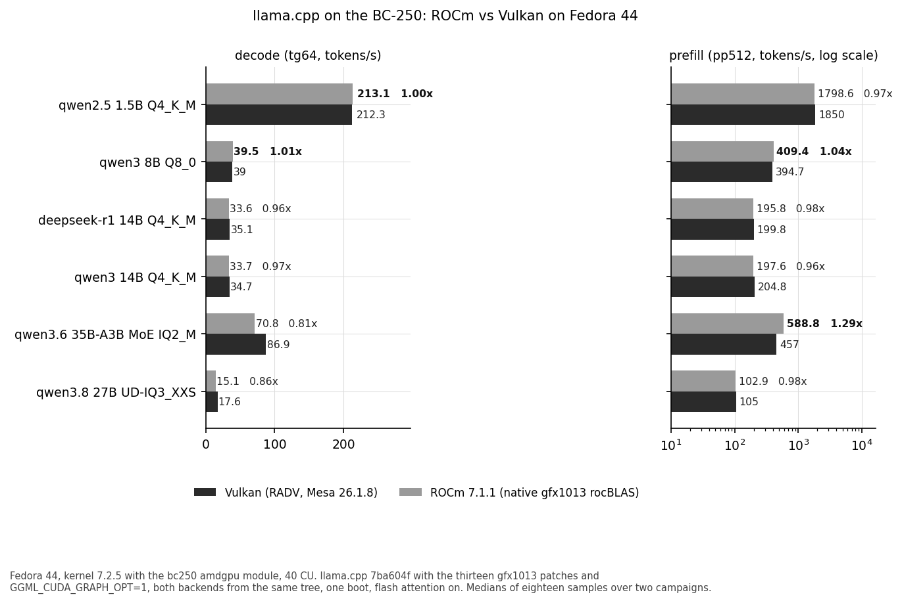

## Contents

[Status](#status) · **[Setup](#setup)**, eight steps · [Benchmarks](#benchmarks) ·
[GPGPU](#gpgpu) · [Where the speed came from](#where-the-speed-came-from) ·
[Known issues](#known-issues) · [Limits](#limits) · [Reproducing](#reproducing)

## Status

| component | state on this board | notes |
|---|---|---|
| amdgpu / KFD compute | works with a patched module | TLB flush fixes (anrp, GabriWar) and the 40-CU unlock (duggasco), [step 1](#1-kernel-module) |
| llama.cpp (ROCm backend) | works, results match Vulkan | thirteen small patches, [step 7](#7-llamacpp) |
| rocBLAS | works with a native gfx1013 build | [step 4](#4-native-gfx1013-rocblas-711) |
| HIP runtime (ROCm 7.1.1) | works with a one-table comgr fix | [step 5](#5-comgr-vgpr-fix); a rebuilt ROCr is optional, [step 6](#6-install-both-ahead-of-the-system-libraries) |
| fp16 compute | correct by default | the Fedora 43 toolchain bug does not exist on Fedora 44 |
| PyTorch | works when built from source for gfx1013 | Fedora's package and the pytorch.org wheel lack gfx1013 kernels |
| SDMA transfers | work with the navi12 microcode, GabriWar | [step 2](#2-firmware-and-boot-arguments) |
| GPU clock | held at 1500 MHz by the oberon governor | sustained work still reaches 93 C and the governor then drops to 1000 MHz, which costs 28 percent and is invisible in the output; the package default is worse, [step 3](#3-gpu-clock-policy) |
| GPU reset / recovery | **does not work** | a reset takes the host down; see [Known issues](#known-issues) |

Everything here is one board. Measurements are reproducible and every figure has a log under
[`logs/`](logs/); explanations are working theories.

## Setup

The configuration measured below: Fedora 44, kernel 7.2.5 with the patched amdgpu module, ROCm
7.1.1 from Fedora, a native gfx1013 rocBLAS 7.1.1, a corrected comgr, and llama.cpp 7ba604f with the
thirteen patches of [step 7](#7-llamacpp). Sections that measured an earlier kernel or an earlier
patch count say so. The kernel version is not critical: the same patch set measured identically on
6.18.9, 6.18.16,
6.19.14, 7.1.5, 7.1.8 and 7.2.5, and below 6.18 the board does not come up. Kernel 7.2 carries amdkfd fixes
that 7.1 lacks, and they change nothing here: the runlist flush is still required, and removing it still
faults ([`logs/kernel-725-2026-09-17/`](logs/kernel-725-2026-09-17/)).

### 1. Kernel module

Apply two scripts to the amdkfd directory of a kernel tree, in this order:

    python3 scripts/apply_runlist_flush.py     <tree>/drivers/gpu/drm/amd/amdkfd
    python3 scripts/apply_svmflush_generic.py  <tree>/drivers/gpu/drm/amd/amdkfd

They add `bc250_flush_by_runlist`, a runlist-rebuild TLB flush on unmap and map, ported from
[GabriWar/bc250-rocm-working](https://github.com/GabriWar/bc250-rocm-working) and extended to the SVM
map side. The module also needs `bc250_flush_pasid_kiq` (the `FLUSHPARAM` step in
[`scripts/ladder_prep_rung.sh`](scripts/ladder_prep_rung.sh); the same change hardcoded is
[`patches/amdgpu-flush-pasid-mmio.patch`](patches/amdgpu-flush-pasid-mmio.patch)) and
`bc250_cc_write_mode` from the community
[40-CU unlock](https://github.com/duggasco/bc250-40cu-unlock). Build and install module-only with
[`scripts/build_patched_amdgpu.sh`](scripts/build_patched_amdgpu.sh), which also rebuilds the
initramfs; the module that runs is the one in the initramfs.

Porting traps: some `kernel-devel` packages lack `amdgpu_trace.h`, and the 40-CU hunk belongs inside
the definition of `gfx_v10_0_get_cu_info`, not its forward declaration, or the board boots at 24 CU.

Check after reboot:

    ls /sys/module/amdgpu/parameters/ | grep bc250
    # bc250_cc_write_mode  bc250_flush_by_runlist  bc250_flush_pasid_kiq
    grep -h simd_count /sys/class/kfd/kfd/topology/nodes/*/properties   # 80 means 40 CU

### 2. Firmware and boot arguments

Kernel arguments:

    amdgpu.bc250_cc_write_mode=3 amdgpu.bc250_flush_pasid_kiq=0 amdgpu.bc250_flush_by_runlist=3
    ttm.pages_limit=4194304 amdgpu.gpu_recovery=0

Do **not** set `amdgpu.sched_policy=2`; it wedges sustained compute. `amdgpu.gpu_recovery=0` stops
the driver attempting a reset that this chip cannot perform. If the parameters are also set in
`/etc/modprobe.d`, check what the module received with `cat /sys/module/amdgpu/parameters/<name>`.

The board's own SDMA microcode never completes a transfer above 16384 bytes. The navi12 microcode
from `linux-firmware` fixes it. The substitution is GabriWar's
([GabriWar/bc250-rocm-working](https://github.com/GabriWar/bc250-rocm-working)); what this page adds
is the A/B against throughput, the gates and decode at depth:

    sudo cp /lib/firmware/amdgpu/navi12_sdma.bin.xz  /lib/firmware/amdgpu/cyan_skillfish2_sdma.bin.xz
    sudo cp /lib/firmware/amdgpu/navi12_sdma1.bin.xz /lib/firmware/amdgpu/cyan_skillfish2_sdma1.bin.xz
    sudo dracut -f

Keep a backup of the originals, and redo the copy after a `linux-firmware` update. The alternative is
to disable SDMA in the environment, `export HSA_ENABLE_SDMA=0`. The gates read the same either way
([`logs/fedora44-validation-2026-09-15/`](logs/fedora44-validation-2026-09-15/)), but **the two are not
equivalent for speed on every model**: with SDMA enabled the qwen2.5-1.5B decodes at 0.947 of its rate
with SDMA off, ten interleaved pairs out of ten in the same direction and the ranges not overlapping,
while the other three models are unaffected, the MoE included, which decodes at nearly twice the 8B's
rate ([`logs/sdma-decode-cost-2026-09-22/`](logs/sdma-decode-cost-2026-09-22/)). Why only that model
pays is unexplained; it is not the transfer sizes, since every copy a decode issues is below the
threshold at which the SDMA engine is used at all
([`logs/sdma-copy-inventory-2026-09-25/`](logs/sdma-copy-inventory-2026-09-25/)). Every throughput figure on
this page was taken with `HSA_ENABLE_SDMA=0`, which is the setting to prefer for inference. Fix the
microcode anyway: it is what makes transfers above 16 KiB complete at all, which matters for anything
that is not llama.cpp.

### 3. GPU clock policy

The board's clocks are managed by the community `oberon-governor`, whose configuration decides both speed
and stability. This repository measures with `/etc/oberon-config.yaml` holding:

    opps:
      - frequency:
        - min: 1000
        - max: 1500
      - voltage:
        - min: 900
        - max: 1000

The package default allows 2000 MHz at a fixed 1000 mV. On this board that overheats within minutes: the
governor logs `GPU overheated, throttling`, drops to 1000 MHz and oscillates, and throughput becomes
erratic, not faster. Distribution upgrades can replace this file, which is how it happened here, so
check it after one. Verify under load, not at idle:

    ( while :; do grep '\*' /sys/class/drm/card*/device/pp_dpm_sclk; sleep 1; done ) &
    llama-bench -m model.gguf -mmp 0 -ngl 99 -fa on -p 512 -n 0 -r 5

Every sample should read the same clock. `sudo journalctl -u oberon-governor | grep -i throttl` shows
whether it has been throttling.

Even at 1500 MHz the board runs hot under sustained load: twenty minutes of continuous 8B prefill reaches
94 C at the edge sensor, spends about a quarter of its samples at the lower clock step and loses 4 percent
of throughput in 2 of 22 rounds ([`logs/fedora44-thermal-2026-09-16/`](logs/fedora44-thermal-2026-09-16/)).
Take several samples and use the median; one reading will mislead you.

Decode at a deep context is worse, because a primed cache makes every token's work longer and the runs
sit back to back. From a cold boot, `tg64` at depths 16384 and 24576 run one after another reached 93 C
in six minutes, at which point `oberon-governor` logs `GPU overheated, throttling` and drops the shader
clock to 1000 MHz. The next two invocations read 0.72 of their neighbours, and the third recovers
([`logs/fault-repro-2026-09-22/`](logs/fault-repro-2026-09-22/)). Nothing in the output flags it: the
three samples inside a throttled invocation agree with each other to 0.3 percent, so it looks like a
clean reading of a slower machine. Leave a cooling gap between points, or check the governor's log
afterwards.

### 4. Native gfx1013 rocBLAS 7.1.1

Fedora's rocBLAS has no gfx1013 kernels, and every GEMM fails against it. Build one:

    sudo dnf install rocm-hip-devel rocblas-devel rocm-cmake rocminfo roctracer-devel msgpack-devel \
                     ninja-build python3-pyyaml python3-msgpack python3-joblib git cmake
    mkdir -p ~/rb711 && cd ~/rb711
    git clone --depth 1 --filter=blob:none --sparse -b rocm-7.1.1 https://github.com/ROCm/rocm-libraries.git
    git -C rocm-libraries sparse-checkout set projects/rocblas shared/tensile
    python3 <this repo>/scripts/apply_gfx1013_rocblas711.py rocm-libraries
    <this repo>/scripts/build_rocblas711_gfx1013.sh ~/rb711

[`scripts/apply_gfx1013_rocblas711.py`](scripts/apply_gfx1013_rocblas711.py) adds gfx1013 to rocBLAS
and Tensile in nine places and refuses to run if any anchor has moved.
[`scripts/build_rocblas711_gfx1013.sh`](scripts/build_rocblas711_gfx1013.sh) builds for gfx1013 only,
about 50 minutes on the board, into `~/rb711/install`. It generates the `msgpack-cxx` CMake config that
Fedora's `msgpack-devel` lacks, and stops early if `/dev/shm` is missing, as it is in a bare chroot,
since Tensile's parallel steps then fail. How these were found is in
[INVESTIGATION.md](INVESTIGATION.md#fedora-44-and-45-rocm-711-and-722).

Check that the library actually carries gfx1013 code objects, because one that builds without them
fails only later and in a way that looks like something else:

    ls ~/rb711/install/lib/rocblas/library/ | grep -c gfx1013   # non-zero
    strings ~/rb711/install/lib/librocblas.so | grep -m1 gfx1013

### 5. comgr VGPR fix

ROCm 7.0 to 7.1.1 comgr reports 256 total VGPRs for every gfx10 device instead of 1024, and llama.cpp's
flash attention then aborts on `GGML_ASSERT(max_blocks_per_sm > 0)`. ROCm 7.2.0 corrects the table.
Until Fedora ships it, patch a copy:

    python3 scripts/fix_comgr_gfx10_vgprs.py /usr/lib64/libamd_comgr.so.3.0 ~/libamd_comgr.so.3

The script finds the 13 gfx10 rows by content, checks their names, and changes 13 bytes. It prints
what it changed; the check that it took is that flash attention runs at all, which
[step 8](#8-verify) exercises. Against an unpatched comgr the 1.5B gate aborts on
`GGML_ASSERT(max_blocks_per_sm > 0)` instead of returning a wrong number.

### 6. Install both ahead of the system libraries

    scripts/install_rocm711_overrides.sh ~/rb711/install ~/libamd_comgr.so.3

This puts both under `/opt/bc250-rocm/lib64` and adds that directory to `/etc/ld.so.conf.d`, so
every program picks them up with no environment variables. Check:

    ldconfig -p | grep -E "librocblas.so.5 |libamd_comgr.so.3 "   # /opt/bc250-rocm entries listed first

A third override is optional and changes a failure mode, not a result: ROCr 7.1.1 segfaults
instead of returning an error when a context crosses the KFD memory limit (rocm-systems PR #2850, fixed
after 7.1.1). [`scripts/build_rocr711_scratch_fix.sh`](scripts/build_rocr711_scratch_fix.sh) rebuilds
Fedora's `rocm-runtime` source package with
[`patches/rocr-guard-queue-scratch-release.patch`](patches/rocr-guard-queue-scratch-release.patch) and
stages `libhsa-runtime64` in the same directory. Behind it the HIP runtime has two nulls of its own on
the same path, one fixed upstream and one not; [`scripts/build_clr_fixed3.sh`](scripts/build_clr_fixed3.sh)
rebuilds Fedora's `rocclr` package with
[`patches/rocclr-hostqueue-thread-release-null-vdev.patch`](patches/rocclr-hostqueue-thread-release-null-vdev.patch)
and [`patches/hip-graph-capture-null-stream.patch`](patches/hip-graph-capture-null-stream.patch) and
stages `libamdhip64` there too. Gates and throughput are identical with both, and the crash is `ROCm
error: out of memory` in every run since
([`logs/rocr-queue-scratch-2026-09-18/`](logs/rocr-queue-scratch-2026-09-18/)).

A `dnf` update of `rocblas`, `rocm-comgr`, `rocm-runtime` or `rocclr` does not replace these copies; rebuild or
re-patch after one. To remove: `sudo rm -r /opt/bc250-rocm /etc/ld.so.conf.d/bc250-rocm.conf && sudo ldconfig`.

### 7. llama.cpp

Apply the thirteen patches in [`patches/llamacpp/`](patches/llamacpp/) in numerical order. Each
carries its own header, and [`patches/PROVENANCE.md`](patches/PROVENANCE.md) says where every patch in
this repository comes from.

| # | what it does | worth |
|---|---|---|
| 1 | `prop.integrated` counter-patch | correctness; already upstream since 8 September |
| 2 | KQV fp32 precision request | correctness |
| 3 | gfx1013 in the RDNA1 macro | correctness: this is what makes flash attention produce text at all |
| 4 | RDNA1 flash-attention tile rows for D=128, 256 and 512, plus a vector kernel for one-token attention | 40 % of prefill with `-fa on`, and 14 to 45 % of decode at a 4096-token depth ([log](logs/rdna1-fattn-spill-2026-09-17/), [log](logs/rdna1-fattn-remainder-2026-09-19/)) |
| 5 | RDNA1 matrix-vector: own launch geometry, `v_sad_u8` activation sums, float-activation kernels for the K-quants, q8_0 and the IQ2/IQ3 types, experts included | 64 % of decode on the 1.5B, 40 % on the 14B models, 105 % on the MoE, 89 % on the 27B ([log](logs/rdna1-mmvq-2026-09-18/)) |
| 6, 7 | a concat kernel for a transposed source, and the gated delta net's lanes per column | 2 to 4 % of prefill on the hybrid Qwen3.5-family models ([log](logs/rdna1-gdn-concat-2026-09-19/)) |
| 8 | packed-fp16 tile GEMM replacing MMQ for prefill on q4_K, q5_K, q6_K, IQ2_XXS, IQ3_XXS, IQ3_S and IQ4_XS | 35 % of pp512 on the 1.5B, 47 to 51 % on the 14B models, 17 % on the MoE and the 27B ([log](logs/round7-2026-09-20/)) |
| 9 | IQ codebooks staged in shared memory, as ggml-vulkan's shaders do | 1.8 % of decode on the 27B ([log](logs/rdna1-iq-matvec-2026-09-20/), which also records five larger ideas that measured worse) |
| 10, 11 | the GEMM's column tile halved from 128 to 64, q8_0 joining on the strength of it | 1.11 to 1.44 times prefill, no change to results ([log](logs/rdna1-pkf16-tile-2026-09-20/)) |
| 12 | the same GEMM over a mixture-of-experts model's experts, which MMQ had kept because they arrive through a different dispatch | 1.55 times that model's prefill, and a little accuracy ([log](logs/rdna1-pkf16-experts-2026-09-21/)) |
| 13 | the GEMM admitting 128-token batches | 1.08 to 1.24 times there, nothing at the 512 the tables measure ([log](logs/rdna1-pkf16-thresholds-2026-09-21/)) |

Every benchmark on this page is at llama.cpp 7ba604f; the headline table uses all thirteen, and
sections measuring an earlier form say which. A spot check against master on 21 September confirms the
three most likely to have been fixed by somebody else are still needed: the RDNA1 macro, the matvec
table entry and the transposed concat
([`logs/llamacpp-master-recheck-2026-09-14/`](logs/llamacpp-master-recheck-2026-09-14/)). Build:

    cmake -S . -B build-hip -DGGML_HIP=ON -DGGML_HIP_NO_VMM=ON -DAMDGPU_TARGETS=gfx1013 \
          -DCMAKE_BUILD_TYPE=Release -DCMAKE_HIP_COMPILER=/usr/lib64/rocm/llvm/bin/clang++
    cmake --build build-hip -j6

A build trap on this system, unrelated to the GPU: a fresh CMake configure resolved OpenMP to
`/usr/lib/gcc/x86_64-redhat-linux/15/libgomp.so` where only the GCC 16 directory exists, and the build
stops at `No rule to make target .../15/libgomp.so`. Existing build directories carry the correct path
in their cache. Pass it explicitly:

    -DOpenMP_gomp_LIBRARY=/usr/lib/gcc/x86_64-redhat-linux/16/libgomp.so \
    -DOpenMP_pthread_LIBRARY=/usr/lib64/libpthread.a

`GGML_HIP_NO_VMM=ON` is required: the runtime advertises virtual memory management on this device, and
the first pool allocation then aborts with `HipVMM Failure: invalid argument`
([`logs/vmm-and-deep-context-2026-09-18/`](logs/vmm-and-deep-context-2026-09-18/)).

No environment variable is needed to make this work on Fedora 44. **Leave `GGML_CUDA_GRAPH_OPT=1`
off unless you also apply its fix.** The option enables ggml-cuda's multi-stream graph optimisation,
which is off by default and is worth 7.6 to 9.8 percent of decode on the 1.5B, about 3 on the 8B and the
14Bs, and nothing on the MoE and the 27B. As shipped it also computes wrong tokens, word salad on
qwen3-8B and qwen3-14B, because the Q branch overwrites `attn_norm` while the K and V projections on the
other streams still read it, and the perplexity gates cannot see that. With
[`alloc-deps.diff`](logs/graphopt-correctness-2026-10-02/alloc-deps.diff) applied and
`GGML_CUDA_GRAPH_OPT_ALLOC_DEPS=1` set beside it, the replies are byte-identical to the default and none
of the gain is lost ([`logs/graphopt-correctness-2026-10-02/`](logs/graphopt-correctness-2026-10-02/),
and the paragraph under [How to measure](#how-to-measure-on-this-board)).

Current master with the last two patches measures within about 1 percent of this base in both
directions, so there is no speed reason to move; forcing cuBLAS (`-DGGML_CUDA_FORCE_CUBLAS=ON`) is
slower on every larger model and is not recommended
([`logs/fedora44-benchmarks-2026-09-15/`](logs/fedora44-benchmarks-2026-09-15/)).

### 8. Verify

Gate on both perplexity and generated text; they catch different faults.

    llama-perplexity -m qwen2.5-1.5b-q4km.gguf --no-mmap -ngl 99 -fa on -c 4096 -f wiki.test.raw --chunks 8
    # 8.9274 with all thirteen patches, 8.9442 with the first three
    llama-perplexity -m qwen3-8b-q8_0.gguf --no-mmap -ngl 99 -fa on -c 2048 -f wiki.test.raw --chunks 2
    # 9.1125, and 9.1130 with GGML_CUDA_CUBLAS_COMPUTE_TYPE=f32

The compute type barely moves the second gate now, where it used to be worth 9.1117 against 9.0975: that
model's prefill matmuls go through the packed-fp16 GEMM instead of rocBLAS, so the rocBLAS setting has
little left to change.

`test-backend-ops -b ROCm0` should pass all tests (12801 of 12801 here). [`reproduce.sh`](reproduce.sh)
checks the module, scheduler and CU configuration. For a longer check,
there are two soaks. [`scripts/soak_thirteen.sh`](scripts/soak_thirteen.sh) rotates the four models
that exercise the kernels these patches add, checking each one's gate against the value measured when
its patch landed, with an allocation-churn sweep every fourth round; it is the one behind the result
in [Limits](#limits). [`scripts/soak_f44.sh`](scripts/soak_f44.sh) is the older one and covers what
the other does not, a PyTorch training loop every third round. Both take a number of hours as their
first argument. Stop anything else that uses the GPU first, such as an `ollama` service, or it will
take the memory a gate needs.

### Fedora 45 needs one fix fewer

Fedora 45 with ROCm 7.2.2 was tested the same way, in its own snapshot
([`logs/fedora45-rocm722-2026-09-16/`](logs/fedora45-rocm722-2026-09-16/)). The comgr fix in step 5 is not
needed there: ROCm 7.2 carries the upstream correction, so flash attention works on the stock packages. The
native gfx1013 rocBLAS still is needed, and the patch script applies unchanged to the `rocm-7.2.2` tag.
Gates, the op suite and throughput all match Fedora 44. Fedora 45 was a development release on the day of
the test, so the manual above stays on Fedora 44.

### Moving an existing Fedora 43 install to Fedora 44

The board was moved without risking the working system: snapshot the btrfs root subvolume, upgrade
the copy with `dnf --installroot=<copy> --releasever=44 --exclude='kernel*' distro-sync`, give the
copy its own `fstab` root line and a boot entry with `rootflags=subvol=<copy>` on the existing kernel,
redo the SDMA microcode copy inside it, relabel with `restorecon`, and boot it. Fedora 43 stays one boot
entry away. Snapshotting requires swap off if the swapfile lives in that subvolume. Details and
pitfalls: [`logs/fedora44-rocm711-2026-09-15/`](logs/fedora44-rocm711-2026-09-15/) and
[INVESTIGATION.md](INVESTIGATION.md#fedora-44-and-45-rocm-711-and-722).
[`scripts/f44_chroot.sh`](scripts/f44_chroot.sh)
enters the copy from the old system, which is how the rocBLAS build above was run.

## Benchmarks

One board, Fedora 44, kernel 7.2.5, 40 CU, GPU clock pinned at 1500 MHz, llama.cpp 7ba604f with the
patches of [step 7](#7-llamacpp), flash attention on. ROCm and Vulkan are built from the same source tree.
Every figure is a median of eighteen samples: three alternated rounds of three per backend, prefill and
decode in separate invocations, the campaign run twice and pooled
([`scripts/campaign_split_f44.sh`](scripts/campaign_split_f44.sh)). Sections quoting a single nine-sample
run say so.

### How to measure on this board

Three things will otherwise give numbers that look real and are not. All three caught me out.

1. **Pin the GPU clock and check it under load.** The governor's package default reaches 2000 MHz at a fixed
   voltage, overheats the board and oscillates down to 1000, which inflates and scatters everything. Under
   that policy qwen3-14B Vulkan prefill ranges from 145 to 269 t/s where it otherwise reads 204.57 to 204.70
   across nine samples, a standard deviation of 0.04
   ([`logs/fedora44-campaign-experts-2026-09-21/`](logs/fedora44-campaign-experts-2026-09-21/)).
   See [step 3](#3-gpu-clock-policy).
2. **Measure prefill and decode in separate invocations.** With `-p 512 -n 64` in one invocation, decode on
   the larger models reads low and scatters: qwen3-14B gives 21.6 that way against 26.7 measured alone.
   Prefill and the small model are unaffected.
3. **Take medians of several samples, and generate enough tokens.** Even at 1500 MHz the board dips to
   the lower clock step under sustained load, losing about 4 percent in the occasional round
   ([`logs/fedora44-thermal-2026-09-16/`](logs/fedora44-thermal-2026-09-16/)). Separately, the first
   repetition of any `llama-bench` invocation has two problems of its own
   ([`logs/first-rep-graphs-2026-09-25/`](logs/first-rep-graphs-2026-09-25/)). It pays for HIP graph
   capture, a fixed cost of roughly 3.5 ms, which is 7.5 percent of a `tg8` and under 1 percent of a
   `tg128`. And about one invocation in four starts before the governor has reached 1500 MHz, which
   costs a further 25 percent across the first two repetitions; pinning the governor removes it and
   pre-warming the GPU does not. Every campaign here uses `-n 64` or more for the first reason and
   medians of many samples for the second.

Also stop anything else using the GPU, such as an `ollama` service; it holds memory a gate may need.
**A reboot restarts it.** With a model loaded behind it the board has about 9.6 GiB free where the
27B needs 11, and `llama-bench` then returns nothing at all for every model that does not fit, which
is easy to read as a broken harness when the board is just full. `systemctl is-active ollama` and
`free -m` before a run, or have the script do it.

**`GGML_CUDA_GRAPH_OPT=1` is the one runtime setting that pays, and as shipped it computes wrong
tokens.** It is off by default. ggml-cuda's multi-stream pass finds the fork/join region of each
attention block, the Q, K and V branches between `attn_norm` and the attention, and runs the branches on
three streams. On the 1.5B decode goes from 182.98 to 200.83 tokens per second, 9.8 percent, faster in
10 of 10 interleaved pairs with the ranges not touching; the pooled campaign below measures 8.3 percent
on a different run ([`logs/graph-opt-2026-09-24/`](logs/graph-opt-2026-09-24/)). It gives about 3
percent on the 8B and the two 14Bs and nothing at all on the MoE and the 27B, where every region is
refused: on those two a tensor in the K branch and one in the V branch occupy the same 2048 bytes
([`logs/moe-stream-aliasing-2026-09-25/`](logs/moe-stream-aliasing-2026-09-25/)).

The models where it does run do not get away with it, as an earlier revision of this page said they
did. The graph allocator plans memory for sequential execution, so once the last of the three
projections has been issued it gives `attn_norm`'s buffer to the Q branch, and on three streams the Q
branch can write its rotated output there while the K and V projections are still reading it.
Instrumenting the pass finds that overlap in every region of all four models it runs on. What it does
depends on how the streams interleave: qwen3-8B and qwen3-14B decode word salad, a different one every
run; deepseek-r1-14B gives a coherent reply that is not the greedy one and changes between runs; the
1.5B came out byte-identical to the default in ordinary runs and produced garbage on another build.
Prefill is untouched, and so are both perplexity gates, which evaluate prompts and could not catch it.
Keeping every tensor of each region, and every tensor it reads, allocated until the region's join,
through the allocation-dependency hook of llama.cpp PR #27301, removes every overlap, makes the replies
byte-identical to the default on all four models, and keeps the gain to within 0.1 percent
([`logs/graphopt-correctness-2026-10-02/`](logs/graphopt-correctness-2026-10-02/), with the diff). The
region code is the same in upstream master at the time of writing; whether it corrupts output on other
GPUs depends on how they schedule the streams, which nothing here measures.

Nothing else I tried moved the needle. `GPU_MAX_HW_QUEUES=1` was worth 7 to 8 percent back when the
patch set numbered three, and is worth nothing now that the dispatch gap it removed is gone.
`HIP_FORCE_DEV_KERNARG=1` and `HSA_ENABLE_INTERRUPT=0` land within 0.2 percent of the default
([`logs/knobs-2026-09-21/`](logs/knobs-2026-09-21/)).

### llama.cpp, ROCm against Vulkan

| model | size | ROCm pp512 | Vulkan | ratio | ROCm tg64 | Vulkan | ratio |
|---|---|---|---|---|---|---|---|
| qwen2.5-1.5B Q4_K_M | 1.04 GiB | 1798.6 | 1850.0 | 0.97 | **213.1** | 212.3 | **1.00** |
| qwen3-8B Q8_0 | 8.24 GiB | **409.4** | 394.7 | **1.04** | **39.5** | 39.0 | **1.01** |
| deepseek-r1-14B Q4_K_M | 8.37 GiB | 195.8 | 199.8 | 0.98 | 33.6 | 35.1 | 0.96 |
| qwen3-14B Q4_K_M | 8.63 GiB | 197.6 | 204.8 | 0.96 | 33.7 | 34.7 | 0.97 |
| qwen3.6-35B-A3B MoE IQ2_M | 10.72 GiB | **588.8** | 457.0 | **1.29** | 70.8 | 86.9 | 0.81 |
| qwen3.8-27B UD-IQ3_XXS | 11.09 GiB | 102.9 | 105.0 | 0.98 | 15.1 | 17.6 | 0.86 |

Prefill 0.96 to 1.29 of Vulkan, decode 0.81 to 1.01, at an empty context. The two sections on depth
below show both improving as the context fills.

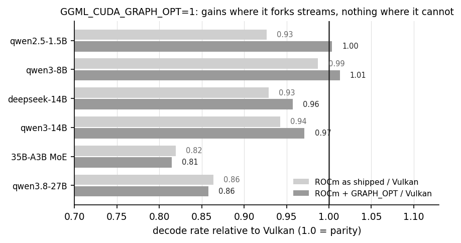

**The decode column is measured with `GGML_CUDA_GRAPH_OPT=1`**, ggml-cuda's multi-stream graph
optimisation, which is off by default. It was measured before the option was found to compute wrong
tokens as shipped ([How to measure](#how-to-measure-on-this-board)); the fix keeps its speed to within
0.1 percent, so the column stands for the option with the fix. Without the option the same campaign
reads 196.7, 38.5, 32.6, 32.7, 71.2 and 15.2, which is the build as shipped: the option is worth 1.083 on
the 1.5B, 1.026 on the 8B and 1.031 and 1.032 on the two 14Bs, and nothing on the MoE and the 27B, where it
launches no streams at all and the two arms' sample ranges overlap. Prefill is unchanged by it to within 0.1 percent
on every model.

**One model is faster than Vulkan on both halves**, the 8B, which prefills at 1.04 and decodes at 1.01.
The 1.5B comes closest to joining it: 0.97 on prefill and level on decode, 213.1 against 212.3. The MoE
prefills at 1.29, which is the largest margin in the table and is where the packed-fp16 GEMM was
extended to reach the expert matmuls, though no experiment here separates that patch from the rest. Decode is 0.96 and 0.97 on the 14B
models, and 1.16 times behind on the 27B and 1.23 on the MoE, the two the option cannot help.

Both halves improve as the context fills, which is the opposite of where this started. Prefill at a
4096- and 8192-token depth is 1.38 and 1.49 times Vulkan ([prefill at depth](#prefill-at-depth)), and
the 1.5B's decode is 1.04 to 1.07 times Vulkan from 4096 out to 30720
([decode at depth](#decode-at-depth)).

This is the thirteen-patch build, two runs of the same campaign pooled so that each figure is the median
of eighteen samples ([`logs/campaign-graphopt-2026-09-24/`](logs/campaign-graphopt-2026-09-24/)). Its
as-shipped arm reproduces the previous campaign
([`logs/fedora44-campaign-experts-2026-09-21/`](logs/fedora44-campaign-experts-2026-09-21/)) to within
0.3 percent on every Vulkan figure and about one percent on the ROCm ones, which is the control on the
third arm.

Against the same campaign on the three-patch build six days earlier
([`logs/fedora44-benchmarks-2026-09-15/clock-corrected/`](logs/fedora44-benchmarks-2026-09-15/clock-corrected/)),
prefill is 2.27 times on the 1.5B, 1.66 on the 8B, 2.0 on each 14B, 2.04 on the MoE and 1.47 on the 27B,
and decode 1.68 times on the 1.5B, 1.5 on the 14B models, 2.06 on the MoE and 1.92 on the 27B. ROCm
prefill runs at 0.96 to 1.29 of Vulkan's, where the three-patch build ran at 0.44 to 0.66.

Vulkan is the steadier backend: its widest spread across the eighteen samples is 2.4 percent and every
Vulkan row reproduces the fourteen earlier campaigns within 0.5 percent. ROCm's wide rows are one
artefact, not a wide distribution. The first of the three samples `llama-bench` takes after
loading a model often reads low and the other two do not: the 1.5B's prefill reads 1767, 1762, 1761,
1629, 1451 and 1660 for the six first samples against 1743 to 1799 for the other twelve. The median over
eighteen is unaffected, so the campaign is run twice and pooled.

Where the gains come from, in order of size: the matrix-vector patch for decode, the packed-fp16
prefill GEMM and its tile for prefill, and the flash-attention patch, whose prefill share grows with
the prompt (40 to 42 percent at pp2048 on the D=128 models with GQA sharing) and which also carries the
one-token rules visible in [the depth tables](#prefill-at-depth).

Every intermediate campaign is kept under [`logs/`](logs/) as `fedora44-campaign-*`, one per form of
the patch set, so any step of the progression can be re-read on its own.

### Which backend to use, and why ROCm at all

Vulkan worked on this board before any of this and is still the better choice for some of it, so here
is the honest comparison.

**If you only run llama.cpp, it is now a per-workload choice.** ROCm prefills faster on two of six
models and is within four percent on the rest, and the gap widens with context: at a 4096- and
8192-token depth ROCm prefills at **1.38 and 1.49 times** Vulkan
([prefill at depth](#prefill-at-depth)). Decode is level or ahead on the two smallest models and behind
on the two largest, 0.81 on the MoE and 0.86 on the 27B, which is the quantised matvec gap described
[below](#decode-four-passes-over-the-matrix-vector-kernel). So: long prompts and long contexts favour
ROCm, decoding a big quantised model favours Vulkan, and Vulkan remains the steadier of the two.

**If you run anything other than llama.cpp, ROCm is the only option.** That is mostly why I bothered:

| | ROCm | Vulkan |
|---|---|---|
| PyTorch, training and inference | works, 33.8 ktok/s training a small transformer, fp32 GEMM at 70.7 % of the board's ceiling | not tested here; PyTorch's Vulkan backend is inference-only and unmaintained upstream |
| BLAS for your own code | rocBLAS, SGEMM at 70.7 % of ceiling | none |
| porting CUDA source | `hipify-perl` translates it, 38 code lines of 142 and no hand edits, and it runs at native speed ([`logs/hipify-cuda-2026-09-24/`](logs/hipify-cuda-2026-09-24/)) | rewrite as GLSL or SPIR-V |
| kernel timing | `scripts/kerntrace.cpp` over the packaged roctracer, used throughout this repository | the Vulkan perf logger |
| hardware performance counters | `rocprofv3` works after two fixes and reads correct SQ-block counters, but not out of the box: Fedora builds ROCm without the profiler handshake, and gfx1013 is missing from rocprofiler-sdk's counter definitions. [`scripts/build_rocprof_gfx1013.sh`](scripts/build_rocprof_gfx1013.sh), [`logs/hw-counters-2026-09-25/`](logs/hw-counters-2026-09-25/) | not tested here |
| source-level GPU debugging | `rocgdb` is not packaged for Fedora, and would not work unpatched if it were: the packaged `librocm-dbgapi.so` carries gfx1010, gfx1011, gfx1012 and gfx1030 upward, and no gfx1013 at all. Adding it is a small patch to ROCdbgapi's architecture table, untried here | not tested here |

The CUDA row is the one people ask about.
[`scripts/cuda_demo.cu`](scripts/cuda_demo.cu) is ordinary CUDA, `cuda_runtime.h` and `cublas_v2.h`,
`cudaMalloc`, `<<< >>>` and `cublasSgemm`, never edited for AMD. `hipify-perl` rewrites 38 code lines
of 142 and leaves the kernel body untouched, because `__global__`, `threadIdx` and the launch
syntax are shared; it then compiles and runs with no hand edits and no runtime penalty, the translated
`cublasSgemm` reaching the same 30.3 ms as native rocBLAS at N=4096. Two Fedora-specific build flags
are needed that hipify does not know about, and they are in the log.

None of this says Vulkan cannot compute; it says the software people actually reach for does not
target it. Everything in the [GPGPU section](#gpgpu), PyTorch and rocBLAS and anything hipified,
exists on the ROCm side, and getting there is what the rest of this page is about.

### Prefill at depth

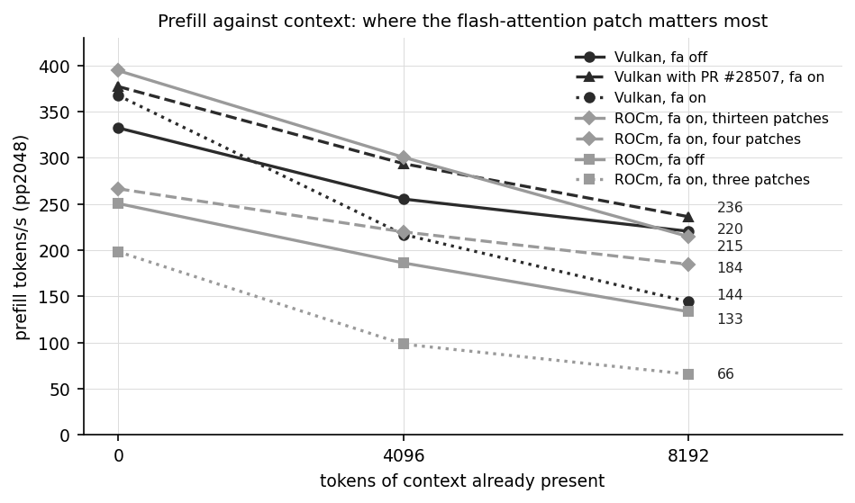

Prefill on a context that already holds tokens is the case a long chat or a large document actually hits,
and it is where the RDNA1 flash-attention patch matters most. qwen3-8B Q8_0, `-p 2048 -n 0`, `-fa on`,
medians. The thirteen-patch column and the Vulkan one are
[`logs/depth-thirteen-2026-09-22/`](logs/depth-thirteen-2026-09-22/); the three-patch column and the
`#28507` one are [`logs/vulkan-fa-staging-2026-09-17/`](logs/vulkan-fa-staging-2026-09-17/), and the
four-patch one [`logs/rdna1-fattn-spill-2026-09-17/`](logs/rdna1-fattn-spill-2026-09-17/)
`depth-final.log`:

| existing context | ROCm, three patches | ROCm, four patches | **ROCm, thirteen patches** | Vulkan | Vulkan with [#28507](https://github.com/ggml-org/llama.cpp/pull/28507) |
|---|---|---|---|---|---|
| 0 | 197.5 | 266.4 | **394.4** | 367.0 | 377.2 |
| 4096 | 98.3 | 219.7 | **300.5** | 217.5 | 293.6 |
| 8192 | 65.5 | 184.5 | **214.6** | 143.8 | 236.1 |

Before the patch ROCm fell off fastest and was under a third of patched Vulkan by 8192 tokens, 65.5
against 236.1. The fourth
patch stopped the gap widening with context; the prefill GEMM and the five patches around it closed it
and then some. **On the thirteen-patch build ROCm prefills faster than Vulkan at every depth measured**,
by 1.07, 1.38 and 1.49 times. ROCm is ahead of Vulkan carrying #28507 at depth 0 and at 4096 as well,
and behind it at 8192. The Vulkan columns are
unchanged measurements, not old ones: re-run on 22 September they return 367.0, 217.5 and 143.8 against
the 366.8, 217.0 and 143.5 of September 17, which is what makes the ROCm column readable.

One warning that page carries and this table depends on. Every figure here is **one `llama-bench`
invocation per depth**. Passing the depths as a list, `-d 0,4096,8192`, is not the same measurement: it
can read up to 22 percent low, on either backend, at some points and not others, and a sweep that used
the list form disagreed with both the September figures and these until it was repeated one invocation
at a time.

### Decode at depth

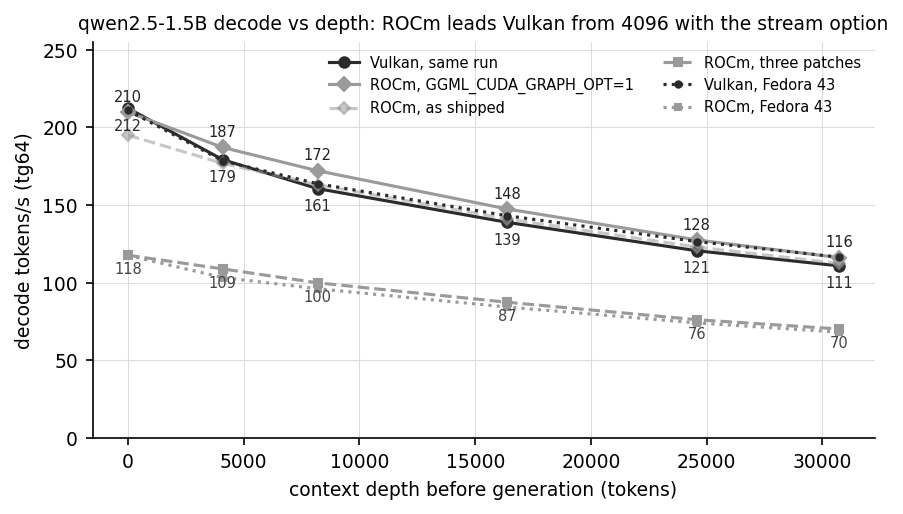

qwen2.5-1.5B, decode rate after the given context depth, **one `llama-bench` invocation per depth**,
clock pinned. The top three rows are two passes of
[`logs/depth-graphopt-2026-09-24/`](logs/depth-graphopt-2026-09-24/), arms interleaved within each
depth; the three-patch and Fedora 44 Vulkan rows are three passes of
[`logs/fedora44-benchmarks-2026-09-15/depth-clock-corrected/`](logs/fedora44-benchmarks-2026-09-15/depth-clock-corrected/),
and the thirteen-patch build without the option was also measured on 22 September
([`logs/depth-thirteen-2026-09-22/`](logs/depth-thirteen-2026-09-22/)):

| depth | 0 | 4096 | 8192 | 16384 | 24576 | 30720 |
|---|---|---|---|---|---|---|
| **ROCm, thirteen patches, `GGML_CUDA_GRAPH_OPT=1`** | 209.8 | 187.1 | 172.1 | 147.5 | 127.6 | 116.2 |
| ROCm, thirteen patches, as shipped | 195.0 | 176.8 | 163.1 | 141.1 | 123.0 | 112.4 |
| Vulkan, same run | 212.3 | 179.2 | 160.6 | 138.9 | 120.6 | 110.9 |
| ROCm, three patches, Fedora 44 | 117.7 | 108.9 | 100.0 | 87.5 | 76.2 | 70.2 |
| Vulkan, Fedora 44 | 212.4 | 179.7 | 163.7 | 140.1 | 121.8 | 111.3 |
| ROCm, Fedora 43 | 117.6 | 103.4 | 96.1 | 84.4 | 74.2 | 68.2 |
| Vulkan, Fedora 43 | 211.0 | 178.5 | 163.8 | 143.1 | 126.5 | 116.5 |

**With the multi-stream option on, ROCm decodes faster than Vulkan at every depth from 4096 to 30720**,
by 4 to 7 percent, and is 1.2 percent behind at an empty context
([`logs/depth-graphopt-2026-09-24/`](logs/depth-graphopt-2026-09-24/)). The option is worth 1.076 at
depth 0 and 1.033 at 30720, which is the shape to expect: as the context fills, more of the token goes
into attention over a longer cache and less into the layer work whose independent branches it overlaps.
Twelve paired comparisons over two passes, the option ahead in 12 of 12 and ahead of Vulkan in 10, the
exceptions being depth 0 in both passes. The as-shipped row of that run reproduces the thirteen-patch
row measured on 22 September to within one percent, which is the control. The option rows were
measured before it was found to compute wrong tokens as shipped. On the 1.5B its replies matched the
default in ordinary runs, and with the fix it decodes at the same speed at an empty context; the deeper
rows have not been re-measured with the fix.

The Fedora 43 and three-patch rows are the old ladders, kept for scale;
[INVESTIGATION.md](INVESTIGATION.md#decode-at-context-depth) covers their provenance.

Re-measured at a filled 4096-token cache on the thirteen-patch build, **ROCm holds 0.84 to 1.00 of
Vulkan**, where the seven-patch build held 0.78 to 0.98 and the three-patch build held 0.60
([`logs/depth-thirteen-2026-09-22/`](logs/depth-thirteen-2026-09-22/)). Every model improved and the 8B
reaches parity. The MoE is last, which is its decode gap from
[the matrix-vector section](#decode-four-passes-over-the-matrix-vector-kernel) carried forward and
nothing about depth.

Context ceilings, meaning how deep each model can still generate at all, are a separate limit set by GPU
memory ([`logs/fedora44-ceilings-2026-09-16/`](logs/fedora44-ceilings-2026-09-16/)):

| model | 8192 | 16384 | 32768 | 131072 |
|---|---|---|---|---|
| qwen2.5-1.5B Q4_K_M | 98.9 | 86.8 | 68.9 | fails |
| qwen3-8B Q8_0 | 26.7 | 20.1 | | |
| qwen3-14B Q4_K_M | 12.4 | fails | | |
| qwen3.8-27B UD-IQ3_XXS | 7.1 | fails | | |

A depth that does not fit prints nothing and dumps core: the kernel logs `SVM mapping failed, exceeds
resident system memory limit` and the stock ROCr runtime segfaults on the error instead of reporting it.
Killing the process restores the GPU. Two of these, the 1.5B at 131072 and the 14B at 16384, completed in
August and do not now, on either system. The limit is 63/64 of RAM minus 1.5 GiB, 13422 MiB on this board,
and it counts everything KFD has registered; `ttm.pages_limit` raises a different counter and does not
help. The segfault itself was three null dereferences stacked on one failure path, one in ROCr and two
in HIP; with the rebuilt runtimes of step 6 the same command ends with `ROCm error: out of memory`
([`logs/rocr-queue-scratch-2026-09-18/`](logs/rocr-queue-scratch-2026-09-18/)).

### Correctness

Wikitext perplexity at context 2048 over eight chunks, flash attention on, one boot, default compute
type ([`logs/correctness-thirteen-2026-09-21/`](logs/correctness-thirteen-2026-09-21/)). The third
column is the same measurement on the three-patch build, kept because the prefill GEMM changed the
arithmetic of every prefill matmul it took over and this is what that did.

| model | ROCm, thirteen patches | Vulkan | ROCm, three patches |
|---|---|---|---|
| qwen2.5-1.5B Q4_K_M | 8.0093 +/- 0.222 | 8.0485 +/- 0.224 | 8.0366 |
| qwen3-8B Q8_0 | 7.3586 +/- 0.232 | 7.3948 +/- 0.234 | 7.3522 |
| qwen3-14B Q4_K_M | 6.3896 +/- 0.192 | 6.4547 +/- 0.195 | 6.3986 |
| deepseek-r1-14B Q4_K_M | 5.9865 +/- 0.172 | 6.0505 +/- 0.175 | 6.0013 |
| qwen3.6-35B-A3B MoE IQ2_M | 5.1820 +/- 0.134 | 5.1975 +/- 0.134 | 5.1887 |
| qwen3.8-27B UD-IQ3_XXS | 5.2938 +/- 0.137 | 5.3385 +/- 0.139 | 5.2899 |

Every ROCm value is below its Vulkan pair and every pair agrees well inside one standard error, as
before. Every Vulkan figure reproduces the August measurement to four decimals, which is what makes the
third column readable: the ROCm column moved and the reference did not.

Four models improved, by 0.0067 to 0.0273, which is the direction the prefill GEMM predicts: it
multiplies in fp16 where MMQ quantises the activations to eight bits. Two are slightly worse, the 8B by
0.0064 and the 27B by 0.0039. The 8B is the case the same reasoning covers, since q8_0 weights are
already the eight-bit operands MMQ wants, so there is no weight-side gain to set against accumulating
in fp16. Beyond that the table does not order itself by weight width: the two narrowest models, IQ2_M
and IQ3_XXS, move least and in opposite directions, while the largest gain is a Q4_K_M. Six models is
too few to read a rule out of, and none of these movements is large. The biggest, 0.0273, is an eighth
of one standard error.

The two short gates used throughout this page are in [step 8](#8-verify). The Fedora 43 comparison that
used to sit in this table has moved to [its own section](#fedora-43-44-and-45-measure-the-same), since
the builds are no longer the same.

### Fedora 43, 44 and 45 measure the same

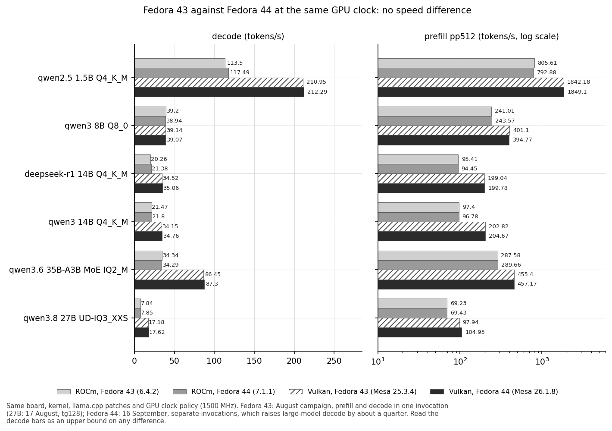

These figures are the **three-patch build of 15 September**, which is the point: the same llama.cpp on
all three systems, so the comparison isolates the operating system and the ROCm version. They are not
the rates this page reports elsewhere, where thirteen patches put the 1.5B at 1799 against 793.

At the same GPU clock the three configurations are indistinguishable. ROCm prefill is within 2 percent of
Fedora 43 on every model, Vulkan within 2 percent, and rocBLAS SGEMM, DGEMM and memory bandwidth within half
a percent. Fedora 45 with ROCm 7.2.2 matches Fedora 44 within 0.5 percent on prefill and is 0.5 to 2.4
percent ahead on decode
([`logs/fedora44-benchmarks-2026-09-15/clock-corrected/`](logs/fedora44-benchmarks-2026-09-15/clock-corrected/),
[`logs/fedora45-rocm722-2026-09-16/`](logs/fedora45-rocm722-2026-09-16/)).

| prefill pp512 | Fedora 43, ROCm 6.4.2 | Fedora 44, ROCm 7.1.1 | Fedora 45, ROCm 7.2.2 |
|---|---|---|---|
| qwen2.5-1.5B | 805.6 | 792.9 | 793.0 |
| qwen3-8B | 241.0 | 243.6 | 243.5 |
| deepseek-r1-14B | 95.4 | 94.5 | 94.4 |
| qwen3-14B | 97.4 | 96.8 | 96.4 |
| qwen3.6-35B MoE | 287.6 | 289.7 | 289.7 |
| qwen3.8-27B | 69.2 | 69.4 | 69.4 |

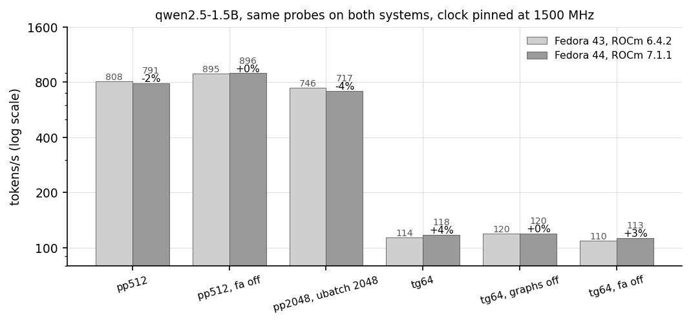

So a newer ROCm is not faster on this board. One real difference exists and it is host CPU, not
throughput: ROCm 6.4.2's runtime makes eleven times as many `AMDKFD_IOC_WAIT_EVENTS` calls waiting for GPU
completion signals, 11387 against 1037 for the same 256-token decode, and 29 times as many ioctls in
total, 127743 against 4379. That costs 4.4 s of kernel time against 0.4 s at the same generation rate
([`logs/fedora44-hostoverhead-2026-09-16/`](logs/fedora44-hostoverhead-2026-09-16/)). On a board whose CPU
also feeds the GPU, but it will not show up in a benchmark.

Fedora 44 can look 23 to 29 percent faster, and that reading is an artefact: the upgrade replaces the governor configuration, and those runs burst to 2000 MHz between throttled periods. The reasons to prefer Fedora 44 or 45 are correctness and reproducibility, not speed.

### GPGPU

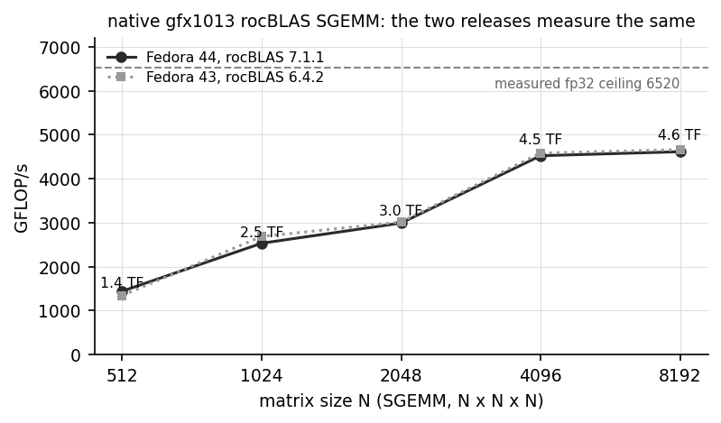

rocBLAS on Fedora 44, native gfx1013 build, every result checked against a CPU reference, clock
sampled and verified at 1500 MHz throughout
([`logs/fedora44-benchmarks-2026-09-15/clock-corrected/`](logs/fedora44-benchmarks-2026-09-15/clock-corrected/),
probes in
[`patches/sgemm_iter.cpp`](patches/sgemm_iter.cpp), [`patches/dgemm_iter.cpp`](patches/dgemm_iter.cpp),
[`patches/membw.cpp`](patches/membw.cpp)):

| measurement | Fedora 44, rocBLAS 7.1.1 | Fedora 43, rocBLAS 6.4.2 |
|---|---|---|
| SGEMM N=4096, median ms (GFLOP/s) | 30.1 (4560) | 30.0 (4580) |
| SGEMM N=8192, median ms (GFLOP/s) | 237.9 (4620) | 236.0 (4660) |
| DGEMM N=2048, GFLOP/s | 456.2 | 456 |
| streaming-read memory bandwidth, GB/s | 432.3, 431.8, 432.0 | 432 |

The two libraries measure the same, within half a percent on every line, once the GPU clock policy described above is controlled.

### What PyTorch and rocBLAS deliver, against the board's ceilings

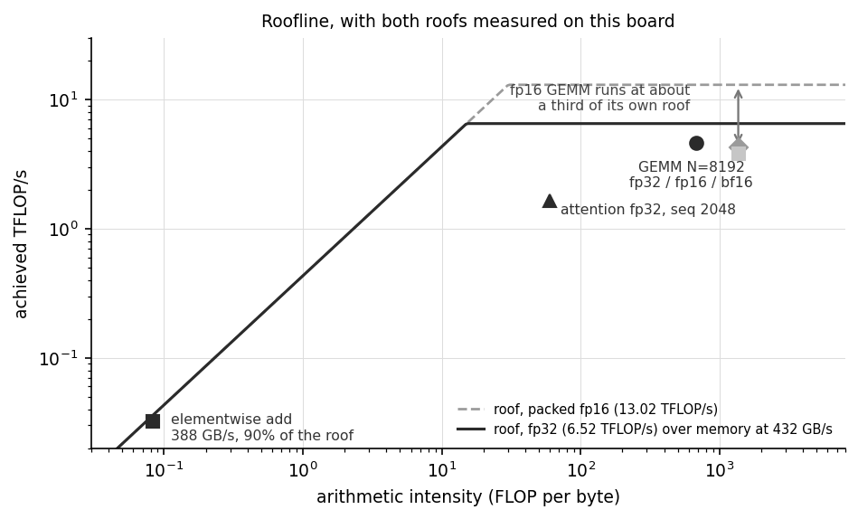

Both roofs in that figure were measured on this board, not copied off a spec sheet: the sloped
one is the 432 GB/s streaming read, the flat ones the `v_fma_f32` and `v_pk_fma_f16` rates from
[`logs/alu-rates-recheck-2026-09-25/`](logs/alu-rates-recheck-2026-09-25/). Elementwise work sits on
the memory roof at 90 percent of it. Neither matmul roof is reached.

Both arithmetic ceilings are measured with the clock sampled throughout and verified at 1500 MHz,
which matters: taken with the governor below its cap the same probe reads 4.74 and 14.40 instead of
**6.52 and 13.02**. The three instructions all cost 5.32 cycles, so packed fp16 is **twice** fp32
and not three
times, which is what the instruction does. Everything below is against the corrected pair.

Correctness is below; this is throughput, every figure also as a fraction of a ceiling measured on this
same silicon ([`logs/alu-rates-recheck-2026-09-25/`](logs/alu-rates-recheck-2026-09-25/)):

| | best measured | ceiling | % of peak |
|---|---|---|---|
| PyTorch fp32 GEMM, N=8192 | 4.61 TFLOP/s | 6.52 | 70.7 % |
| PyTorch fp16 GEMM, N=8192 | 4.25 TFLOP/s | 13.02 | 32.6 % |
| PyTorch bf16 GEMM, N=8192 | 3.78 TFLOP/s | 13.02 | 29.0 % |
| rocBLAS SGEMM, N=8192 | 4612 GFLOP/s | 6520 | 70.7 % |
| rocBLAS HGEMM, N=8192 | 4637 GFLOP/s | 13020 | 35.6 % |
| rocBLAS DGEMM, N=4096 | 457 GFLOP/s | 430 measured for `v_fma_f64` | see below |
| PyTorch `c = a + b`, 64 M elements | **388 GB/s** | 432 | **90 %** |

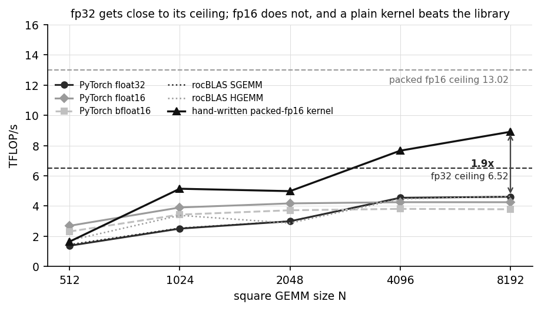

Double precision has a measured rate too: `v_fma_f64` costs 80.8 cycles against `v_fma_f32`'s 5.32,
one fifteenth of the fp32 instruction rate and close to the one sixteenth RDNA1 is documented to have.
The chain measures 0.43 TFLOP/s and rocBLAS DGEMM reaches 0.457, slightly above it.

The interesting line is fp16. It is *slower* than fp32, 4.25 against 4.61, on a part whose packed-fp16
rate is twice its fp32 rate. rocBLAS HGEMM is only 1.7 percent faster than its own SGEMM, so this
belongs to the library and not to PyTorch, which is passing the call through.

**Hardware counters say where the shortfall is.** `rocprofv3` now runs on this board, after rebuilding
the HSA runtime with the profiler handshake Fedora omits and adding gfx1013 to rocprofiler-sdk's
counter definitions, and its SQ-block counters were checked against a kernel whose instruction count
is fixed by its ISA before anything was read from them
([`logs/hw-counters-2026-09-25/`](logs/hw-counters-2026-09-25/)). At N=8192 rocBLAS HGEMM issues
9.29e9 VALU instructions against SGEMM's 18.29e9, almost exactly half, so the packed instruction is
issued and not just present in the binary. What does not halve is the traffic through
shared memory: LDS instructions fall only from 3.42e9 to 1.95e9, so arithmetic per LDS access drops
from 5.34 to 4.78 and the rate does not move. Packed math takes arithmetic out of a kernel whose limit
is not arithmetic. The hand-written kernel below issues *more* instructions than rocBLAS HGEMM and
keeps half as many waves resident, and is still 1.9 times faster, because it does 17.34 VALU
instructions per LDS instruction against 4.78.

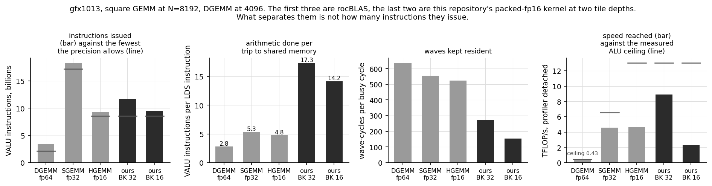

**The shortfall is rocBLAS's kernel, not the hardware.** A plain hand-written packed-fp16 GEMM, one
tile geometry for every size, no double buffering and no assembly, reaches **8.9 TFLOP/s at N=8192
against rocBLAS's 4.67**, in the same boot at the same clock, on the same data, with relative error
of the same order on both arms since both accumulate in fp16
([`logs/pkf16-vs-rocblas-2026-09-25/`](logs/pkf16-vs-rocblas-2026-09-25/)). That is 68 percent of the
measured 13.02 TFLOP/s packed-fp16 ceiling against the library's 36. The comparison between the two
kernels was measured directly and does not depend on the ceiling at all.

My first guess was that Tensile does not emit `v_pk_fma_f16` for this target. It does: the object
HGEMM loads carries 720 of them ([`logs/hgemm-isa-2026-09-24/`](logs/hgemm-isa-2026-09-24/)). What
costs the library the difference is the tile. rocBLAS gives each thread 32 outputs from 70 registers
and 3 KB of shared memory; the hand-written kernel gives each thread 128 from 113 registers and 17 KB,
so every staged value is reused four times as often. Neither spills, and the faster kernel is the one
with the *worse* occupancy. All 54 Tensile solution files shipped for gfx1013 are `fallback`, with no
architecture-tuned set at all, which is where the small tile comes from
([`logs/rdna1-pkf16-tile-2026-09-20/`](logs/rdna1-pkf16-tile-2026-09-20/)). That is also why llama.cpp
gets its own packed-fp16 GEMM here instead of calling rocBLAS.

One limit on all of it: fp16 accumulation is too inaccurate for most work at these sizes on either
arm, relative error running from 3e-03 to 3e-02. The 1.9x is a gap between two fp16-accumulating
kernels, not a usable fp16 GEMM.

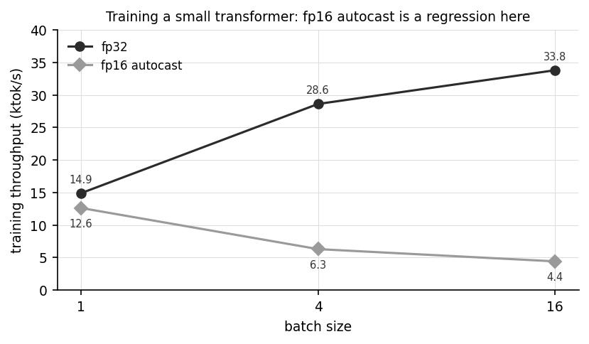

Training a small transformer, four pre-norm blocks at d_model 512, reaches **33.8 kilotokens a second**
in fp32 at batch 16, and `torch.autocast` with fp16 is a **7.7 times regression** and not a
speedup, which follows the GEMM result in direction. Convolution and attention agree: fp16 conv2d is
about four times slower than fp32 and fp16 attention slower than fp32 attention, so the pattern is the
precision and not one operator ([`logs/torch-rocblas-bench-2026-09-24/`](logs/torch-rocblas-bench-2026-09-24/)).
**Do not use fp16 autocast on this board.** The
same fp32 GEMM is **10.5 times the CPU** at N=2048, against numpy on scipy-openblas; torch's own CPU
path is forty times slower again because this build has neither MKL nor MKLDNN, and quoting the GPU
against that would give a meaningless 420x.

**PyTorch**, built from source with `PYTORCH_ROCM_ARCH=gfx1013` ([`patches/pytorch/`](patches/pytorch/),
[`scripts/build_pytorch_gfx1013.sh`](scripts/build_pytorch_gfx1013.sh)), about 1 h 45 min on the board:
on Fedora 44, 11 of 11 operations in the probe including fp16 matmul, and a 50-step training loop tracking a
CPU reference to 1.8e-05 per step, with the same losses and parameter drift as on Fedora 43
([`logs/fedora44-validation-2026-09-15/`](logs/fedora44-validation-2026-09-15/),
[`logs/torch-train-2026-08-19/`](logs/torch-train-2026-08-19/)). Prebuilt packages do not work:
the pytorch.org ROCm wheel ships no gfx1013 or gfx101x Tensile library, and Fedora 44's `python3-torch`
2.9.1 lacks gfx1013 kernels, so its library operations run (with the native rocBLAS) but its own
kernels crash inside `libamdhip64`
([`logs/fedora44-validation-2026-09-15/`](logs/fedora44-validation-2026-09-15/)).

## Where the speed came from

Thirteen patches, none of them large. Three share a pattern, an architecture choice that does not
fit gfx1013: llama.cpp's RDNA1 macro lists gfx1010 and gfx1012 but not gfx1013; the matrix-vector
table has no RDNA1 entry, so gfx1013 runs the generic one; and the flash-attention tile rows are
shared by all of RDNA and spill on RDNA1. Five more are one packed-fp16 prefill GEMM and its
extensions. Full workings for each are in the linked logs and in [INVESTIGATION.md](INVESTIGATION.md).

### Decode: four passes over the matrix-vector kernel

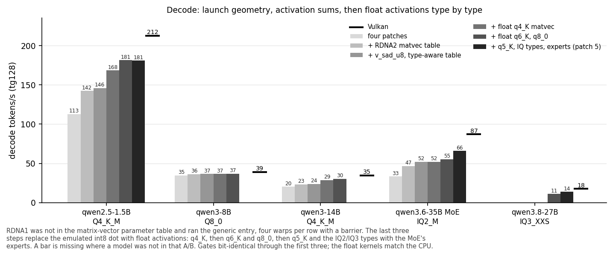

The quantised matrix-vector kernel picks warps per row from a table holding RDNA4, RDNA3, RDNA2, GCN
and Turing. RDNA1 is absent, so gfx1013 took the generic entry: four warps per row with a shared-memory
exchange and a barrier. Routing it to the RDNA2 entry is two lines. Giving RDNA1 its own entry is
better still, because one wave per row suits the K-quants and IQ types while Q8_0 and the legacy
Q4/Q5 types want the four cooperating warps back
([`logs/rdna1-mmvq-2026-09-18/`](logs/rdna1-mmvq-2026-09-18/)).

The larger win came from copying what Vulkan already does on this GPU: stop emulating `v_dot4` and
unpack the weights to float instead. Patch 5 adds that path for q4_K, q6_K, q8_0, q5_K and the IQ
types, carrying MMVQ's bias, gate and GLU fusion, and reaching the MoE's experts as well. It matches
the CPU on every covered `test-backend-ops` case and leaves the perplexity gates unchanged
([`patches/llamacpp/rdna1-f32-matvec/`](patches/llamacpp/rdna1-f32-matvec/)). One type stays on the
int8 path deliberately: IQ4_XS, whose int8 `vec_dot` is a byte-permute lookup cheap enough that the
float version measured 0.6 times its speed.

A fourth pass stages the IQ codebooks in shared memory, worth 1.8 percent on the 27B. Five other
attempts at the same kernel measured worse and are written up with their numbers
([`logs/rdna1-iq-matvec-2026-09-20/`](logs/rdna1-iq-matvec-2026-09-20/)). One sign runs through all
six: every change that added a memory operation lost, and the only one that removed one won.

### Prefill: a register spill, and a packed-fp16 GEMM

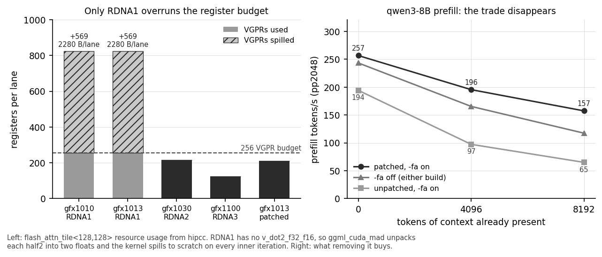

`V_DOT2_F32_F16_AVAILABLE` is defined for RDNA2 and later but not RDNA1, correctly, since gfx1013 has
no `v_dot2_f32_f16`. Without it `ggml_cuda_mad` unpacks each `half2` into two floats, doubling the live
values in the flash-attention tile kernel's inner loop, and the D=128 kernel overruns the 256-VGPR
budget:

| arch | VGPRs | spilled | scratch bytes/lane |
|---|---|---|---|
| gfx1010 (RDNA1) | 256 | 569 | 2280 |
| gfx1013 (RDNA1) | 256 | 569 | 2280 |
| gfx1030 (RDNA2) | 215 | 0 | 0 |
| gfx1100 (RDNA3) | 125 | 0 | 0 |

An RDNA1 tile table that doubles `nthreads` to 512 and cuts `nbatch_fa` to 32 brings it to 211 VGPRs
with no spill, and prefill at an 8192-token depth goes from 64.9 to 157.4 tokens/s on the 8B. A later
row with `nbatch_K` at 128 takes the same kernel to 96 VGPRs, raises occupancy from 4 waves to 10 and
brings that depth to 184.5 ([`logs/rdna1-fattn-spill-2026-09-17/`](logs/rdna1-fattn-spill-2026-09-17/)).
gfx1010 spills identically, so this is not particular to the BC-250.

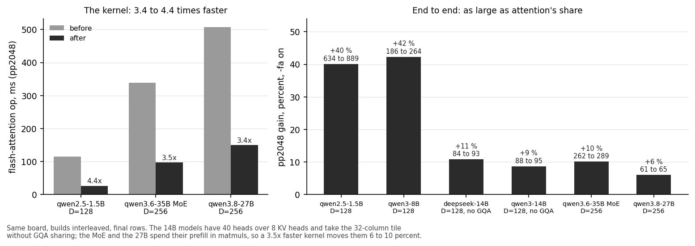

The kernel itself gets 3.4 to 4.4 times faster. What that is worth end to end depends on how much of a
model's prefill is attention: 40 percent on the two D=128 models with GQA sharing, 6 to 11 percent on
the rest ([`logs/rdna1-fattn-remainder-2026-09-19/`](logs/rdna1-fattn-remainder-2026-09-19/)).

That fix also removes a trade. Before it, prefill at depth was faster with `-fa off` and decode faster
with it on, which is the awkward position the figure below shows. After it, leave flash attention on:
it wins at every depth measured, by 5 to 34 percent, and keeps the KV cache smaller.

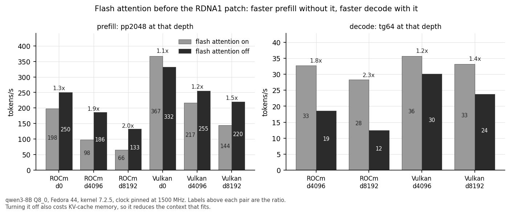

The other prefill patch is a hand-written packed-fp16 GEMM, since `v_pk_fma_f16` runs at twice the fp32
rate and rocBLAS does not get near it. Extending it to reach the MoE's experts through
`ggml_cuda_mul_mat_id` is what puts that model's prefill 1.29 times ahead of Vulkan, and it improves
accuracy too, because fp16 activations beat the eight bits MMQ quantises them to
([`logs/rdna1-pkf16-experts-2026-09-21/`](logs/rdna1-pkf16-experts-2026-09-21/)).

Both patches came out of replaying the real prefill graph operation by operation on each backend,
which is how the two culprits were separated from everything else. This is the picture *before* either
fix, with flash attention 7 times slower than Vulkan's and the quantised matmuls about 2 times
([`logs/op-perf-hip-vs-vulkan-2026-09-17/`](logs/op-perf-hip-vs-vulkan-2026-09-17/)):

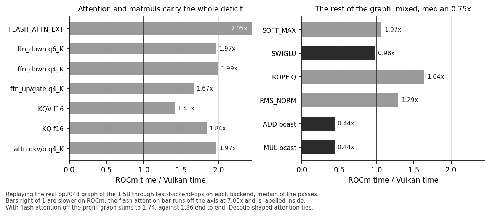

### The MoE's decode gap, which is still open

The MoE decodes at 0.81 of Vulkan, the furthest behind of the six models. Four plausible explanations
were tested and none of them accounts for it: HIP graph capture, the per-dispatch floor, node overlap,
and a missing fusion pattern. The floor is real, 1.78 microseconds a dispatch, and it does explain the
2.20 ms of the MoE's token that falls outside any kernel
([`logs/decode-residue-2026-09-25/`](logs/decode-residue-2026-09-25/)). It cannot explain the deficit
against Vulkan, though, because Vulkan's own per-node floor is larger and Vulkan issues more dispatches
a token, 1423 against 1298.

What is left is the kernels. Split by weight type, ROCm is slower on 9 of the 10 quantised matmuls at a
median 1.078 and faster on all 3 f32 ones
([`logs/moe-kernels-reweighted-2026-09-23/`](logs/moe-kernels-reweighted-2026-09-23/)). How many
microseconds that is worth cannot be stated, because the two backends do not issue the same dispatches.
A lower bound needs no cross-backend instrument: ROCm spends 12.12 ms a token inside kernels where
Vulkan's entire token is 11.54 ms.

### Two community RADV patches

Two other BC-250 owners publish out-of-tree RADV patches: one exposes the dedicated compute queues
upstream hides on gfx1013, the other optimises the integer dot-product fallback. Built into one driver
and loaded together they give the 1.5B 1.0 percent prefill and 1.7 percent decode, and nothing
measurable on the 8B ([`logs/radv-patches-2026-09-17/`](logs/radv-patches-2026-09-17/)).

## Known issues

The first two are the ones that can cost you a machine or a day; the rest are handled by the recipe above
or are limits to work within.

| issue | what to do | status |
|---|---|---|
| A GPU reset takes the host down: MODE1 and MODE2 have no implementation on this chip and report success anyway | `amdgpu.gpu_recovery=0`; after a fault, reboot | open ([`logs/reset-smu-gc-2026-09-14/`](logs/reset-smu-gc-2026-09-14/), [`logs/reset-honest-2026-09-15/`](logs/reset-honest-2026-09-15/)) |
| A rare GPU page fault under sustained load escalates to a preemption timeout; with recovery off the GPU then stays unusable until reboot while still enumerating normally, though Vulkan on the same board keeps working | reboot | open; ended two Fedora 43 soaks, after about 190 and 254 rounds ([`logs/fault-usability-2026-08-24/`](logs/fault-usability-2026-08-24/), [`logs/soak-crash-2026-08-20/`](logs/soak-crash-2026-08-20/)). It did not appear in 152 rounds on kernel 7.2.5 with `gpu_recovery=0` ([`logs/soak-thirteen-2026-09-22/`](logs/soak-thirteen-2026-09-22/)), but it did appear a few hours later under deep-context decode, and that is the first time the chain has been watched with the mitigation in place: no reset, no SIGBUS, host up, Vulkan unaffected throughout ([`logs/fault-caught-2026-09-22/`](logs/fault-caught-2026-09-22/)) |
| Freed and reallocated GPU memory faults without the runlist flush | `amdgpu.bc250_flush_by_runlist=3` | worked around in the module; verified again on Fedora 44 (on: clean, off: faults) |
| PASID TLB flush covers nothing under hardware scheduling | `amdgpu.bc250_flush_pasid_kiq=0` | worked around in the module |
| Software scheduler wedges sustained compute | leave `sched_policy` unset | understood |
| rocBLAS and PyTorch ship no gfx1013 kernels | build them ([step 4](#4-native-gfx1013-rocblas-711)) | not upstream at the time of writing; [rocm-libraries PR #8838](https://github.com/ROCm/rocm-libraries/pull/8838) proposes the rocBLAS half, so check its current state before trusting this line |
| comgr gfx10 VGPR count (ROCm 7.0 to 7.1.1) | [step 5](#5-comgr-vgpr-fix) | fixed in ROCm 7.2; verified on Fedora 45, where the patch is unnecessary |
| llama.cpp: `prop.integrated`, KQV precision, RDNA1 macro, RDNA1 flash attention, RDNA1 matvec in its two passes, transposed concat, GDN lanes, and the packed-fp16 prefill GEMM in its five parts, which is thirteen files in [`patches/llamacpp/`](patches/llamacpp/) | [`patches/llamacpp/`](patches/llamacpp/), provenance of every patch in [`patches/PROVENANCE.md`](patches/PROVENANCE.md) | master now forces `integrated = false` itself (PR #28604, after an attempt to trust the flag was found to corrupt output when `-ub` is below `-b`); the others are still needed, and a second BC-250 owner derived the RDNA1 macro one independently in September 2026. The tile-config patch is new here and applies to RDNA1 generally, gfx1010 included |
| `GGML_CUDA_GRAPH_OPT=1` computes wrong tokens: the Q branch overwrites `attn_norm` while the K and V projections on the other streams still read it | leave the option off, which is the default, or apply [`alloc-deps.diff`](logs/graphopt-correctness-2026-10-02/alloc-deps.diff) and set `GGML_CUDA_GRAPH_OPT_ALLOC_DEPS=1` with it | found here; the region code is the same in upstream master at the time of writing ([`logs/graphopt-correctness-2026-10-02/`](logs/graphopt-correctness-2026-10-02/)) |
| HIP graph instantiation fails at very deep context on 14B models | `GGML_CUDA_DISABLE_GRAPHS=1` | workaround; it costs nothing by itself, the 1.5B decoding 0.88 percent *faster* with capture off over 28 processes an arm ([`logs/dispatch-bimodal-2026-09-23/`](logs/dispatch-bimodal-2026-09-23/)), but it also disables `GGML_CUDA_GRAPH_OPT=1`, which needs capture, so the run gives up that option's gain too |
| A context depth that exceeds the KFD resident-memory limit (13422 MiB here, 63/64 of RAM minus 1.5 GiB) cannot run | use a smaller context; `ttm.pages_limit` and `HSA_XNACK` do not apply, and disabling the limit only trades the failure for swapping. With the stock runtimes the process segfaults; with the rebuilt ROCr and HIP of step 6 it reports `ROCm error: out of memory` | the limit is open; the crash on it is closed, three null checks across two runtimes, one of which upstream still lacks ([`logs/rocr-queue-scratch-2026-09-18/`](logs/rocr-queue-scratch-2026-09-18/)) |
| Fedora 43 only: ROCm 6.4.2's compiler-rt half-precision helpers are broken, zeroing fp16 GEMMs | on Fedora 43, [`scripts/fix_half_helpers.py`](scripts/fix_half_helpers.py) or `-mf16c` | not present on Fedora 44 ([`logs/fp16-root-cause-2026-09-15/`](logs/fp16-root-cause-2026-09-15/)) |
| A plain reboot can land on a stale bootloader entry for the same kernel, without `bc250_flush_by_runlist` and with `sched_policy=2`, both of which this table says are wrong | `grubby --set-default-index` at the documented entry, and check `/proc/cmdline` after any reboot before trusting a measurement | understood ([`logs/boot-entry-2026-09-21/`](logs/boot-entry-2026-09-21/)) |
| A distribution upgrade can replace the oberon governor configuration with the package default, which overheats the board and throttles it to 1000 MHz | restore the 1500 MHz configuration, [step 3](#3-gpu-clock-policy) | understood; it made an earlier revision of this page report Fedora 44 as 23 to 29 percent faster than Fedora 43 |

Suspend (s2idle) does not return on this board, and rebinding the driver hangs the host
([`logs/suspend-recovery-2026-09-15/`](logs/suspend-recovery-2026-09-15/),
[`logs/rebind-recovery-2026-09-15/`](logs/rebind-recovery-2026-09-15/)).

## Limits

- One board. Nothing here shows that another BC-250 behaves the same.
- The board boots with `mitigations=off`, which flatters CPU-side comparisons but not GPU figures.
- Context ceilings move with whatever else holds system memory, since the KFD limit is computed from it.
  Two depths that worked in August fail on both systems today
  ([`logs/fedora44-ceilings-2026-09-16/`](logs/fedora44-ceilings-2026-09-16/)). Loading with `--no-mmap`
  costs usable context, and for the qwen3-8B Q8_0 the cost is now measured: it generates at 16128 and
  16384 with mmap on and aborts at both with `-mmp 0`, its ceiling falling to between 15360 and 16128
  ([`logs/nommap-ceiling-2026-09-22/`](logs/nommap-ceiling-2026-09-22/)). The ceilings table above is
  the mmap-on figure and every throughput campaign here passes `-mmp 0`, so the two describe different
  usable depths. Vulkan is not subject to this at all and runs the same point.
  The August measurements are in
  [INVESTIGATION.md](INVESTIGATION.md#fedora-43-with-rocm-642).
- The thirteen-patch build has passed an eight-hour soak: 152 rounds over four models, every
  perplexity gate bit-identical, 38 of 38 allocation-churn sweeps passed, no kernel fault lines
  ([`logs/soak-thirteen-2026-09-22/`](logs/soak-thirteen-2026-09-22/)). An earlier soak on the
  three-patch build covered the PyTorch training this one does not
  ([`logs/fedora44-soak8-2026-09-16/`](logs/fedora44-soak8-2026-09-16/)). Nothing has run a full day
  though, and 152 rounds says little about a fault that showed up once in 200.
- **No power or efficiency figures, deliberately.** `power1_average` responds nicely (47.9 W idle,
  126.3 W under a rocBLAS sweep) but it is package power, so twelve busy CPU threads move it +32 W with
  the GPU idle. That would quietly favour whichever backend does less *host* work. It is also an SMU
  model output on mining firmware with no wall meter here to check it against. Too many confounds to
  quote, so I do not.
- Stop other GPU users before measuring. Three rounds of the September 16 soak failed their 8B gate
  because an `ollama` service loaded a 14B model behind it; the board was fine.

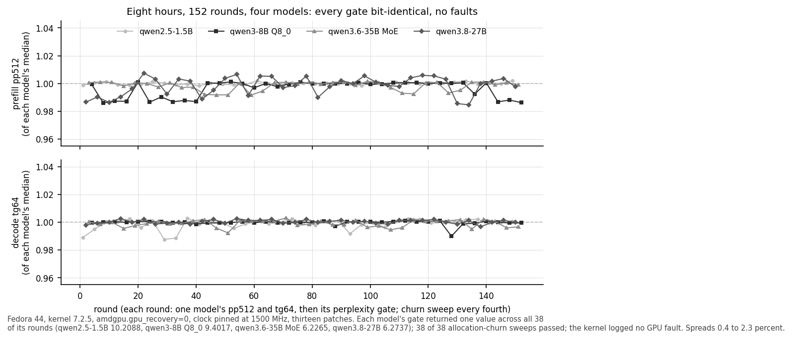

## Reproducing

[`reproduce.sh`](reproduce.sh) builds and runs the basic probes and checks the configuration. Every
experiment has a harness in [`scripts/`](scripts/) with a header saying what it measures, and a
directory under [`logs/`](logs/README.md) with a README naming the harness, so any figure quoted here
can be traced back to the run that produced it. [`logs/README.md`](logs/README.md) indexes all 214.

## References

- [ROCm/ROCm#6313](https://github.com/ROCm/ROCm/issues/6313): BC-250 freeze after compute workloads,
  where anrp and ahorek found `flush_pasid_uses_kiq = false`.
- [GabriWar/bc250-rocm-working](https://github.com/GabriWar/bc250-rocm-working): the runlist-rebuild
  flush ported in step 1, SDMA instrumentation, and the navi12 microcode substitution.
- [duggasco/bc250-40cu-unlock](https://github.com/duggasco/bc250-40cu-unlock): the 40-CU unlock.
- [DryhoppedIPA/bc250-gfx1013-fix](https://github.com/DryhoppedIPA/bc250-gfx1013-fix): kernel and Mesa
  work on the compute queue.
- [ROCm/rocm-libraries PR #8838](https://github.com/ROCm/rocm-libraries/pull/8838) by boondocklabs:
  gfx1013 in rocBLAS and Tensile; [step 4](#4-native-gfx1013-rocblas-711) follows the same approach.
- ROCm/llvm-project commit
  [4f5ae331f659](https://github.com/ROCm/llvm-project/commit/4f5ae331f659), "[Comgr] Correct total VGPR
  counts for gfx10 devices", first in ROCm 7.2.0; [step 5](#5-comgr-vgpr-fix) applies the same change.
- [Mesa MR !33116](https://gitlab.freedesktop.org/mesa/mesa/-/merge_requests/33116) by Ivan Avdeev
  (w23), a community contributor: disables the gfx1013 compute queue in RADV.
- [akandr/bc250](https://github.com/akandr/bc250): the board itself and its Vulkan setup.
- [Preprint on Zenodo](https://doi.org/10.5281/zenodo.21364833). It predates both working
  configurations described here, and several of its conclusions have since been withdrawn.

## Author and license

Copyright (c) 2026 Artur Andrzejczak, written with assistance from Claude.

| | |
|---|---|
| code | [AGPL-3.0-or-later](LICENSE) |
| documentation | [CC BY-SA 4.0](https://creativecommons.org/licenses/by-sa/4.0/) |
| [`scripts/apply_runlist_flush.py`](scripts/apply_runlist_flush.py), [`scripts/apply_svmflush_generic.py`](scripts/apply_svmflush_generic.py) | GPL-2.0-only: they embed kernel C derived from GabriWar's work |
| [`patches/`](patches/) | each patch under its upstream project's licence, GPL-2.0-only for the kernel and MIT for llama.cpp. [`patches/PROVENANCE.md`](patches/PROVENANCE.md) records what is original here |
