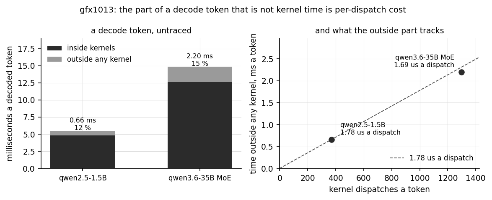

# What the part of a decode token outside the kernels is, 2026-09-25

[`logs/moe-kernels-reweighted-2026-09-23/`](../moe-kernels-reweighted-2026-09-23/) closed with
1.81 ms of the MoE's 13.93 ms token unaccounted for: kernel time was measured and the rest was not.
It named the missing measurement as well, a HIP API timeline beside the dispatch timeline on one
run, which needed a profiler this board did not have until
[`logs/hw-counters-2026-09-25/`](../hw-counters-2026-09-25/).

That measurement is still not possible, for a reason worth knowing, and the question turned out not
to need it anyway.

## The HIP API timeline is still out of reach

`libamdhip64.so.7` has no `rocprofiler_register_*` symbols, the same omission that
[`logs/hw-counters-2026-09-25/`](../hw-counters-2026-09-25/) found in `libhsa-runtime64.so` and
fixed by rebuilding it. Fedora builds HIP without the handshake too, so `--hip-runtime-trace`
attaches to nothing: it writes no file, reports no error, and segfaults when combined with a trace
that does work. Getting the host side would mean rebuilding clr as well as ROCR.

## Tracing cannot measure the gaps between kernels either

Which matters more, because the gaps are the quantity in question. On the 1.5B a traced token runs
19.4 ms against 5.4 ms untraced, and essentially the whole difference lands between the kernels:
the gap sums to 14.9 ms a token where the real non-kernel time is 0.66 ms. The instrument inflates
what it is being asked to measure by more than twenty times.

This repository already assumed as much, in the sentence "that is tracing overhead between kernels,
not inside them". It holds, and it is now measured instead of assumed. It also means the
answer has to come from arithmetic on untraced runs, not from reading a traced timeline.

## The residue, measured

Kernel time from `kerntrace` over roctracer, token time from `llama-bench` without any instrument,
both on a freshly cleaned machine with ollama stopped and the clock verified at 1500 MHz. The
residue is the subtraction. `-p 0 -n 64 -r 1` traced, `-r 5` untraced.

| model | token, untraced | inside kernels | residue | share | dispatches a token | residue a dispatch |
|---|---|---|---|---|---|---|
| qwen2.5-1.5B | 5.440 ms | 4.783 ms | 0.657 ms | 12.1 % | 369 | **1.78 us** |
| qwen3.6-35B MoE | 14.826 ms | 12.629 ms | 2.197 ms | 14.8 % | 1298 | **1.69 us** |

Two models whose dispatch counts differ by 3.5 times give the same cost per dispatch to within six
percent. So the residue is: **per-dispatch overhead, about 1.7 microseconds of it.**

The estimate this repository already carried,
[`logs/moe-decode-2026-09-20/`](../moe-decode-2026-09-20/)'s "at the measured 1.78 us a dispatch",
was taken from a separate dispatch microbenchmark and applied to the models by multiplication. It
is right, which was not obvious: the same arithmetic predicted 2.31 ms for the MoE
against the 1.81 ms that was actually outside its kernels, and that discrepancy is what left the
question open. Measured directly on both models here, the per-dispatch figure and the residue agree.

## What it is not

**Not memory copies.** Under `--memory-copy-trace` the 1.5B's copies that do not overlap a kernel
total 0.007 ms a token, one percent of its 0.66 ms residue.

**Not something HIP graph capture is hiding.** Disabling capture moves neither model outside its
error bars (`scaling.log`):

| | graphs on | capture disabled |
|---|---|---|
| qwen2.5-1.5B | 183.82 ± 3.09 t/s | 185.71 ± 0.04 |
| qwen3.6-35B MoE | 67.45 ± 0.67 | 66.55 ± 4.10 |

## The assumption left in it

The residue is `untraced token − traced kernel time`, so it assumes tracing does not lengthen the
kernels themselves, only the space between them. Two instruments agreeing supports that without
proving it: on the 1.5B `kerntrace` reads 12.76 us a dispatch over 23985 dispatches and rocprofv3
reads 12.86 us over 12177, 0.8 percent apart, having nothing in common but the hardware. If kernels
are inflated at all then the residue is larger than stated, not smaller.

## Two traps this run fell into, both silent

A profiled run that crashes leaves `llama-bench` holding `/dev/kfd` and its memory. The next
rocprofv3 then attaches to nothing, writes no files, and **exits zero**. An early reading here was
taken in that state and had kernel time 23 percent high, 376.52 ms against the 306.09 ms the same
command gives from a clean machine. Every run in the table above kills survivors and drops caches
first.

And rocprofv3's tracing has a ceiling at about 16384 records on this build (`trace_limit.txt`):
16309 dispatches traced fine, 17059 segfaulted, and `rocpd` and `pftrace` output fail identically,
so it is the collection path and not a writer. The 1.5B is traceable to about 42 decoded tokens and
the MoE not at all, its model load alone exceeding the ceiling. That is why the MoE's kernel time
here comes from `kerntrace`, which has no such limit, and why the two instruments were checked
against each other on the model where both run.

## Files

| | |
|---|---|
| `ktc_qwen2.5-1.5b-q4km.txt`, `ktc_qwen3.6-35b-a3b-iq2m.txt` | kerntrace per-kernel tables, clean machine |
| `rocprofv3_1.5b_n32/` | the rocprofv3 dispatch trace used for the cross-check and the gap measurement |
| `scaling.log` | untraced token rates, graph capture on and off |
| `trace_limit.txt` | the dispatch-count bisection |

## Reproducing

    scripts/decode_timeline.py logs/decode-residue-2026-09-25/rocprofv3_1.5b_n32 --tokens=24
    scripts/make_residue_figure.py

`decode_timeline.py` finds the decode graph's period by the point at which the sequence of kernel
names repeats, 369 dispatches for the 1.5B, not by looking for a kernel that fires once a
token: most fire once a layer, and the few that do not are too few to judge regularity from.
